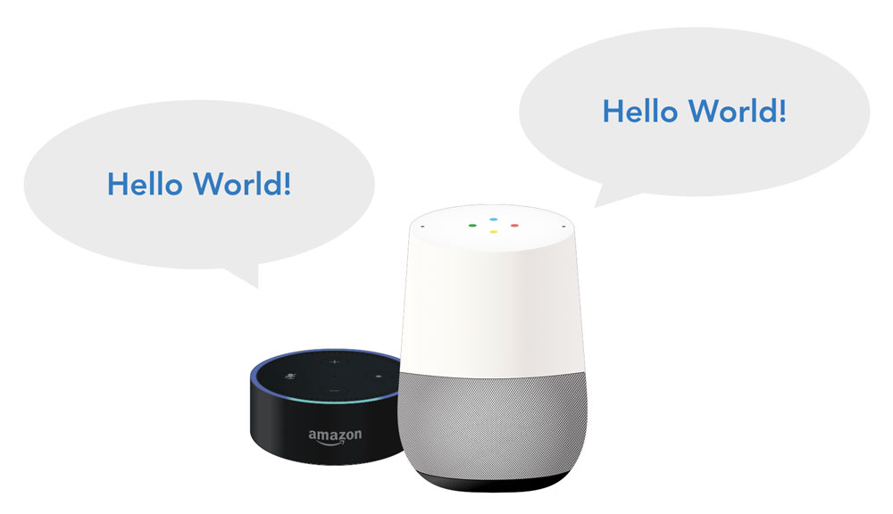

# Project 1: Hello World

Great to have you here! We're happy that you're interested in learning more about Alexa Skill and Google Action development. In this course, we're going to use the Jovo Framework to build a very simple voice application and learn the basics of Amazon Alexa and Google Assistant along the way. Let's do this.

## What We're Building

By building a very simple app called "Hello World," we're going to learn more about how voice apps work. This course is targeted at very beginners to help with their first steps of developing with the Jovo Framework.

## Course Outline

In a few simple steps, you will be introduced to Jovo voice app development.

* [Step 1: Introduction to Voice Apps](./step-1-introduction-voice-apps.md)
* [Step 2: Introduction to Language Models](./step-2-introduction-language-models.md)
* [Step 3: Create a Project on the Amazon Developer Portal](./step-3-amazon-developer-portal.md)
* [Step 4: Create a Project on Dialogflow and Google Assistant](./step-4-dialogflow-google-assistant.md)
* [Step 5: Create a Jovo Project](./step-5-create-jovo-project.md)
* [Step 6: Hello World!](./step-6-hello-world.md)

## Next Steps

Ready? Now let's go with [Step 1: Introduction to Voice Apps](./step-1-introduction-voice-apps.md).

Prefer to go from start to finish in one tutorial instead? Then go ahead with the resources below:

* [Google Action Beginner Tutorial](../tutorials/google-action-tutorial-nodejs/)
* [Alexa Skill Beginner Tutorial](..tutorials/alexa-skill-tutorial-nodejs/)

<!--[metadata]: { "description": "Learn the basics of voice app development for Amazon Alexa and Google Assistant in this free course.", "author": "jan-koenig" }-->
