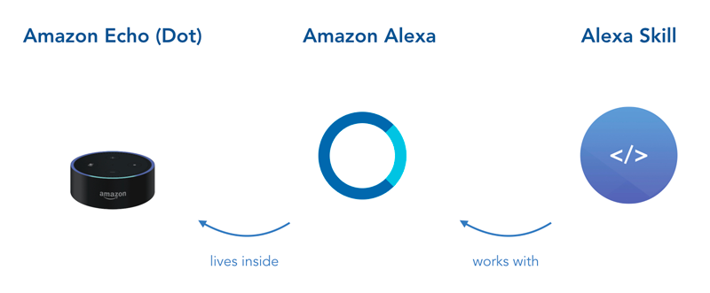
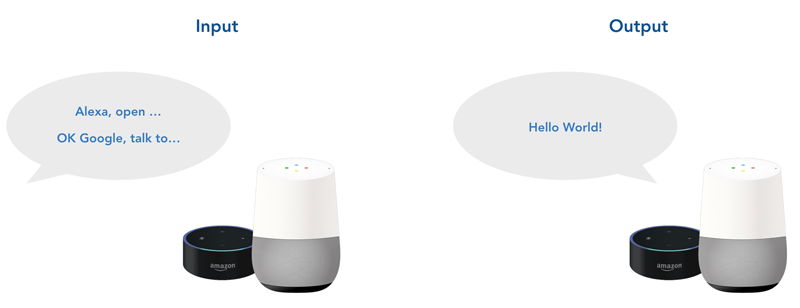
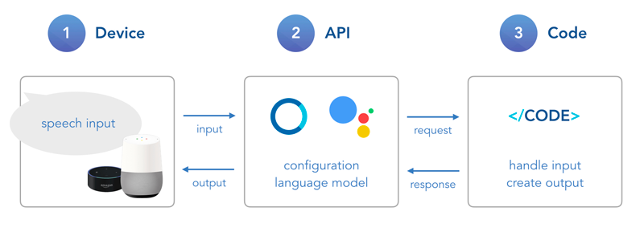

# Step 1: Introduction to Voice Apps

In this lecture, you will learn the basics of voice applications for both Amazon Alexa (Alexa Skills) and Google Home (Actions on Google).

### Sections

* [What is a Voice App?](#what-is-a-voice-app)
* [How Voice Apps Work](#how-voice-apps-work)
    * [Input](#input)
    * [Output](#output)
    * [Platform Differences](#platform-differences)
* [Next Steps](#next-steps)

## What is a Voice App?

Popular voice platforms like Amazon Alexa and Google Assistant offer the opportunity for developers to build applications (voice apps) on top of their solutions. By talking to Alexa or Google Assistant (through Google Home), users can access the apps.

### Amazon Alexa

Alexa is the voice assistant living inside Amazon's Echo, Echo Dot, and other devices. An app for Alexa is called **Alexa Skill**.

### Google Assistant

The voice platform you talk to on your Google Home or other Google devices is called Google Assistant. Apps for Assistant are called **Google Actions**.

## How Voice Apps Work

Simply put, voice applications consist of two processes: input and output. It's what the user is saying to your app, and what your app is responding through the voice device.

Both steps have 3 important elements:

1.  A **device** the user is talking to
2.  The voice platform **API** that transforms voice to text (and vice versa) and figures out what the user wants (through natural language understanding)
3.  Your **code** as heart of the app's logic

In the following, you can find more details about the input and output processes.

### Input

When a user is talking to your application through an Alexa or Google Assistant enabled device, there are several things that happen in between before their input is reaching your code. First, the device passes the recorded **speech input** to the voice platform (for example, the Alexa API or Google Actions API).

There, the speech input is first transcribed to text, which is called **speech to text**. The result is then used to understand what the user wants to express with that sentence or phrase, a process that involves both natural language processing and **natural language understanding** (what we're going to call it in this course). The platform then passes this information to your app as **JSON request**.

This is when your code acts for the first time and uses the request's information to handle the input and create output.

### Output

Your role as a voice app developer is now to deal with the information and pass it back to the user. Again, this involves several steps. First, a **JSON response** needs to be created and returned to the voice platform.

The response usually involves information like the desired text to read out to your user, or links to audio files and additional visual information to pass on. Most voice apps return at least some type of text, which is then transformed to a voice with **text to speech** processing.

### Platform Differences

The main difference between the Amazon Alexa and Google Assistant platform is the **JSON request** they're sending to your app, and the **JSON response** they're expecting. Fortunately, the [Jovo Framework](https://github.com/jovotech/jovo-framework-nodejs/) is built exactly to help you with that.

Besides the request and response, there are many other little differences between the platforms. We will uncover them throughout this course.

For now, there is one more thing to keep in mind (which we will also cover in the next lecture): While on Amazon Alexa, the API also does the **natural language understanding**, the Google Actions API doesn't do that itself. For this, you have to integrate with an NLU tool. Most Action developers use [Dialogflow](https://dialogflow.com/) to configure their application’s language model:

## Next Steps

Now that we know the very simple basics of voice applications, let's dive a little deeper into the language models that need to be developed to make your Alexa Skills and Google Actions work.

> [Step 2: Introduction to Language Models](./step-2-introduction-language-models.md)

<!--[metadata]: { "description": "In this lecture, you will learn the basics of voice applications for both Amazon Alexa (Alexa Skills) and Google Home (Actions on Google).", "author": "jan-koenig" }-->
