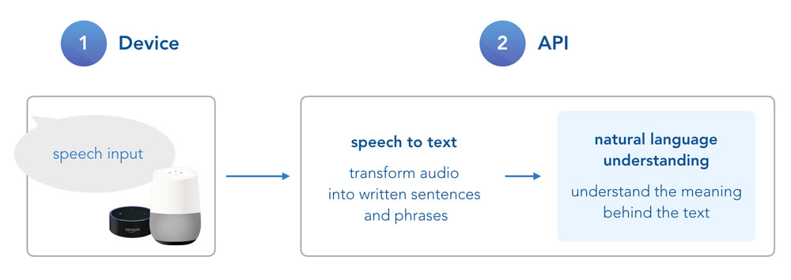
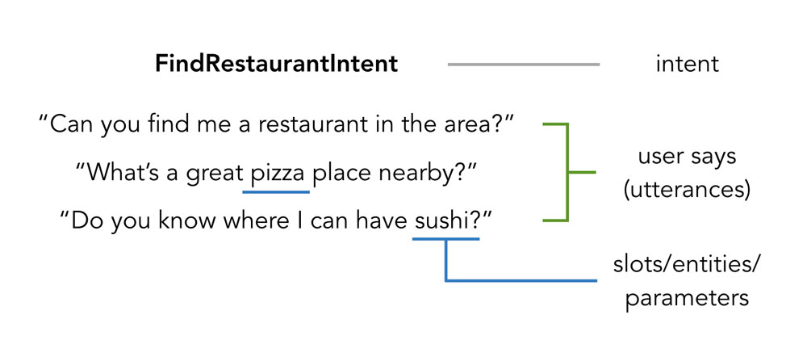
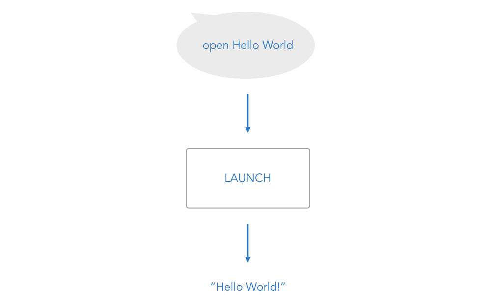

# Step 2: Introduction to Language Models

In this lecture, you will learn the basics of how voice platforms like Alexa and Google Assistant use natural language understanding (NLU) for your voice app, and how you can build interaction and language models for them.

* [What is a Language Model?](#what-is-a-language-model)
* [The 3 Basic Elements of Voice Interactions](#the-3-basic-elements-of-voice-interactions)
    * [Amazon Alexa](#amazon-alexa)
    * [Google Assistant](#google-assistant)
* [Creating Voice Language Models](#creating-voice-language-models)
* [Next Steps](#next-steps)

## What is a Language Model?

We've already talked about the process of how the Alexa or Google Assistant enabled device sends the user's speech input to the voice platform API, which is then trying to figure out what it means. This involves both transforming **speech to text** and **natural language understanding**.

While the voice platform does the speech-to-text first part itself, the NLU section to the right is where you need to help out.

_Why do I need to take action here? Shouldn't Alexa or Google Assistant understand everything on their own?_

It is still difficult for computers to understand the human language. A sentence like "the sky is blue" could have different meanings and backgrounds for different applications. This is why, in order to send you the right JSON request, the voice platforms need some more information about what types of speech input and interactions you're expecting from your user.

This is called a **language or interaction model**.

## The 3 Basic Elements of Voice Interactions

Generally, a user's speech input consists of three elements:

* What the user wants
* What the user says
* Specific values or parameters

Depending on the platform, these elements are called differently. Usually, what the user wants or means is defined as an **intent**. An intent is the underlying thing your user wants to achieve, or an action your app needs to take during the conversation. In the example below, a _FindRestaurantIntent_ does exactly what it says: while talking to your app, a user wants to find a restaurant that fits their needs.

And as you can see, there are many ways for a user to express that. To help the voice platform understand what your user might mean by saying something specific, you need to provide example phrases or sentences to train the model. The _what the user says_ part of your language model is often called **sample utterances** or **user expressions**.

No matter if I’m looking for a super cheap place, a pizza spot that serves Pabst Blue Ribbon, or a dinner restaurant to bring a date, generally speaking it serves one purpose (user intent): to find a restaurant. However, the user is passing some more specific information that can be used for a better user experience. These are often called **entities**, **slots**, or **parameters**.

Let's take a look at differences between language models for Amazon Alexa and Google Assistant.

### Amazon Alexa

For your Alexa Skill, the language model you need to create is called **interaction model**. The elements are called:

* Intents
* Sample Utterances
* Slots

Besides custom defined intents, Alexa offers (and requires for Skill certification) several intents. For example, there is no need to define Yes- or No-intents on your own, you can use _AMAZON.YesIntent_ and _AMAZON.NoIntent_. We will talk about this in a later step.

### Google Assistant

For Google Actions, we will create a language model as an **Dialogflow Agent**. The elements are called:

* Intents
* User says
* Entities

In the next section, we are going to create a simple language model for our "Hello World" voice application on both platforms.

## Creating Voice Language Models

Before we're proceeding to the next steps of this course and create a language model on both platforms Alexa and Dialogflow, let's map out the functionality of our Hello World voice app.

It's very simple. When a user opens the app, we will use the [LAUNCH intent](https://www.jovo.tech/docs/routing#launch-intent) to redirect the user to the "HelloWorldIntent", which asks the user for their name. After the user answered, the "MyNameIsIntent" will be triggered, which greets the user with their name.

## Next Steps

We have our language models defined. The only thing that's left before we can dive into our voice app code is the configuration of the models on the developer platforms for Amazon Alexa and Google Assistant.

We're going to set the projects up in the following two steps:

> [Step 3: Create a Project on the Amazon Developer Portal](./step-3-amazon-developer-portal.md)

> [Step 4: Create a Project on Dialogflow and Google Assistant](./step-4-dialogflow-google-assistant.md)

<!--[metadata]: { "description": "In this lecture, you will learn the basics of how voice platforms like Alexa and Google Assistant use natural language understanding (NLU) for your voice app, and how you can build interaction and language models for them.", "author": "jan-koenig" }-->
