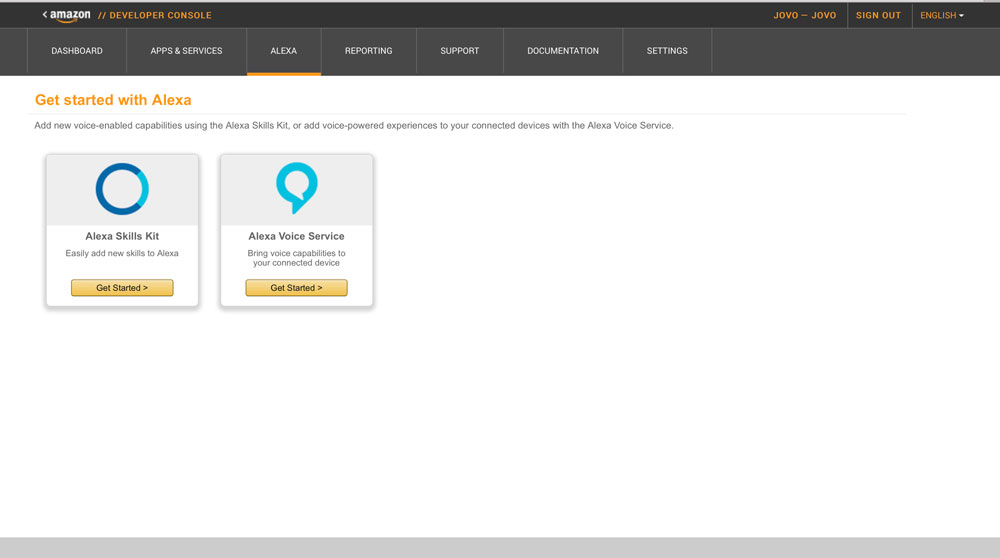
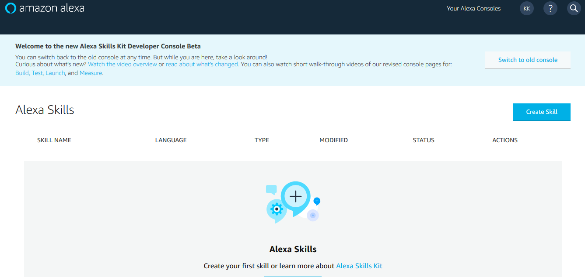
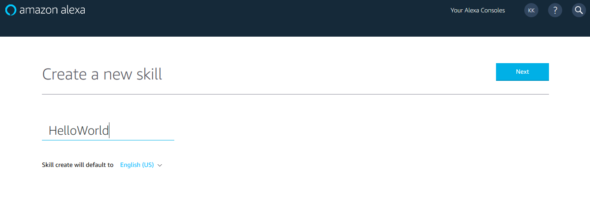
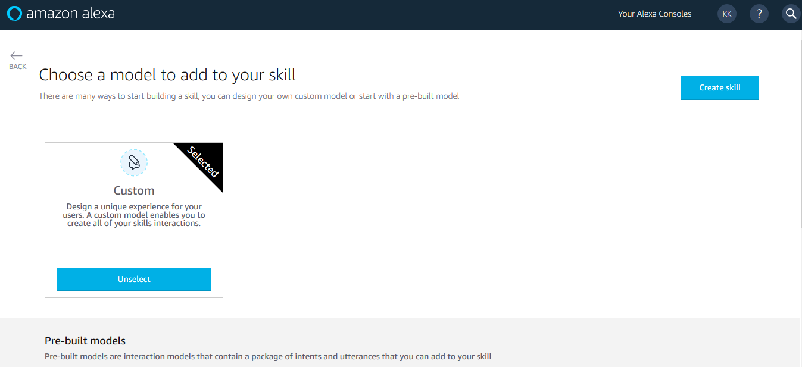
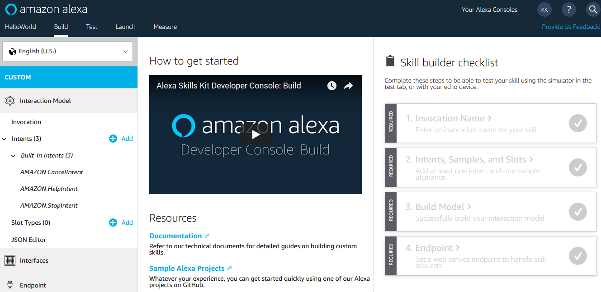
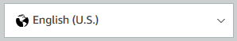
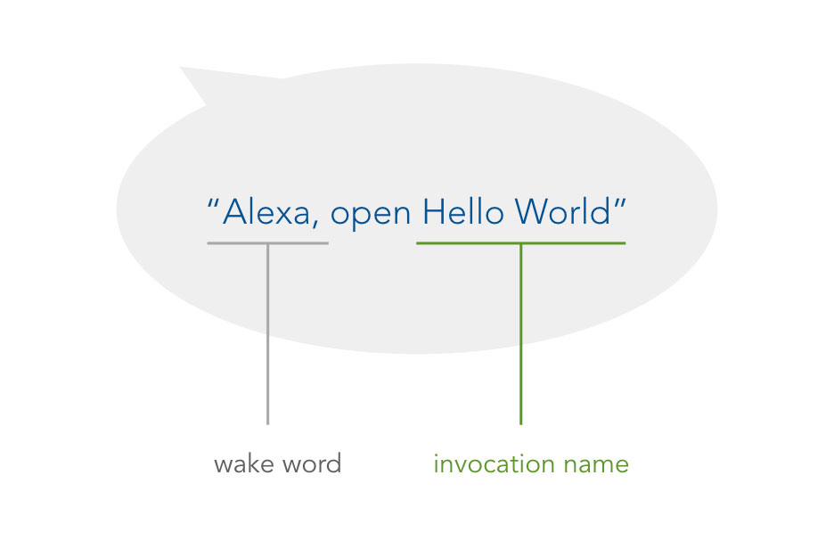
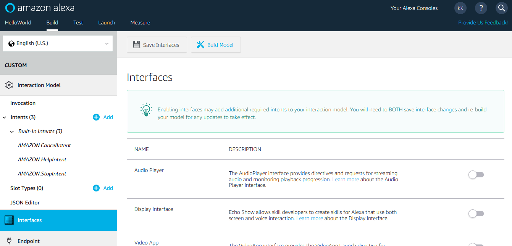

# Step 3: Create a Project on the Amazon Developer Portal

In this lecture, you will learn how to create an Alexa Skill project and interaction model on the Amazon Developer Portal. This project will be used to configure how your Skill is reached by your users and how the Alexa API is communicating with your code.

* [Sign in to Amazon Developer Portal](#sign-in-to-amazon-developer-portal)
* [New Skill Project and Configuration](#new-skill-project-and-configuration)
* [Create an Interaction Model](#create-an-interaction-model)
* [Next Steps](#next-steps)

## Sign in to Amazon Developer Portal

Go to [developer.amazon.com](https://developer.amazon.com) and click "Developer Console" on the upper right:


Now either sign in with your Amazon Developer account or create a new one. To simplify things, make sure to use the same account that's registered with your Alexa enabled device (if possible) for more seamless testing.


Great! You should now have access to your account. This is what your dashboard of the Amazon Developer Console looks like:


## New Skill Project and Configuration

Now it's time to create a new project on the developer console. Click on the "Alexa" menu item in the navigation bar and choose "Alexa Skill Kit" to access your Alexa Skills:



Let's create a new Skill by clicking on the blue button to the upper right:



First step is to name your Alexa Skill:



For our Skill we will use a custom model and create the skill:



Let's break down the developer console build tab:



#### Skill Language

Currently, Alexa is available in the US, UK, and Germany. A Skill can have more than one language (although you have to configure all the following steps again). Make sure to use the language that is also associated to the Amazon account that is linked to your Alexa enabled device, so you can test it without any problems. In our case, it will be English (U.S.) for the United States:



#### Invocation Name

This is where it gets a little more interesting. The **Invocation Name** is used by your users to access your Skill:



Make sure to choose an invocation name that can be understood by Alexa. For this project, we go with **hello world**: 


#### Interfaces

Alexa offers support for more and more special types of Skills, e.g. ones that make use of the Echo Show's visual component. In our case, we won't make use of them for now:



Let's move on to the language model of your Skill.

## Create an Interaction Model

As mentioned in [step 2](./step-2-introduction-language-models.md), for our simple voice app we only need to create two intents and add a few sample utterances, as well as a slot. So let's dive into the Amazon Developer Console and do this.

Let's create the "HelloWorldIntent" first:


And add the following example phrases to the "**Sample Utterances**":

```text
hello
say hello
say hello world
```


Create the "MyNameIsIntent" next with the following utterances:

```text
my name is {name}
it's {name}
{name}
```


After you did that, you will see that the console automatically added an intent slot called "name", but we still have to assign a slot type, so our Skill knows what kind of input it should except. In our case it's "AMAZON.US_NAME":


That's all we need. Now click on the "Build Model" button on the top:


## Next Steps

You can either go directly into the coding section and create a Jovo project, or set up the Google Assistant language model on Dialogflow first.

> [Step 4: Create a Project on Dialogflow and Google Assistant](./step-4-dialogflow-google-assistant.md)

> [Step 5: Create a Jovo Project](./step-5-create-jovo-project.md)


<!--[metadata]: { "description": "In this lecture, you will learn how to create an Alexa Skill project and interaction model on the Amazon Developer Portal.", "author": "jan-koenig" }-->
