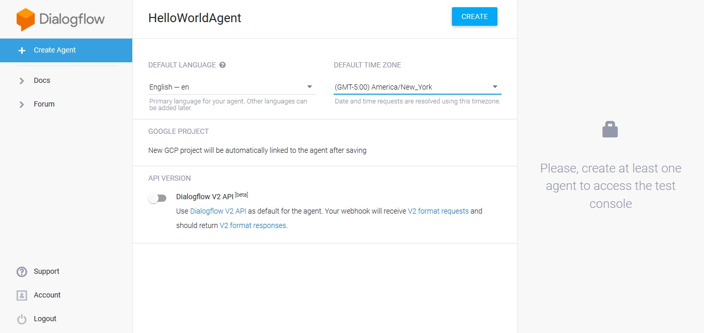
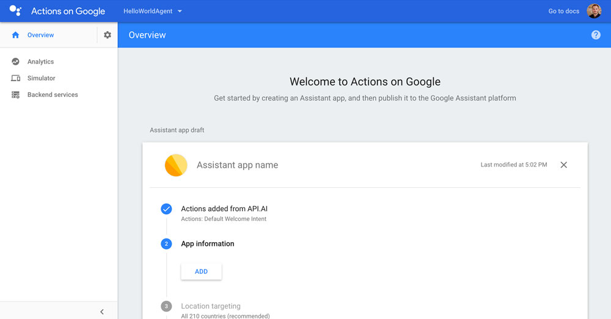

# Step 4: Create a Project on Dialogflow and Google Assistant

In this lecture, you will learn how to create an agent on Dialogflow for the language model, and connect it to a Google Action project on the Google developer console.

### Sections

* [Create an Dialogflow Agent](#create-an-dialogflow-agent)
* [Create an Interaction Model](#create-an-interaction-model)
* [Connect your Agent to a Google Action](#connect-your-agent-to-a-google-action)
* [Next Steps](#next-steps)

## Create an Dialogflow Agent

A [Dialogflow agent](https://dialogflow.com/docs/agents) offers a set of modules and integrations to add natural language understanding (NLU) to your product. Although it's owned by Google, it is platform agnostic and works for other channels like Facebook Messenger, as well.

We're going to add our own agent now. Let's get started:

Go to [dialogflow.com](https://dialogflow.com/) and click "Go to console" on the upper right:


Now sign in with your Google account. To simplify things, make sure to use the same account that's registered with your Actions on Google enabled device like Google Home (if possible) for more seamless testing.


Great! Once you're in the console, click "create agent"


We're just going to name it "HelloWorldAgent" and leave the other information out for now:



After creating the agent, you can see the **Intents**:


 
These intents are part of the agent's language model. We're going to create a new intent in the next section.   

## Create an Interaction Model

After creating the agent, you can see that there are two standard intents already in place. We're going to keep them. The "Default Welcome Intent" will later be mapped to the Jovo ["LAUNCH"](https://www.jovo.tech/framework/docs/intents-states#intents) intent.

Let's create another intent and name it "HelloWorldIntent":


Also add the following example phrases to the "**Training Phrases**" tab:

```text
hello
say hello
say hello world
```


Save the intent and create another one named "MyNameIsIntent". With this one we are also going to add example phrases of what the user could say to "**Training Phrases**" and also add an entity called "name" in the "**Action and parameters**":

```text
my name is name
it's name
it is name
name
```


Now we have to map the entity we created to the "**Training Phrases**" section by selecting the word "name", which is a placeholder for the actual name, and choosing "**@sys.given-name:name**":


One more step: To be able to communicate with our Dialogflow agent through Google Assistant, we need to connect it to a Google Action project.   

## Connect your Agent to a Google Action

Open the Integrations panel from the sidebar menu:


Here, choose the "Actions on Google" integration:


Click "Manage Assistant App":


This is it for now. This is how your project looks like on the **Actions on Google Console**:


   
## Next Steps

Yay! Finally, we're ready to dive into the code and the Jovo Framework. We're going to do this in the next step of this course:

> [Step 5: Create a Jovo Project](https://www.jovo.tech/blog/step-5-create-jovo-project/)