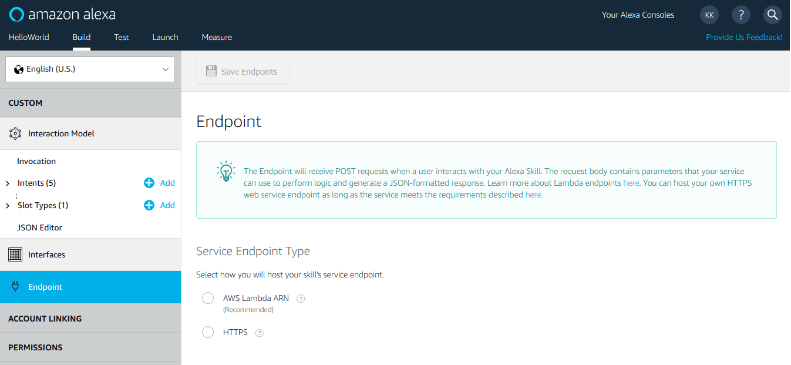
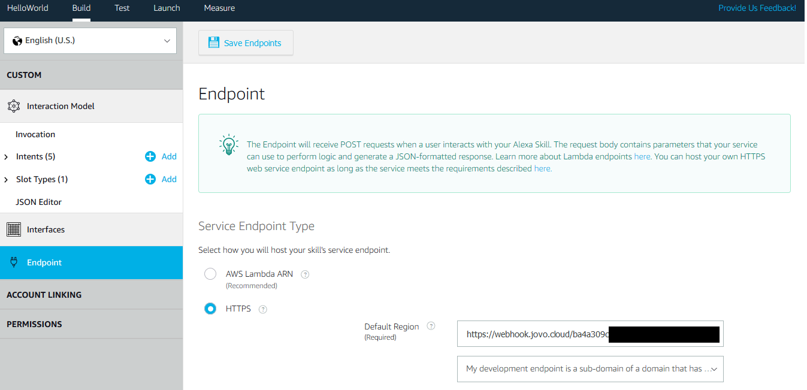
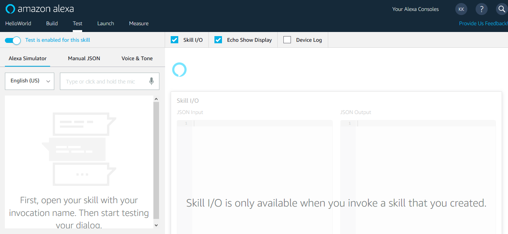
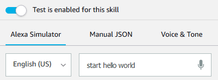
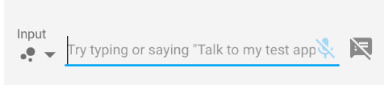

# Step 6: Hello World!

In this lecture, you will learn how to connect your Jovo code to the Amazon Alexa and Google Actions APIs, and test your first "Hello World" voice application.

* [Where to Run Your Code](#where-to-run-your-code)
    * [Run Local Server](#run-local-server)
* [Connecting Your Platform Project to an Endpoint](#connecting-your-platform-project-to-an-endpoint)
    * [Connect to Amazon Alexa](#connect-to-amazon-alexa)
    * [Connect to Dialogflow](#connect-to-dialogflow)
* [Testing Your Voice App](#testing-your-voice-app)
    * [Amazon Alexa](#amazon-alexa)
    * [Google Assistant](#google-assistant)
* [Next Steps](#next-steps)

## Where to Run Your Code

To connect our voice app's code to the Alexa and Dialogflow platforms, we need to run it somewhere and create an endpoint the APIs can call. Jovo currently supports an Express server, AWS Lambda and Azure Functions.

For this project, the focus is on **local prototyping** to get started quickly and to be able to test and debug your voice app locally. We're going to use a local Express server for this, and look into hosting solutions at a later course. If you prefer to run your code on Lambda while prototyping, you can take a look at these tutorials for [Amazon Alexa](https://www.jovo.tech/tutorials/alexa-skill-tutorial-nodejs#host-your-code-on-aws-lambda) and [Google Assistant](https://www.jovo.tech/tutorials/host-google-action-on-lambda).

The [index.js](https://www.jovo.tech/docs/project-structure#indexjs---host-configuration) comes with off-the-shelf server support so that you can start developing locally as easy as possible:

```javascript
'use strict';

const { Webhook, ExpressJS, Lambda } = require('jovo-framework');
const { app } = require ('./app.js');

// ------------------------------------------------------------------
// HOST CONFIGURATION
// ------------------------------------------------------------------

// ExpressJS (Jovo Webhook)
if (process.argv.indexOf('--webhook') > -1) {
    const port = process.env.PORT || 3000;

    Webhook.listen(port, () => {
        console.info(`Local server listening on port ${port}.`);
    });

    Webhook.post('/webhook', async (req, res) => {
        await app.handle(new ExpressJS(req, res));
    });
}

// AWS Lambda
exports.handler = async (event, context, callback) => {
    await app.handle(new Lambda(event, context, callback));
};
```

### Run Local Server

Let's try that out with the following command (make sure to go into the project directory first):

```sh
$ jovo run
```

This will start the express server. We now need to create a connection to the voice platforms. Let's take a look at this in the next step.   

## Connecting Your Platform Project to an Endpoint

Your code is currently running locally, so it's not accessible for outside APIs. We need to find a way to create an endpoint that we can post to the Amazon Developer Portal and the Dialogflow Agent Console. Fortunately, since [Jovo Framework v1](https://www.jovo.tech/blog/jovo-v1/) we have a feature called the [Jovo Webhook](https://www.jovo.tech/docs/jovo-webhook#jovo-webhook), which will do exactly this for you.

```sh
$ jovo run

Example server listening on port 3000!
This is your webhook url: https://webhook.jovo.cloud/[your-id]
```

Great! We now have a link to post to the voice platforms. Let's take a look at the each of them to find out how to do it:

### Connect to Amazon Alexa

So where do we send the response to? Let's switch tabs once again and take a look at the Amazon Developer Console, this time the "Endpoint" tab:



As we're not using Lambda for this project, let's go with the second option: a HTTPS endpoint. Paste the link into the field of the Amazon Developer Console and choose the second option for the SSL Certificate (the link Jovo webhook provides you is a secure subdomain):



That's it for now! Your code is now connected to the Alexa API. Keep reading to also connect it to your Dialogflow Agent, or [jump to the Testing section](#testing-your-voice-app).  

### Connect to Dialogflow

To connect your Dialogflow agent to your local development server, go back to the Dialogflow console and choose the **Fulfillment** navigation item. Enable the webhook and paste your Jovo webhook endpoint to the URL field and press the save button at the bottom of the page:


Almost finished. However, there is one more important step:

Dialogflow offers the ability to customize your language model in a way that you can choose for every intent how it's going to be handled.

This means we need to enable **webhook fulfillment** for every intent we use in our model.

Go to HelloWorldIntent first and check "Use webhook" in at the bottom of the page:


Do the same for the MyNameIsIntent and also take a look at the "Default Welcome Intent" and don't forget to check the box there as well. The intent comes with default text responses, which would otherwise cause random output instead of your model, when the application is launched.


Great! In the next section, you will find ways to test your voice app on both the Amazon Alexa and Google Assistant platforms. 

## Testing Your Voice App

This is the last and probably most exciting step of this course. We're going to return a "Hello World!" from both Amazon Alexa and Google Assistant.

### Amazon Alexa

Go back to the Amazon Developer Console and select the **Test** tab and enable testing:



Wanna get your first "Hello World!"? You can do this by either using the Service Simulator by Alexa, test on your device, or on your phone.

#### Test Your Skill in the Service Simulator

To use the Service Simulator simply invoke your Skill:



This will create a JSON request and test it with your Skill. And if you look to the right: TADA 🎉! There is your response with "Hello World!" as output speech:


#### Test on your Alexa Enabled Device

If you have your Amazon Developer Portal account also connected to an Alexa enabled device, you should be able to receive a "Hello World!" with by saying this out loud: 

"_Alexa, open Hello World_"  

### Google Assistant

To test your Google Action you have to use the Actions on Google Simulator. For that go to the "Integrations" tab and select Google Assistant:


Now press "Test" and, on the success screen, "Continue":


In the Simulator, you can now test your Action:


Sometimes, testing with the Simulator can be a bit tedious, so make sure that you use the sample phrase that's suggested by the input field:



Yeah! Your application is now an Action on Google Assistant.

## Next Steps

Congrats! 👏

You just finished your first course on voice app development. Check out [jovo.tech/learn](https://www.jovo.tech/learn) for more advanced courses.

<!--[metadata]: { "description": "In this lecture, you will learn how to connect your Jovo code to the Amazon Alexa and Google Actions APIs, and test your first Hello World voice application.", "author": "jan-koenig" }-->
