# Step 1: Adventure Game Interaction Design

In this step, we are going to take a look at the interaction design and the language model of a simple choose-your-own-adventure game. The game will consist of two interactions, both having two options.

* [Initial Interaction: Blue Door or Red Door?](#initial-interaction-blue-door-or-red-door)
* [Second Interaction: Yes or No?](#second-interaction-yes-or-no)
* [Create the Interaction Model on Amazon Alexa](#create-the-interaction-model-on-amazon-alexa)
* [Create the Language Model on Dialogflow](#create-the-language-model-on-dialogflow)
* [Next Steps](#next-steps)

**A note on cross-platform development**: We will guide you through all the necessary steps to develop for both Amazon Alexa and Google Assistant (with Dialogflow). However, it's not necessary to build for both platforms right away. We usually suggest to start with Alexa and then port the experience over to Google Assistant.  

## Initial Interaction: Blue Door or Red Door?

We already talked about the player's situation in the [project description](https://www.jovo.tech/blog/project-2-adventure-game/): The user opens the adventure game and is introduced to the story. _You don't know where you are and you have two options: blue door or red door._ This is the first interaction we're creating in this section.

As we learned in [Project 1: Hello World](https://www.jovo.tech/blog/project-1-hello-world/), intents can be used to map what a user says to the meaning behind the phrase or sentence. See [Project 1 Step 2: Introduction to Language Models](https://www.jovo.tech/blog/p1s2-introduction-language-models/) for a refresher on intents.

For this game's first step, you can map out the interaction with two intents (we will consider other solutions in a later step): A '_BlueDoorIntent_' and a '_RedDoorIntent_'.

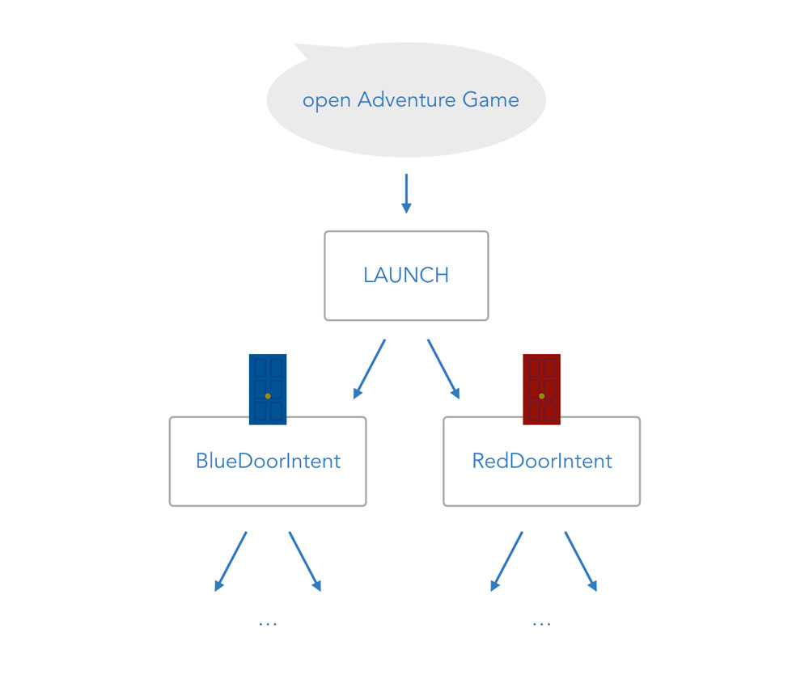

Both intents have similar example phrases (this might cause problems that we will deal with later). For example, here are the ones for the 'BlueDoorIntent':

```text
I want to go through the blue door
go through the blue door
through the blue door
the blue door
blue door
blue
```

We're going to create these intents below. But first, let's take a look at the second step.

## Second Interaction: Yes or No?

No matter which door the players choose, they will be asked a question they should answer with _yes_ or _no_ in the next step.

As you can see below, there are now 4 possible scenarios for the game:

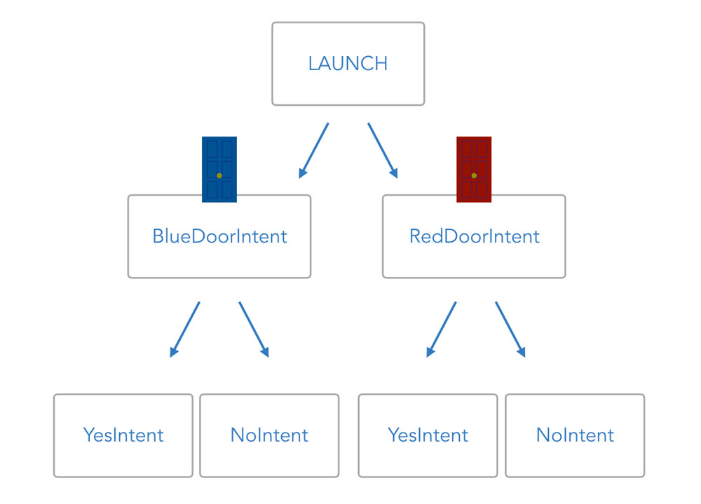

Let's go ahead and create the interaction model. For the sake of fast prototyping, we will focus on Amazon Alexa for each step. However, we're also going to include information for you to bring this game to Google Home and Google Assistant.

* [Create the Interaction Model on Amazon Alexa](#create-the-interaction-model-on-amazon-alexa)
* [Optional: Create the Language Model on Dialogflow](#optional-create-the-language-model-on-dialogflow)

## Create the Interaction Model on Amazon Alexa

By now, we already know how the creation of a Skill project on the [Amazon Developer Portal](https://developer.amazon.com/) works. You can learn about it in more detail in [Project 1 Step 3: Create a Project on the Amazon Developer Portal](../project-1-hello-world/step-3-amazon-developer-portal.md).

Let's create a Skill called "Adventure Game" with the same invocation name:

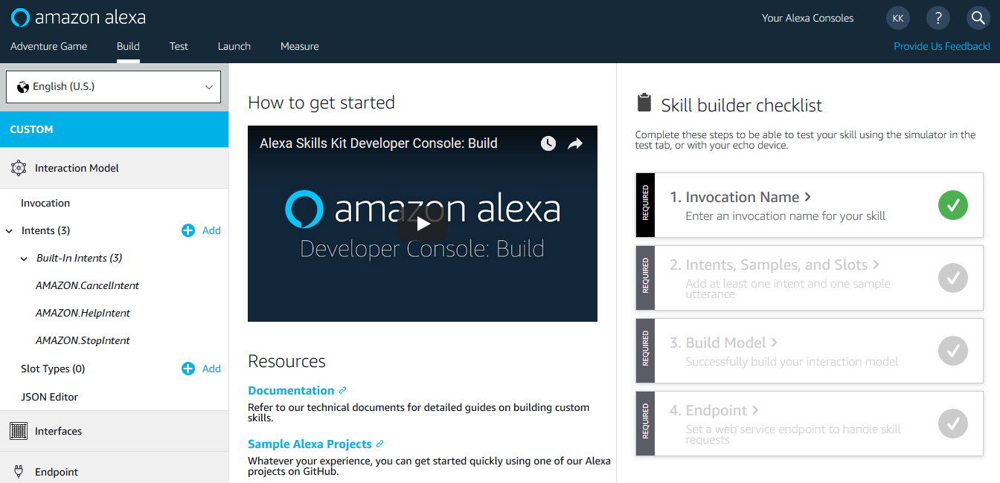

For the interaction model, we're going to add 4 intents:

* 2 intents for the first step: _BlueDoorIntent_ and _RedDoorIntent_
* 2 intents for the second step: _AMAZON.YesIntent_ and _AMAZON.NoIntent_

### Alexa: BlueDoorIntent and RedDoorIntent

In the Skill Builder Beta, we're adding two custom intents _BlueDoorIntent_ and _RedDoorIntent_.

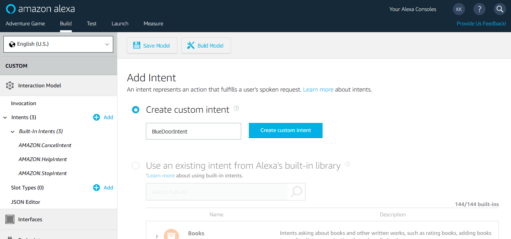

Again, these are sample utterances for BlueDoorIntent:

```text
I want to go through the blue door
go through the blue door
through the blue door
the blue door
blue door
blue
```

This is how it looks like in the Skill Builder:

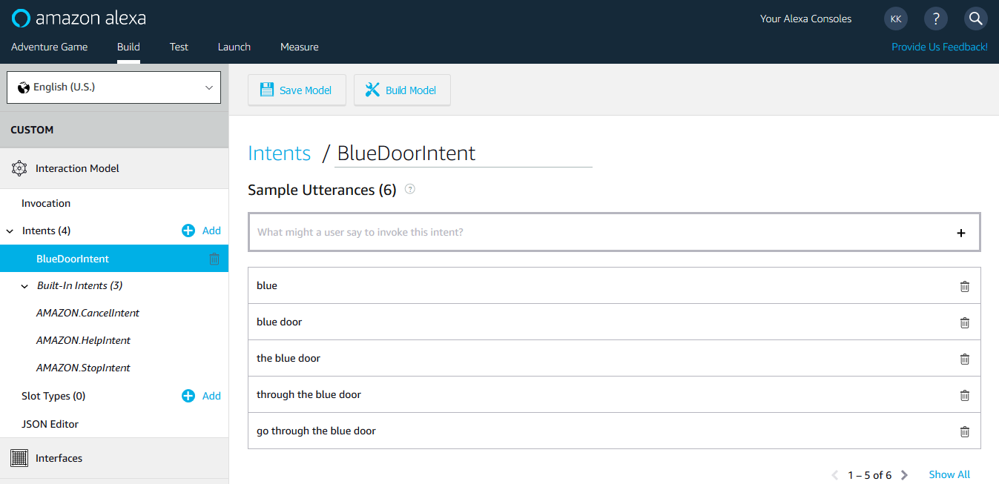

The RedDoorIntent looks similar:

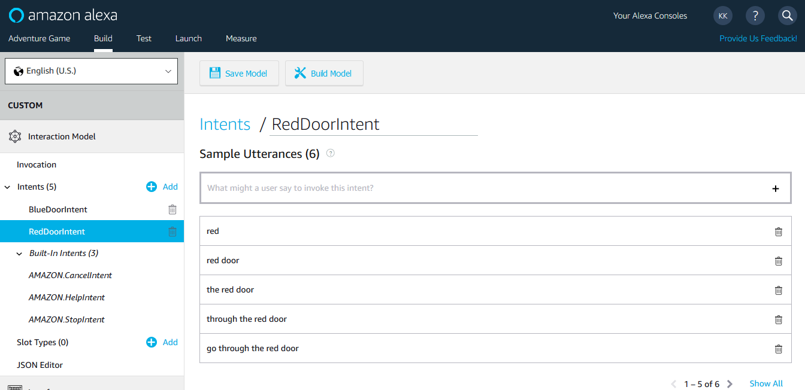

We will later see that this is not the ideal way to create two almost identical intents. But for now, we're fine with this.

### AMAZON.YesIntent and AMAZON.NoIntent

In the next step, we want to add support for a user replying with "Yes" or "No".

For this, Amazon offers so-called built-in intents that are already trained with utterances, so you don't have to.

For Yes and No, we're adding _AMAZON.YesIntent_ and _AMAZON.NoIntent_.

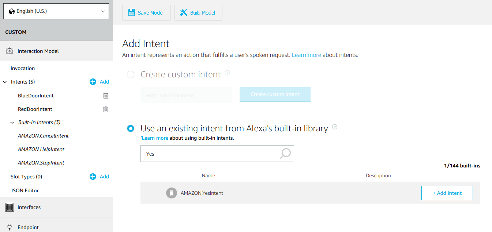

We will take a deeper look into those Yes and No intents in [step 4: Built-in Intents and intentMap](./step-4-built-in-intents-intentmap.md).

We're done with the interaction model for now. Click "Build Model":

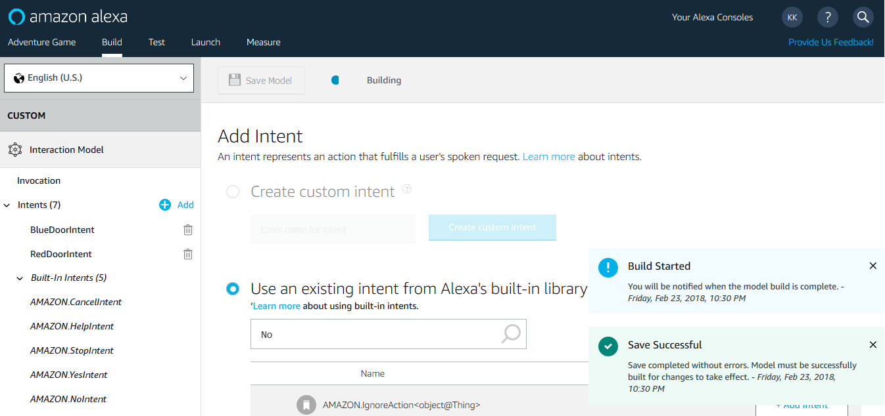

After a bit, it should be successfully created.

You can now either go to the [next step](#next-steps) or take a look how a language model is created on Dialogflow to use with Google Assistant.

## Create the Language Model on Dialogflow

Creating a language model for Google Assistant is a little different compared to Alexa, where it's done all on one platform, the Amazon Developer Portal. As we learned in [Project 1 Step 4: Create a Project on Dialogflow and Google Assistant](../project-1-hello-world/step-4-dialogflow-google-assistant.md), it is common to use Dialogflow to do the natural language understanding for Google Assistant, and use the built-in integration to connect both.

Let's go to the [Dialogflow Console](https://console.dialogflow.com) and create a new agent called AdventureGame. This is what the screen of the agent including default intents looks like:

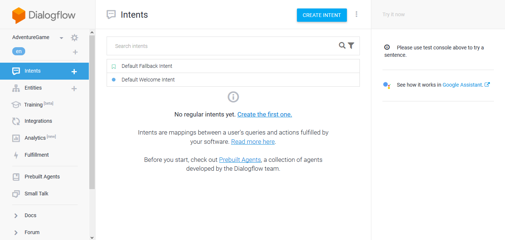

We’re going to add 4 intents to this agent:

* 2 intents for the first step: _BlueDoorIntent_ and _RedDoorIntent_
* 2 intents for the second step: _YesIntent_ and _NoIntent_

### Dialogflow: BlueDoorIntent and RedDoorIntent

Just like we did for Amazon Alexa, we're creating an intent for each door, for example with these phrases for _BlueDoorIntent_:

```text
I want to go through the blue door
go through the blue door
through the blue door
the blue door
blue door
blue
```

This is how it looks like on Dialogflow:

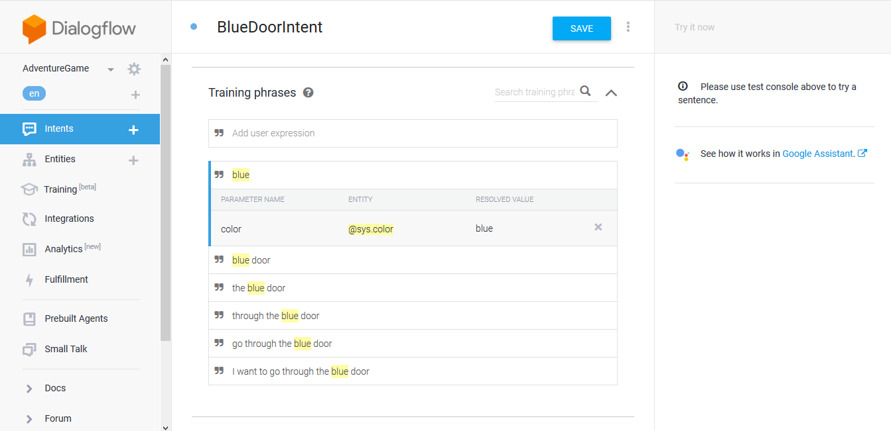

Notice something? Dialogflow automatically recognizes _blue_ as a color. We will make use of this in a later step. For now, let's also create a _RedDoorIntent_:

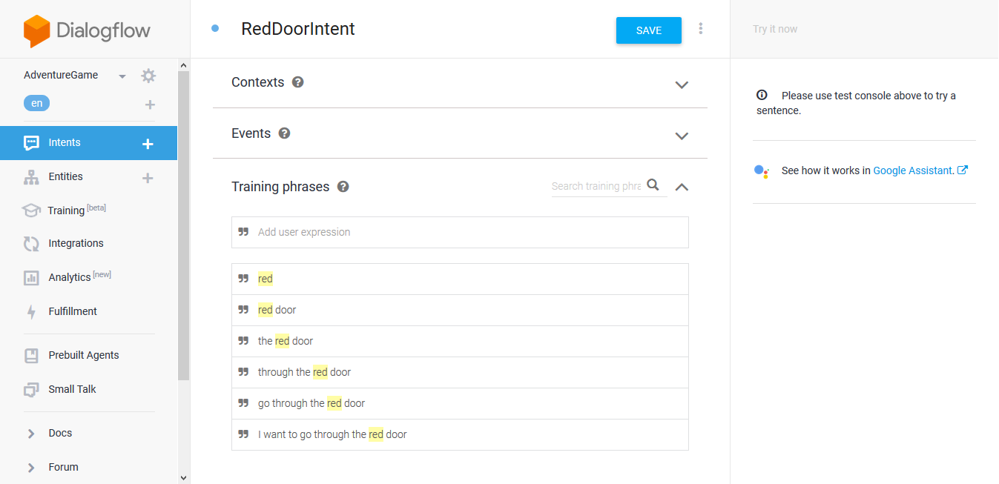

### YesIntent and NoIntent

For _Yes_ and _No_ on Amazon Alexa, we could rely on so-called built-in intents _AMAZON.YesIntent_ and _AMAZON.NoIntent_. On Dialogflow, we need to create them ourselves.

We're just going to add a few sample phrases like _yes please_, _yes_, or _yup_. This is was _YesIntent_ looks like:

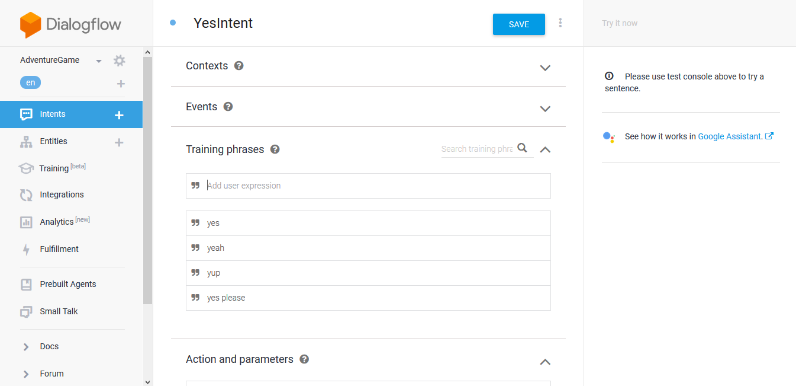

And this is _NoIntent_:

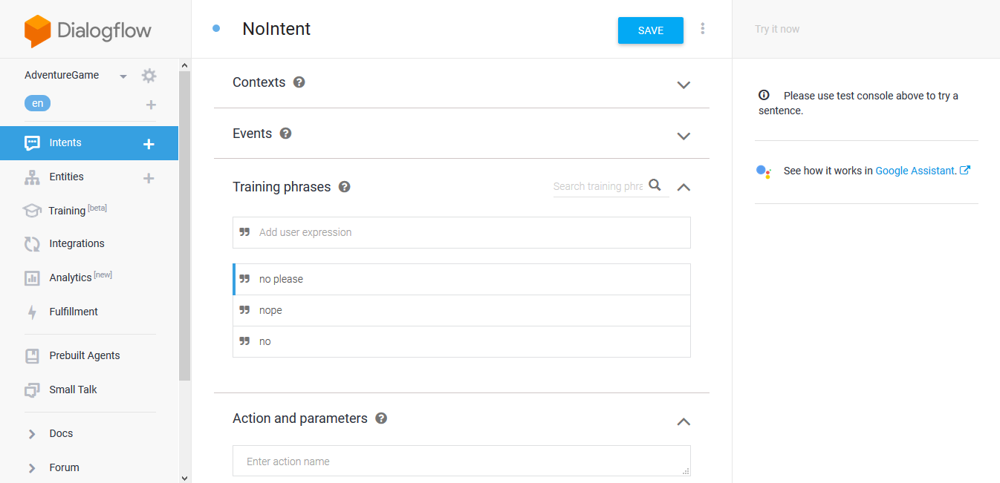

Done. The agent trains itself automatically every time you save an intent.

## Next Steps

> [Step 2: Route Through Intents with the Ask Method](./step-2-ask-method.md)

<!--[metadata]: { "description": "In this lecture, you will design the interaction and create the language model for the game.", "author": "jan-koenig" }-->
