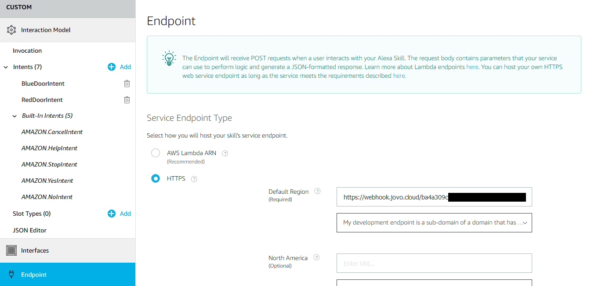
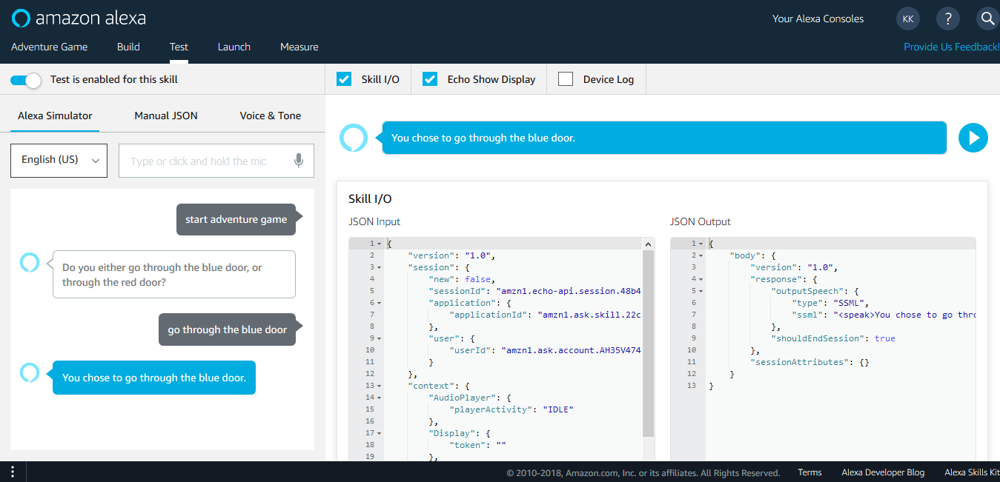
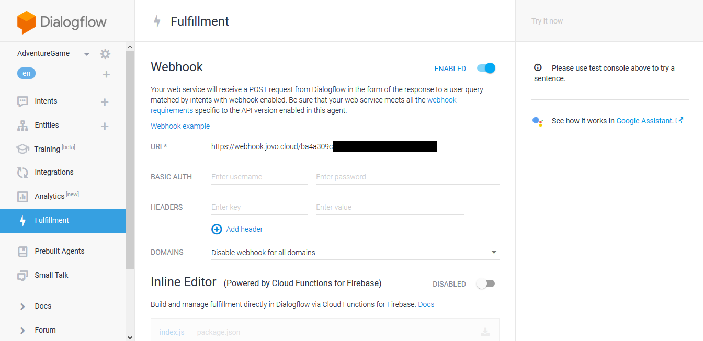
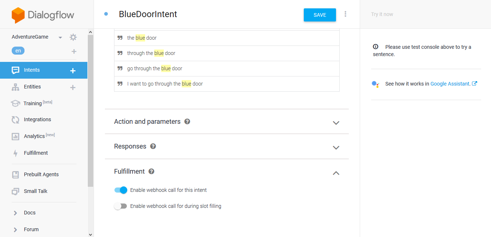
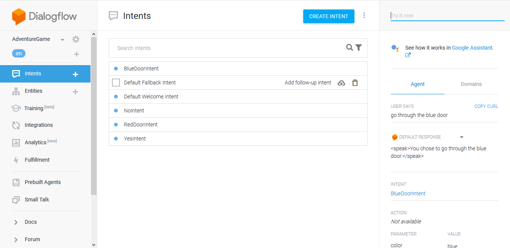
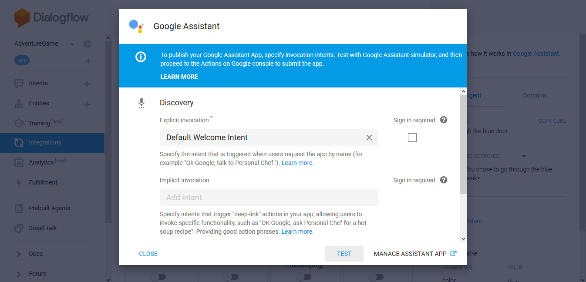
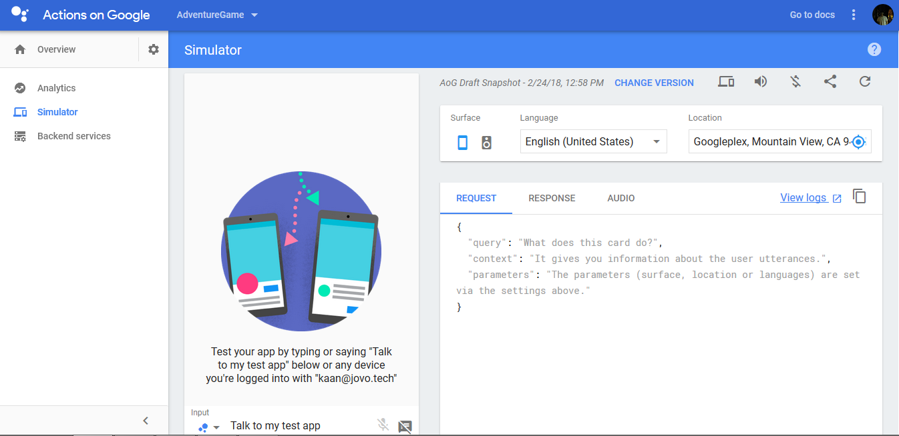
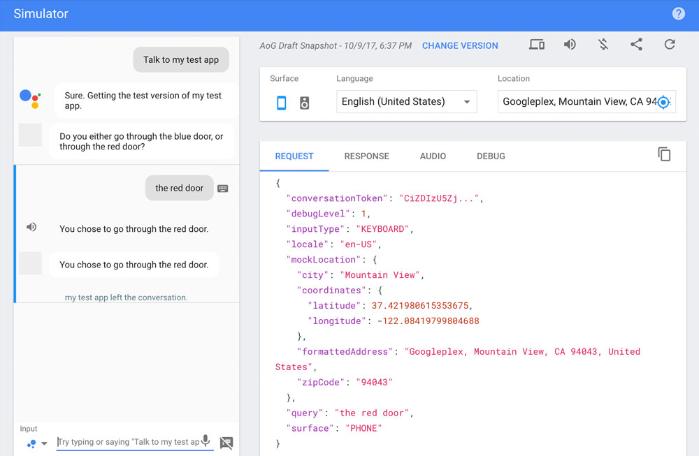

# Step 2: Route through Intents with the Ask Method

In this step, we're learning more about the flow of voice apps. How does a person get to a specific intent, how do we route them through the app logic?

We're first creating a new Jovo project, then building the app logic for the first interaction (_BlueDoorIntent_ and _RedDoorIntent_). Afterward, we're testing the voice app online.

### Sections

* [Create a Jovo Project](#create-a-jovo-project)
* [Building the Voice App Logic](#building-the-voice-app-logic)
* [Preparing for Local Testing](#preparing-for-local-testing)
* [Testing on Amazon Alexa](#testing-on-amazon-alexa)
* [Testing on Dialogflow and Google Assistant](#testing-on-dialogflow-and-google-assistant)
* [Next Steps](#next-steps)

## Create a Jovo Project

If you're new to the Jovo Framework, you can learn more about the command line tools and the creation of a new project in in the previous course: [Project 1 Step 5: Create a Jovo Project](../project-1-hello-world/step-5-create-jovo-project.md '../../project-1-hello-world/step-5-create-jovo-project').

Let's create a new project named **AdventureGame**:

```sh
$ jovo new AdventureGame
```

This will create a new folder and clone the [Jovo Sample Voice App](https://github.com/jovotech/jovo-sample-voice-app-nodejs) into it:

```text
  I'm setting everything up

   V Creating new directory /AdventureGame
   V Downloading and extracting template helloworld
   V Installing npm dependencies

  Installation completed.
```

In the next steps we're going to modify the [app.js](https://github.com/jovotech/jovo-sample-voice-app-nodejs/blob/master/src/app.js) of our app and create a logic that reflects how the flow of our adventure game should be. The app file generally consists of two parts: the **App Initialization** and the **App Logic**.

```javascript
'use strict';

// =================================================================================
// APP INITIALIZATION
// =================================================================================

const {App} = require('jovo-framework');
const {Alexa} = require('jovo-platform-alexa');
const {GoogleAssistant} = require('jovo-platform-googleassistant');
const {JovoDebugger} = require('jovo-plugin-debugger');

const app = new App();

app.use(
    new Alexa(),
    new GoogleAssistant(),
    new JovoDebugger()
);


// =================================================================================
// APP LOGIC
// =================================================================================

app.setHandler({
    LAUNCH() {
        this.toIntent('HelloWorldIntent');
    },

    HelloWorldIntent() {
        this.ask('Hello World! What\'s your name?', 'Please tell me your name.');
    },

    MyNameIsIntent() {
        this.tell('Hey ' + this.$inputs.name.value + ', nice to meet you!');
    },
});

module.exports.app = app;
```

In this step of the tutorial, we will only care about the second (bottom) part.

## Building the Voice App Logic

Before we're building out the app's logic and talk about routing through intents, let's take a look at how it is usually structured.

### Refresher

Here is what the off-the-shelf logic for a "Hello World" voice app looks like, when you're using the Jovo CLI to create a new project:

```javascript
app.setHandler({
    LAUNCH() {
        this.toIntent('HelloWorldIntent');
    },

    HelloWorldIntent() {
        this.ask('Hello World! What\'s your name?', 'Please tell me your name.');
    },

    MyNameIsIntent() {
        this.tell('Hey ' + this.$inputs.name.value + ', nice to meet you!');
    },
});
```

The _LAUNCH_ intent is opened when a user initially launches the app without deep invocation (if the user says "_open adventure game_"). In the Hello World example, this uses _toIntent_ to redirect to the HelloWorldIntent, which returns a simple speech output statement by using the _tell_-method.

### Add BlueDoorIntent and RedDoorIntent

Let's get rid of HelloWorldIntent and create intents for both doors:

```javascript
app.setHandler({

    LAUNCH() {
        //
    },

    BlueDoorIntent() {
        //
    },

    RedDoorIntent() {
        //
    }
});
```

In comparison to Hello World, this is now different: We have some form of interactivity, where the the app asks the user for additional input, and then routes to the resulting intent.

So, how do we now set up the code so we can ask users for additional input? As the wording already suggests, it's called _ask_-method.

### Use the Ask-Method

For speech output, you can use two common methods with the Jovo Framework:

* [tell](https://github.com/jovotech/jovo-framework-nodejs/tree/master/docs/basic-concepts/output#tell 'docs/basic-concepts/output#tell'): Returns speech output and ends the session
* [ask](https://github.com/jovotech/jovo-framework-nodejs/tree/v2/docs/basic-concepts/output#ask 'docs/basic-concepts/output#ask'): Returns a speech prompt and waits for user input, reprompts if user stays quiet

So, for a basic interaction, we would use _ask_ in our _LAUNCH_ intent to prompt users to either say "blue door" or "red door". If this happens, we will first just return a simple statement like "You chose to go through the blue door" for testing the model.

Let's build this into our code:

```javascript
app.setHandler({

    LAUNCH() {
        let speech = 'Do you either go through the blue door, or through the red door?';
        let reprompt = 'You have two options, the blue door, or the red door.';
        this.ask(speech, reprompt);
    },

    BlueDoorIntent() {
        let speech = 'You chose to go through the blue door.';
        this.tell(speech);
    },

    RedDoorIntent() {
        let speech = 'You chose to go through the red door.';
        this.tell(speech);
    }
});
```

As you can see above, the _ask_ method needs both initial _speech_ output and a _reprompt_ if the user misses to answer for the first time. If the user answers with either _BlueDoorIntent_ or _RedDoorIntent_, the output will be a simple sentence produced with the _tell_ method, which closes the session.

Let's test this on either the Alexa or Dialogflow platform.

## Preparing for Local Testing

We will use a local webhook and the tunneling service ngrok for the testing of our code. You can find a more detailed introduction in [Project 1 Step 6: Hello World!](../project-1-hello-world/step-6-hello-world.md)

### Run the Local Server

In your command line, go to your project's folder and start the development server with the following command:

```sh
$ jovo run
```

Remember that it's necessary to restart the server with _ctrl + c_ and _$ jovo run_ whenever you make changes to the code.

This will start the server and create a link for you to use as an endpoint. Now we can test it on Amazon Alexa and/or Dialogflow:

* [Testing on Amazon Alexa](#testing-on-amazon-alexa)
* [Testing on Dialogflow](#testing-on-dialogflow-and-google-assistant)

## Testing on Amazon Alexa

Paste your webhook link to your Skill project's **Endpoint** on the [Amazon Developer Portal](https://developer.amazon.com) and select the second option for the **SSL Certificate**, because Jovo provides a subdomain:



On the **Test** tab enable testing and type in an utterance to see if this worked:



If you have an **Alexa enabled device**, you can test it there as well. Just make sure you have the same email address connected to your device, as you're using on the Amazon Developer Portal.

## Testing on Dialogflow and Google Assistant

If you want to test the interaction with Google Assistant, you need to do the following steps:

* Add endpoint to Dialogflow Fulfillment
* Add webhook fulfillment to Dialogflow intents
* Add Google Assistant integration to Dialogflow agent

We've done these steps in more detail in [Project 1 Step 6: Hello World! > Testing Your Voice App > Google Assistant](../project-1-hello-world/step-6-hello-world.md#google-assistant).

Open your agent in the [Dialogflow Console](https://console.dialogflow.com), go to the **Fulfillment** section and paste the webhook you created above into the URL field:



The next step is important: Go to each of your intents, scroll down and select webhook fulfillment ("**Enable webhook call for this intent**"):



This way the agent knows to pass the request to your code.

This should already be enough to test your voice app inside the Dialogflow console. Just go to the right panel and type in a phrase like "_go through the blue door_":



This should be enough for simple testing if an intent's response comes through as expected.

If you want to test the whole flow, it's better to use the Actions on Google Simulator. To access this, go to the **Integrations** tab and choose the Google Assistant integration (the first one). Keep the information as is and click on "**Test**":



After that "**Continue**" to open the simulator:



By typing in "_Talk to my test app_" (or what's suggested by the simulator), you can launch your app and work through the flow:



Great, this worked! You can also test this on any **Assistant enabled device** that uses the same email address you have associated to the Actions on Google Console account.

## Next Steps

> [Step 3: Slots and Parameters](./step-3-slots-and-parameters.md)

<!--[metadata]: { "description": "Learn about the flow of voice apps and how to route your user through the app logic.", "author": "jan-koenig" }-->
