# Step 3: Slots and Parameters

In this step, we're addressing a problem that has come up in the [previous step](./step-2-ask-method.md): _BlueDoorIntent_ and _RedDoorIntent_ are so similar, why do I have to do all the work twice? And what would happen if there were even more doors with more colors? Meet slots and parameters.

* [Changing the Interaction Model](#changing-the-interaction-model)
* [Introduction to Slots and Parameters](#introduction-to-slots-and-parameters)
* [Creating an EnterDoorIntent](#creating-an-enterdoorintent)
* [Updating the App Logic for EnterDoorIntent and Parameters](#updating-the-app-logic-for-enterdoorintent-and-parameters)
* [Testing](#testing)
* [Next Steps](#next-steps)

## Changing the Interaction Model

As previously mentioned, the intents _BlueDoorIntent_ and _RedDoorIntent_ are pretty similar to each other, as in the utterances are the same, with only the color being different.

This comes with two main problems:

* It's a lot of redundant work setting up the language models
* It could confuse the natural language understanding service from the voice platforms, as the example phrases are too close to each other

So, wouldn't it be great to merge the both intents to one, say, _EnterDoorIntent_?

It would look like this:

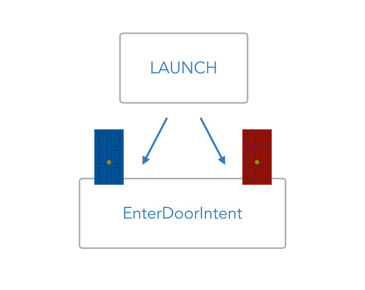

With only one intent left, how can we train the language model to help the voice service understand the difference between the blue and the red door?

This is what parameters (slots on Alexa and entities on Dialogflow) are about:

## Introduction to Slots and Parameters

Slots are one of the [3 Elements of Voice Interactions](https://www.jovo.tech/courses/project-1-hello-world/step-2-introduction-language-models#the-3-basic-elements-of-voice-interactions) (Project 1 Step 2: Introduction to Language Models). Depending on the platform, they are also often referred to as parameters or entities. For this course, we are going to call them slots most of the time.

These slots are additional elements of input within an intent that a user provides. In this example, the differences are only in the color, so we're going to add a slot called **Color** to our interaction model.

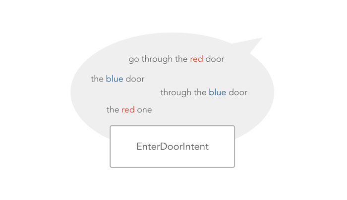

Let's go to the platforms and create the new intent **EnterDoorIntent** with slots called **Color**.

## Creating an EnterDoorIntent

In this section, we're going to merge the _BlueDoorIntent_ and _RedDoorIntent_ to a single _EnterDoorIntent_ on Amazon Alexa and Dialogflow. If you prefer to only use one platform for testing, you can jump right to it:

* [Creating Slots on Amazon Alexa](#creating-slots-on-amazon-alexa)
* [Creating Entities on Dialogflow](#creating-entities-on-dialogflow)

### Creating Slots on Amazon Alexa

On the [Amazon Developer Portal](https://developer.amazon.com/), let's delete one of the existing intents. In our example, the _BlueDoorIntent_:

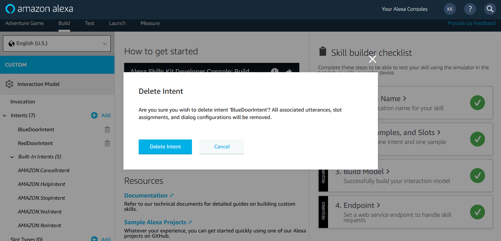

Instead of having to create a whole new intent with all the utterances, let's modify the _RedDoorIntent_ and add a slot there. Rename the intent to _EnterDoorIntent_:

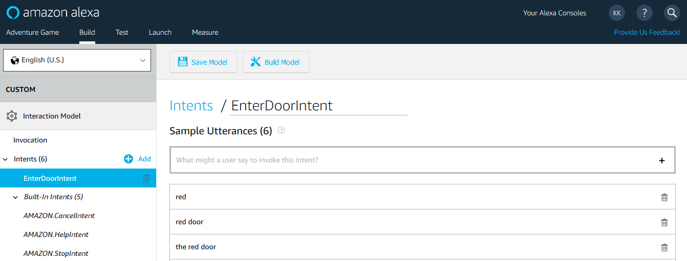

Next, select the color in one the utterances:

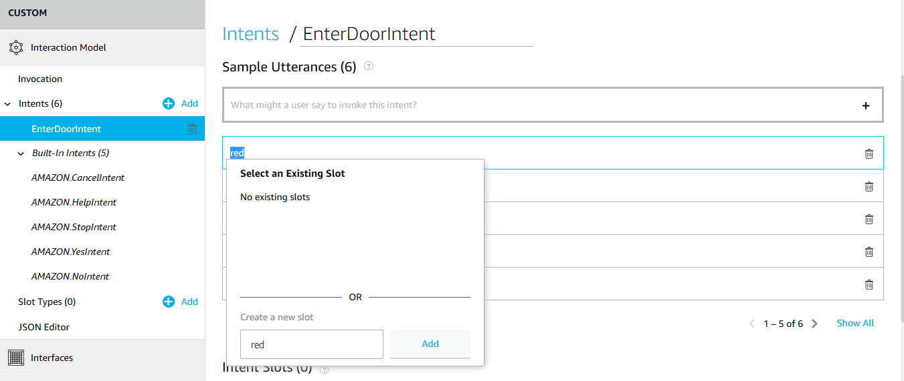

Create a new intent slot called **color**. Then, you can select all elements that say red and assign them to this intent slot. It should now look like this:

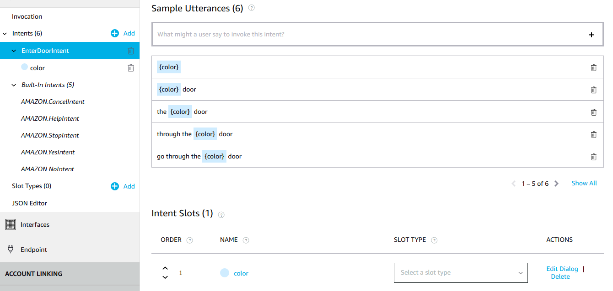

It is likely that a person could also answer with "_the red one_" or "_the blue one_", so let's add something like this as well:

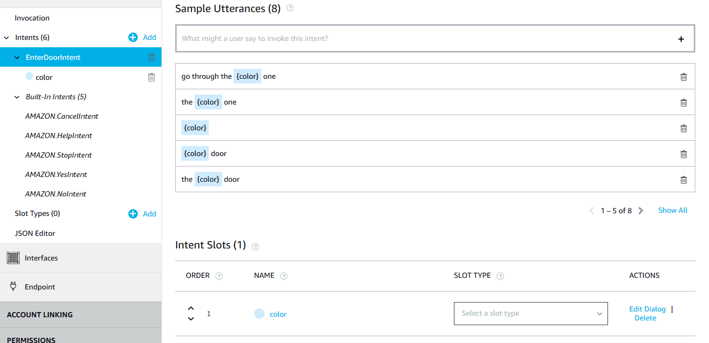

Now that we have created an intent slot, we need to tell Alexa what values to expect for it. At the bottom of the screen, you can see that it's possible to choose a slot type:

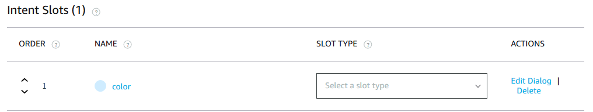

By clicking on it, you can see all the options Amazon provides as built-in slots.

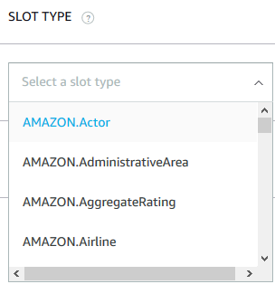

If you search for color, you can see that Amazon already provides a slot type called **AMAZON.Color**. Although we only have two colors to select from, let's use this for convenience:

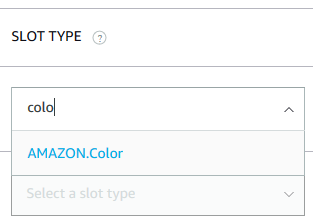

You can now see that this slot type is selected:

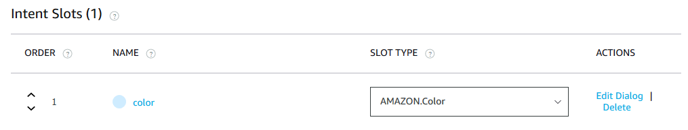

You're done! Click on **Build Model** to finish the process of adding a slot to your _EnterDoorIntent_.  

### Creating Entities on Dialogflow

We're doing the same thing on Dialogflow: Delete one slot and renaming the other to _EnterDoorIntent_.

As already mentioned in the last step, Dialogflow automatically detected "red" as a color in the sample phrases. Let's click on it:

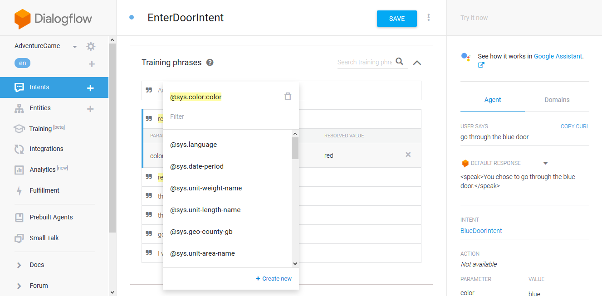

As you can see in the screenshot above, a built-in entity called **@sys.color:color** is suggested, which is similar to Alexa's AMAZON.Color slot type.

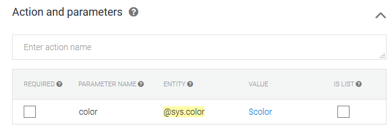

So, Dialogflow saved us some time by attaching the slot itself. It also named the parameter **color**, which matches the name of the intent slot on the Alexa platform. This will come in quite handy in our next step, when we're updating the code.

## Updating the App Logic for EnterDoorIntent and Parameters

Now that we updated our interaction models, let's take a look at our voice app's code.

Remember that our app logic looked something like this:

```javascript
app.setHandler({

    LAUNCH() {
        let speech = 'Do you either go through the blue door, or through the red door?';
        let reprompt = 'You have two options, the blue door, or the red door.';
        this.ask(speech, reprompt);
    },

    BlueDoorIntent() {
        let speech = 'You chose to go through the blue door.';
        this.tell(speech);
    },

    RedDoorIntent() {
        let speech = 'You chose to go through the red door.';
        this.tell(speech);
    }
});
```

Let's merge the two intents. The response could look something like this:

```javascript
app.setHandler({

    LAUNCH() {
        let speech = 'Do you either go through the blue door, or through the red door?';
        let reprompt = 'You have two options, the blue door, or the red door.';
        this.ask(speech, reprompt);
    },

    EnterDoorIntent() {
        let speech = 'You chose to go through the ' + color + ' door.';
        this.tell(speech);
    },
});
```

However, how can we access the values a user provided with a slot or entity? With the Jovo Framework they are stored in the `$inputs` object:

```javascript
EnterDoorIntent() {
    let speech = 'You chose to go through the ' + this.$inputs.color.value + ' door.';
    this.tell(speech);
},
```

Also, let's add some error handling, so that users are asked again if they miss to provide either blue or red:

```javascript
EnterDoorIntent() {
    let speech = '';
    let reprompt = '';

    if (this.$inputs.color.value === 'blue' || this.$inputs.color.value === 'red') {
        speech = 'You chose to go through the ' + this.$inputs.color.value + ' door.';
        this.tell(speech);
    } else {
        speech = 'Please choose either the blue door or the red door.';
        reprompt = 'Say blue door, or red door.';
        this.ask(speech, reprompt);
    }
},
```

That's it!

Let's test it on the platforms.

## Testing

Save your code and restart your local server in your command line with _ctrl + c_ and _jovo run_.

Then, go to your preferred platform to do some testing (or talk to the device next to you).

### Amazon Alexa

Go to the Service Simulator and type in different phrases to see if they return the expected response. For example, "_go through the red door_":

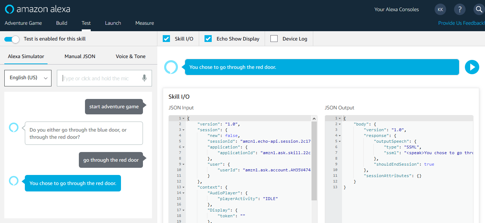

Now let's try something else. What if the user is confused and wants to go through a green door instead? Then our app should ask for either red or blue again. And it works: 

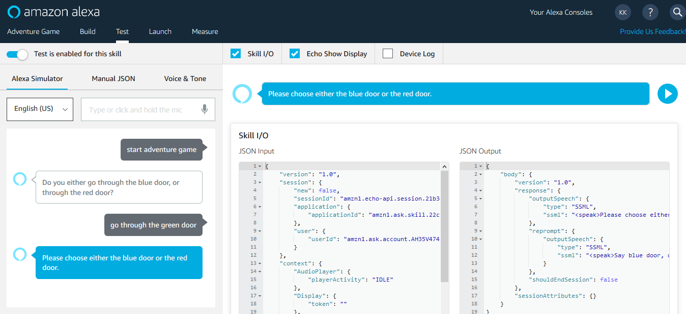

That's it!  

### Google Assistant

On Dialogflow, you can see compare different responses in the testing panel to the right:

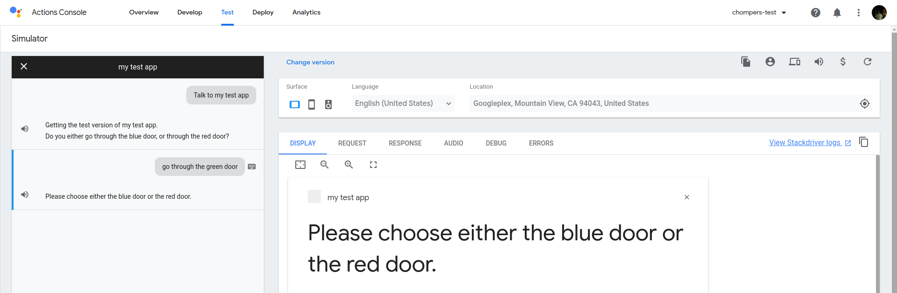

## Next Steps

> [Step 4: Built-in Intents and intentMap](./step-4-built-in-intents-intentmap.md)

<!--[metadata]: { "description": "Learn how to use slots and parameters to define dynamic values", "author": "jan-koenig" }-->
