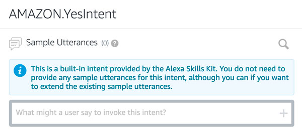
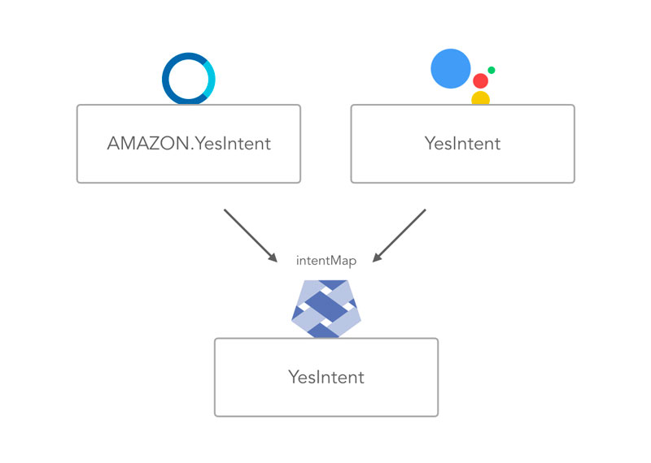

# Step 4: Built-in Intents and IntentMap

In [Step 1: Adventure Game Interaction Design](./step-1-adventure-game-interaction-design.md), we already created two intents for the second interaction of the adventure game: a "Yes" and a "No" answer. In this step, we're going to build out the app logic for this.

### Sections

* [Second Step Interaction Design](#second-step-interaction-design)
* [Coding the Second Interaction](#coding-the-second-interaction)
* [Alexa Built-in Intents and Jovo intentMap](#alexa-built-in-intents-and-jovo-intentmap)
* [Adding YesIntent and NoIntent to the Logic](#adding-yesintent-and-nointent-to-the-logic)
* [Next Steps](#next-steps)

  

## Second Step Interaction Design

First, let's take a look at the interaction to see what we could ask the user. For this course, we won't go too deep into scripting games (there are whole books written about this topic), but let's think about some different scenarios for both doors:

**Blue Door**: You're going through the blue door. There is a dark, long floor. Suddenly, you hear a sound from a room at the end of it. Do you want to follow the sound?

**Red Door:** You're going through the red door. You find yourself in a small room with only one door, and a dog sleeping in front of it. To go through it, you would have to wake up the dog. Do you want to do it?

This leaves two options for each door: Yes or No.


Fortunately, we already created the necessary intents in the previous steps.

Let's build this into our code.

## Coding the Second Interaction

This is what our _EnterDoorIntent_ currently looks like:

```javascript
EnterDoorIntent() {
    let speech = '';
    let reprompt = '';

    if (this.$inputs.color.value === 'blue' || this.$inputs.color.value === 'red') {
        speech = 'You chose to go through the ' + this.$inputs.color.value + ' door.';
        this.tell(speech);
    } else {
        speech = 'Please choose either the blue door or the red door.';
        reprompt = 'Say blue door, or red door.';
        this.ask(speech, reprompt);
    }
},
```

As we want to ask another question and not stop the session, we need to switch from _tell _to _ask_ for the blue and red door.

Let's restructure the code a little bit and add the script from above.

```javascript
EnterDoorIntent() {
    let speech = '';
    let reprompt = '';

    if (this.$inputs.color.value === 'blue') {
        speech = 'You chose to go through the blue door.'
            \+ ' There is a dark, long floor. Suddenly, you hear a sound from a room at the end of it.'
            \+ ' Do you want to follow the sound?';
        reprompt = 'Please say yes or no.';
        this.ask(speech, reprompt);
    } else if (this.$inputs.color.value === 'red') {
        speech = 'You chose to go through the red door.'
            \+ ' You find yourself in a small room with only one door, and a dog sleeping in front of it.'
            \+ ' To go through it, you would have to wake up the dog. Do you want to do it?';
        reprompt = 'Please say yes or no.';
        this.ask(speech, reprompt);
    } else {
        speech = 'Please choose either the blue door or the red door.'; 
        reprompt = 'Say blue door, or red door.'; 
        this.ask(speech, reprompt); 
    }
},
```

Notice how we changed the methods from _tell_ to _ask_ to keep the session open and wait for user input.

Next, we need to add the intents for _Yes_ and _No_.

## Alexa Built-in Intents and Jovo intentMap

What we have created in [Step 1: Adventure Game Interaction Design](./step-1-adventure-game-interaction-design.md) for Yes and No are Alexa built-in intents called _AMAZON.YesIntent_ and _AMAZON.NoIntent_.

If you click into them on the Skill Builder, they are explained like this:



This means we don't need to create a any phrases for these intents. Great, right? However, those built-in intents do come with one problem: If we're developing for cross-platform, we probably don't want to call our intents on Dialogflow (for Google Assistant) _AMAZON.x_.

For this, Jovo offers the ability to match different names to one with an [intentMap](https://www.jovo.tech/docs/routing#intentmap). In it, you can define new names for certain intents, so that they have the same key across platforms.

In this example, we want to map incoming _AMAZON.YesIntent_ requests from Alexa and _YesIntent_ requests from Google Assistant to one intent called _YesIntent_:



Let's do this for both _YesIntent_ and _NoIntent_.

In the configuration part of your voice app, `config.js`, add the following:

```javascript
// ------------------------------------------------------------------
// APP CONFIGURATION
// ------------------------------------------------------------------

module.exports = {
   logging: true,

   intentMap: {
      'AMAZON.StopIntent': 'END',
      'AMAZON.YesIntent': 'YesIntent',
      'AMAZON.NoIntent': 'NoIntent'
   },
};
```

This is all you need to do to map different intent names. We're going add the intents for yes and no to our logic next.

## Adding YesIntent and NoIntent to the Logic

First we're going to add this to the handlers variable for testing:

```javascript
app.setHandler({

    LAUNCH() {
        let speech = 'Do you either go through the blue door, or through the red door?';
        let reprompt = 'You have two options, the blue door, or the red door.';
        this.ask(speech, reprompt);
    },

    EnterDoorIntent() {
        let speech = '';
        let reprompt = '';

        if (this.$inputs.color.value === 'blue') {
            speech = 'You chose to go through the blue door.'
                \+ ' There is a dark, long floor. Suddenly, you hear a sound from a room at the end of it.'
                \+ ' Do you want to follow the sound?';
            reprompt = 'Please say yes or no.';
            this.ask(speech, reprompt);
        } else if (this.$inputs.color.value === 'red') {
            speech = 'You chose to go through the red door.'
                \+ ' You find yourself in a small room with only one door, and a dog sleeping in front of it.'
                \+ ' To go through it, you would have to wake up the dog. Do you want to do it?';
            reprompt = 'Please say yes or no.';
            this.ask(speech, reprompt);
        } else {
            speech = 'Please choose either the blue door or the red door.';
            reprompt = 'Say blue door, or red door.';
            this.ask(speech, reprompt);
        }
    },

    YesIntent() {
        let speech = 'You chose Yes!';
        this.tell(speech);
    },

    NoIntent() {
        let speech = 'You chose No!';
        this.tell(speech);
    },
});
```

So, how do we know if the person is in the room with the blue door, or in the one with the red door?

Let's talk about this next.

## Next Steps

> [Step 5: Introduction to States](./step-5-introduction-to-states.md)

<!--[metadata]: { "description": "Learn to keep using built-in intents in your cross-platform app using the Jovo intent-map", "author": "jan-koenig" }-->