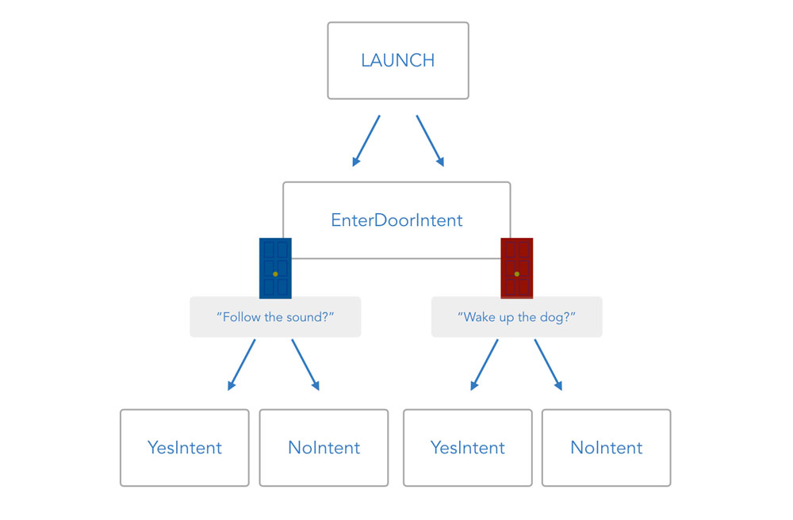
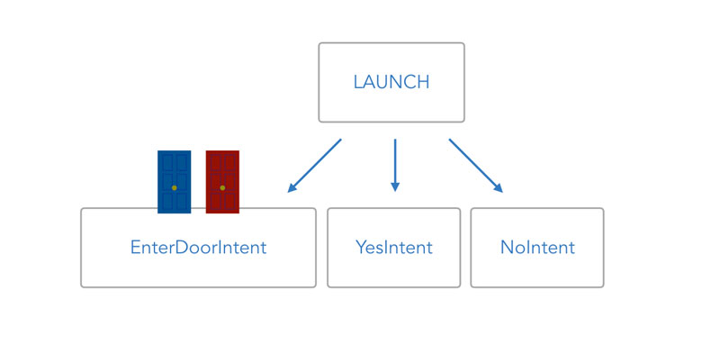
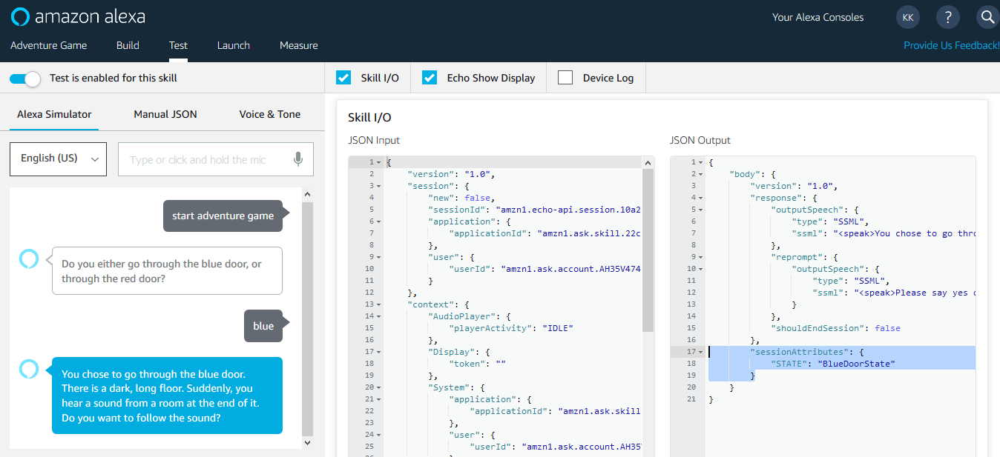
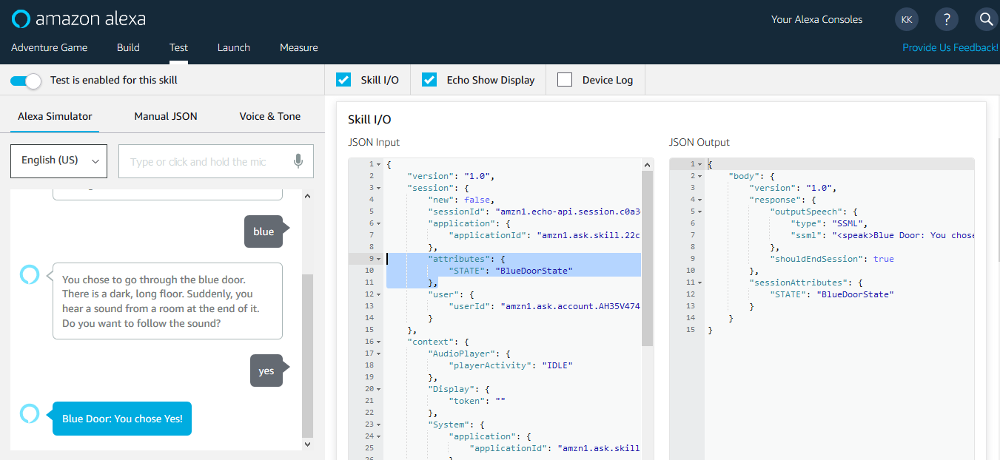
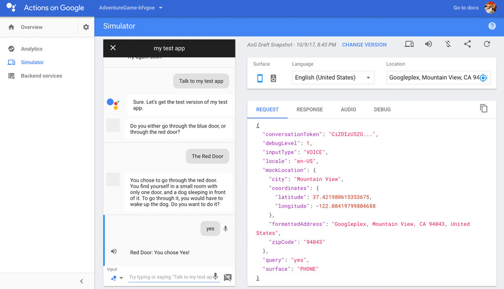
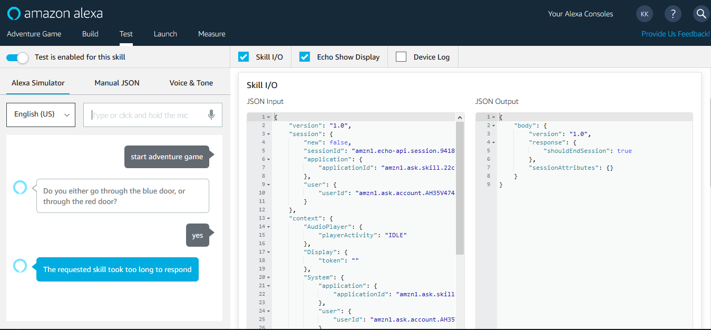
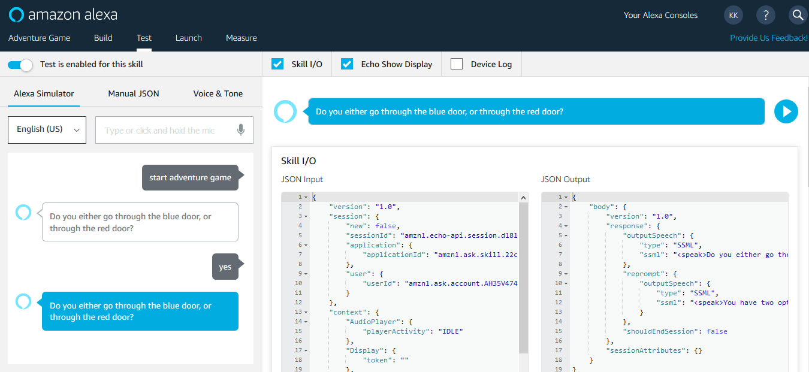
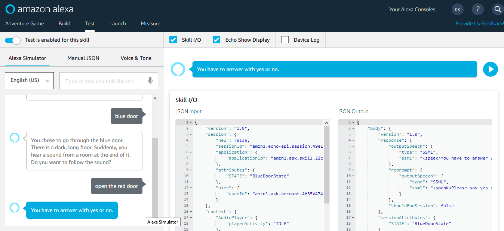

# Step 5: Introduction to States

In the previous step, we noticed that there is the possibility for certain intents to be needed several times with different meanings. In this post, we're introducing states to accomplish this.

* [Why We Need States](#why-we-need-states)
* [How States Work](#how-states-work)
* [Adding States with followUpState](#adding-states-with-followupstate)
* [Adding States to the Logic](#adding-states-to-the-logic)
* [Using Unhandled Intent](#using-unhandled-intent)
* [Congrats](#congrats)

## Why We Need States

As mentioned in previous steps, we want our app logic to look like a binary tree, where users play through different scenarios with different things happening depending on which door they choose at the beginning.



However, with the current structure there is no real hierarchy. There's no way to figure out which room in the game the person is currently in.

It looks more like this:



So how can we create some hierarchy?

We need to find some (frictionless) way to save where a user is coming from when going to the next intent. We could do this manually by saving it in a database, or use [session attributes](https://www.jovo.tech/docs/data#session-data). This is basically what we're doing, but without worrying about saving the data ourselves: with Jovo State Handling.

## How States Work

States can be added to any _ask_ method call to make sure the next intent knows from the request where the user is coming from.

In our example, we're adding a _BlueDoorState_ or a _RedDoorState_ to the ask calls to be able to distinguish the Yes- and NoIntents from each other, depending on the door that was previously entered.


In the next step we're going to use states for the first time.

## Adding States with followUpState

We're doing this by adding a [followUpState](https://www.jovo.tech/docs/routing/states#followupstate) to the app before an _ask_ call.

Remember the _EnterDoorIntent_:

```javascript
EnterDoorIntent() {
    let speech = '';
    let reprompt = '';

    if (this.$inputs.color.value === 'blue') {
        speech = 'You chose to go through the blue door.'
            \+ ' There is a dark, long floor. Suddenly, you hear a sound from a room at the end of it.'
            \+ ' Do you want to follow the sound?';
        reprompt = 'Please say yes or no.';
        this.ask(speech, reprompt);
    } else if (this.$inputs.color.value === 'red') {
        speech = 'You chose to go through the red door.'
            \+ ' You find yourself in a small room with only one door, and a dog sleeping in front of it.'
            \+ ' To go through it, you would have to wake up the dog. Do you want to do it?';
        reprompt = 'Please say yes or no.';
        this.ask(speech, reprompt);
    } else { 
        speech = 'Please choose either the blue door or the red door.'; 
        reprompt = 'Say blue door, or red door.'; 
        this.ask(speech, reprompt); 
    } 
},
```
For blue, instead of using

```javascript
this.ask(speech, reprompt);
```

We're adding the following.

```javascript
this.followUpState('BlueDoorState')
        .ask(speech, reprompt);
```

This way, the state will be saved as a session attribute, and at the next request, we will know where the user is coming from. Let's do the same for the red door, leaving us with this version of the complete intent:

```javascript
EnterDoorIntent() {
    let speech = '';
    let reprompt = '';

    if (this.$inputs.color.value === 'blue') {
        speech = 'You chose to go through the blue door.'
            \+ ' There is a dark, long floor. Suddenly, you hear a sound from a room at the end of it.'
            \+ ' Do you want to follow the sound?';
        reprompt = 'Please say yes or no.';
        this.followUpState('BlueDoorState').ask(speech, reprompt);
    } else if (this.$inputs.color.value === 'red') {
        speech = 'You chose to go through the red door.'
            \+ ' You find yourself in a small room with only one door, and a dog sleeping in front of it.'
            \+ ' To go through it, you would have to wake up the dog. Do you want to do it?';
        reprompt = 'Please say yes or no.';
        this.followUpState('RedDoorState').ask(speech, reprompt);
    } else {
        speech = 'Please choose either the blue door or the red door.'; 
        reprompt = 'Say blue door, or red door.'; 
        this.ask(speech, reprompt); 
    }
},
```

In the next step, we need to add the states to the code.

## Adding States to the Logic

States can simply be added as objects to the handlers variable.

For example, we're adding the following below the _EnterDoorIntent_:

```javascript
EnterDoorIntent() {
    // Shortened
},
BlueDoorState: {
    YesIntent() {
        let speech = 'Blue Door: You chose Yes!';
        this.tell(speech);
    },

    NoIntent() {
        let speech = 'Blue Door: You chose No!';
        this.tell(speech);
    },
},
RedDoorState: {
    YesIntent() {
        let speech = 'Red Door: You chose Yes!';
        this.tell(speech);
    },

    NoIntent() {
        let speech = 'Red Door: You chose No!';
        this.tell(speech);
    },
},
```

And that's it.

If you're testing it in the Alexa Service Simulator, you can see that the states are added as session attributes:



And if you now test the utterance "_Yes_", you can see that the attribute "_BlueDoorState_" is set in the request to the left, and that the right YesIntent response is generated:



You can also use the Actions on Google Simulator to test the flow:



## Using Unhandled Intent

Our "happy path" works now, but what if a user answers the first question (the one about the doors) with a "Yes" or "No"? In our current handlers, we don't have a "_YesIntent_" or "_NoIntent_" defined outside states.

Let's try that out.

In the Service Simulator, if we answer the first question (so there's no state yet) with a yes, it returns an error:



If we look into our command line, we can find the following error:

```javascript
(node:87242) UnhandledPromiseRejectionWarning: Unhandled promise rejection (rejection id: 1): Error: The intent name YesIntent has not been defined in your handler.
```

Hmm, so what do we do now? We need to make _YesIntent_ and _NoIntent _accessible outside our states as well. There are two options to do this:

* Add _YesIntent_ and _NoIntent_ manually to your global intents like any other intent before
* Use an _Unhandled_ intent to map all missing intents together

For this tutorial, we're going to use the _Unhandled_ intent. This intent acts like a catch-all for any intent that is coming from the request, but can't be found in the handlers variable.

_Unhandled_ can be used for both for global (stateless) intents or state intents.

### Global Unhandled Intent

By adding an _Unhandled_ intent to your global intents (outside any state), you can make sure that no intent falls through.

For the sake of this tutorial, let's just map global unhandled intents to the _LAUNCH_ intent to make sure people know what this game is really about:

```javascript
app.setHandler({
    // Other intents and states above

    Unhandled() {
        this.toIntent('LAUNCH');
    },
});
```

And as you can see, this time it worked:



Yay!

### Unhandled Intent in States

The _Unhandled_ intent can also be used inside a state. For example, if we don't want people to answer the yes-no questions (in the Blue_DoorState_) with other utterances like "red_ door_," we can add the an _Unhandled_ intent as well:

```javascript
app.setHandler({
    // Other intents and states above

    BlueDoorState: {
        YesIntent() {
            let speech = 'Blue Door: You chose Yes!';
            this.tell(speech);
        },

        NoIntent() {
            let speech = 'Blue Door: You chose No!';
            this.tell(speech);
        },

        Unhandled() {
            this.followUpState('BlueDoorState')
                .ask('You have to answer with yes or no.', 'Please say yes or no');
        },
    },

    // Other intents and states below
});
```

This makes for a more robust experience whenever you need to guide users through the process. If you want to keep them in the loop until they reach a certain intent, make sure to use _followUpState_ again.

_Unhandled_ intents can also help you find out if people are trying to access different features that aren't part of the flow you imagined. This can help you evaluate the concept of your interaction design. For example, we can log the intent people used:

```javascript
console.log(this.$request.getIntentName());
```



In the above example, I tried to trick the game by answering to the yes-no question inside the _BlueDoorState _with "_open the red door_." With the _Unhandled_ intent inside the state, it asks me again to answer with either yes or no.

And this is what was logged into my console:

```javascript
EnterDoorIntent
```

## Congrats

What happens next? Will the dog wake up and bite the player? What's that sound in the other room?

You now know all the basics you need to dive deeper into the game design and add some additional layers and steps to the plot.

Congrats on finishing this course!

<!--[metadata]: { "description": "Learn to split your voice app into different states to give the intents a separate meaning for each intent", "author": "jan-koenig" }-->
