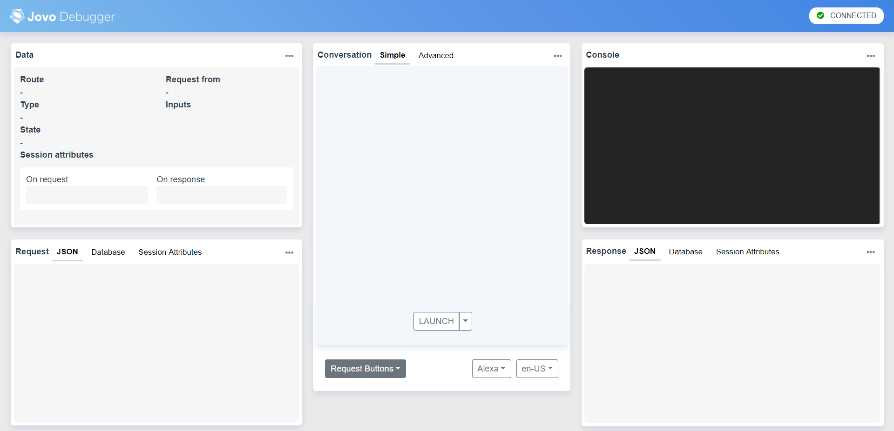
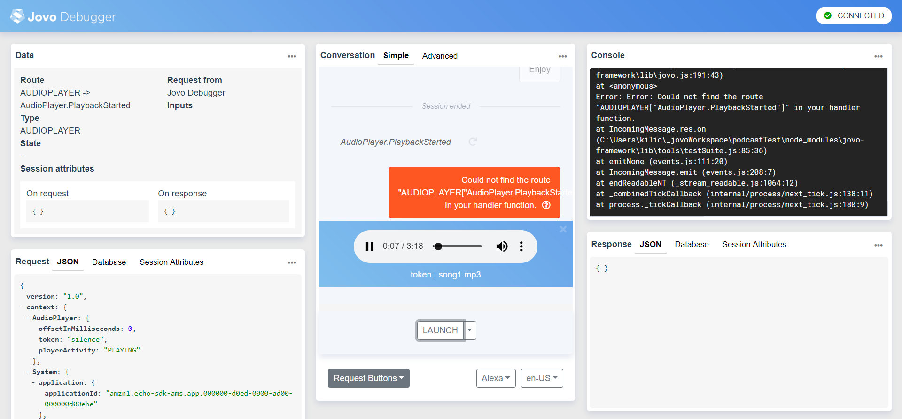
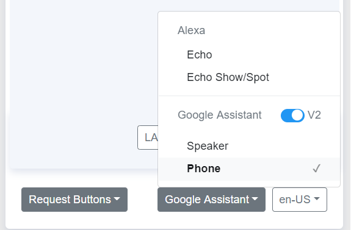
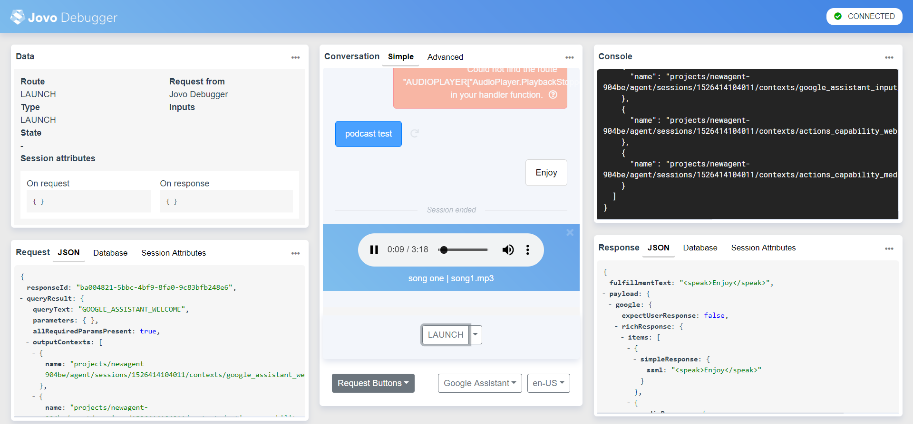

# Step 1: Streaming an Audio File

As a first step towards building our own podcast player Alexa Skill and Google Action, we will create a new Jovo project and make it stream a single audio file for both Alexa and Google Assistant.

* [Creating the Project](#creating-the-project)
* [Playing an Audio File](#playing-an-audio-file)
   * [On Amazon Alexa](#on-amazon-alexa)
   * [On Google Assistant](#on-google-assistant)
* [Next Step](#next-step)

## Creating the Project

> [You can find the full code example on GitHub](https://github.com/jovotech/jovo-sample-podcast-player).

To start off we have to create a new Jovo project. Therefore if you haven't already, install the [Jovo CLI](https://www.jovo.tech/docs/cli):

```sh
# Learn more here: www.jovo.tech/docs/installation
$ npm install -g jovo-cli
```

Create a new project:

```text
$ jovo new PodcastPlayer
```

This will create a new Jovo project into the folder `PodcastPlayer`. You can go into the folder like this:

```text
$ cd PodcastPlayer
```

## Playing an Audio File

The heart of our project is located in the `app.js` file inside the `src` folder. That's the place where we build the logic of our project.

Open up the file and we will see that there are already three intents defined in the `setHandler()` function. We delete everything besides the `LAUNCH` intent since we won't need the other intents at this point:

```javascript
// src/app.js

app.setHandler({
    LAUNCH() {

    }
});
```

Streaming an audio file works differently on both platforms, so we will go over the Alexa part first and add the Google Action implementation after that.

* [On Amazon Alexa](#on-amazon-alexa)
* [On Google Assistant](#on-google-assistant)

### On Amazon Alexa

> [Learn more about the Alexa AudioPlayer interface](https://www.jovo.tech/docs/amazon-alexa/audioplayer).

To play a long-form audio file with Alexa, we will use the [Alexa AudioPlayer interface](https://www.jovo.tech/docs/amazon-alexa/audioplayer). This needs to be enabled either by using the Jovo CLI, or in the Alexa Developer Console. We will do this in [Step 3: Preparing the Development Environment](./step-3-development-environment.md), where we set up the voice platform projects. For now, let's get started with the code first and use the [Jovo Debugger](https://www.jovo.tech/docs/debugger) for testing.

First, we store the URL, where the audio file is hosted at (has to be an HTTPS endpoint). Let's use the popular [Voicebot Podcast](https://voicebot.ai/voicebot-podcasts/) by [Bret Kinsella](https://twitter.com/bretkinsella) as an example and play a recent episode: 

```js
const episode = 'https://traffic.libsyn.com/voicebot/Jan_Konig_on_the_Jovo_Open_Source_Framework_for_Voice_App_Development_-_Voicebot_Podcast_Ep_56.mp3';
```

Next, we use the `this.$alexaSkill.$audioPlayer` object to do 3 things:
* Set the `offset`, which defines the timestamp at which Alexa will start playing the file (in milliseconds). For example, an offset of `1000` will start your audio file at `0:01`.
* Call the `play` function and pass in the URL as well as a token which will discuss later on.
* Use `tell` to attach a speech output that will be said by Alexa *before* playing the audio file.

We place that snippet inside your `LAUNCH` intent, so it gets triggered every time our app is launched:

```javascript
// src/app.js

LAUNCH() {
    const song = 'https://traffic.libsyn.com/voicebot/Jan_Konig_on_the_Jovo_Open_Source_Framework_for_Voice_App_Development_-_Voicebot_Podcast_Ep_56.mp3';
    this.$alexaSkill.$audioPlayer
        .setOffsetInMilliseconds(0)
        .play(song, 'token')
        .tell('Enjoy');
},
```

The most convenient way to test our application is to run the local Jovo Webhook using the CLI.

```sh
$ jovo run
```

The Webhook URL we receive can be used for local development as an HTTPS endpoint, so we don't have to upload our code to AWS Lambda or any other cloud service.

```text
Example server listening on port 3000!
This is your Webhook url: https://webhook.jovo.cloud/<your-unique-id>
```

The Webhook URL is also the gateway to the [Jovo Debugger](https://www.jovo.tech/docs/debugger). You can simply copy and paste the URL into your browser (or use the `.` key):



The Jovo debugger improves your developing experience by showing you the most important data (incoming requests, responses, database, etc.) at one place as well as allowing you to test right on the spot.  

For now, press the launch button right at the middle of the page to send a sample request to your Webhook. Your app should respond by playing the audio file. Ignore the errors for now, we will discuss and fix these further down the road.



That was easy, wasn’t it?

Let’s do the same for our Google Action.

### On Google Assistant

> [Learn more abou the Google Action Media Response interface](https://www.jovo.tech/docs/google-assistant/media-response).

Google Actions offer a similar interface, the [Media Response API](https://www.jovo.tech/docs/google-assistant/media-response), to play audio files. Again, we will take care of the setup process in [Step 3: Preparing the Development Environment](./step-3-development-environment.md), and focus on the implementation for now.

To get started, we can add a similar method call `this.$googleAction.$mediaResponse.play(song, 'song one');` to our existing code:

```javascript
// src/app.js

const song = 'https://traffic.libsyn.com/voicebot/Jan_Konig_on_the_Jovo_Open_Source_Framework_for_Voice_App_Development_-_Voicebot_Podcast_Ep_56.mp3';

this.$alexaSkill.$audioPlayer
    .setOffsetInMilliseconds(0)
    .play(song, 'token');

this.$googleAction.$mediaResponse.play(song, 'Episode 56');

this.tell('Enjoy');
```

As you can see there’s a slight difference between the Alexa function and the Google one. We don’t have to specify the `offset` or a `token`, but a `title`. I will explain the reason for that later on.

But, there's still a small issue. We don't want to use both interfaces with every request, because that would cause an error, so we have to first check from which platform the request is being sent. For this. we can use the `isAlexaSkill` or `isGoogleAction` helpfer methods:

```javascript
// src/app.js
const song = 'https://traffic.libsyn.com/voicebot/Jan_Konig_on_the_Jovo_Open_Source_Framework_for_Voice_App_Development_-_Voicebot_Podcast_Ep_56.mp3';

if (this.isAlexaSkill()) {
    this.$alexaSkill.$audioPlayer
        .setOffsetInMilliseconds(0)
        .play(song, 'token');
} else if (this.isGoogleAction()) {
    this.$googleAction.$mediaResponse
        .play(song, 'Episode 56');
}

this.tell('Enjoy');
```

So our `LAUNCH` intent should look like this now:

```javascript
// src/app.js
LAUNCH() {
    const song = 'https://traffic.libsyn.com/voicebot/Jan_Konig_on_the_Jovo_Open_Source_Framework_for_Voice_App_Development_-_Voicebot_Podcast_Ep_56.mp3';

    if (this.isAlexaSkill()) {
        this.$alexaSkill.$audioPlayer
            .setOffsetInMilliseconds(0)
            .play(song, 'token');
    } else if (this.isGoogleAction()) {
        this.$googleAction.$mediaResponse
            .play(song, 'Episode 56');
    }

    this.tell('Enjoy');
},
```

Let’s test the Google Action implementation. First, we have to change the device that the Jovo Debugger simulates, which is set to the Alexa Echo Dot by default, to the Google Assistant Phone so our application receives the right requests. You can find the option on the bottom of the Debugger.



After that press the `LAUNCH` button and we should hear the song playing.



Alright, we're now able to play a simple audio file on both Amazon Alexa and the Google Assistant. 

## Next Step

In the next step, we will learn how to keep streaming additional audio files after the first song finished.

> [Step 2: Streaming Multiple Files in a Row](./step-2-stream-multiple-files.md)

<!--[metadata]: { "description": "Learn how to stream an audio file on both Amazon Alexa and Google Assistant with the Jovo Framework.", "author": "kaan-kilic", "og-image": "https://www.jovo.tech/img/courses/project-3-podcast-player/podcast-player-course.jpg" }-->
