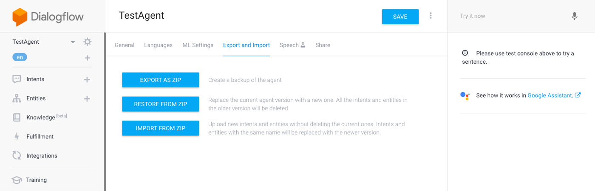
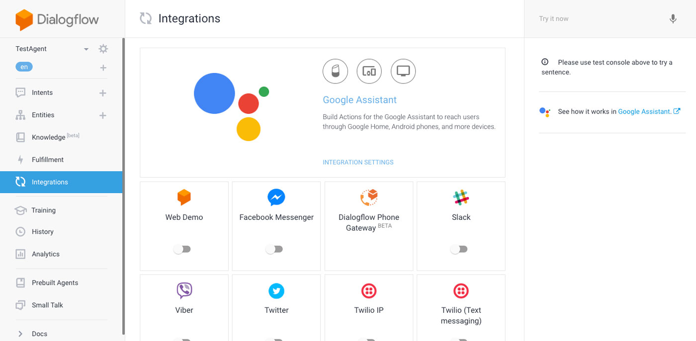
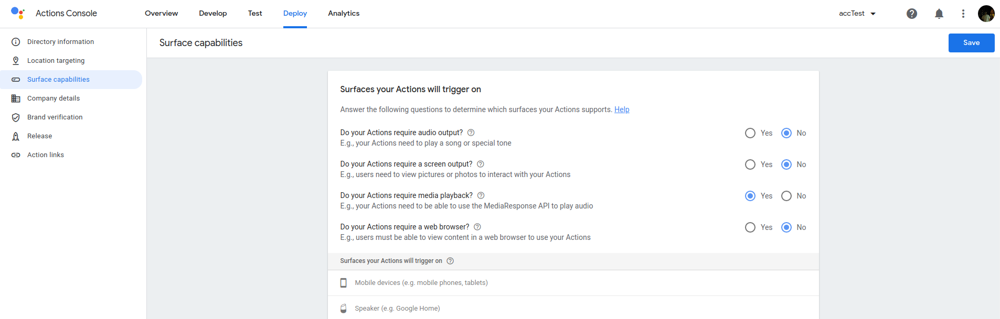

# Step 3: Preparing our Development Environment

From this point on we will start testing the application on actual devices. To do that we have to get some work done, which we were able to skip in the previous steps thanks to the Jovo Debugger.

* [For Amazon Alexa](#for-amazon-alexa)
   [Enabling the AudioPlayer Interface](#enabling-the-audioplayer-interface)
* [For Google Assistant](#for-google-assistant)
* [Next Step](#next-step)
  
## For Amazon Alexa

To test our application on an Amazon Echo as an Alexa Skill, we have to create and customize a project on the Amazon Developer Portal. Instead of doing that on the website, we will use the [Jovo CLI](https://www.jovo.tech/docs/cli). For that, we first need to install and set up the [`ASK CLI`](https://developer.amazon.com/docs/smapi/quick-start-alexa-skills-kit-command-line-interface.html).

We can skip the AWS credentials association step, since we don't need it right now, but we have use the Amazon account which our Alexa device is registered to. Otherwise, we won't be able to test our skill on it device.

```text
$ npm install -g ask-cli

# After that:
$ ask configure
```

### Enabling the AudioPlayer Interface

> [Learn more about the Alexa AudioPlayer interface](https://www.jovo.tech/docs/amazon-alexa/audioplayer).

To use the Alexa AudioPlayer interface, we have to enable it in our Alexa Skill's settings. In the earlier steps, the Debugger handled that for us (because the requests didn't go through an actual Alexa device, enabling the interface wasn't necessary).

These settings are stored inside the `skill.json` file, which every Alexa Skill has. That file is being automatically generated by the Jovo CLI with every `build` command (as well as every other file inside the `platforms` folder) and can be found under `/platforms/alexaSkill/skill.json`.

So making changes directly in that file is counterproductive, since it will be overwritten every time we rebuild the project.

These configurations have to be made inside the `project.js` file in our root folder. This is how it currently looks like:

```javascript
// project.js
module.exports = {
	alexaSkill: {
		nlu: 'alexa',
	},
    googleAction: {
        nlu: 'dialogflow',
    },
	endpoint: '${JOVO_WEBHOOK_URL}'
}
```

We simply use the same path the settings, that we want to override, have in the `skill.json` and every time we use the `build` command, the Jovo CLI will use the content of the `project.js` to modify the `skill.json` file.

You can add the AudioPlayer interface like this:

```javascript
// project.js

module.exports = {
    alexaSkill: {
        nlu: 'alexa',
        manifest: {
            apis: {
                custom: {
                  interfaces: [
                    {
                      type: 'AUDIO_PLAYER'
                    }
                  ]
                }
            }
        }
    },
    googleAction: {
        nlu: 'dialogflow',
    },
    endpoint: '${JOVO_WEBHOOK_URL}'
};
```

## For Google Assistant

> Tutorial: [Deploying your Dialogflow Agent using the Jovo CLI](https://www.jovo.tech/tutorials/deploy-dialogflow-agent)

We're going to do the same for the Google Action, but this time we will have to use the developer portal for some of the stuff. There is also the option to set up your Google Actions project for CLI deployments, but we're skipping this for now as it's quite a few steps to set up the credentials. If you're interested, you can check out our tutorial on [Dialogflow CLI deployment](https://www.jovo.tech/tutorials/deploy-dialogflow-agent).

We will use the Dialogflow `zip` import feature to get started quickly. To create a `zip` file, use the Jovo `build` and `deploy` commands:

```sh
# Build platform-specific files
$ jovo build

# Create deployment package
$ jovo deploy -p googleAction
```

This will create a `dialogflow_agent.zip` file in the `platforms/googleAction` folder. To use it, create a new Dialogflow agent using their [console](https://console.dialogflow.com).

There, go to **Settings**, open the **Export and Import**, and click ***Restore from ZIP***:



That's it! Your Dialogflow agent should work now.

Next, set up the Google Assistant integration in the **Integrations** menu:



Clicking on **Test** in the modal window brings you to the Actions on Google console:


To enable the Media Response API, select the **Surface capabilities** menu and select "*Do your Actions require media playback?*": 




## Next Step

In the next step, we will flesh out our podcast player and allow the user to pause and resume the audio file.

> [Step 4: Pause and Resume the Audio Stream](./step-4-pause-resume-stream.md)

<!--[metadata]: { "description": "Learn how to prepare your development environment to start testing your Podcast Player voice app on Amazon Alexa and Google Assistant devices.", "author": "kaan-kilic", "og-image": "https://www.jovo.tech/img/courses/project-3-podcast-player/podcast-player-course.jpg" }-->