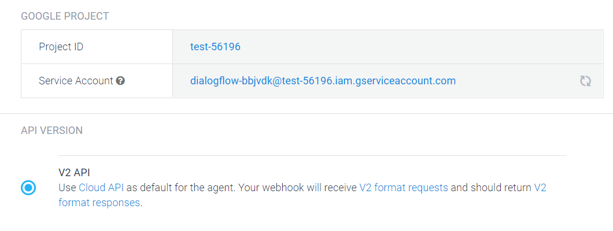
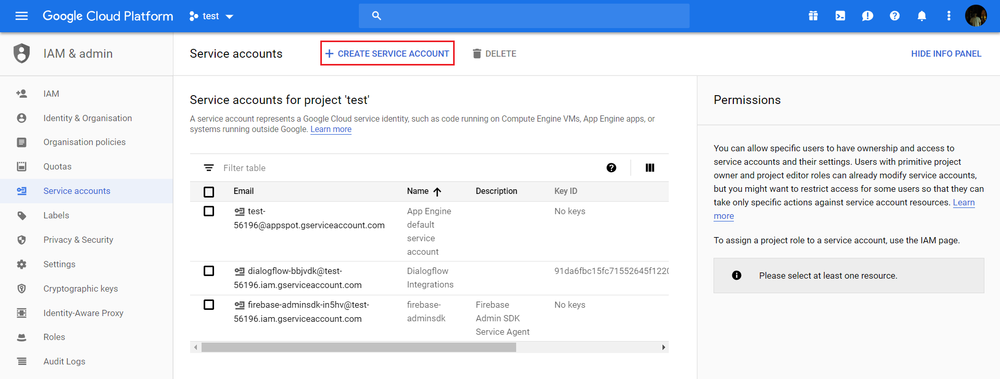
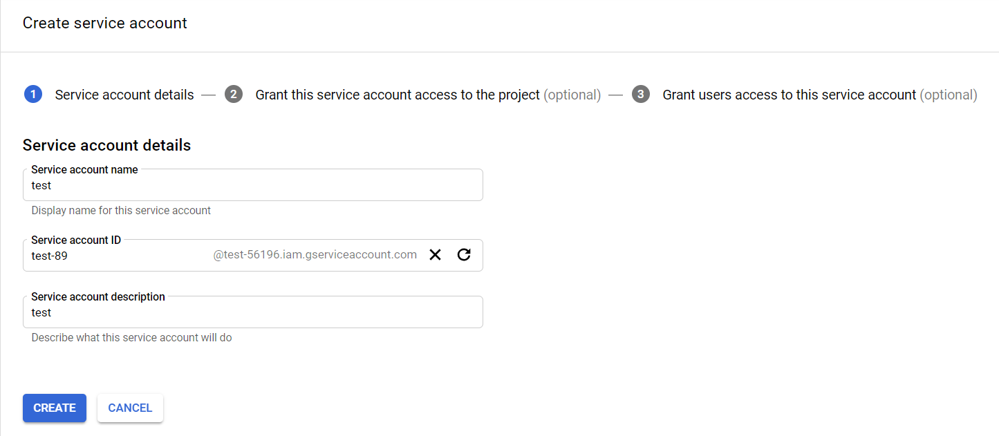
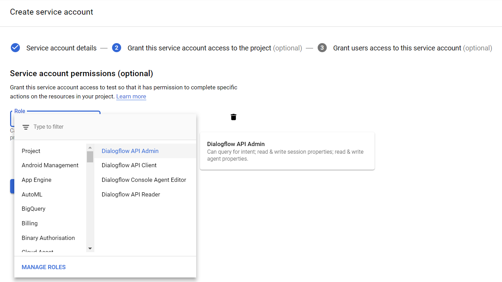

# Step 3: Preparing our Development Environment

From this point on we will start testing the application on actual devices. To do that we have to get some boring work done, which we skipped in the earlier steps thanks to the Jovo Debugger.

* [Amazon Alexa](#amazon-alexa)
* [Google Action](#google-action)
* [Next Step](#next-step)
  
## Amazon Alexa

To test our application on an Amazon Echo as an Alexa Skill, we have to create and customize a project on the Amazon Developer Portal. Instead of doing that on the website we will use the command line. For that, we first need to install and set up the [`ASK CLI`](https://developer.amazon.com/docs/smapi/quick-start-alexa-skills-kit-command-line-interface.html).

We can skip the AWS credentials association step, since we don't need it right now, but we have use the Amazon account, which the Alexa device is registered to, otherwise, we won't be able to test our skill on it device.

```text
$ npm install -g ask-cli

# After that:
$ ask init
```

After we have done all that, we go to the projects root folder and initialize Alexa as one of the platforms the project will be using as well as build the platform files, we will be talking about now:

```text
$ jovo init alexaSkill --build
```

### AudioPlayer Interface

To actually use the Alexa AudioPlayer interface we have to enable it in our Alexa Skill's settings. In the earlier steps, the Debugger handled that for us.

These settings are stored inside the `skill.json` file, which every Alexa Skill has. That file is being automatically generated by the Jovo CLI with every `build` command (as well as every other file inside the `platforms` folder) and can be found under `/platforms/alexaSkill/skill.json`.

So making changes directly in that file is counterproductive, since it will be overridden every time we rebuild the project.

These configurations have to be made inside the `project.js` file in our root folder. 

```javascript
// project.js
module.exports = {
	alexaSkill: {
		nlu: {
			name: 'alexa'
		}
	},
	endpoint: '${JOVO_WEBHOOK_URL}'
}
```

We simply use the same path the settings, that we want to override, have in the `skill.json` and every time we use the `build` command, the Jovo CLI will use the content of the `project.js` to modify the `skill.json` file:

```javascript
// project.js
module.exports = {
    alexaSkill: {
        nlu: {
			name: 'alexa'
		}
        manifest: {
            apis: {
                custom: {
                  interfaces: [
                    {
                      type: 'AUDIO_PLAYER'
                    }
                  ]
                }
            }
        }
    },
    endpoint: '${JOVO_WEBHOOK_URL}'
};
```

## Google Action

We're going to do the same for the Google Action, but this time we will have to use the developer portal for some of the stuff.

First of all, we will initialize Google Action as a platform in our project:

```text
$ jovo init googleAction
```

Now we will set up a new Dialogflow agent using their [console](https://console.dialogflow.com).

After that we will find a service account right beneath the project ID:



It will lead us to the Google Cloud Platform, where we will create a new service account using the button at the top of the page:





We select `Dialogflow API Admin` as the role:



After that we create a new `JSON` key:


Last but not least move the key file to our project's root folder.

### Google Cloud SDK


Now we need the Google Cloud SDK, which the Jovo CLI uses to access Dialogflow projects on the Google Cloud Platform. We can download it [here](https://cloud.google.com/sdk/docs/).

Install the SDK and initialize it using the [quickstart guide](https://cloud.google.com/sdk/docs/quickstarts) from Google.

After that we add both the `projectId` of our Dialogflow agent (can be found in our Dialogflow agent's settings) and the path to the `keyFile` to our project's `project.js`:

```js
// project.js
module.exports = {
    googleAction: {
        dialogflow: {
            projectId: '<your-project-id>',
            keyFile: '<path-to-key-file>'
        }
    }
}
```

Now we can run the `build` and `deploy` command and our Dialogflow agent will be updated using the Jovo Language Model:

```sh
$ jovo build -p googleAction --deploy
```

At the end our `project.js` file should look like this:

```javascript
// project.js
module.exports = {
    alexaSkill: {
        nlu: {
			name: 'alexa'
		}
        manifest: {
            apis: {
                custom: {
                  interfaces: [
                    {
                      type: 'AUDIO_PLAYER'
                    }
                  ]
                }
            }
        }
    },
    googleAction: {
        dialogflow: {
            projectId: '<your-project-id>',
            keyFile: '<path-to-key-file>'
        }
    },
    endpoint: '${JOVO_WEBHOOK_URL}'
}
```

## Next Step

In the next step, we will flesh out our podcast player and allow the user to pause and resume the audio file.

> [Step 4: Pause and Resume the Audio Stream](./step-4.md)

<!--[metadata]: { "description": "In this lecture, we prepare our development environment to start testing on Amazon Alexa or Google Assistant devices", "author": "kaan-kilic" }-->