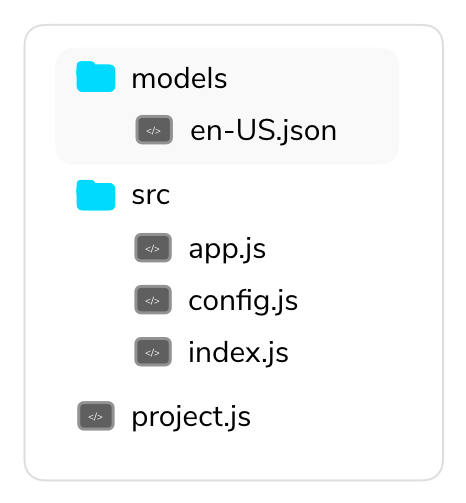

# Step 4: Pausing and Resuming the Audio Stream

In this step, we will flesh out our podcast player and allow the user to pause and resume the audio file.

* [On Amazon Alexa](#amazon-alexa)
	* [Updating the Jovo Language Model](#updating-the-jovo-language-model)
	* [Updating the Logic](#updating-the-logic)
	* [Remaining Alexa Built-in Intents](#remaining-alexa-built-in-intents)
* [On Google Assistant](#google-assistant)
* [Summary](#summary)
* [Next Step](#next-step)

## On Amazon Alexa

Currently, our podcast player can only start playing audio files, nothing else. It's time to change that. We will start with Amazon since they provide us with built-in intents, which we can use as a guideline later on.

The built-in intents for playback control are:

* `AMAZON.PauseIntent`
* `AMAZON.ResumeIntent`
* `AMAZON.CancelIntent`
* `AMAZON.LoopOffIntent`
* `AMAZON.LoopOnIntent`
* `AMAZON.NextIntent`
* `AMAZON.PreviousIntent`
* `AMAZON.RepeatIntent`
* `AMAZON.ShuffleOffIntent`
* `AMAZON.ShuffleOnIntent`
* `AMAZON.StartOverIntent`

Two of these built-in intents, `AMAZON.PauseIntent` and `AMAZON.ResumeIntent`, are **required**, the other intents are technically not, but these intents can still be invoked by our user, so we should, as Amazon says, handle the situation gracefully and return a short response, explaining that the command is not supported, otherwise we will run into errors.

### Updating the Jovo Language Model

> [Learn more about the Jovo language Model here](https://www.jovo.tech/docs/model).

Before we can work with the AudioPlayer interface on an Alexa device, we have to prepare one more thing. As I said two of these intents are required, because of that, an Alexa Skill, that has the AudioPlayer interface enabled, has to have both intents in its language model as well. Instead of using the Alexa Developer Portal to add those intents, we will use the Jovo Language Model, which allows us to maintain a single file, that will be used to create the platform specific language models.

We can find the language model file in the `/models` folder of our Jovo project:



Here's its default state:

```javascript
// model/en-US.json

{
	"invocation": "my test app",
	"intents": [
		{
			"name": "HelloWorldIntent",
			"phrases": [
				"hello",
				"say hello",
				"say hello world"
			]
		},
		{
			"name": "MyNameIsIntent",
			"phrases": [
				"{name}",
				"my name is {name}",
				"i am {name}",
				"you can call me {name}"
			],
			"inputs": [
				{
					"name": "name",
					"type": {
						"alexa": "AMAZON.US_FIRST_NAME",
						"dialogflow": "@sys.given-name"
					}
				}
			]
		}
	],
	"alexa": {
		"interactionModel": {
			"languageModel": {
				"intents": [
					{
						"name": "AMAZON.CancelIntent",
						"samples": []
					},
					{
						"name": "AMAZON.HelpIntent",
						"samples": []
					},
					{
						"name": "AMAZON.StopIntent",
						"samples": []
					}
				]
			}
		}
	},
	"dialogflow": {
		"intents": [
			{
				"name": "Default Fallback Intent",
				"auto": true,
				"webhookUsed": true,
				"fallbackIntent": true
			},
			{
				"name": "Default Welcome Intent",
				"auto": true,
				"webhookUsed": true,
				"events": [
					{
						"name": "WELCOME"
					}
				]
			}
		]
	}
}
```

Right next to the other Alexa built-in intents inside the `alexa` object, which is used to add platform-specific intents and input types, we will add the `AMAZON.PauseIntent` and `AMAZON.ResumeIntent` in the same format:

```javascript
// model/en-US.json

"alexa": {
    "interactionModel": {
        "languageModel": {
            "intents": [
                {
                    "name": "AMAZON.CancelIntent",
                    "samples": []
                },
                {
                    "name": "AMAZON.HelpIntent",
                    "samples": []
                },
                {
                    "name": "AMAZON.StopIntent",
                    "samples": []
                },
                {
                    "name": "AMAZON.PauseIntent",
                    "samples": []
                },
                {
                    "name": "AMAZON.ResumeIntent",
                    "samples": []
                }
            ]
        }
    }
},
```

The content of each platform object will be used to extend the language model defined in the platform-independent part.

We can also change the invocation name to `my podcast player`:

```js
"invocation": "my podcast player",
```

Now that our preparation are done, we can use the Jovo Language Model to create the platform specific files and deploy them to the Amazon Developer Console right after:

```text
# Update platforms folder
$ jovo build --deploy

# Deploy Alexa Language Model
$ jovo deploy --platform alexaSkill --target model
```

This was just a small sneak peek into the [Jovo Language Model](https://www.jovo.tech/docs/model). We will use the it again in one the next steps, where we will go more in depth.

### Updating the Logic

After we have updated our language model, we need to add the intents to the logic of the code:

* [Adding AMAZON.PauseIntent](#adding-amazonpauseintent)
* [Adding AMAZON.ResumeIntent](#adding-amazonresumeintent)

#### Adding AMAZON.PauseIntent

Open up the `app.js` file inside your `src/` folder and add the `AMAZON.PauseIntent` intent to our handler.

```javascript
// src/app.js

LAUNCH() {
	// ...
},

'AMAZON.PauseIntent'() {

},

AUDIOPLAYER: {
	// ...
}
```

Every time the intent is called we want to pause the audio stream by sending out a *stop directive* (learn more in the [official reference by Amazon](https://developer.amazon.com/docs/custom-skills/audioplayer-interface-reference.html#stop)):

```javascript
// src/app.js

'AMAZON.PauseIntent'() {
    this.$alexaSkill.$audioPlayer.stop();
},
```

To test it out we run our Jovo Webhook and say *Alexa, start my podcast player* to launch the app with our Amazon Echo. After the audio started playing, we just say *Alexa, pause* to invoke the `AMAZON.PauseIntent`.

That's it. We have successfully paused the audio file.


#### Adding AMAZON.ResumeIntent

Alright, our user can now pause the audio, but now they also have to be able to resume where they left off. That's what the second required built-in `AMAZON.ResumeIntent` is for.

As we learned at the beginning of the course, we can specify the point at which the audio stream should start playing using the `offset` variable. To let the user resume, we simply save the offset at the time at which they stop the audio in a database, so we can retrieve the offset and use it in our `ResumeIntent` to start the audio back at the correct spot.

For this, we have to do the following steps:

* [An Introduction to Databases in Jovo](#an-introduction-to-databases-in-jovo)
* [Updating the PlaybackStopped Request Handler](#updating-the-playbackstopped-request-handler)
* [Saving and Retrieving the Current Audio File](#saving-and-retrieving-the-current-audio-file)


##### An Introduction to Databases in Jovo

> [Learn more about different data types here](https://www.jovo.tech/docs/data).

As the session is closed after the `PauseIntent`, we have to find a way to persist data across sessions. This is where the [Jovo Database Integrations](https://www.jovo.tech/docs/databases) can be helpful. 

The default databse is [File DB](https://www.jovo.tech/docs/databases/file-db) for local development and prototyping. Jovo will save the data inside a `JSON` file, which we can find in our project's root folder under `db/db.json`. To save and load data we use Jovo Framework's [user class](https://www.jovo.tech/docs/data/user):

```javascript
// Save data
this.$user.$data.key = value;

// Load data
let data = this.$user.$data.key;
```

> Later on, when you prepare to launch your application and host your app on e.g. AWS Lambda, you have switch to a different database, e.g. **DynamoDB**. [Find all supported databases here](https://www.jovo.tech/docs/databases).


##### Updating the PlaybackStopped Request Handler

The most convenient way to save the offset is with the help of the `AlexaSkill.PlaybackStopped` request.

The request will be sent if:

* we stop the current stream and start a new one,
* we stop the audio stream altogether,
* the user pauses the current stream,
* the user makes any type of other voice requests, which will pause the audio for the moment. It will resume after the interaction has ended.

That `JSON` request will contain the data we need:

```javascript
{
  "type": "AudioPlayer.PlaybackStopped",
  "requestId": "unique.id.for.the.request",
  "timestamp": "timestamp of request in format: 2018-04-11T15:15:25Z",
  "token": "token representing the currently playing stream",
  "offsetInMilliseconds": 0,
  "locale": "a locale code such as en-US"
}
```

We save the offset to our database using one of `$audioPlayer` class's built-in methods:

```javascript
// src/app.js

'AlexaSkill.PlaybackStopped'() {
    this.$user.$data.offset = this.$alexaSkill.$audioPlayer.getOffsetInMilliseconds();
},
```

Now we add the `AMAZON.ResumeIntent` to our handler and retrieve the `offset` from the database.

```javascript
// src/app.js

'AMAZON.ResumeIntent'() {
    let offset = this.$user.$data.offset;
},
```

But, there's one more thing missing. How do we know, which audio file to stream? We have to not only save the `offset`, but the current audio files URL as well.

##### Saving and Retrieving the Current Audio File

The first step is to save the current episode before we send out the first *play directive*:

```javascript
// src/app.js

LAUNCH() {
    const episode = 'http://traffic.libsyn.com/voicebot/Jan_Konig_on_the_Jovo_Open_Source_Framework_for_Voice_App_Development_-_Voicebot_Podcast_Ep_56.mp3';
    this.$user.$data.currentEpisode = episode;

	// Rest of the intent
},
```

Besides that, we have to remember that we enqueue the next song, which we have to save as the current episode after the first one finished playing. For that we save the audio file, which we enqueue, as the `nextEpisode` and switch out `currentEpisode` with `nextEpisode` as soon as the audio stream finishes, which we get notified about with the `PlaybackFinished` request:

```javascript
// src/app.js

'AlexaSkill.PlaybackNearlyFinished'() {
    const secondEpisode = 'https://traffic.libsyn.com/voicebot/John_Kelvie_CEO_of_Bespoken_Talks_Voice_App_Testing_-_Voicebot_Podcast_Ep_55';

    this.$user.$data.nextEpisode = secondEpisode;

    this.$alexaSkill.$audioPlayer
		.setExpectedPreviousToken('token')
		.enqueue(secondEpisode, 'token2');
},

'AlexaSkill.PlaybackFinished'() {
    this.$user.$data.currentEpisode = this.$user.$data.nextEpisode;
},
```

Now we can finish implementing the `AMAZON.ResumeIntent`. Simply retrieve the current episode from the database and send out a *play directive* using that and the `offset`:

```javascript
// src/app.js

'AMAZON.ResumeIntent'() {
    let offset = this.$user.$data.offset;
    let episode = this.$user.$data.currentEpisode;

    this.$alexaSkill.$audioPlayer
		.setOffsetInMilliseconds(offset)
		.play(episode, 'token');
},
```

To test it out, simply pause the audio stream at some point and restart it with *Alexa, resume*.


### Remaining Alexa built-in Intents

There are still quite many built-in intents remaining. For now we will simply tell the user that these are not implemented and revisit at least two of them at a later point:

```javascript
// src/app.js

'AMAZON.LoopOffIntent'() {
    this.tell('Not implemented');
},

'AMAZON.LoopOnIntent'() {
    this.tell('Not implemented');
},

'AMAZON.LoopOffIntent'() {
    this.tell('Not implemented');
},

'AMAZON.RepeatIntent'() {
    this.tell('Not implemented');
},

'AMAZON.ShuffleOffIntent'() {
    this.tell('Not implemented');
},

'AMAZON.ShuffleOnIntent'() {
    this.tell('Not implemented');
},

'AMAZON.NextIntent'() {
    this.tell('Not implemented');
},

'AMAZON.PreviousIntent'() {
    this.tell('Not implemented');
},

'AMAZON.StartOverIntent'() {
    this.tell('Not implemented');
},
```


## On Google Assistant

Here's the deal: Implementing a resume and pause intent the same way won't work here. First of all, pausing an audio stream is handled by Google, so those requests don't reach our app's code. Resuming an audio stream at a certain point won't work either, because we can't specify the offset as we did with Alexa.

But, there's one thing we can do. Instead of starting with the very first audio file every time, we will automatically start playing the audio file the user last listened to.

To do that, we have to additionally save the current episode in the `GoogleAction.Finished` intent:

```javascript
// src/app.js

'GoogleAction.Finished'() {
    const secondEpisode = 'https://traffic.libsyn.com/voicebot/John_Kelvie_CEO_of_Bespoken_Talks_Voice_App_Testing_-_Voicebot_Podcast_Ep_55';

    this.$user.$data.currentEpisode = secondEpisode;

    this.$googleAction.$mediaResponse.play(secondEpisode, 'Episode 55');
	this.$googleAction.showSuggestionChips(['pause', 'start over']);
    this.tell('Enjoy');
}
```


Now we can check at our `LAUNCH` intent if the request is from a new user, if that's the case we start with the first track, otherwise we stream the most recently listened one:

```javascript
// src/app.js

LAUNCH() {
    let episode;
    if (this.$user.isNew()) {
        episode = 'http://traffic.libsyn.com/voicebot/Jan_Konig_on_the_Jovo_Open_Source_Framework_for_Voice_App_Development_-_Voicebot_Podcast_Ep_56.mp3';

        this.$user.$data.currentEpisode = episode;
    } else {
        episode = this.$user.$data.currentEpisode;
    }
    if (this.isAlexaSkill()) {
        this.$alexaSkill.$audioPlayer.setOffsetInMilliseconds(0).play(episode, 'token');
        
    } else if (this.isGoogleAction()) {
        this.$googleAction.$mediaResponse.play(episode, 'Episode 56');
        this.$googleAction.showSuggestionChips(['pause', 'start over']);
        this.ask('Enjoy');
    }
},
```

As you can see, for the Google Action we still need to find a way to use different `title` parameters for different episodes. We will look into this in a later step.

## Summary

Wow, that was quite a long step, but we can now successfully pause and resume episodes. Our handler should look like this:

```javascript
// src/app.js

app.setHandler({
	LAUNCH() {
		let episode;
		if (this.$user.isNew()) {
			episode = 'http://traffic.libsyn.com/voicebot/Jan_Konig_on_the_Jovo_Open_Source_Framework_for_Voice_App_Development_-_Voicebot_Podcast_Ep_56.mp3';

			this.$user.$data.currentEpisode = episode;
		} else {
			episode = this.$user.$data.currentEpisode;
		}
		if (this.isAlexaSkill()) {
			this.$alexaSkill.$audioPlayer.setOffsetInMilliseconds(0).play(episode, 'token');
			
		} else if (this.isGoogleAction()) {
			this.$googleAction.$mediaResponse.play(episode, 'Episode 56');
			this.$googleAction.showSuggestionChips(['pause', 'start over']);
			this.ask('Enjoy');
		}
	},

	'AMAZON.PauseIntent'() {
		this.$alexaSkill.$audioPlayer.stop();
	},

	'AMAZON.ResumeIntent'() {
		let offset = this.$user.$data.offset;
		let episode = this.$user.$data.currentEpisode;

		this.$alexaSkill.$audioPlayer
			.setOffsetInMilliseconds(offset)
			.play(episode, 'token');
	},

	'AMAZON.LoopOffIntent'() {
    	this.tell('Not implemented');
	},

	'AMAZON.LoopOnIntent'() {
		this.tell('Not implemented');
	},

	'AMAZON.LoopOffIntent'() {
		this.tell('Not implemented');
	},

	'AMAZON.RepeatIntent'() {
		this.tell('Not implemented');
	},

	'AMAZON.ShuffleOffIntent'() {
		this.tell('Not implemented');
	},

	'AMAZON.ShuffleOnIntent'() {
		this.tell('Not implemented');
	},

	'AMAZON.NextIntent'() {
		this.tell('Not implemented');
	},

	'AMAZON.PreviousIntent'() {
		this.tell('Not implemented');
	},

	'AMAZON.StartOverIntent'() {
		this.tell('Not implemented');
	},

	AUDIOPLAYER: {
	   	'AlexaSkill.PlaybackStarted'() {
			
	   	},

	   	'AlexaSkill.PlaybackNearlyFinished'() {
			const secondEpisode = 'https://traffic.libsyn.com/voicebot/John_Kelvie_CEO_of_Bespoken_Talks_Voice_App_Testing_-_Voicebot_Podcast_Ep_55';

			this.$user.$data.nextEpisode = secondEpisode;

			this.$alexaSkill.$audioPlayer
				.setExpectedPreviousToken('token')
				.enqueue(secondEpisode, 'token2');
		},

		'AlexaSkill.PlaybackFinished'() {
			this.$user.$data.currentEpisode = this.$user.$data.nextEpisode;
		},

	   	'AlexaSkill.PlaybackStopped'() {
			this.$user.$data.offset = this.$alexaSkill.$audioPlayer.getOffsetInMilliseconds();
	   	},

	   	'AlexaSkill.PlaybackFailed'() {
			
	   	},

	    'GoogleAction.Finished'() {
			const secondEpisode = 'https://traffic.libsyn.com/voicebot/John_Kelvie_CEO_of_Bespoken_Talks_Voice_App_Testing_-_Voicebot_Podcast_Ep_55';

			this.$user.$data.currentEpisode = secondEpisode;

			this.$googleAction.$mediaResponse.play(secondEpisode, 'Episode 55');
			this.$googleAction.showSuggestionChips(['pause', 'start over']);
			this.tell('Enjoy');
		},
	}
})
```


## Next Step

In the next step, we will build a system to store and retrieve the episodes of our podcast.

> [Step 5: Store and Retrieve Multiple Episodes](./step-5-episode-list.md)

<!--[metadata]: { "description": "In this lecture, we flesh out our Podcast Player Alexa Skill and Google Action and allow the user to pause and resume the audio file.", "author": "kaan-kilic", "og-image": "https://www.jovo.tech/img/courses/project-3-podcast-player/podcast-player-course.jpg" }-->