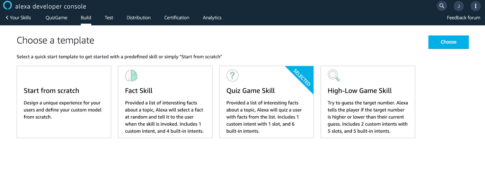

# Project 4: Migrate a Quiz Game Alexa Skill from ASK SDK to the Jovo Framework

Learn how to migrate an Alexa Skill built with the Alexa Skills Kit (ASK) SDK to the Jovo Framework. In this step-by-step course, we are converting a sample  Quiz Game Alexa Skill into a Jovo voice app.

> [You can find the full code example of the Quiz Game Alexa Skill on GitHub](https://github.com/jovotech/skill-sample-nodejs-quiz-game/).

* [What We're Building](#what-were-building)
* [Course Outline](#course-outline)
* [Let's Get Started](#lets-get-started)

## What We're Building

For this course, we will use a Quiz Game Alexa Skill template provided by the Amazon team. It's a quiz about US states that asks you questions about abbreviation, capital, statehood year, and statehood order of a state.

The code for this project can be found here:

* Original repository in ASK SDK v2: [alexa/skill-sample-nodejs-quiz-game](https://github.com/alexa/skill-sample-nodejs-quiz-game)
* Migrated repsitory in Jovo: [jovotech/skill-sample-nodejs-quiz-game](https://github.com/jovotech/skill-sample-nodejs-quiz-game/tree/jovo)

For this example, Amazon also provides a Skill project template in the Alexa Skill Developer Console. You can access this by going to the [Alexa Developer Console](https://developer.amazon.com/alexa/console/ask) and creating a new custom skill:

For some locales (in our case `en-US`), there is the option to choose from a few templates. Select "Quiz Game":

We will dive deeper into elements of the app logic and interaction model in the steps outlined below.

## Course Outline

> [You can find the full code example of the Quiz Game Voice App on GitHub](https://github.com/jovotech/skill-sample-nodejs-quiz-game/).

* [Step 1: Initial Setup and Project Structure](./step-1-project-setup.md)
* [Step 2: Migrating the Alexa Interaction Model](./step-2-interaction-model.md)
* [Step 3: Migrating Intents and Handlers](./step-3-intents-handlers.md)
* [Step 4: Migrating the App Logic](./step-4-app-logic.md)
* Step 5: Structuring the Content in i18n (coming soon)

## Let's Get Started

In the [next step]((./step-1-project-setup.md)), we will dive into the basics first: How to create a new Jovo project and how it differs from an ASK SDK and ASK CLI project: 

> [Step 1: Initial Setup and Project Structure](./step-1-project-setup.md)

<!--[metadata]: { "description": "Learn how to migrate an Alexa Skill built with the Alexa Skills Kit (ASK) SDK to the Jovo Framework.", "author": "jan-koenig" }-->