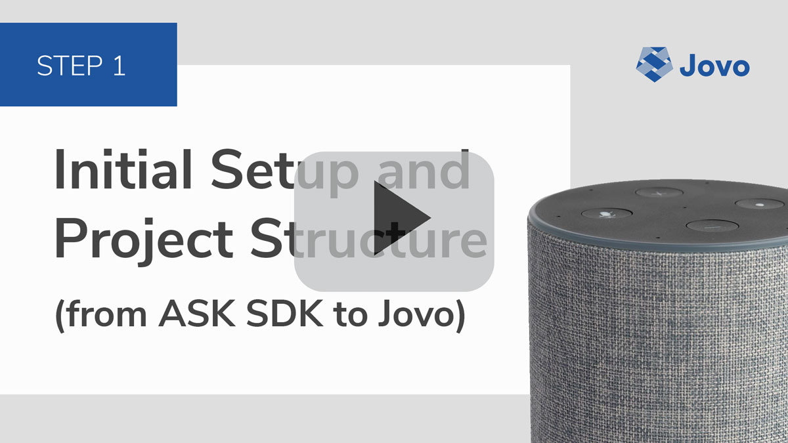
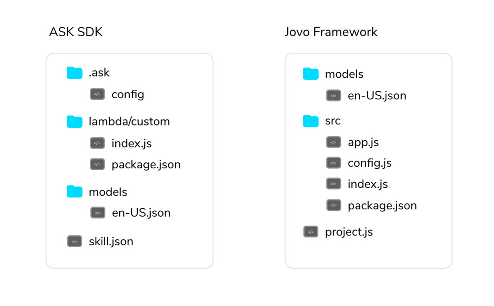

# Step 1: Initial Setup and Project Structure

Learn about the differences of an Alexa Skill project built with the Jovo Framework compared to the Alexa Skills Kit (ASK) SDK. In this step, we will install the Jovo CLI, create a new Jovo Framework project, and test out a first "Hello World" with the Jovo Debugger.

* [Creating a Jovo Project](#creating-a-jovo-project)
* [Understanding the Jovo Project Structure](#understanding-the-jovo-project-structure)
   * [project.js](#projectjs)
   * [src folder](#src-folder)
   * [models folder](#models-folder)
* [A First Hello World](#a-first-hello-world)
* [Optional: Deploy to the Alexa Developer Console](#optional:-deploy-to-the-alexa-developer-console)
* [Next Step](#next-step)

[](https://www.youtube.com/watch?v=hpc5Tiri0AU)

## Creating a Jovo Project

> [You can find the full code example on GitHub](https://github.com/jovotech/skill-sample-nodejs-quiz-game/).

As the Jovo Framework comes with a different folder structure than typical ASK CLI projects, the easiest way to get started and play around is to create a new Jovo project.

Usually, this is done by using the [Jovo CLI](https://www.jovo.tech/docs/cli). You can install it like this:

```sh
# Learn more here: www.jovo.tech/docs/installation
$ npm install -g jovo-cli
```

You can then use the [`jovo new` command](https://www.jovo.tech/docs/cli/new) to create a new project:

```sh
# Create a new Jovo project with the default "Hello World" project
$ jovo new QuizGame
```

This will create a Jovo project into a newly created `QuizGame` folder. You can go into the folder like this:

```sh
$ cd QuizGame
```

Let's take a look at the folder structure.

## Understanding the Jovo Project Structure

> [Learn nore about the Jovo project structure here](https://www.jovo.tech/docs/project-structure).

You can find the differences of an ASK SDK project and a Jovo Framework project in the illustration below:



The Jovo Framework also consists of a `test` folder, but right now, the following folders and files are most interesting for us:

* [`project.js`: Project Configuration](#projectjs)
* [`src` folder: App Logic](#src-folder)
* [`models` folder: Language Model](#models-folder)

In a later section ([Optional: Deploy to the Alexa Developer Console](#optional:-deploy-to-the-alexa-developer-console)), we will create an additional `platforms` folder which will consist the `skill.json` and Alexa Interaction Model files that you know from ASK SDK projects.

### project.js

> [Learn more about the project.js file here](https://www.jovo.tech/docs/project-js)

The [Jovo Project Configuration](https://www.jovo.tech/docs/project-js) includes essential information about your project. For a fresh Jovo project, it looks like this:

```js
module.exports = {
    alexaSkill: {
       nlu: 'alexa',
    },
    googleAction: {
       nlu: 'dialogflow',
    },
    endpoint: '${JOVO_WEBHOOK_URL}',
};
```

This specifies which platforms (e.g. `alexaSkill` and `googleAction`) ,including natural language understanding (`nlu`) services, should be used for this Jovo project. If you want to keep your voice app Alexa-only, you can delete or comment out the `googleAction` element.

This also includes an `endpoint`, which is later translated into your personal Jovo Webhook URL that can be used for local prototyping.

For now, this is everything we need. Besides these elements, the `project.js` file offers additional features that are especially helpful for teams that want to work with staging environments. [Learn more in the Jovo Docs](https://www.jovo.tech/docs/project-js).


### src folder

This is where the app logic is happening. This is the equivalent of the `lambda/custom` folder in a typical ASK SDK project.

It usually contains the following files:
* `app.js`: We will be mostly looking at this file, which contains all our app logic.
* `config.js`: App configurations can be added here. More on this later.
* `index.js`: You usually don't have to touch this file.

In steps [3: Migrating Intents and Handlers](./step-3-intents-handlers.md) and [4: Migrating the App Logic](./step-4-app-logic.md), we will take a closer look at the contents of the `src` folder, especially the `app.js` and `config.js` files for app logic and configuration.


### models folder

> [Learn more about the Jovo Language Model here](https://www.jovo.tech/docs/model).

The [Jovo Language Model](https://www.jovo.tech/docs/model) files are located in the `models` folder. Those files (like `en-US.json` in our example) can then be translated into an Alexa Interaction Model (or a Dialogflow Agent for Google Assistant) by using the Jovo CLI.

We will take a deeper look in [Step 2: Migrating the Alexa Interaction Model](./step-2-interaction-model.md)).


## A First Hello World

Let's do some testing first to understand how local development works with the Jovo Framework, which offers a local development server and the [Jovo Debugger](https://www.jovo.tech/docs/debugger) for fast testing.

This way, you don't have to upload your code to a server (or AWS Lambda) every time you make a change. Just run the following command:

```sh
$ jovo run
```

By copying the webhook URL into a browser window, you can access the Jovo Debugger, which you can also open by typing `.` in your terminal after running the server. With a click on the `LAUNCH` button, you can test the functionality of the "Hello World" Jovo template:


If you already have an Alexa Skill project in the [Alexa Developer Console](https://developer.amazon.com/alexa/console/ask), you can copy your webhook URL and paste it into the endpoint section to test your code with a device. If you don't have an existing Skill project, no worries, we can create one in the next section.


## Optional: Deploy to the Alexa Developer Console

If you don't already have an existing Skill project in the [Alexa Developer Console](https://developer.amazon.com/alexa/console/ask), you can use the Jovo CLI to create a new Alexa Skill.

Use the following two commands for this:

```sh
# Create platform-specific files
$ jovo build

# Deploy platform files
$ jovo deploy
```

The [`build` command](https://www.jovo.tech/docs/cli/build) will create a `platforms` folder, which contains an `alexaSkill` folder with all the platform-specific elements like `.ask` and `skill.json`, which you know from your typical ASK SDK projects:


This also includes the Alexa Interaction Model in `alexaSkill/models`, which was translated from the Jovo Language Model file.

The [`deploy` command](https://www.jovo.tech/docs/cli/deploy) then uses these files and uploads them to the Alexa Develope Console. If you don't have a Skill ID specified in your `.ask/config` file, it will create a new Alexa Skill project. Note: The Jovo CLI uses ASK CLI for deployment. [Learn how to set it up here](https://www.jovo.tech/docs/cli/deploy#amazon-alexa-deployment).


## Next Step

This is it. We took a look at a Hello World Jovo project and then created our first Alexa Skill with the Jovo CLI. In [the next step](./step-2-interaction-model.md)), we will update the language model to be able to quickly test the Skill.

> [Step 2: Migrating the Alexa Interaction Model](./step-2-interaction-model.md)

<!--[metadata]: { "description": "Learn about the differences of an Alexa Skill project built with the Jovo Framework compared to the Alexa Skills Kit (ASK) SDK.", "author": "jan-koenig" }-->