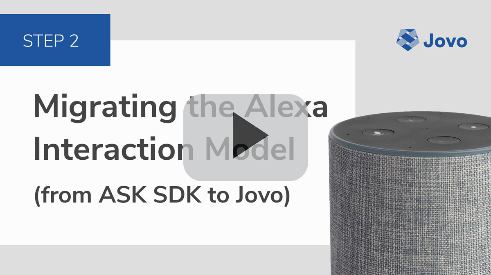
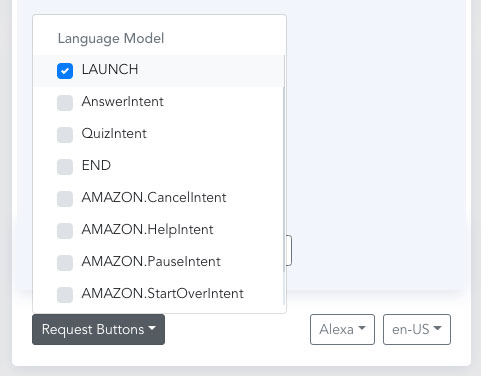
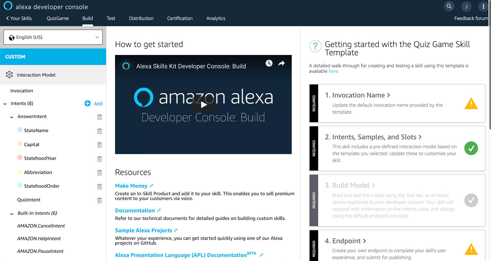

# Step 2: Migrating the Alexa Interaction Model

In this step, we will turn an Alexa Skill Interaction Model into a Jovo Language Model. This step isn't necessary to get your app running at this step of the course, but it is especially helpful for fast testing in the Jovo Debugger (the buttons there access the Jovo Language Model, in the previous step it was `LAUNCH` and `MyNameIsIntent`, for example). 

* [Introduction to the Jovo Language Model](#introduction-to-the-jovo-language-model)
* [Accessing the Interaction Model](#accessung-the-interaction-model)
   * [Alternative 1: jovo get](#alternative-1:-jovo-get)
   * [Alternative 2: copy paste](#alternative-2:-copy-paste)
* [jovo build reverse](#jovo-build-reverse)
* [Next Step](#next-step)

[](https://www.youtube.com/watch?v=9dz4gEgdYbU)


## Introduction to the Jovo Language Model

> [Learn more about the Jovo Language Model here](https://www.jovo.tech/docs/model).

The [Jovo Language Model](https://www.jovo.tech/docs/model) offers an abstracted way to define language models for multiple platforms. For example, you can create the model files once and translate them into an Alexa Interaction Model and a Dialogflow Agent for Google Actions.

The Jovo Language Model also works well with other tools in the Jovo ecosystem. For example, you can directly access the intents from the [Jovo Debugger](https://www.jovo.tech/docs/debugger) for fast testing:



In this course step, we will import the existing Interaction Model of the Quiz Game Alexa Skill template and turn it into a Jovo Language Model, in two sections:

* [Accessing the Interaction Model](#accessung-the-interaction-model)
* [jovo build reverse](#jovo-build-reverse)

## Accessing the Interaction Model

The Alexa Skill Interaction Model of quiz game template comes with some custom intents and a custom slot type:



It would be a lot of manual work to copy all the intents and values into the Jovo Language Model by hand. This is why we offer two ways to import the Interaction Model files into your Jovo project:

* [Alternative 1: jovo get](#alternative-1:-jovo-get)
* [Alternative 2: copy paste](#alternative-2:-copy-paste)

### Alternative 1: jovo get

You can import an existing Alexa Skill project from the Amazon Developer Console (including the Interaction Model files) into your Jovo project by using the [`jovo get`](https://www.jovo.tech/docs/cli/get) command:

```sh
# Get the Alexa Skill project files from the "default" ASK profile
$ jovo get alexaSkill

# Alternative: Specify ASK profile
$ jovo get alexaSkill --ask-profile <yourprofile>
```

If you're doing this for the first time, this will prompt you to choose from all Alexa Skills in the current developer account connected to your ASK profile:


After you select your Skill project, it will import the files into the `platforms/alexaSkill` folder of your Jovo project.

In the `platforms/alexaSkill/models` folder you can now find a file called `en-US.json` which contains your interaction model. It starts like this:

```javascript
{
  "interactionModel": {
    "languageModel": {
      "invocationName": "quiz game",
      "intents": [
        {
          "name": "AMAZON.CancelIntent",
          "samples": []
        },
        {
          "name": "AMAZON.HelpIntent",
          "samples": []
        },
        {
          "name": "AMAZON.PauseIntent",
          "samples": []
        },

        // More intents can be found here
      ],
      "types": [
        // Slot types can be found here
      ]
```

### Alternative 2: Copy paste

You can also access the Alexa Interaction Model on GitHub: [skill-sample-nodejs-quiz-game/models/en-US.json](https://github.com/alexa/skill-sample-nodejs-quiz-game/blob/master/models/en-US.json).

You can use this file and copy it into your `platforms/alexaSkill/models` folder.

Don't see that folder? Run the following command first:

```sh
# Build platform-specific files
$ jovo build
```

This will create the `platforms/alexaSkill` folder in your Jovo project.


## jovo build reverse

Bringing the Interaction Model from above into the right format for the [Jovo Language Model](https://www.jovo.tech/docs/model) by hand can be quite time consuming.

This is why we created a "[reverse build](https://www.jovo.tech/docs/cli/build#reverse-build)" CLI command that saves you some time: 

```sh
$ jovo build --platform alexaSkill --reverse
```

This will use the `en-US.json` file in the `platforms/alexaSkill/models` folder and translate it into a Jovo Language Model file in the `models` folder of your Jovo project directory.

This file looks like this:

```javascript
{
	"invocation": "quiz game",
	"intents": [
		{
			"name": "AnswerIntent",
			"phrases": [
				"{StateName}",
				"{Capital}",
				"{StatehoodYear}",
				"{StatehoodOrder}",
				"{Abbreviation}",
				// More phrases
			],
			"inputs": [
				{
					"name": "StateName",
					"type": {
						"alexa": "AMAZON.US_STATE"
					}
				{
					"name": "Abbreviation",
					"type": "US_STATE_ABBR"
				}
        // More inputs
			]
		},
		{
			"name": "QuizIntent",
			"phrases": [
				"start a quiz",
				"start a quiz game",
				// More phrases
			],
			"inputs": []
		}
	],
  "inputTypes": [
    {
      "name": "US_STATE_ABBR",
      "values": [
				{
					"value": "AK"
				},
        // More values
      ]
    }
  ],
  "alexa": {
		"interactionModel": {
			"languageModel": {
				"intents": [
					{
						"name": "AMAZON.CancelIntent",
						"samples": []
					},
          // More Alexa-specific intents
        ]
      }
    }
  }
}
```

After this step, we can access the intents of the model in the Jovo Debugger.


## Next Step

We have everything prepared for fast testing now. Let's dive deeper into the Skill's structure by converting from ASK SDK `canHandle` and `handle` to the Jovo routing.

> [Step 3: Migrating Intents and Handlers](./step-3-intents-handlers.md)

<!--[metadata]: { "description": "Learn how to migrate an Alexa Interaction Model into a Jovo Language Model.", "author": "jan-koenig" }-->