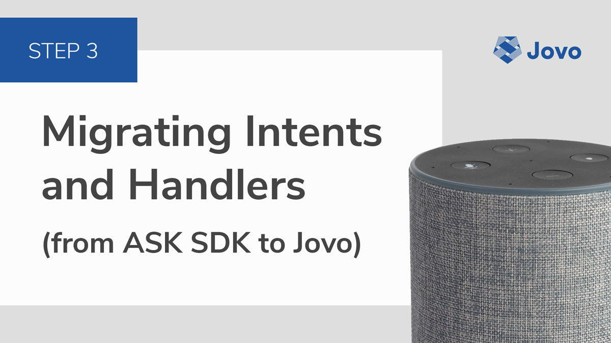
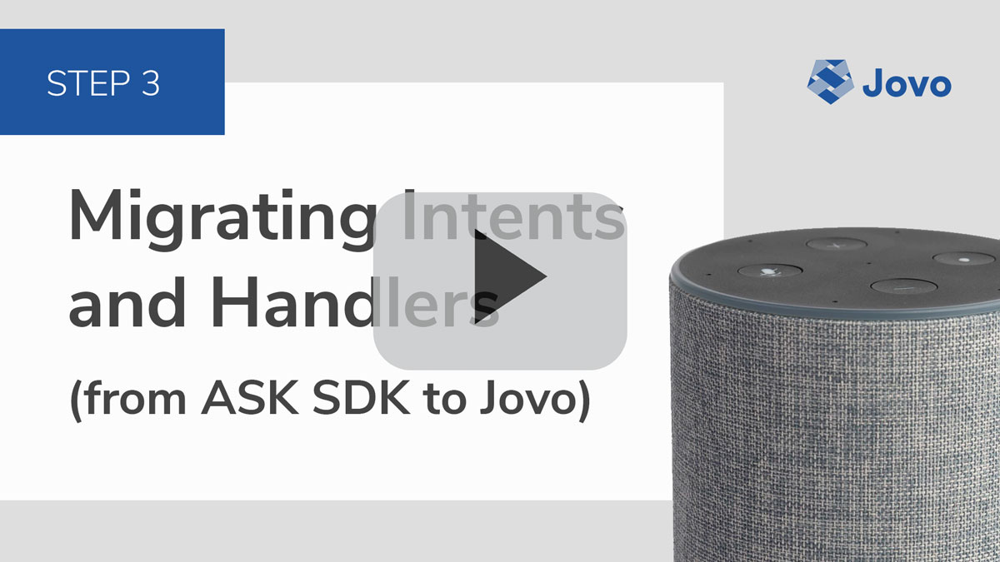
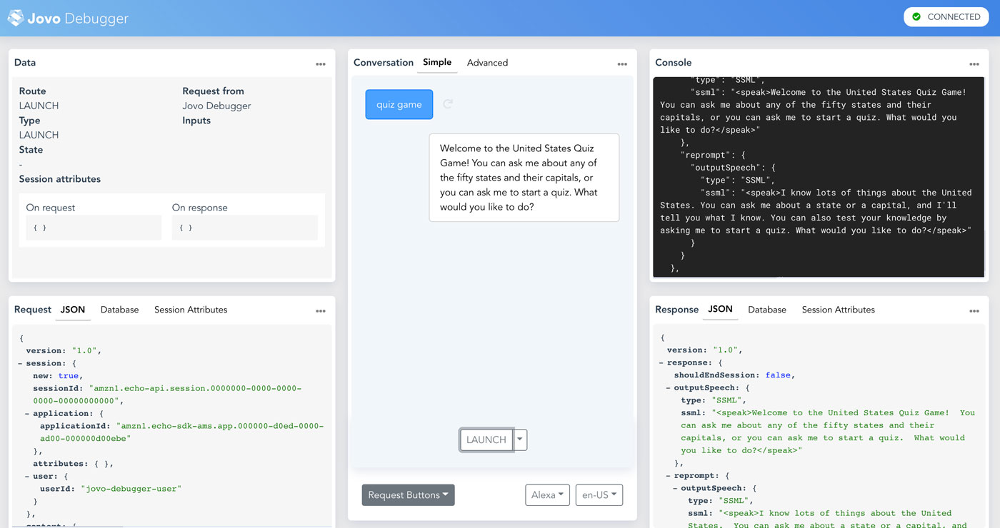

# Step 3: Migrating Intents and Handlers from ASK to Jovo



In this step, we will convert the `canHandle` intent and state structure of an ASK SDK v2 Alexa Skill project into the Jovo Framework intent and state routing format.

* [Introduction to Intent and State Handling in Jovo](#introduction-to-intent-and-state-handling-in-jovo)
* [Migrating our First Intent](#migrating-our-first-intent)
   * [From LaunchRequestHandler to LAUNCH](#from-launchrequesthandler-to-launch)
   * [Adding Helper Methods and Constants](#helper-methods-and-constants)
   * [Initial Testing](#initial-testing)
* [Migrating from canHandle to Nested States and Intents](#migrating-from-canhandle-to-nested-states-and-intents)
   * [Building the Handler Structure](#building-the-handler-structure)
   * [intentMap](#intentmap)
   * [Intent Redirects](#intent-redirects)
   * [END and Error Requests](#end-and-error-requests)
* [Summary](#summary)
* [Next Step](#next-step)

[](https://www.youtube.com/watch?v=fRhjay2CeVo)

## Introduction to Intent and State Handling in Jovo

> [Learn more about Jovo Routing here](https://www.jovo.tech/docs/routing).

Compared to the `canHandle` and `handle` methods of ASK SDK v2, Jovo works with intents and nested states in handler object.

For example, the Hello World handler in a Jovo app looks like this:

```js
// src/app.js

app.setHandler({
    LAUNCH() {
        return this.toIntent('HelloWorldIntent');
    },

    HelloWorldIntent() {
        this.ask('Hello World! What\'s your name?', 'Please tell me your name.');
    },

    MyNameIsIntent() {
        this.tell('Hey ' + this.$inputs.name.value + ', nice to meet you!');
    },
});
```

Jovo also comes with support to use [states](https://www.jovo.tech/docs/routing/states), a way to track where in the conversation the user is in.

States can be nested in Jovo and look like this:

```js
// src/app.js

app.setHandler({
    
    SomeIntent() {
        // SomeIntent outside any state (stateless)
    }

    State1: {
        SomeIntent() {
            // SomeIntent in State1
        }
    },
});
```

Before we dive deeper into state management, let's convert our first intent to the Jovo Framework structure.


## Migrating our First Intent

> [Learn more about Jovo Intent Handling here](https://www.jovo.tech/docs/routing/intents).

To be honest, technically it's the `LaunchRequest`, not an *intent* that we're taking a look at first. This is the first interaction users have with your voice app, for example when they say "*Alexa, open Quiz Game*".

For cross-platform compatibility, Jovo maps Alexa `LaunchRequests` to a built-in [`LAUNCH` intent](https://www.jovo.tech/docs/routing/intents#launch). If you go back to the example above, this looks like this:

```js
// src/app.js

app.setHandler({
    LAUNCH() {
        // Do something
    },
});
```
In three steps, we're now going to convert the `LaunchRequestHandler` of the ASK SDK app to Jovo and then do some testing to see if it worked:

* [From LaunchRequestHandler to LAUNCH](#from-launchrequesthandler-to-launch)
* [Adding Helper Methods and Constants](#helper-methods-and-constants)
* [Initial Testing](#initial-testing)


### From LaunchRequestHandler to LAUNCH

Let's take a look at the `LaunchRequest` part in the app that is using ASK SDK ([find the code here](https://github.com/alexa/skill-sample-nodejs-quiz-game/blob/bd3be5cd5d46586a74f6bcb09ef671b1337cb8ce/lambda/custom/index.js#L12)):

```js
// ASK SDK v2 project
// custom/lambda/index.js

const LaunchRequestHandler = {
  canHandle(handlerInput) {
    return handlerInput.requestEnvelope.request.type === `LaunchRequest`;
  },
  handle(handlerInput) {
    return handlerInput.responseBuilder
      .speak(welcomeMessage)
      .reprompt(helpMessage)
      .getResponse();
  },
};
```
This adds a `speak` command and feeds it with the `welcomeMessage` constant (more on that in the next step), and also adds a `helpMessage` as reprompt.

Jovo typically uses the [`ask` method](https://www.jovo.tech/docs/output#ask) for this, which has a `speech` and `reprompt` parameter. So in this specific case, it could look like this:

```js
// Jovo Framework project
// src/app.js

LAUNCH() {
    this.ask(welcomeMessage, helpMessage);
}
```

Before we can test this out, let's import constants like `welcomeMessage` and `helpMessage` along with other helper methods from the original project.


### Adding Helper Methods and Constants

In the sample code provided by Amazon, there are a bunch of constants that are used to store speech output like `welcomeMessage` and `helpMessage`, for example ([find the code here](https://github.com/alexa/skill-sample-nodejs-quiz-game/blob/bd3be5cd5d46586a74f6bcb09ef671b1337cb8ce/lambda/custom/index.js#L294)):

```js
/* CONSTANTS */

const skillBuilder = Alexa.SkillBuilders.custom();
const imagePath = "https://m.media-amazon.com/images/G/01/mobile-apps/dex/alexa/alexa-skills-kit/tutorials/quiz-game/state_flag/{0}x{1}/{2}._TTH_.png";
// More constants below...
```

There are also quite a few helper methods ([find them here](https://github.com/alexa/skill-sample-nodejs-quiz-game/blob/bd3be5cd5d46586a74f6bcb09ef671b1337cb8ce/lambda/custom/index.js#L365)):

```js
/* HELPER FUNCTIONS */
function getBadAnswer(item) {
  return `I'm sorry. ${item} is not something I know very much about in this skill. ${helpMessage}`;
}
// More helper functions below...
```

For now, let's just copy everything below our handlers. We will tweak some things here and there (and delete some helpers later), but for now this should be enough.

```js
// src/app.js

app.setHandler({
    LAUNCH() {
        this.ask(welcomeMessage, helpMessage);
    },
});

// ------------------------------------------------------------------
// HELPERS
// ------------------------------------------------------------------

// Add stuff here
```

### Initial Testing

To test the current state of the app, try to run the Jovo Webhook again:

```sh
$ jovo run
```

At first, this will throw an error with the message `Cannot read property 'custom' of undefined`. This is because of the following (first) line of the constants ([find it here](https://github.com/alexa/skill-sample-nodejs-quiz-game/blob/bd3be5cd5d46586a74f6bcb09ef671b1337cb8ce/lambda/custom/index.js#L295)):

```js
const skillBuilder = Alexa.SkillBuilders.custom();
```

You can delete this entirely. We don't need it for Jovo projects.

After this, if you  `run` the Jovo development server again, you should be able to try out `LAUNCH` in the Jovo Debugger:



First intent is done! Let's take a look at the other intents.


## Migrating from canHandle to Nested States and Intents

> [Learn more about Jovo State Handling here](https://www.jovo.tech/docs/routing/states).

As we learned above, ASK SDK v2 projects are typically organized into different handlers that look like this:

```js
const SomeHandler = {
  canHandle(handlerInput) {
    const request = handlerInput.requestEnvelope.request;

    // Conditions to handle request, e.g. SomeIntent
    return request.type === 'IntentRequest' &&
           request.intent.name === 'SomeIntent';
  },
  handle(handlerInput) {
      // Logic and response
  },
};
```
In the next steps, we're going through the handlers to set up the intent and state structure as used in Jovo projects. For this, we will mostly focus on the `canHandle` part and deal with the logic (`handle`) later.

We're starting with this handler structure from the previous step:

```js
// src/app.js

app.setHandler({
    LAUNCH() {
        this.ask(welcomeMessage, helpMessage);
    },
});
```

Let's take a look at some more intents of the Quiz Game.


## Building the Handler Structure

In the `QuizHandler` ([find code here](https://github.com/alexa/skill-sample-nodejs-quiz-game/blob/bd3be5cd5d46586a74f6bcb09ef671b1337cb8ce/lambda/custom/index.js#L24)), ...

```js
const QuizHandler = {
  canHandle(handlerInput) {
    const request = handlerInput.requestEnvelope.request;
    console.log("Inside QuizHandler");
    console.log(JSON.stringify(request));
    return request.type === "IntentRequest" &&
           (request.intent.name === "QuizIntent" || request.intent.name === "AMAZON.StartOverIntent");
  },
  handle(handlerInput) {
    //
  },
};
```

Deal with `AMAZON.StartOverIntent` later.

```js
// src/app.js

app.setHandler({
    LAUNCH() {
        this.ask(welcomeMessage, helpMessage);
    },

    QuizIntent() {
        //
    },
});
```


The `DefinitionHandler` ([find code here](https://github.com/alexa/skill-sample-nodejs-quiz-game/blob/bd3be5cd5d46586a74f6bcb09ef671b1337cb8ce/lambda/custom/index.js#L76)) ...

```js
const DefinitionHandler = {
  canHandle(handlerInput) {
    console.log("Inside DefinitionHandler");
    const attributes = handlerInput.attributesManager.getSessionAttributes();
    const request = handlerInput.requestEnvelope.request;

    return attributes.state !== states.QUIZ &&
           request.type === 'IntentRequest' &&
           request.intent.name === 'AnswerIntent';
  },
  handle(handlerInput) {
    //
  }
};
```

The `return attributes.state !== states.QUIZ` is interesting here. This handler is only triggered when the voice app is not in the `QUIZ` state.

Jovo nested states:

// Example


Here, we're referencing the states from an object:

```js
const states = {
  START: `_START`,
  QUIZ: `_QUIZ`,
};
```

We can add them like this:

```js
app.setHandler({
    LAUNCH() {
        this.ask(welcomeMessage, helpMessage);
    },

    QuizIntent() {
        //
    },

    [states.START]: {
        // START state intents
    },

    [states.QUIZ]: {
        // QUIZ state intents
    }
});
```

However, for this, we would need to move the `states` object *above* the `setHandler` method (otherwise it would be undefined when the handler is set, and throw an error). For readability, we will get rid of the `states` object and use the Jovo convention to add `State` behind every state name:

```js
app.setHandler({
    LAUNCH() {
        this.ask(welcomeMessage, helpMessage);
    },

    QuizIntent() {
        //
    },

    StartState: {
        // START state intents
    },

    QuizState: {
        // QUIZ state intents
    }
});
```

`QuizAnswerHandler` ([find code here](https://github.com/alexa/skill-sample-nodejs-quiz-game/blob/bd3be5cd5d46586a74f6bcb09ef671b1337cb8ce/lambda/custom/index.js#L128)) ...

```js
const QuizAnswerHandler = {
  canHandle(handlerInput) {
    console.log("Inside QuizAnswerHandler");
    const attributes = handlerInput.attributesManager.getSessionAttributes();
    const request = handlerInput.requestEnvelope.request;

    return attributes.state === states.QUIZ &&
           request.type === 'IntentRequest' &&
           request.intent.name === 'AnswerIntent';
  },
  handle(handlerInput) {
    //
  },
};
```

Only different behavior for `QUIZ` state, so it can be added outside, no need to add it to the `START` state:

```js
app.setHandler({
    LAUNCH() {
        this.ask(welcomeMessage, helpMessage);
    },

    QuizIntent() {
        //
    },

    AnswerIntent() {
        //
    },

    StartState: {
        // START state intents
    },

    QuizState: {
        AnswerIntent() {
            //
        },
    }
});
```

### intentMap

> [Learn more about the Jovo intentMap here](https://www.jovo.tech/docs/routing/intents#intentmap).

Both the `RepeatHandler` ([find code here](https://github.com/alexa/skill-sample-nodejs-quiz-game/blob/bd3be5cd5d46586a74f6bcb09ef671b1337cb8ce/lambda/custom/index.js#L209)) and `HelpHandler` ([find code here](https://github.com/alexa/skill-sample-nodejs-quiz-game/blob/bd3be5cd5d46586a74f6bcb09ef671b1337cb8ce/lambda/custom/index.js#L231)) use so called *built-in intents* provided by Amazon, `AMAZON.RepeatIntent` and `AMAZON.HelpIntent`:

```js
const RepeatHandler = {
  canHandle(handlerInput) {
    console.log("Inside RepeatHandler");
    const attributes = handlerInput.attributesManager.getSessionAttributes();
    const request = handlerInput.requestEnvelope.request;

    return attributes.state === states.QUIZ &&
           request.type === 'IntentRequest' &&
           request.intent.name === 'AMAZON.RepeatHandler';
  },
  handle(handlerInput) {
    //
  },
};

const HelpHandler = {
  canHandle(handlerInput) {
    console.log("Inside HelpHandler");
    const request = handlerInput.requestEnvelope.request;
    return request.type === 'IntentRequest' &&
           request.intent.name === 'AMAZON.HelpHandler';
  },
  handle(handlerInput) {
      //
  },
};

// Note: There are typos in this example by Amazon.
// It should be AMAZON.RepeatIntent instead of AMAZON.RepeatHandler.
// Same for AMAZON.HelpIntent.
```

You can add these intents to the handler like below. Note that they need to be added in quotation marks because of the `.` in the name (otherwise they would be treated as nested object):

```js
app.setHandler({
    LAUNCH() {
        this.ask(welcomeMessage, helpMessage);
    },

    QuizIntent() {
        //
    },

    AnswerIntent() {
        //
    },

    'AMAZON.HelpIntent'() {
        //
    },

    StartState: {
        // START state intents
    },

    QuizState: {
        AnswerIntent() {
            //
        },

        'AMAZON.RepeatIntent'() {
            //
        }
    }
});
```

For readability and cross-platform capabilities, it can make sense to not use the `AMAZON` prefix for the intents in the handler. For this, [Jovo offers an `intentMap`]((https://www.jovo.tech/docs/routing/intents#intentmap)) that can be helpful with a variety of things.

For example, the `intentMap` (which you can find in the `config.js` file in the `src` folder) of a Jovo "Hello World" project already maps `AMAZON.StopIntent` to the [Jovo `END` intent](https://www.jovo.tech/docs/routing/intents#end):

```js
// src/config.js

module.exports = {

    intentMap: {
       'AMAZON.StopIntent': 'END',
    },
 };
```
In the below example, we map `AMAZON.RepeatIntent` to just `RepeatIntent`, and do the same für `AMAZON.HelpIntent`:

```js
module.exports = {

    intentMap: {
       'AMAZON.StopIntent': 'END',
       'AMAZON.RepeatIntent': 'RepeatIntent',
       'AMAZON.HelpIntent': 'HelpIntent',
    },
 };
```

In the handler, it would then look like this:

```js
app.setHandler({
    
    // Other intents

    HelpIntent() {
        //
    },

    QuizState: {

        RepeatIntent() {
            //
        }
    }
});
```


### Intent Redirects

In the `QuizHandler` ([find code here](https://github.com/alexa/skill-sample-nodejs-quiz-game/blob/bd3be5cd5d46586a74f6bcb09ef671b1337cb8ce/lambda/custom/index.js#L24)), ...

```js
const QuizHandler = {
  canHandle(handlerInput) {
    const request = handlerInput.requestEnvelope.request;
    console.log("Inside QuizHandler");
    console.log(JSON.stringify(request));
    return request.type === "IntentRequest" &&
           (request.intent.name === "QuizIntent" || request.intent.name === "AMAZON.StartOverIntent");
  },
  handle(handlerInput) {
    //
  },
};
```

Same functionality for both `QuizIntent` and `AMAZON.StartOverIntent`. We could solve this with the `intentMap` as described in the previous section:

```js
module.exports = {

    intentMap: {
       'AMAZON.StopIntent': 'END',
       'AMAZON.RepeatIntent': 'RepeatIntent',
       'AMAZON.HelpIntent': 'HelpIntent',
       'AMAZON.StartOverIntent': 'QuizIntent',
    },
 };
```

This would solve the problem. However, intent mapping is global, so for every state, the `AMAZON.StartOverIntent` would be mapped to `QuizIntent`. This could lead to problems if we wanted to use `StartOverIntent` in different contexts.

For this you can use [Intent Redirects](https://www.jovo.tech/docs/routing#intent-redirects) instead of the `intentMap`. Redirects like `toIntent` route the handler to a different intent, to keep everything organized and readable:

```js
app.setHandler({

    // Other intents

    QuizIntent() {
        //
    },

    StartOverIntent() {
        return this.toIntent('QuizIntent'); // Request goes to QuizIntent
    },

});
```

We keep the `AMAZON.StartOverIntent` in the `intentMap` though, and map it to `StartOverIntent`:

```js
module.exports = {

    intentMap: {
       'AMAZON.StopIntent': 'END',
       'AMAZON.RepeatIntent': 'RepeatIntent',
       'AMAZON.HelpIntent': 'HelpIntent',
       'AMAZON.StartOverIntent': 'StartOverIntent',
    },
 };
```


### END and Error Requests


The `ExitHandler` ([find code here](https://github.com/alexa/skill-sample-nodejs-quiz-game/blob/bd3be5cd5d46586a74f6bcb09ef671b1337cb8ce/lambda/custom/index.js#L231)) uses three different intents, `AMAZON.StopIntent`, `AMAZON.PauseIntent`, and `AMAZON.CancelIntent`:

```js
const ExitHandler = {
  canHandle(handlerInput) {
    console.log("Inside ExitHandler");
    const attributes = handlerInput.attributesManager.getSessionAttributes();
    const request = handlerInput.requestEnvelope.request;

    return request.type === `IntentRequest` && (
              request.intent.name === 'AMAZON.StopIntent' ||
              request.intent.name === 'AMAZON.PauseIntent' ||
              request.intent.name === 'AMAZON.CancelIntent'
           );
  },
  handle(handlerInput) {
    //
  },
};
```

If we take a look at the `intentMap` again, we can see that `AMAZON.StopIntent` is already mapped to `END`. We can go ahead and also add the other ones:

```js
module.exports = {

    intentMap: {
       'AMAZON.StopIntent': 'END',
       'AMAZON.PauseIntent': 'END',
       'AMAZON.CancelIntent': 'END',
       'AMAZON.RepeatIntent': 'RepeatIntent',
       'AMAZON.HelpIntent': 'HelpIntent',
       'AMAZON.StartOverIntent': 'StartOverIntent',
    },
 };
```

The [`END` standard intent in Jovo](https://www.jovo.tech/docs/routing/intents#end) alrady maps `SessionEndedRequests` by Alexa and can be used to do some cleanup and also to send a last response (not possible for all types of requests). Let's add it:

```js
app.setHandler({
    
    // Other intents

    END() {
        //
    },

    StartState: {
        // START state intents
    },

    QuizState: {
        AnswerIntent() {
            //
        },

        RepeatIntent() {
            //
        }
    }
});
```

There is one more interesting handler in the ASK SDK project: The `ErrorHandler` ([find code here](https://github.com/alexa/skill-sample-nodejs-quiz-game/blob/bd3be5cd5d46586a74f6bcb09ef671b1337cb8ce/lambda/custom/index.js#L277)) is triggered when there is an error in the Alexa Skill:

```js
const ErrorHandler = {
  canHandle() {
    console.log("Inside ErrorHandler");
    return true;
  },
  handle(handlerInput, error) {
    //
  },
};
```

For this, Jovo offers the `ON_ERROR` handler:

```js
app.setHandler({
    
    // Other intents

    ON_ERROR() {
        //  
    },

    StartState: {
        // START state intents
    },

    QuizState: {
        AnswerIntent() {
            //
        },

        RepeatIntent() {
            //
        }
    }
});
```


## Summary

If you followed all the previous steps, your handler should look like this:

```js
app.setHandler({
    LAUNCH() {
        this.ask(welcomeMessage, helpMessage);
    },

    QuizIntent() {
        //
    },

    StartOverIntent() {
        return this.toIntent('QuizIntent'); // Request goes to QuizIntent
    },

    AnswerIntent() {
        //
    },

    HelpIntent() {
        //
    },

    END() {
        //
    },

    ON_ERROR() {
        //  
    },

    StartState: {
        // START state intents
    },

    QuizState: {
        AnswerIntent() {
            //
        },

        RepeatIntent() {
            //
        },
    },
});
```

As you can see here, the `START` state doesn't seem to be used, so we can get rid of that for now. This leaves us with the following intent and state structure:

```js
app.setHandler({
    LAUNCH() {
        this.ask(welcomeMessage, helpMessage);
    },

    QuizIntent() {
        //
    },

    StartOverIntent() {
        return this.toIntent('QuizIntent'); // Request goes to QuizIntent
    },

    AnswerIntent() {
        //
    },

    HelpIntent() {
        //
    },

    END() {
        //
    },

    ON_ERROR() {
        //  
    },

    QuizState: {
        AnswerIntent() {
            //
        },

        RepeatIntent() {
            //
        },
    },
});
```


## Next Step

In the [next step](./step-4-app-logic.md), we're going to add some life to the app. Let's do some work on the application logic.

> [Step 4: Migrating the App Logic](./step-4-app-logic.md)

<!--[metadata]: { "description": "In this step, we will convert the canHandle intent and state structure of an ASK SDK v2 Alexa Skill project into the Jovo Framework intent and state routing format.", "author": "jan-koenig", "short-title": "Step 3: Migrating Intents and Handlers", "og-image": "https://www.jovo.tech/img/courses/project-4-quiz-game-ask-sdk-jovo/ask-sdk-migration-course-handlers.jpg"}-->