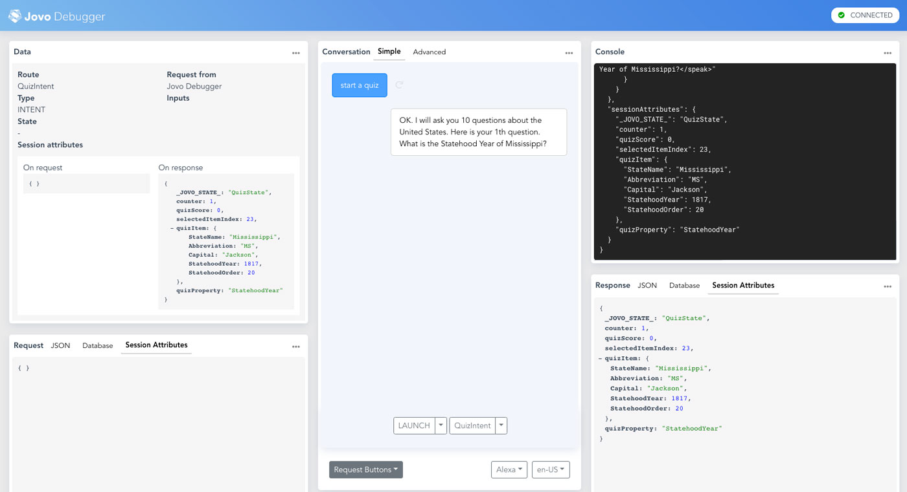
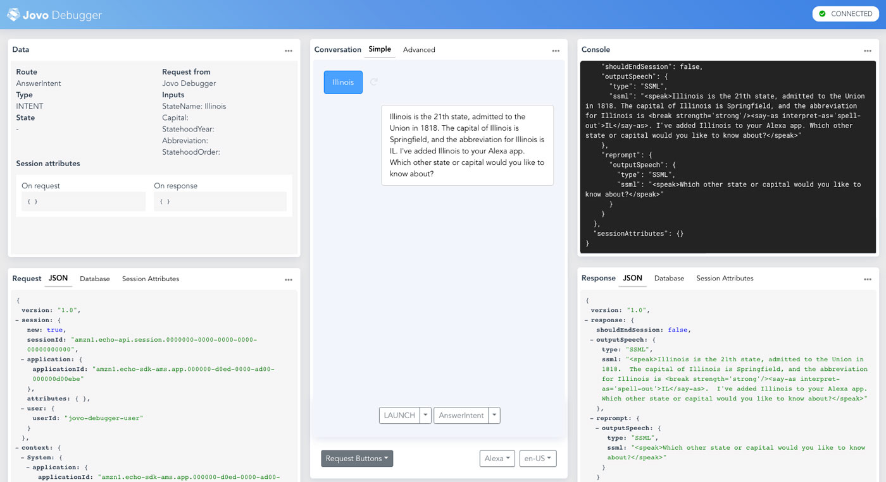

# Step 3: Migrating the App Logic from ASK SDK to Jovo

After creating the intent and state structure [in the previous step](./step-2-intents-handlers.md), we're now adding logic to the intents of our Quiz Game Alexa Skill.

* [Introduction to App Logic in Jovo](#introduction-to-app-logic-in-jovo)
   * [Creating Speech Output](#creating-speech-output)
   * [Working with Data and Session Attributes](#working-with-data-and-session-attributes)
* [First Intent: QuizHandler](#first-intent:-quizhandler)
   * [Migrating the Handle Logic to Jovo](#migrating-the-handle-logic-to-jovo)
   * [Updating the Helper Functions](#updating-the-helper-functions)
   * [Testing](#testing)
* [Advanced Migrations](#advanced-migrations) 
   * [Slot Validation](#slot-validation)
   * [Adding Visual Output](#adding-visual-output)
* [Next Step](#next-step)


## Introduction to App Logic in Jovo

Currently, we have the following handlers in our Jovo project:

```js
app.setHandler({
    LAUNCH() {
        this.ask(welcomeMessage, helpMessage);
    },

    QuizIntent() {
        //
    },

    StartOverIntent() {
        return this.toIntent('QuizIntent'); // Request goes to QuizIntent
    },

    AnswerIntent() {
        //
    },

    HelpIntent() {
        //
    },

    END() {
        //
    },

    ON_ERROR() {
        //  
    },

    QuizState: {
        AnswerIntent() {
            //
        },

        RepeatIntent() {
            //
        },
    },
});
```

Let's add some life to it. The application logic in Jovo voice apps usually involves two core concepts, data and output. We will take a look at these concepts in this section:

* [Creating Speech Output](#creating-speech-output)
* [Working with Data and Session Attributes](#working-with-data-and-session-attributes)

### Creating Speech Output

> [Learn more about Output here](https://www.jovo.tech/docs/output).

In Jovo projects, we usually use methods like `ask` or `tell` to creat speech output. You can find an example in our Jovo "Hello World" project:

```js
app.setHandler({
    LAUNCH() {
        return this.toIntent('HelloWorldIntent');
    },

    HelloWorldIntent() {
        this.ask('Hello World! What\'s your name?', 'Please tell me your name.');
    },

    MyNameIsIntent() {
        this.tell('Hey ' + this.$inputs.name.value + ', nice to meet you!');
    },
});
```

In the next few sections, we will convert the typical ASK SDK output to this format. [We already did this in step 2](./step-2-intents-handlers.md) when we turned the `LaunchRequestHandler` into a Jovo `LAUNCH` intent:

```js
// ASK SDK v2 project
// LaunchRequestHandler

const LaunchRequestHandler = {
  
  //
  
  handle(handlerInput) {
    return handlerInput.responseBuilder
      .speak(welcomeMessage)
      .reprompt(helpMessage)
      .getResponse();
  },
};


// Jovo Framework project
// LAUNCH intent inside app.setHandler

LAUNCH() {
    this.ask(welcomeMessage, helpMessage);
}
```

We will take a look at other [advanced output methods](https://www.jovo.tech/docs/output#advanced-output) (for example, visual output) in the next sections. Let's first investigate the next key concept, data.

### Working with Data and Session Attributes

> [Learn more about Data concepts in Jovo here](https://www.jovo.tech/docs/data).

Many Alexa Skills work with session attributes to store session specific data in requests and responses. For example, the `askQuestion` ([find code here](https://github.com/alexa/skill-sample-nodejs-quiz-game/blob/bd3be5cd5d46586a74f6bcb09ef671b1337cb8ce/lambda/custom/index.js#L445)) helper method uses them like this:

```js
function askQuestion(handlerInput) {

    // ...

    //GET SESSION ATTRIBUTES
    const attributes = handlerInput.attributesManager.getSessionAttributes();

    //SET QUESTION DATA TO ATTRIBUTES
    attributes.selectedItemIndex = random;
    attributes.quizItem = item;
    attributes.quizProperty = property;
    attributes.counter += 1;

    //SAVE ATTRIBUTES
    handlerInput.attributesManager.setSessionAttributes(attributes);

    // ...

},
```

In Jovo, this concept is called [Session Data](https://www.jovo.tech/docs/data#session-data) and can be accessed like this in a handler:

```js
this.$session.$data.key = value;
```

The `$session.$data` object is automatically stored in the response that is sent back to the Alexa platform, so there is no need to use the `getSessionAttributes` and `setSessionAttributes` methods.

The above example could look like this:

```js
this.$session.$data.selectedItemIndex = random;
this.$session.$data.attributes.quizItem = item;
this.$session.$data.attributes.quizProperty = property;
this.$session.$data.attributes.counter += 1;
```

However, for readability, you could also keep the `attributes` variable as a reference to the session data object and do it like this:

```js
//GET SESSION ATTRIBUTES
const attributes = this.$session.$data;

//SET QUESTION DATA TO ATTRIBUTES
attributes.selectedItemIndex = random;
attributes.quizItem = item;
attributes.quizProperty = property;
attributes.counter += 1;

// No need to save the data
```


## First Intent: QuizHandler

Let's go through the handlers in the ASK SDK v2 project and migrate each of them step by step. For now, we will write all the logic into our intent handlers in Jovo. At a later point of this course, we can take a look at modularizing the structure to keep everything organized.

Let's start with `QuizHandler` ([find code here](https://github.com/alexa/skill-sample-nodejs-quiz-game/blob/bd3be5cd5d46586a74f6bcb09ef671b1337cb8ce/lambda/custom/index.js#L24)). We will go through all the things that need to be updated compared to the ASK SDK v2 version.

### Migrating the Handle Logic to Jovo

Let's first take a look at things that need to be updated in the `handle` method of the `QuizHandler`. We can first go ahead and copy all its content to our `QuizIntent` handler in the Jovo Framework project.

Fortunately, there aren't too many things to be changed. For example, for session attributes, it does not need a lot of updates if we just replace the `getSessionAttributes` part with this:

```js
// ASK SDK v2
const attributes = handlerInput.attributesManager.getSessionAttributes();

// Jovo Framework
const attributes = this.$session.$data;
```

The `responseBuilder` can be deleted:

```js
// Delete this line
const response = handlerInput.responseBuilder;
```

There is also a difference how states are set in Jovo. The framework stores states in a session attribute called `_JOVO_STATE_` to minimize potential conflicts. This is why typically the `followUpState` or `setState` methods (they do the same) are used in Jovo:
 
```js
// ASK SDK v2
attributes.state = states.QUIZ;

// Jovo Framework
this.setState('QuizState');

// Alternative
attributes._JOVO_STATE_ = 'QuizState';
```

Also, we don't have the `handlerInput` object anymore, so we will pass the Jovo context object (`this`) when calling helper functions:

```js
// ASK SDK v2
var question = askQuestion(handlerInput);

// Jovo Framework
let question = askQuestion(this);
```

We will talk about this more in the [Updating the Helper Functions](#updating-the-helper-functions) section.

There is also a section with visual output that calls the `supportsDisplay` helper function:

```js
if (supportsDisplay(handlerInput)) {
    // ...
}
```

We will leave this out for now and take a look in a later subsection ([Adding Visual Output](#adding-visual-output)).

The last step is to convert the response to `ask`:

```js
// ASK SDK v2
return response.speak(speakOutput)
                .reprompt(repromptOutput)
                .getResponse();

// Jovo Framework
this.ask(speakOutput, repromptOutput);
```

After this, our `QuizIntent` handler should look like this:

```js
QuizIntent() {
    console.log("Inside QuizIntent");

    const attributes = this.$session.$data;
    this.setState('QuizState');
    attributes.counter = 0;
    attributes.quizScore = 0;

    var question = askQuestion(this);
    var speakOutput = startQuizMessage + question;
    var repromptOutput = question;

    const item = attributes.quizItem;
    const property = attributes.quizProperty;

    // Add display support later

    this.ask(speakOutput, repromptOutput);
},
```

If we do `jovo run` in the command line though and test out the `QuizIntent` in the Jovo Debugger, it throws an error:

```text
Cannot read property 'getSessionAttributes' of undefined
```

This is because we're calling the `askQuestion` helper method. Let's take a look at this one in the next section.

### Updating the Helper Functions

We've already takken a quick look at the `askQuestion` ([find code here](https://github.com/alexa/skill-sample-nodejs-quiz-game/blob/bd3be5cd5d46586a74f6bcb09ef671b1337cb8ce/lambda/custom/index.js#L445)) helper method in the introduction above.

Instead of passing `handlerInput` in to the function in our `QuizHandler`, we passed the `this` Jovo context object. To make it work, we now need to update the method to accept this object. `this` is not allowed, but we can use `jovo`, for example:

```js
function askQuestion(jovo) {
    // ...
}
```

We don't need to care abou the rest, except we need to update the session attributes to the Jovo session data object. We already demonstrated this in the introduction above, but this time, we need to use `jovo` instead of `this`:

```js
//GET SESSION ATTRIBUTES
const attributes = jovo.$session.$data;

//SET QUESTION DATA TO ATTRIBUTES
attributes.selectedItemIndex = random;
attributes.quizItem = item;
attributes.quizProperty = property;
attributes.counter += 1;

// No need to save the data
```

That's it. Good news: We won't need to update any of the other helper methods for now, as they don't use the `handlerInput` from ASK SDK v2 (except the `supportsDisplay` helper which we will delete anyways in a later section).


### Testing

Now it should work if we do `jovo run` and test the `QuizIntent` in the Jovo Debugger:



In the screenshot above, you can see the speech output and also the session attributes (all elements that have been saved into the response based on the Jovo `$session.$data` object).


## Advanced Migrations

* [Slot Validation](#slot-validation)
* [Adding Visual Output](#adding-visual-output)

### Slot Validation

The `DefinitionHandler` ([find code here](https://github.com/alexa/skill-sample-nodejs-quiz-game/blob/bd3be5cd5d46586a74f6bcb09ef671b1337cb8ce/lambda/custom/index.js#L76)) calls a `getItem` function to get all slot values. In Jovo, you can get the slot (we call it `input`) values with the `this.$inputs` object:

```js
// ASK SDK v2
handlerInput.requestEnvelope.request.intent.slots

// Jovo Framework
this.$inputs
```

The `AnswerIntent` uses five slots (`StateName`, `Capital`, `StatehoodYear`, `StatehoodOrder`, `Abbreviation`), of which only one can be triggered (there is only one slot per utterance). This is why the `getItem` function can seem a bit daunting. We could either rewrite it to fit the Jovo input structure, or access the request with the `this.$alexaSkill.$request` method like this:

```js
// ASK SDK v2
const item = getItem(handlerInput.requestEnvelope.request.intent.slots);

// Jovo Framework
const item = getItem(this.$alexaSkill.$request.request.intent.slots);
```

This way it returns the right output for the following code (visual output will be discussed later):

```js
AnswerIntent() {
    console.log("Inside AnswerIntent");

    //GRABBING ALL SLOT VALUES AND RETURNING THE MATCHING DATA OBJECT.
    const item = getItem(this.$alexaSkill.$request.request.intent.slots);

    //IF THE DATA WAS FOUND
    if (item && item[Object.getOwnPropertyNames(data[0])[0]] !== undefined) {
        // Add display support later

        this.ask(getSpeechDescription(item), repromptSpeech);
    }
    //IF THE DATA WAS NOT FOUND
    else
    {
        this.ask(getBadAnswer(item));
    }
},
```

This is the result in the Jovo Debugger:




### Adding Visual Output

// TODO


## Next Step

In the next step (coming soon), we will learn how to structure our app's content into i18n language resource files.


<!--[metadata]: { "description": "Learn about the differences of an Alexa Skill project built with the Jovo Framework compared to the Alexa Skills Kit (ASK) SDK.", "author": "jan-koenig" }-->