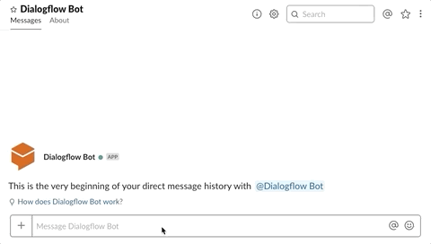

# Jovo v2.1 is here: Google Transactions, Amazon Pay, Hooks, Messenger, Slack, and more


Almost 2 months ago, [we released Jovo `v2`](https://medium.com/@einkoenig/introducing-jovo-framework-v2-c98326ac4aca), an all-new Jovo that came with a new architecture and many integrations.

Since then, [with help from our great community](#a-big-thank-you), we've worked on a lot of new additions, including new features for Amazon Alexa, Google Assistant, cross-platform improvements, and even some new platforms. You can now find everything bundled togeher in Jovo `v2.1`.

You can find all new features and improvements below:

* [New Features](#new-features)
   * [Alexa Skill Features: Amazon Pay, Proactive Events, and more](#alexa-skill-features:-amazon-pay,-proactive-events,-and-more)
   * [Google Action Features: Transactions, Push Notifications, and more](#google-action-features:-transactions,-push-notifications,-and-more)
   * [Alpha: Build Bots for Platforms like Facebook Messenger and Slack](#alpha:-build-bots-for-platforms-like-facebook-messenger-and-slack)
   * [Extend the Jovo Framework with Hooks](#extend-the-jovo-framework-with-hooks)
   * [New Integrations](#new-integrations)
   * [And more, including Unit Testing Improvements and Logging](#and-more,-including-unit-testing-improvements-and-logging)
* [A Big Thank You](#a-big-thank-you)

*Like what we're doing? [Support us with a star on GitHub](https://github.com/jovotech/jovo-framework/)* 

## New Features

Find all the new features in the sections below.

To update to Jovo v2.1, use the following command:

```sh
$ jovo update
```

### Alexa Skill Features: Amazon Pay, Proactive Events, and more

As of today, you can build any publicly available Alexa Skill feature with the Jovo Framework (for quickly integrating private features, [take a look at our new Hooks](#extend-the-jovo-framework-with-hooks)).

Newest additions to the Alexa platform integration in Jovo include:

* [Sell physical goods and services with Amazon Pay](https://www.jovo.tech/docs/amazon-alexa/pay)
* [Send notifications by using the Proactive Events API](https://www.jovo.tech/tutorials/alexa-notifications-proactive-events)
* [Alexa Geolocation support (also known as Location Services)](https://www.jovo.tech/docs/amazon-alexa/data#geolocation)
* Added a `getSkillId()` helper method


### Google Action Features: Transactions, Push Notifications, and more

Every publicly available Google Actions feature to date is available in the Jovo Framework.

Recent additions to the Google Assistant platform integration include:

* [Sell digital and physical goods and services with Google Transactions](https://www.jovo.tech/docs/google-assistant/transactions)
* [Send push notifications](https://www.jovo.tech/tutorials/google-action-notifications)
* [Send daily updates](https://www.jovo.tech/docs/google-assistant/daily-update)
* [Add routine suggestions](https://www.jovo.tech/docs/google-assistant/routine-suggestion)
* [Get the current location with `askForPlace()`](https://www.jovo.tech/docs/google-assistant/data#place-and-location)


### Alpha: Build Bots for Platforms like Facebook Messenger and Slack

> Jovo Docs: [Dialogflow Integrations](https://www.jovo.tech/docs/dialogflow-integrations/)



New experimental feature: By using [Dialogflow Integrations](https://www.jovo.tech/docs/dialogflow-integrations/), you can now bring your Jovo apps to bot platforms like Facebook Messenger and Slack!

Right now, this is an alpha release, so you will only be able to create text responses. Please note that, although they are similar, text based conversational experiences can differ from voice applications. Currently, there is no real difference between `tell` and `ask`, for example. We will work towards a clearer designed abstraction in upcoming releases.

However, you can already add [custom payloads](https://dialogflow.com/docs/intents/rich-messages#custom_payload) to the Dialogflow response with `this.$dialogflowAgent.setCustomPayload`, which can be used for platform specific output.

For example, you can add [Facebook Messenger Quick Replies](https://developers.facebook.com/docs/messenger-platform/send-messages/quick-replies) like this:

```js
// src/app.js

app.setHandler({

   HelloWorldIntent() {
      this.$dialogflowAgent.setCustomPayload("facebook", {
         "quick_replies": [
               {
                  "content_type": "text",
                  "title": "Joe",
                  "payload": "Joe",
               },
               {
                  "content_type": "text",
                  "title": "Samantha",
                  "payload": "Samantha",
               },
               {
                  "content_type": "text",
                  "title": "Chris",
                  "payload": "Chris",
               }
         ]
      });
      this.ask('Hello World! What\'s your name?', 'Please tell me your name.');
   },

   // Other Intents

});
```


### Extend the Jovo Framework with Hooks

> Docs: [Hooks](https://www.jovo.tech/docs/hooks)

[](https://www.youtube.com/watch?v=hBrX5srF3yU)

[Jovo Hooks](https://www.jovo.tech/docs/hooks) offer the ability to customize and extend the Jovo Framework in a lightweight way, without having to build a full-fledged plugin.

This can be helpful if you wan to do quick modifications during certain parts of the request lifecycle. For example, you could add additional JSON output necessary for an Alexa Skill private beta feature before the response is sent put by hooking into `before.response`.


### New Integrations

Besides the larger updates above, we also added and updated some [integrations](https://www.jovo.tech/docs/integrations):

* [Google Cloud Firestore (Firebase)](https://www.jovo.tech/tutorials/deploy-to-google-cloud)
* Azure Functions Context Logging
* Added an `ObjectArray` sheet type to the [Google Sheets CMS integration](https://www.jovo.tech/docs/cms/google-sheets)


### And more, including Unit Testing Improvements and Logging

There were tons of smaller updates, but the following ones were among the most anticipated updates:

* [You can now access user data in unit tests](https://www.jovo.tech/docs/unit-testing#user-data) with `conversation.$user.$data`
* [A `Jovo Logger`class](https://www.jovo.tech/docs/data/logging#jovo-logger) that allows for verbose logging and improved debugging

Interested in *all the updates*? See the [Jovo Framework Changelog](https://github.com/jovotech/jovo-framework/blob/master/CHANGELOG.md) for a more detailed overview.

## A Big Thank You

Thanks a lot for all your help to the contributors of this release, including [Renato Alencar](https://github.com/renatoalencar), [Matthew Lieder](https://github.com/IGx89), [scouzinier](https://github.com/kouz75), [Dominik Meissner](https://github.com/dominik-meissner), [Kaan Kilic](https://github.com/KaanKC), [Alex Swetlow](https://github.com/aswetlow), and everyone else who helped with ideas and feature requests in the [Jovo Slack community](https://www.jovo.tech/slack) 👏👏👏.

**Any thoughts? Wishes for Jovo v2.2? Let us know in the comments below.**


<!--[metadata]: { "description": "Learn more about Jovo Framework version 2.1, which was released in March 2019.", "author": "jan-koenig", "tags": "Releases", "og-image": "https://www.jovo.tech/img/news/2019-02-27-jovo-v2-1/v2-1.jpg" }-->
