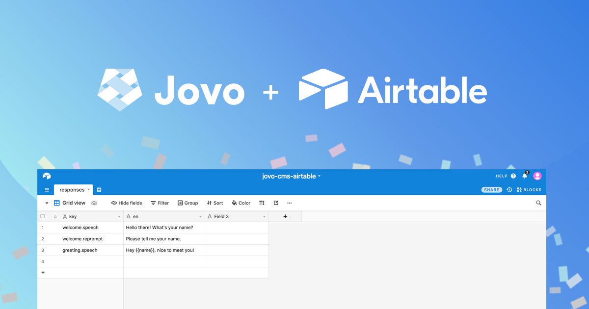
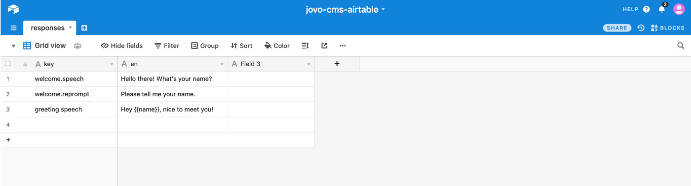

# New Jovo Integration: Airtable CMS

Looking for new ways to manage the content of your voice apps? We just released a new [CMS integration](https://www.jovo.tech/docs/cms) for the Jovo Framework: Airtable. 

* [Introduction](#introduction)
* [Getting Started](#getting-started)

*Like what we're doing? [Support us with a star on GitHub](https://github.com/jovotech/jovo-framework/)* 

## Introduction

During our [`v2` release](https://medium.com/@einkoenig/introducing-jovo-framework-v2-c98326ac4aca) two months ago, we also announced a new interface for [Jovo CMS integrations](https://www.jovo.tech/docs/cms). The main goal of this is to allow teams to decouple their voice app content from the app logic to be able to update content more easily, without the need to constantly update the code.

While we first started with our [Google Sheets integration](https://www.jovo.tech/docs/cms/google-sheets) ([find the tutorial here](https://www.jovo.tech/tutorials/google-sheets-cms)), we're excited to launch an integration to Airtable today.

[Airtable](https://airtable.com) is a powerful tool that uses advantages of both spreadsheets and databases. Relations between tables, file uploads, and many more features open up a lot of possibilities for content management.

With this integration, you can now easily store your content in Airtable tables and reference them inside your Jovo voice apps in a comfortable way.

## Getting Started

To get started with the Jovo Airtable CMS integration, take a look at the following documents:
* Jovo Docs: [Airtable CMS Integration](https://www.jovo.tech/docs/cms/airtable)
* Tutorial: [Use Airtable as CMS for your Voice App](https://www.jovo.tech/tutorials/airtable-cms)

**Any thoughts? Wishes for Jovo v2.2? Let us know in the comments below.**

<!--[metadata]: { "description": "Learn more about Jovo Framework CMS integration for Airtable, which was released in March 2019.", "author": "jan-koenig", "tags": "Releases", "og-image": "https://www.jovo.tech/img/news/2019-03-12-airtable-cms-integratio/jovo-airtable-integration.jpg" }-->
