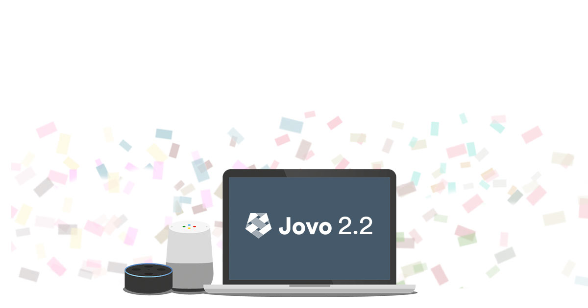
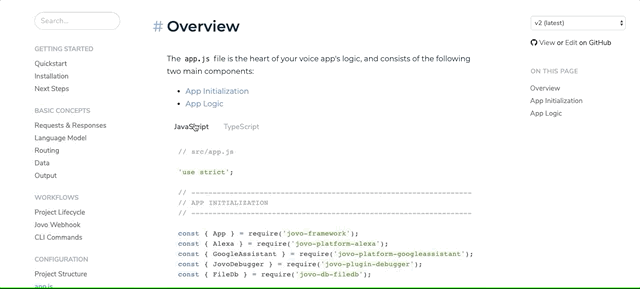

# Jovo v2.2: Build Alexa Skills and Google Actions with TypeScript



Since the [release of Jovo v2](https://medium.com/@einkoenig/introducing-jovo-framework-v2-c98326ac4aca), the Jovo Framework and CLI are both built in TypeScript. And although most users have still been using JavaScript (Node.js) for building Alexa Skills and Google Actions with Jovo, we have seen an increasing amount of community members build voice apps with TypeScript. With this new release of Jovo version `2.2`, we want to make it even easier for the growing number of TypeScript users.

Here are all the updates and features of Jovo `2.2`:

* [Better Support for TypeScript](#better-support-for-typescript)
   * [TypeScript Templates](#typescript-templates)
   * [Docs](#docs)
* [Improved Database Integrations](#improved-database-integrations)
   * [Save updatedAt Timestamps](#save-updatedat-timestamps)
   * [Caching](#caching) 
* [Additional Features](#additional-features)
* [How to Update](#how-to-update)
   * [Breaking Changes](#breaking-changes)


*Like what we're doing? [Support us with a star on GitHub](https://github.com/jovotech/jovo-framework/)* 


## Better Support for TypeScript

The [Jovo Framework code](https://github.com/jovotech/jovo-framework) is already written in TypeScript, which made it possible to build Alexa Skills and Google Actions with TypeScript in Jovo.

We've listened to the many questions of the growing TypeScript users in the Jovo community, and decided to make the development process easier by adding lots of improvements and offering deeper integrations into the Jovo services, like templates and docs.

Get started with Jovo and TypeScript like this:

```sh
# Update to the latest version of the Jovo CLI
$ npm install -g jovo-cli

# Create a new Jovo project in TypeScript
$ jovo new <directory> --language typescript
```

To start working with your project, go into its directory, run the TypeScript compiler: 

```sh
# Run compiler
$ npm run tsc

# Run compiler (and watch for updates)
$ npm run tscw
```

Then run the Jovo local development server (in a new tab if you use watch):

```sh
# Run development server
$ jovo run

# Run development server (and watch for updates)
$ jovo run --watch
```

Take a look at additional updates that we've done for improved TypeScript coverage:

* [TypeScript Templates](#typescript-templates)
* [Docs](#docs)

### TypeScript Templates

> [Check out the Jovo Templates to get started](https://github.com/jovotech/jovo-templates).

To celebrate the newest update, we made all [Jovo Templates](https://github.com/jovotech/jovo-templates) available in TypeScript as well. For example:

* [Trivia Game](https://github.com/jovotech/jovo-templates/tree/master/02_trivia-game/typescript)
* [Podcast Player](https://github.com/jovotech/jovo-templates/tree/master/podcast-player/typescript)
* [Alexa Presentation Language (APL)](https://github.com/jovotech/jovo-templates/tree/master/alexa/apl/typescript)
* [i18n](https://github.com/jovotech/jovo-templates/tree/master/i18n/typescript)

To download any template, update the Jovo CLI to the newest version (also `2.2`) and then use the following command:

```sh
# Download any Jovo template in TypeScript
$ jovo new <directory> --template <template> --language typescript
```

Thanks a lot [Max Ripper](https://github.com/Veake) for helping us migrate all templates to TypeScript!

### Docs

> [Check out the Jovo Docs to get started](https://www.jovo.tech/docs).

Most of our documentation also shows TypeScript sample code next to JavaScript. Just toggle between the languages to see the differences:




## Improved Database Integrations

Besides TypeScript, this release also focused a lot on robustness, especially for the Jovo Database integrations, which now all have >90% test coverage.

We also added two additional helpful features for the database integrations:
* [Save updatedAt Timestamps](#save-updatedat-timestamps)
* [Caching](#caching) 


### Save updatedAt Timestamps

You can now save an additional column `updatedAt` into your database, which stores the last time the data has been updated. This is especially helpful if you want to quickly access the data of your latest users.

You can enable the option like this:

```js
// @language=javascript

// src/config.js

module.exports = {

   user: {
      updatedAt: true,
   },

   // ...
}

// @language=typescript

// src/config.ts

const config = {

   user: {
      updatedAt: true,
   },

   // ...
}
```

Learn more in pull request [#451](https://github.com/jovotech/jovo-framework/pull/451) by Kaan Kilic.

### Caching

With the latest update, you can enable database caching. The Jovo user object will only save to the database if any data has changed.

To enable it, use the following configuration:

```js
// @language=javascript

// src/config.js

module.exports = {

   user: {
      dataCaching: true,
   },

   // ...
}

// @language=typescript

// src/config.ts

const config = {

   user: {
      dataCaching: true,
   },

   // ...
}
```
Learn more in pull request [#446](https://github.com/jovotech/jovo-framework/pull/446) by Kaan Kilic. Thank you, Peter Nann, [for sparking this idea in the Jovo Community Forum](https://community.jovo.tech/t/jovo-middlewares-and-db-operations/164/3).


## Additional Features

There are a few more features that were released since the [Jovo v2.1 release last month](https://www.jovo.tech/news/2019-03-05-jovo-v2-1), including:

* [SpeechBuilder: Accept arbitrary SSML wrapping elements](https://github.com/jovotech/jovo-framework/pull/442) by [Jonathan Wan](https://github.com/jnthnwn)
* [Jovo CMS Integration for Airtable](https://www.jovo.tech/news/2019-03-12-airtable-cms-integration) by [Kaan Kilic](https://github.com/KaanKC)
* [CMS: Platform-specific Responses](https://www.jovo.tech/news/2019-03-27-cms-platform-responses-caching) by [Ruben Aegerter](https://github.com/rubenaeg)
* [More Unit Tests for the GoogleSheetsCMS integration](https://github.com/jovotech/jovo-framework/pull/450) by [Ruben Aegerter](https://github.com/rubenaeg)


## How to Update

> [Learn more in the Jovo Upgrading Guide](https://www.jovo.tech/docs/installation/upgrading).

To update to the latest version of Jovo, use the following commands:

```sh
# Update to the latest version of the Jovo CLI
$ npm install -g jovo-cli

# Update Jovo packages in your Jovo project
$ jovo update
```

### Breaking Changes

Due to improved TypeScript compatibility, there is a tweak that needs to be done if you're using multiple reprompts with Google Assistant.

```js
// Before Jovo v2.2: Add array of reprompts
this.ask(speech: string, reprompts: string | string[]);

// With Jovo v2.2: Add additional parameters
this.ask(speech: string | string[], reprompt1: string | string[], reprompt2: string | string[], ...);
```


**Any thoughts? Let us know in the comments below.**


<!--[metadata]: { "description": "Learn more about Jovo Framework version 2.2, which was released in April 2019.", "author": "jan-koenig", "tags": "Releases", "og-image": "https://www.jovo.tech/img/news/2019-04-04-jovo-v2-2/jovo-v2-2.jpg" }-->
