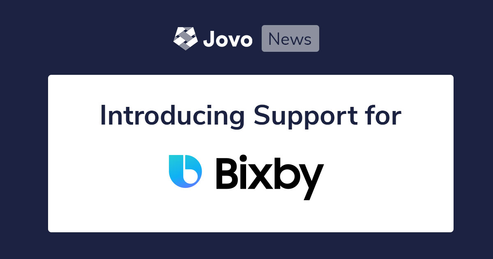

# Introducing Samsung Bixby Support for the Jovo Framework



Last week, we officially launched `v3` of the Jovo Framework. [You can find the announcement here](https://context-first.com/introducing-jovo-v3-the-voice-layer-bf369db4808e). Today, we want to take a deeper look into one of the most celebrated features additions: Support for Samsung Bixby. You can also take a look at the tutorial here: [Build your first Samsung Bixby Capsule with Jovo](https://www.jovo.tech/tutorials/samsung-bixby-hello-world).

* [Introduction to Bixby Development with Jovo](#introduction-to-bixby-development-with-jovo)
* [Get Started with Bixby and Jovo](#get-started-with-bixby-and-jovo)
   * [Hello World Tutorial](#hello-world-tutorial)
   * [2 Jovo Templates for Bixby](#2-jovo-templates-for-bixby)
   * [Bixby Platform Docs](#bixby-platform-docs)
* [Need Help?](#need-help?)


*Like what we're doing? [Support us with a star on GitHub](https://github.com/jovotech/jovo-framework/)* 


## Introduction to Bixby Development with Jovo

Samsung Bixby is seen as the third major voice assistant platform, together with Amazon Alexa and Google Assistant. It is claimed that Bixby is soon running on more than 500 million devices, which makes it pretty compelling for developers and businesses to look into its app ecosystem.

Apps for Samsung's assistant are called Bixby Capsules. You can find a general introduction into the platform at the [Bixby Developer Portal](https://bixbydevelopers.com/). If you're used to Alexa Skill and Google Action development, you will notice that Bixby uses a few different patterns. We offer an introduction to the differences in our [Bixby tutorial](https://www.jovo.tech/tutorials/samsung-bixby-hello-world).

By using Jovo, you can now build Bixby Capsules and enjoy our framework's benefits:
* Cross-platform development
* Open source and highly flexible, e.g. [host your voice app anywhere](https://www.jovo.tech/docs/hosting)
* Many integrations, e.g. [CMS](https://www.jovo.tech/docs/cms), [databases](https://www.jovo.tech/docs/databases), [analytics](https://www.jovo.tech/docs/analytics)


## Get Started with Bixby and Jovo

There are several ways how you can build your first Bixby Capsule with Jovo:

* [Hello World Tutorial](#hello-world-tutorial)
* [2 Jovo Templates for Bixby](#2-jovo-templates-for-bixby)
* [Bixby Platform Docs](#bixby-platform-docs)


### Hello World Tutorial

To get to your first "Hello World" with Bixby and Jovo, we recommend you take a look at our tutorial: [Build your first Samsung Bixby Capsule with Jovo](https://www.jovo.tech/tutorials/samsung-bixby-hello-world).


### 2 Jovo Templates for Bixby

We also offer two templates for Bixby development. You can find them on Github: [jovotech/jovo-templates](https://github.com/jovotech/jovo-templates/tree/master/bixby).

The first one is the "Hello World" version that is also used in our tutorial:

```sh
// @language=javascript

# Update to the latest version of the Jovo CLI
$ npm install jovo-cli -g

# Create new Jovo project from Bixby Hello World template
$ jovo new bixby-hello-world --template bixby


// @language=typescript

# Update to the latest version of the Jovo CLI
$ npm install jovo-cli -g

# Create new Jovo project from Bixby Hello World template
$ jovo new bixby-hello-world --template bixby --language typescript
```

We also offer a template for Bixby Audioplayer:

```sh
// @language=javascript

# Update to the latest version of the Jovo CLI
$ npm install jovo-cli -g

# Create new Jovo project from Bixby Hello World template
$ jovo new bixby-audioplayer --template bixby/audioplayer


// @language=typescript

# Update to the latest version of the Jovo CLI
$ npm install jovo-cli -g

# Create new Jovo project from Bixby Hello World template
$ jovo new bixby-audioplayer --template bixby/audioplayer --language typescript
```


### Bixby Platform Docs

For specific details of the integration, take a look at the Jovo Docs: [Samsung Bixby Platform](https://www.jovo.tech/docs/samsung-bixby). We also recommend to study the [Official Bixby Docs](https://bixbydevelopers.com/dev/docs/dev-guide) in parallel.


## Need Help?

Want to get involved with Samsung Bixby, but don't know where to get started. [Contact us for professional support from the Jovo core team](https://www.jovo.tech/services/support-training).


<!--[metadata]: { "description": "Learn more about the Samsung Bixby integration for the Jovo Framework.", "author": "jan-koenig", "tags": "Releases", "og-image": "https://www.jovo.tech/img/news/2020-03-05-samsung-bixby-jovo/jovo-bixby-support.jpg" }-->
