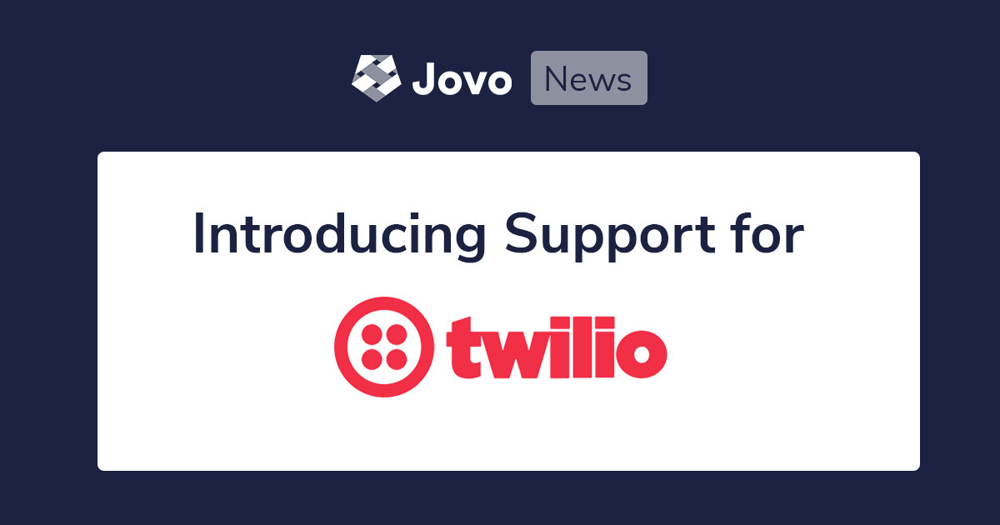

# Introducing Twilio Autopilot Support for the Jovo Framework



Today, we're introducing more helpful features that enable you to build IVRs for Twilio Autopilot with Jovo. This integration (which was part of our `v3` release, [you can find the announcement here](https://context-first.com/introducing-jovo-v3-the-voice-layer-bf369db4808e)) helps you deploy voice experienecs to various platforms, including phone bots and contact center automation.x

> You can also take a look at the tutorial here: [Build your first Twilio Autopilot IVR with Jovo](https://www.jovo.tech/tutorials/twilio-autopilot-hello-world).

* [Introduction to Twilio Autopilot Development with Jovo](#introduction-to-twilio-autopilot-development-with-jovo)
* [Get Started with Twilio and Jovo](#get-started-with-twilio-and-jovo)
   * [Hello World Tutorial](#hello-world-tutorial)
   * [3 Jovo Templates for Twilio Autopilot](#3-jovo-templates-for-twilio-autopilot)
   * [Twilio Autopilot Platform Docs](#twilio-autopilot-platform-docs)
* [Need Help?](#need-help?)


*Like what we're doing? [Support us with a star on GitHub](https://github.com/jovotech/jovo-framework/)* 


## Introduction to Twilio Autopilot Development with Jovo

[Twilio Autopilot](https://www.twilio.com/autopilot) is a powerful platform that includes natural language understanding (nlu), cross-platform deployment, and much more. Especially for contact center use cases it offers powerful features like handoff to human agents and seamless transition between phone calls and automated text messages.

At Jovo, we're excited to now make it even easier for you to build Twilio Autopilot bots. Some of our framework's benefits include:

* Cross-platform development
* Open source and highly flexible, e.g. [host your voice app anywhere](https://www.jovo.tech/docs/hosting)
* Many integrations, e.g. [CMS](https://www.jovo.tech/docs/cms), [databases](https://www.jovo.tech/docs/databases), [analytics](https://www.jovo.tech/docs/analytics)

Thanks a lot to [Kaan Kilic](https://twitter.com/KnKlc8) who put a lot of work and passion into building this integration!


## Get Started with Twilio and Jovo

There are several ways how you can build your first Twilio Autopilot bot with Jovo:

* [Hello World Tutorial](#hello-world-tutorial)
* [3 Jovo Templates for Twilio Autopilot](#3-jovo-templates-for-twilio-autopilot)
* [Twilio Autopilot Platform Docs](#twilio-autopilot-platform-docs)


### Hello World Tutorial

To get to your first "Hello World" with Twilio and Jovo, we recommend you take a look at our tutorial: [Build your first Twilio Autopilot IVR with Jovo](https://www.jovo.tech/tutorials/twilio-autopilot-hello-world).

[](https://www.jovo.tech/tutorials/samsung-bixby-hello-world)


### 3 Jovo Templates for Twilio Autopilot

We also offer two templates for IVR development with Twilio and Jovo. You can find them on Github: [jovotech/jovo-templates](https://github.com/jovotech/jovo-templates/tree/master/autopilot).

The first one is the "Hello World" version that is also used in our tutorial:

```sh
// @language=javascript

# Update to the latest version of the Jovo CLI
$ npm install jovo-cli -g

# Create new Jovo project from Twilio Autopilot Hello World template
$ jovo new autopilot-hello-world --template autopilot


// @language=typescript

# Update to the latest version of the Jovo CLI
$ npm install jovo-cli -g

# Create new Jovo project from Twilio Autopilot Hello World template
$ jovo new autopilot-hello-world --template autopilot --language typescript
```

We also offer a template for handoff to a human agent:

```sh
// @language=javascript

# Update to the latest version of the Jovo CLI
$ npm install jovo-cli -g

# Create new Jovo project from Autopilot Handoff template
$ jovo new autopilot-handoff --template autopilot/handoff


// @language=typescript

# Update to the latest version of the Jovo CLI
$ npm install jovo-cli -g

# Create new Jovo project from Autopilot Handoff template
$ jovo new autopilot-handoff --template autopilot/handoff --language typescript
```

We also offer a template that collects the user's phone number and sends them a text message:

```sh
// @language=javascript

# Update to the latest version of the Jovo CLI
$ npm install jovo-cli -g

# Create new Jovo project from Autopilot SMS template
$ jovo new autopilot-handoff --template autopilot/sms


// @language=typescript

# Update to the latest version of the Jovo CLI
$ npm install jovo-cli -g

# Create new Jovo project from Autopilot SMS template
$ jovo new autopilot-handoff --template autopilot/sms --language typescript
```


### Twilio Autopilot Platform Docs

For specific details of the integration, take a look at the Jovo Docs: [Twilio Autopilot Platform](https://www.jovo.tech/docs/twilio-autopilot). We also recommend to study the [Official Twilio Autopilot Docs](https://www.twilio.com/docs/autopilot) in parallel.


## Need Help?

Want to get involved with Twilio Autopilot, but don't know where to get started. [Contact us for professional support from the Jovo core team](https://www.jovo.tech/services/support-training).


<!--[metadata]: { "description": "Learn more about the Twilio Autopilot integration for the Jovo Framework.", "author": "jan-koenig", "tags": "Releases", "og-image": "https://www.jovo.tech/img/news/2020-03-12-twilio-autopilot-jovo/jovo-twilio-support.jpg" }-->
