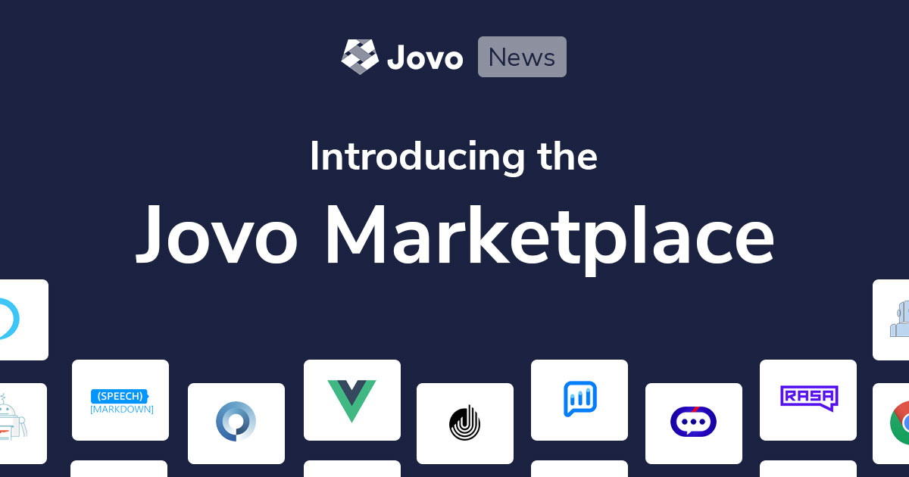
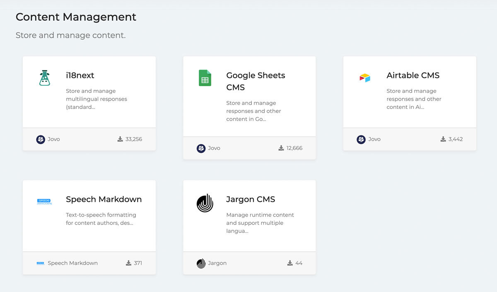
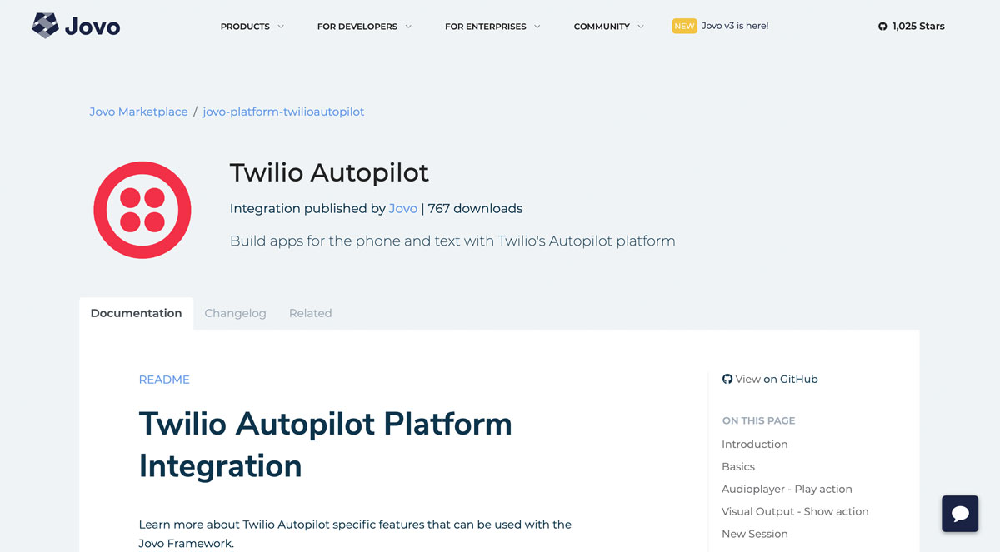
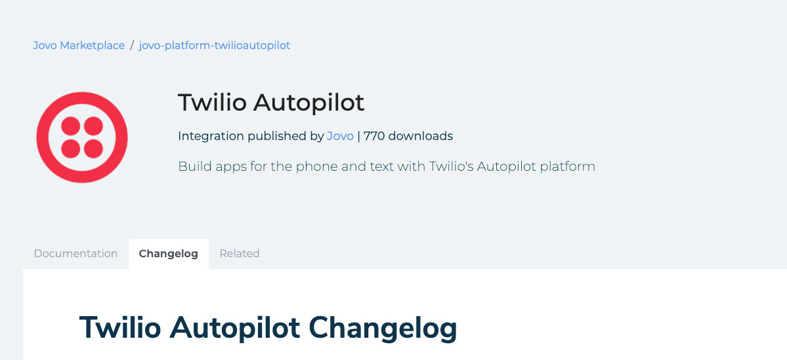

# Introducing the Jovo Marketplace

One of the things we care about a lot as creators of Jovo is its openness and compatibility. The framework allows you to integrate with many different voice platforms, hosting environments, content management systems, and much more.

Over the time, not only more first-party integrations, but also many third-party plugins were added by our great community. It became difficult to find the right extensions and learn how they fit into the voice development process.

We're excited to finally bring everything together in the [Jovo Marketplace](https://www.jovo.tech/marketplace).

The Jovo Marketplace lists all Jovo integrations and plugins in one place, including their documentation, changelogs, and related categories.

Learn more below:

* [Find all integrations and plugins in one place](#find-all-integrations-and-plugins-in-one-place)
* [Cleaner documentation](#cleaner-documentation)
* [Package changelogs](#package-changelogs)
* [Missing an integration?](#missing-an-integration?)

*Like what we're doing? [Support us with a star on GitHub](https://github.com/jovotech/jovo-framework/)* 

## All integrations and plugins in one place

Jovo offers a growing list of first-party integrations and third-party plugins. It became more difficult to discover all the different possibilities without diving deep into our documentation or screening our (and our community members') GitHub accounts.

With the Jovo Marketplace, you can now find all extensions (no matter if first- or third-party) in one place, for example:
* [Content Management](https://www.jovo.tech/marketplace/tag/cms)
* [Monitoring and Analytics](https://www.jovo.tech/marketplace/tag/monitoring)
* [Databases](https://www.jovo.tech/marketplace/tag/databases)

There is more to come. Stay tuned!

## Cleaner documentation

One big problem was that it was sometimes difficult to find the right documentation. Was it part of the `README` of a package? In the Jovo Docs?

With the Jovo Marketplace, all documentation is now right where it's needed. And we're working on improving all docs over the upcoming weeks.

## Package changelogs

With these changes, we also a added the possibility to track package-specific changes in a separate `CHANGELOG.md` file. Previously, all changes where collected in one monolithic [Jovo Framework Changelog](https://github.com/jovotech/jovo-framework/blob/master/CHANGELOG.md).

## Missing an integration?

Want to see a service integrated that you can't find yet? Feel free to reach out on Twitter [@jovotech](https://twitter.com/jovotech) or [contact us here](https://www.jovo.tech/contact).

<!--[metadata]: { "description": "Find all Jovo integrations and plugins in one place.", "author": "jan-koenig", "tags": "Releases", "og-image": "https://www.jovo.tech/img/news/2020-04-30-jovo-marketplace/jovo-marketplace.jpg" }-->
