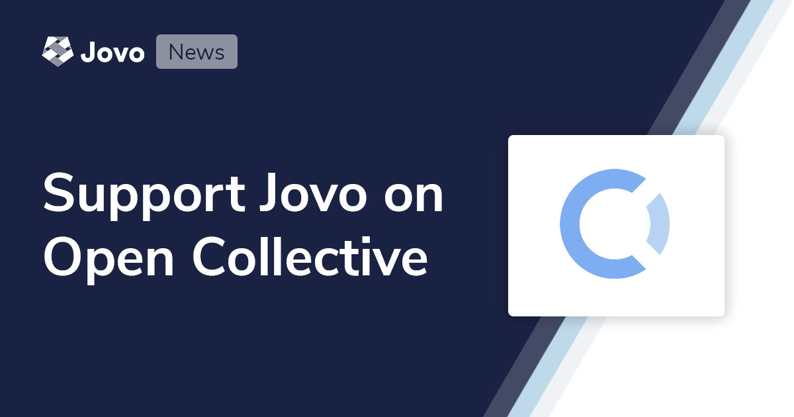
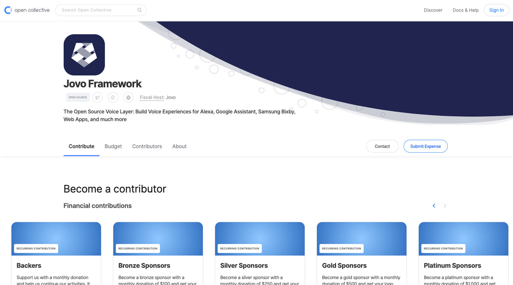
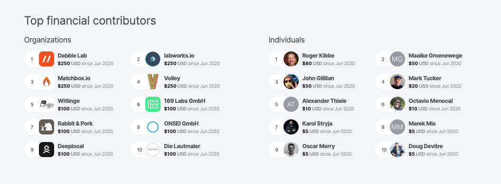

# Support the Jovo Framework with Monthly Sponsorships on Open Collective

Jovo is the most popular open source framework to build voice experiences that work across platforms and devices, including Alexa, Google Assistant, Samsung Bixby, the web, and more.

"Open source" means that our code is openly available on [GitHub](https://github.com/jovotech/jovo-framework) and free to use for anyone. Over the years, many companies and individuals asked us how they can support our mission and help us sustain our open source development. Today, we're excited to launch our [Jovo support and sponsorship plans on Open Collective](https://opencollective.com/jovo-framework).

And we're happy that were already being supported by well respected companies and individuals in the voice-first industry:

Learn more below:

* [Why we chose Open Source](#why-we-chose-open-source)
* [How we make money](#how-we-make-money)
* [First Jovo backers and sponsors](#first-jovo-backers-and-sponsors)

## Why we chose Open Source

When we started working on Jovo more than 3 years ago, we knew that building an open source framework would be a difficult task that would require a long time to establish a sustainable business model.

Here are some of the reasons why we still believe open source is the way to go for us, especially in an early market like voice:

* **Flexibility**: There are still no clear, repeatable use cases for voice interactions. This is why we focused on building a flexible tool that companies can customize to their needs and workflows. Ideally, Jovo can be embedded into any product or service.
* **Ownership**: Data security and privacy is an important topic in voice interactions. As an open source framework, we provide companies with the ability to host their code wherever they want, being in full control.
* **Community**: We wouldn't be where we are today without our great community of voice experts that keep pushing the boundaries. We're happy to be working closely with our community of open source developers.

We strongly believe that voice interactions will be an important part of any future product ecosystem. This is why we've spent the last 3 years continuously working on building and improving Jovo, for example with our latest [v3 release](https://www.context-first.com/introducing-jovo-v3-the-voice-layer/). And we're excited to keep going!

## How we make money

More open source funding means more time dedicated to Jovo Framework feature development and community initiatives.

To date, we have been financing ourselves by offering professional services for companies who need help with Jovo and building voice apps.

For example:
* [Support and Training](https://www.jovo.tech/services/support-training) for faster adoption of Jovo
*  [Implementation](https://www.jovo.tech/services/implementation) if you need to hire an expert who builds a voice app for you
* [Customization](https://www.jovo.tech/services/customization) to add features or additional channnels and integrations

While the Jovo Framework will always stay free and open source, we're also working on additional products for enterprise teams. Reach out if you want to [learn more about the Jovo Enterprise Suite](https://www.jovo.tech/enterprise-suite). 

## First Jovo backers and sponsors

We're excited that we already have a number of great companies and individuals support our open source development.

Thanks a lot to every single one of you!

### Silver Sponsors

* [Dabble Lab](https://www.dabblelab.com/)
* [Labworks.io](https://www.labworks.io/)
* [Matchbox.io](https://matchbox.io/)
* [Volley](https://volleythat.com/)

### Bronze Sponsors
* [169 Labs](https://www.169labs.com/)
* [Witlingo](https://www.witlingo.com/)
* [Rabbit & Pork](https://wearerabbitandpork.com/)
* [Die Lautmaler](https://www.die-lautmaler.de/)
* [ONSEI](https://www.onsei.de/)
* [Jargon](https://jargon.com/)
* [Node Kitchen](https://node.kitchen/)

### Backers

* Deep Local
* Roger Kibbe
* Maaike Groenewege
* John Gillilan
* n8n.io
* Mark Tucker
* Alexander Thiele
* Octavio Menocal
* Karol Stryja
* Marek Mis
* Oscar Merry
* Braden Ream
* Sameer Rasa
* Doug Devitre
* Jeff Kinsey
* Stoked Skills

You can find all supporters in our [BACKERS.md](https://github.com/jovotech/jovo-framework/blob/master/BACKERS.md) file on GitHub.

> [Support Jovo on Open Collective](https://opencollective.com/jovo-framework)

<!--[metadata]: { "description": "Find out how you can support the Jovo Open Source Framework development on Open Collective. Join other sponsors and backers here.", "author": "jan-koenig", "tags": "Releases", "og-image": "https://www.jovo.tech/img/news/2020-06-26-jovo-support-sponsoring/jovo-open-collective.jpg" }-->
