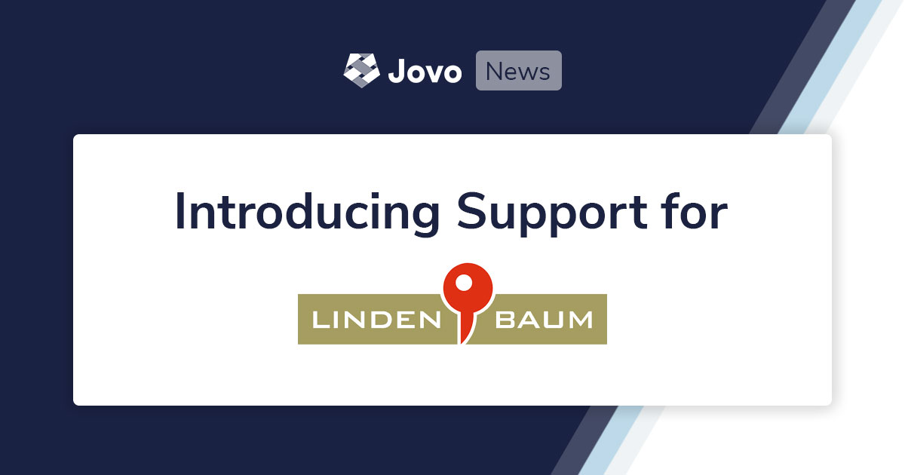
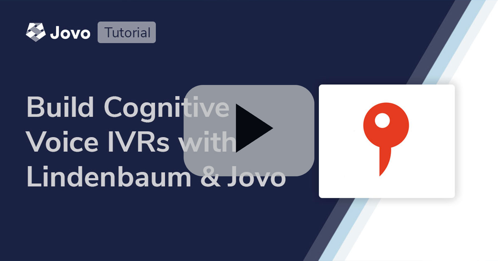

# Introducing Jovo Support for Lindenbaum Cognitive Voice IVR Systems



Lindenbaum, leading European provider for smart IVR systems, and Jovo, the most popular open source framework for voice, launch an integration to accelerate phone bot development.

> Take a look at the tutorial here: [Build IVRs with Lindenbaum Cognitive Voice and Jovo](https://www.jovo.tech/tutorials/lindenbaum-cognitive-voice).


* [Introduction](#introduction)
* [Getting Started with Lindenbaum and Jovo](#getting-started-with-lindenbaum-and-jovo)
* [Next Steps](#next-steps)

## Introduction

When the industry talks about voice user interfaces, the focus is usually on the major smart speaker assistants Amazon Alexa and Google Assistant. While these platforms are doing a great job at increasing the mainstream acceptance of speech recognition technology, companies sometimes struggle to find clear use cases on how to integrate with them today.

What is often neglected: One of the most business critical voice channels is the phone. Millions of customer support calls happen every day, and automating the contact center can help both deliver a better customer experience and reduce service cost.


"_Before Covid contact centers already were the key window between customers and an enterprise; and this only has increased since Covid. Contact centers have increased in reach and scope, but call volumes have increased too. In fact the majority of contact center touch points is still through calls, and enterprises quite too easily forget that efficiency is definitely possible, while increasing service levels._" - Maarten Kronenburg, CEO Lindenbaum GmbH

One leading company that specializes in making phone calls smarter is [Lindenbaum](https://www.lindenbaum.eu/). Their [Cognitive Voice](https://www.lindenbaum.eu/en/cognitive-voice-voice-bot-integration/) platform enables businesses to build telephony and voice bots that adhere to highest standards in security and privacy with servers based in Germany.

With the [Jovo Lindenbaum platform integration](https://www.jovo.tech/marketplace/jovo-platform-lindenbaum), it is now possible to connect a Jovo app to a Lindenbaum phone number. This comes with several benefits, including:
Cross-platform development: Build once and deploy to many platforms
Open source and highly flexible: Extend and host your voice experience anywhere
Many integrations for better development workflows: CMS, databases, analytics, and more

Thanks a lot to [Kaan Kilic](https://twitter.com/kaankilic45) who put a lot of work and passion into building this integration!


## Getting Started with Lindenbaum and Jovo
To make it as easy as possible, we worked on a number of resources to help you build your first phone bot with Lindenbaum Cognitive Voice and Jovo.

Watch the video here:

[](https://www.youtube.com/watch?v=zizPsZWVE8U)

You can also follow the tutorial here: [Build IVRs with Lindenbaum Cognitive Voice and Jovo](https://www.jovo.tech/tutorials/lindenbaum-cognitive-voice).

We also offer 3 templates for IVR development with Lndenbaum and Jovo. You can find them on Github: [jovotech/jovo-templates/lindenbaum](https://github.com/jovotech/jovo-templates/tree/master/lindenbaum).


```sh
// @language=javascript

# Update to the latest version of the Jovo CLI
$ npm install jovo-cli -g

# Create new Jovo project from Lindenbaum Hello World template
$ jovo new --template lindenbaum

# Create new Jovo project from Lindenbaum Dialog API template
$ jovo new --template lindenbaum/dialog-api

# Create new Jovo project from Lindenbaum Forward Feature template
$ jovo new --template lindenbaum/forward

// @language=typescript

# Update to the latest version of the Jovo CLI
$ npm install jovo-cli -g

# Create new Jovo project from Lindenbaum Hello World template
$ jovo new --template lindenbaum --language typescript

# Create new Jovo project from Lindenbaum Dialog API template
$ jovo new --template lindenbaum/dialog-api --language typescript

# Create new Jovo project from Lindenbaum Forward Feature template
$ jovo new --template lindenbaum/forward --language typescript
```


## Next Steps

* Contact Lindenbaum to get access to the Cognitive Voice platform: https://www.lindenbaum.eu/en/cognitive-voice-voice-bot-integration/
* Need help building your contact center solution? [Contact Jovo support](https://www.jovo.tech/services/implementation)


---

**About Lindenbaum**
Lindenbaum GmbH from Karlsruhe, Germany, has been developing its own communications and voice solutions since 1999. As the only European provider, Lindenbaum relies on its own hardware-accelerated media processing platform to offer customers the best possible audio quality and lowest possible latencies.
Lindenbaum builds on its media processing platform with its own voice and conferencing solutions and offers APIs to third parties to develop their own services.
Lindenbaum is registered with the Federal Network Agency as a provider of telecommunications services and fulfills all relevant legal requirements. Lindenbaum’s platform is located exclusively in the EU - so the highest security standards are guaranteed that fully comply with European data protection regulations.


**About Jovo**
Jovo is the open source voice layer: Build voice experiences for Alexa, Google Assistant, Samsung Bixby, Web Apps, IVRs, and much more. Learn more on the [Jovo website](https://www.jovo.tech) or [GitHub repository](https://github.com/jovotech/jovo-framework).


<!--[metadata]: { "description": "Lindenbaum, leading European provider for smart IVR systems, and Jovo, the most popular open source framework for voice, launch an integration to accelerate phone bot development.", "author": "jan-koenig", "tags": "Releases", "og-image": "https://www.jovo.tech/img/news/2020-07-09-lindenbaum-cognitive-voice/jovo-lindenbaum.jpg" }-->
