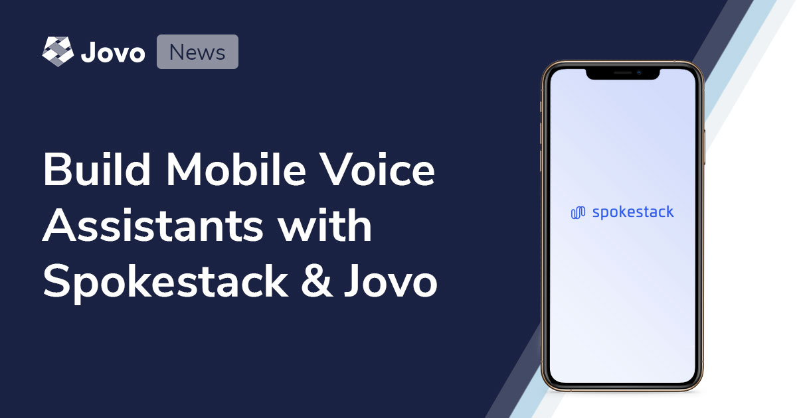

# Build Mobile Voice Assistants with Spokestack and Jovo



We’re excited to launch a new integration with [Spokestack](https://www.spokestack.io) that enables you to use your Jovo language model to build voice-enabled mobile apps.

* [Introduction](#introduction)
* [Getting Started with Spokestack and Jovo](#getting-started-with-spokestack-and-jovo)
* [Next Steps](#next-steps)

## Introduction

When we [launched Jovo v3](https://www.context-first.com/introducing-jovo-v3-the-voice-layer/), we shared our vision of the _voice layer_, a framework that lets you build great voice experiences that work anywhere. One channel that our community has been continuously asking us about is the mobile phone and ways to build voice-enabled apps for iOS and Android. While it was already possible to integrate mobile apps with Jovo, we wanted to provide a more seamless way for developers to deploy their voice experiences to the phone.

Today brings us one step closer to this goal by integrating with Spokestack’s embedded NLU (natural language understanding) solutions for iOS, Android, and React Native. The team at Spokestack has been doing exceptional work with [open source libraries](https://github.com/spokestack) for the major mobile operating systems and we can’t wait to see what our community is building with the integration.


Thanks a lot to [Ruben Aegerter](https://twitter.com/kaankilic45) who put a lot of work and passion into building this integration!


## Getting Started with Spokestack and Jovo


The new Spokestack Jovo integration allows you to turn your [Jovo Language Model](https://www.jovo.tech/docs/model) into a Spokestack NLU model that works on-device across iOS and Android.

To get started, create a new account on the [Spokestack website](https://www.spokestack.io/create).

Then, update to the latest version of the Jovo CLI:

```sh
$ npm install jovo-cli -g
```

Go into your project directory (or create a new project) and add the following information to your project.js file:

```js
// project.js

{
    // ...

    spokestack: {
        nlu: 'spokestack',
        name: '{{your-assistant-name}}',
        keyId: '{{your-api-key-id}}',
        keySecret: '{{your-api-key-secret}}',
    },
}
```

Then run the following commands to build the model and deploy it to Spokestack:

```sh
# Build language model into platforms/spokestack folder
$ jovo build

# Deploy to Spokestack
$ jovo deploy
```

You can then review the status in the Spokestack console.


## Next Steps

We’re already excited about this integration, and we have more things coming to unleash the full power of Spokestack and Jovo!

Our teams are working together to build even more integrations to make the deployment to mobile apps easier, for example:
* A Jovo platform integration that allows you to build the full conversational flow in Jovo while relying on Spokestack’s on-device NLU
* Standalone integrations to Spokestack’s ASR, NLU, and TTS services
* Educational content on how to turn a Jovo app into a voice-enabled mobile app

Spokestack has also signed on to be a [Platinum Jovo sponsor](https://opencollective.com/jovo-framework) to help support these integrations as well as further improvements to the Jovo-Spokestack partnership.

We’re looking forward to seeing what you’re building with this!


<!--[metadata]: { "description": "We’re excited to launch a new integration with Spokestack that enables you to use your Jovo language model to build voice-enabled mobile apps.", "author": "jan-koenig", "tags": "Releases", "og-image": "https://www.jovo.tech/img/news/2020-07-15-spokestack-mobile-voice/spokestack-mobile-voice.jpg" }-->
