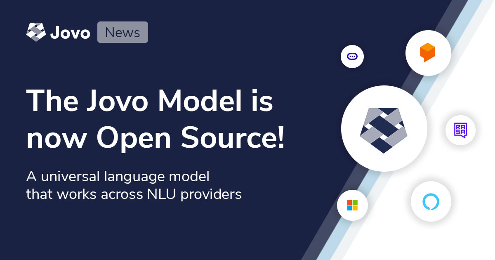

# Open Sourcing the Jovo Model, a Cross-Platform NLU Schema

Today, we're open sourcing the code behind the [Jovo Model](https://www.jovo.tech/marketplace/jovo-model) to allow the Jovo community and tool creators to build on top of a language model schema that works across platforms.

> You can find the Jovo Model on GitHub: [jovotech/jovo-model](https://github.com/jovotech/jovo-model).

* [Introduction](#introduction)
* [Supported NLU Providers](#supported-nlu-providers)
* [Next Steps](#next-steps)
   * [Roadmap](#roadmap)
   * [Getting Started](#getting-started)

## Introduction

Working on great voice and chat experiences usually involves a lot of testing and tweaking language models for natural language understanding (NLU) services. This gets more and more complex, the more platforms and providers are added to the mix. Keeping every language model in sync is a pain and requires a lot of redundant work.

The [Jovo Model](https://www.jovo.tech/marketplace/jovo-model) was always one of the key elements of the Jovo product ecosystem. By using the [Jovo CLI](https://www.jovo.tech/marketplace/jovo-cli), it made it possible to design and maintain a language model once and turn it into relevant schemas for Alexa and Dialogflow (for Google Assistant).

With the [launch of Jovo v3](https://www.context-first.com/introducing-jovo-v3-the-voice-layer/), we added support for many more [NLU providers](https://www.jovo.tech/marketplace/tag/nlu) with the goal to make it as easy as possible to build voice and conversational experiences with a best of breed approach. Jovo users can switch between different NLU providers and find the one that fits their needs best without fearing lock-in.

With the [Jovo Model](https://www.jovo.tech/marketplace/jovo-model) now being open source, the community members can build on top of the existing functionality and deeply integrate NLU updates into their toolchain. We're excited to see what everyone uses this new library for! 

## Supported NLU Providers

Want to learn more about each of the platforms that are currently supported? Take a look at the documentation for each integration:

* [Amazon Alexa](https://www.jovo.tech/marketplace/jovo-model/amazon-alexa)
* [Amazon Lex](https://www.jovo.tech/marketplace/jovo-model/amazon-lex)
* [Google Dialogflow](https://www.jovo.tech/marketplace/jovo-model/dialogflow)
* [Google Assistant Conversational Actions](https://www.jovo.tech/marketplace/jovo-model/google-assistant) (alpha)
* [Microsoft LUIS](https://www.jovo.tech/marketplace/jovo-model/microsoft-luis)
* [Rasa NLU](https://www.jovo.tech/marketplace/jovo-model/rasa) (alpha)
* [NLP.js](https://www.jovo.tech/marketplace/jovo-model/nlpjs) (alpha)

## Next Steps

### Roadmap

A few of the integrations are still in `alpha` and we're working hard to support all the features and make sure that we can provide a clean abstraction that works across platforms without being a common denominator. Let us know if you have any feedback!

### Getting Started

* Take a look at the [Jovo Model Docs](https://www.jovo.tech/marketplace/jovo-model)
* Want to see another platform added? [Reach out in our forum](https://community.jovo.tech/)

<!--[metadata]: { "description": "Today, we're open sourcing the code behind the Jovo Model to allow the Jovo community and tool creators to build on top of a language model schema that works across platforms.", "author": "jan-koenig", "tags": "Releases", "og-image": "https://www.jovo.tech/img/news/2020-08-20-jovo-model-nlu/jovo-model-nlu-open-source.jpg" }-->
