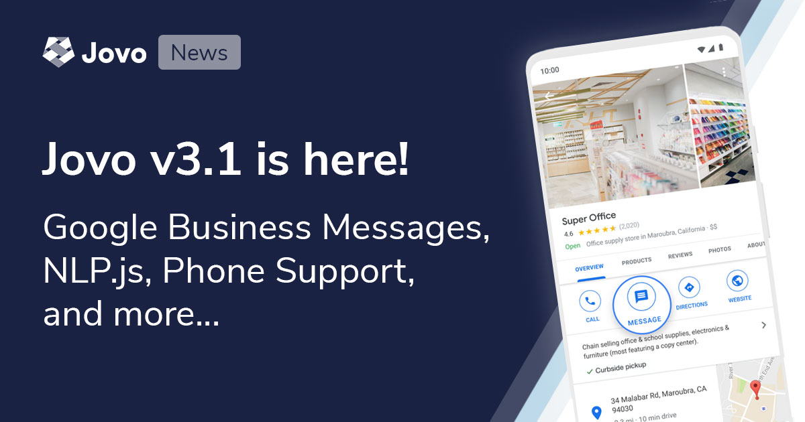

# Jovo v3.1: Google Business Messages, NLP.js, Phone Integrations, and more



6 months ago, [we released Jovo `v3`](https://www.context-first.com/introducing-jovo-v3-the-voice-layer/) with lots of integrations with platforms like [Samsung Bixby](https://www.jovo.tech/marketplace/jovo-platform-bixby), [the web](https://www.jovo.tech/marketplace/jovo-client-web), and various [ASR](https://www.jovo.tech/marketplace/tag/asr) and [NLU](https://www.jovo.tech/marketplace/tag/nlu) services.

Since then, [with help from our great community](#a-big-thank-you), we've ben working on a lot of new features, bugfixes, and integrations. Everything is now bundled togeher in Jovo `v3.1`.

You can find all new features and improvements below:

- [New Features and Integrations](#new-features-and-integrations)
  - [Build Conversational Agents for Google Business Messages](#build-conversational-agents-for-google-business-messages)
  - [Open Source NLU with NLP.js](#open-source-nlu-with-nlpjs)
  - [New Phone Integrations](#new-phone-integrations)
- [Improvements and Bugfixes](#improvements-and-bugfixes)
- [How to Update](#how-to-update)
  - [Breaking Changes](#breaking-changes)
- [A Big Thank You](#a-big-thank-you)

*Like what we're doing? [Support us on Open Collective!](https://opencollective.com/jovo-framework)* 

## New Features and Integrations

Below is a list of new features that we're excited about. [You can find the full changelog here](https://github.com/jovotech/jovo-framework/blob/master/CHANGELOG.md).

### Build Conversational Agents for Google Business Messages

> [Learn more about Google Business Messages in the Jovo Marketplace](https://www.jovo.tech/marketplace/jovo-platform-googlebusiness).

Ever went to Google Maps to search for a business? I bet.

What if there could be a "Message" button right next to your business loation on Google Maps, Search, and other touchpoints your customers have with you in the Google ecosystem? [Google Business Messages](https://developers.google.com/business-communications/business-messages) is all about this.

And with Jovo, you can now build automated conversational experiences for Google Business. [Learn more in the Jovo Marketplace](https://www.jovo.tech/marketplace/jovo-platform-googlebusiness). 


### Open Source NLU with NLP.js

> [Learn more about NLP.js in the Jovo Marketplace](https://www.jovo.tech/marketplace/jovo-nlu-nlpjs).

Jovo now supports the free and open source natural language understanding (NLU) library [NLP.js](https://github.com/axa-group/nlp.js).

This integration allows you to host your own NLU service without sending data to an external API. [Learn more in the Jovo Marketplace](https://www.jovo.tech/marketplace/jovo-nlu-nlpjs). Our [Lindenbaum tutorial](https://www.jovo.tech/tutorials/lindenbaum-cognitive-voice#adding-an-nlu-service) already uses this integration.

### New Phone Integrations

This year, the need to provide automated customer support on the phone has been going through the roof. Since `3.0`, there were two integrations added that help you build phone bots:

* [Lindenbaum Cognitive Voice](https://www.jovo.tech/news/2020-07-09-lindenbaum-cognitive-voice)
* [Dialogflow Phone Gateway](https://github.com/jovotech/jovo-framework/pull/820), added by community member [Stephen Wilcox](https://github.com/stephen-wilcox)


## Improvements and Bugfixes

> [You can find the full changelog here](https://github.com/jovotech/jovo-framework/blob/master/CHANGELOG.md).

There are lots improvements that we've added in the last few months. Some of them include:

* Various CLI improvements, [find the changelog here](https://www.jovo.tech/marketplace/jovo-cli)
* [Improvements to the logging JSON output](https://github.com/jovotech/jovo-framework/pull/827)
* [Google Analytics improvements](https://github.com/jovotech/jovo-framework/pull/804) by community member [André Heraucourt](https://github.com/freiSMS)
* [SSML support for Bixby](https://github.com/jovotech/jovo-framework/pull/799)
* [DynamoDb improvements](https://github.com/jovotech/jovo-framework/pull/751) by community member [Mark Tucker](https://github.com/rmtuckerphx)


## How to Update

> [Learn more in the Jovo Upgrading Guide](https://www.jovo.tech/docs/installation/upgrading).

To update to the latest version of Jovo, use the following commands:

```sh
# Update to the latest version of the Jovo CLI
$ npm install -g jovo-cli

# Update Jovo packages in your Jovo project
$ jovo update
```

### Breaking Changes

For users of our [Facebook Messenger integration](https://www.jovo.tech/marketplace/jovo-platform-facebookmessenger), [take a look at this breaking change about asynchronous messages](https://github.com/jovotech/jovo-framework/pull/817).


## A Big Thank You

Thanks a lot for all your help to the contributors of this release, including:

* [RokasVaitkevicius](https://github.com/RokasVaitkevicius)
* [Mark Tucker](https://github.com/rmtuckerphx)
* [AndresContreras96](https://github.com/AndresContreras96)
* [André Heraucourt](https://github.com/freiSMS)
* [Stephen Wilcox](https://github.com/stephen-wilcox)
* [Dustin Coates](https://github.com/dustincoates)
* [Dominik Meissner](https://github.com/dominik-meissner)
* [Joy A](https://github.com/1t5j0y)
* [Stephane C](https://github.com/StephaneC)
* [Awolad Hossain](https://github.com/awolad)
* [Andrew Doyon](https://github.com/adoyon23)
* [Voice-First-AI](https://github.com/Voice-First-AI)
* [Nick Fleker](https://github.com/Fleker)
* [Ruben Aegerter](https://github.com/rubenaeg)
* [Kaan Kilic](https://github.com/KaanKC)
* [Max Ripper](https://github.com/m-ripper)
* [Alex Swetlow](https://github.com/aswetlow)


And to everyone else who helped with ideas and feature requests in the [Jovo Slack](https://www.jovo.tech/slack) and [Jovo Community Forum](https://community.jovo.tech/)!


<!--[metadata]: { "description": "The Jovo v3.1 release includes support for Google Business Messages, NLP.js NLU, more phone platforms, and more.", "author": "jan-koenig", "tags": "Releases", "og-image": "https://www.jovo.tech/img/news/2020-09-29-jovo-v3-1-google-business/jovo-v3-1-google-business.jpg" }-->
