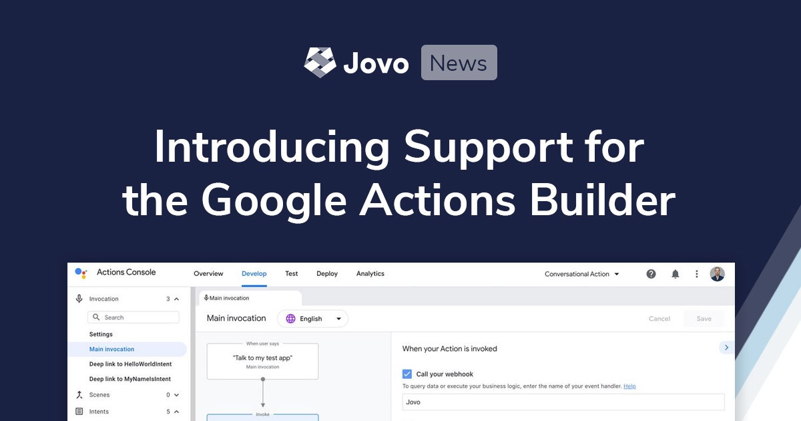

# Introducing Google Conversational Actions Support for the Jovo Framework

We're excited to announce a new powerful integration: With Jovo, you can now build Google Conversational Actions with the Actions Builder that was recently introduced by Google. Learn more about the features below.

> You can also take a look at the tutorial here: [Build Google Conversational Actions with Jovo and the Actions Builder](https://www.jovo.tech/tutorials/google-conversational-actions-getting-started).

- [Jovo and the Actions Builder: Goodbye Dialogflow](#jovo-and-the-actions-builder-goodbye-dialogflow)
- [Getting Started with Google Conversational Actions and Jovo](#getting-started-with-google-conversational-actions-and-jovo)

*Like what we're doing? [Support us on Open Collective!](https://opencollective.com/jovo-framework)* 

## Jovo and the Actions Builder: Goodbye Dialogflow

Jovo has been offering support for Google Assistant since our launch more than 3 years ago. From the beginning on, we integrated with Google's natural language understanding service Dialogflow, the then standard way to build Google Actions. Although this already worked great ([including support for additional integrations](https://www.jovo.tech/marketplace/jovo-platform-dialogflow)), our users had to create and configure a Dialogflow agent as an additional step.

Recently, Google introduced a new way to build apps for Google Assistant: [Conversational Actions](https://developers.google.com/assistant/conversational). This new release removed the necessity to connect with Dialogflow for natural language understanding.

In addition, you can use their graphical user interface called Action Builder to create intents and scenes:

With Jovo, you can now build Google Conversational Actions that work with the Actions Builder. By using our [Google Assistant integration for the Jovo Model](https://www.jovo.tech/marketplace/jovo-model/google-assistant), you can create all necessary files for the Actions Builder. And the conversational logic can be built the same way you've been using our previous Google Assistant integration.

## Getting Started with Google Conversational Actions and Jovo

There are several ways how you can build your first Google Conversational Action with Jovo:

* Read the tutorial: [Build Google Conversational Actions with Jovo and the Actions Builder](https://www.jovo.tech/tutorials/google-conversational-actions-getting-started)
* Download the template: [Google Conversational Actions Jovo Template](https://github.com/jovotech/jovo-templates/tree/master/google/conversational-actions-hello-world)
* Take a look at example code: [Google Conversational Action examples](https://github.com/jovotech/jovo-framework/tree/master/examples/javascript/02_googleassistantconv)

<!--[metadata]: { "description": "Learn more about the Google Conversational Action and Actions Builder integration for the Jovo Framework.", "author": "jan-koenig", "tags": "Releases", "og-image": "https://www.jovo.tech/img/news/2020-10-08-google-conversational-actions-builder/google-actions-builder-jovo.jpg" }-->
