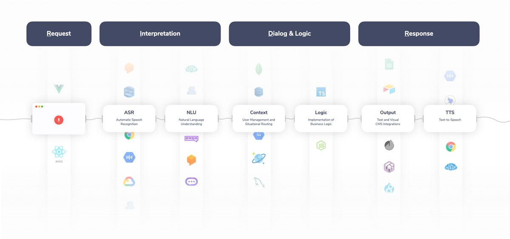
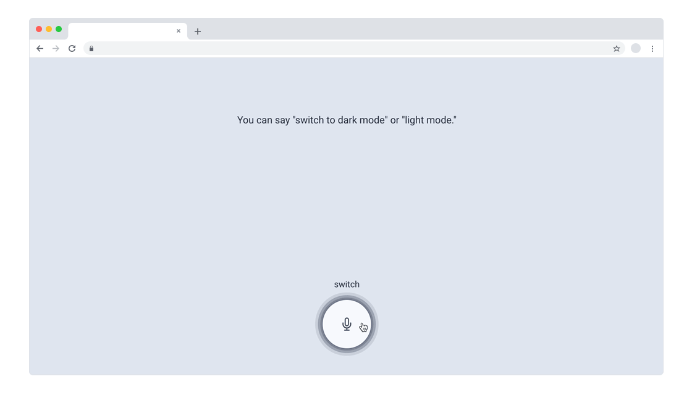
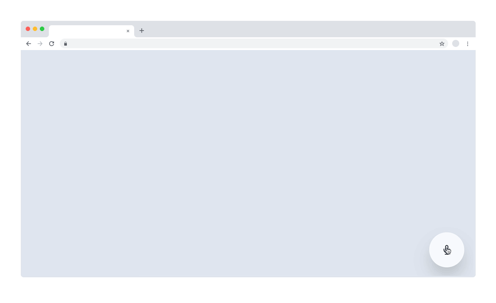
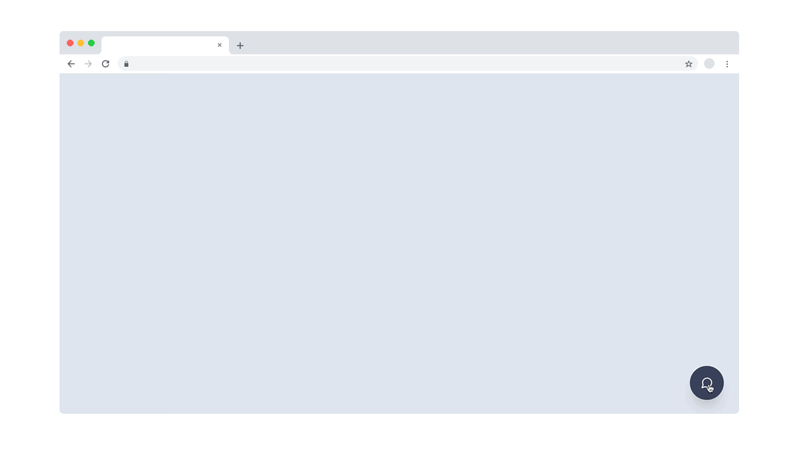
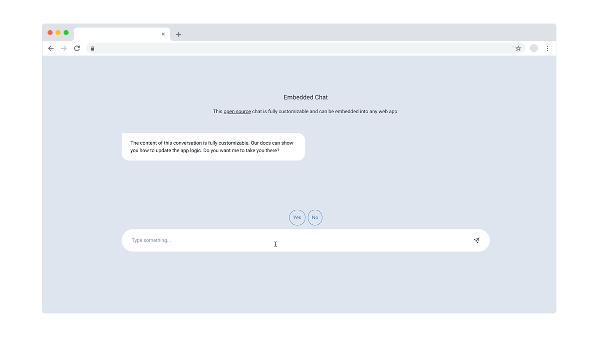

# Jovo for Web: Open Source, Customizable Voice & Chat for the Browser


With the release `v3.2` of the [Jovo Framework](https://github.com/jovotech/jovo-framework), we're excited to present a completely revamped web integration.

*Jovo for Web* allows you to build fully customizable voice and chat apps that work in the browser. And it even comes with 4 open source templates (gifs below!) that help you get started.


- [Jovo for Web Features](#jovo-for-web-features)
- [Select from 4 Starter Templates](#select-from-4-starter-templates)
  - [Standalone Voice Experience](#standalone-voice-experience)
  - [Voice Overlay](#voice-overlay)
  - [Chat Widget](#chat-widget)
  - [Embedded Chat](#embedded-chat)
- [More New Features](#more-new-features)
- [How to Update](#how-to-update)
  - [Breaking Changes](#breaking-changes)
- [A Big Thank You](#a-big-thank-you)

*Like what we're doing? [Support us on Open Collective!](https://opencollective.com/jovo-framework)* 


## Jovo for Web Features

Let's build voice and chat apps for the browser!

In our [v3 announcement](https://www.context-first.com/introducing-jovo-v3-the-voice-layer/), we already mentioned that Jovo works with web apps and websites thanks to the [RIDR Lifecycle](https://www.context-first.com/introduction-voice-multimodal-interactions/) and [Jovo Marketplace](www.jovo.tech/marketplace).



Today, we're thrilled to announce a completely improved verson of our **Jovo for Web** platform.

Features include:

* Support for speech, text, and touch input
* Multimodal: Complex visual and audio output possible
* Open source and fully customizable
* [4 starter templates](#select-from-4-starter-templates) built with modern technologies like Vue.js and Tailwind CSS

We can't wait to see and hear what you build with this!

## Select from 4 Starter Templates

To help you get started quickly, we built 4 templates with Vue.js and Tailwind CSS that implement use cases for both voice and chat.

### Standalone Voice Experience

> Find this starter on GitHub: [github.com/jovotech/jovo-starter-web-standalone](https://github.com/jovotech/jovo-starter-web-standalone)




This starter brings your voice experiences into the browser as a standalone web app. This can be seen as an experience equivalent to a smart display. Many Alexa Skills and Google Actions like voice games can be brought to the web using this template.

The starter includes:

* a push-to-talk button
* a display of the transcribed speech above the button
* app output at the top of the screen
* conversational logic that switches to dark/light mode using custom web actons

[Check out the demo here!](https://www.jovo.tech/demos/starter-web-standalone) Hold the button and say "_switch to dark mode._"


### Voice Overlay

> Find this starter on GitHub: [github.com/jovotech/jovo-starter-web-overlay](https://github.com/jovotech/jovo-starter-web-overlay)



This starter adds a speech input button as an overlay to an existing website or web app. Voice interactions like search, customizations, and deep access of features could be added using the overlay.

The starter includes:

* a push-to-talk button
* a display of the transcribed speech left to the button
* conversational logic that switches to dark/light mode using custom web actons

[Check out the demo here!](https://www.jovo.tech/demos/starter-web-overlay) Hold the button and say "_switch to dark mode._"


### Chat Widget

> Find this starter on GitHub: [github.com/jovotech/jovo-starter-web-chatwidget](https://github.com/jovotech/jovo-starter-web-chatwidget)



This starter adds a classic chat widget to your website. Think chatbots and conversational experiences for customer support and more.

The starter includes:

* a bottom-right toggle button
* text input and quick replies
* conversational logic that asks the user to open the Jovo Docs (redirect not working on iOS due to platform limitations)

[Check out the demo here!](https://www.jovo.tech/demos/starter-web-chatwidget)

### Embedded Chat

> Find this starter on GitHub: [github.com/jovotech/jovo-starter-web-embbeddedchat](https://github.com/jovotech/jovo-starter-web-embeddedchat)



This starter adds a customizable chat interface to your website that can be used for things like conversational landing pages, FAQs, mobile chat support, and much more.

The starter includes:

* fullsize chat component that can be embedded into an existing website
* text input and quick replies
* conversational logic that asks the user to open the Jovo Docs (redirect not working on iOS due to platform limitations)

[Check out the demo here!](https://www.jovo.tech/demos/starter-web-embeddedchat)


## More New Features

Alongside the big launch of Jovo for Web, we also shipped some other improvements and bug fixes with the help of our community. [You can find the full changelog here](https://github.com/jovotech/jovo-framework/blob/master/CHANGELOG.md).

* We released Google Conversational Actions. [Find the announcement here](https://www.jovo.tech/news/2020-10-08-google-conversational-actions-builder).
* New analytics integration: [OneDash](https://www.jovo.tech/marketplace/jovo-analytics-onedash). _Thanks to [StepanU](https://github.com/StepanU)!_
* [Dialogflow Genesys integration](https://github.com/jovotech/jovo-framework/pull/838). _Thanks to [Dominik Meissner](https://github.com/dominik-meissner)!_

## How to Update

> [Learn more in the Jovo Upgrading Guide](https://www.jovo.tech/docs/installation/upgrading).

To update to the latest version of Jovo, use the following commands:

```sh
# Update to the latest version 3.2.x of the Jovo CLI
$ npm install -g jovo-cli

# Update Jovo packages in your Jovo project
$ jovo update
```


### Breaking Changes

The "Jovo Web Client" and "Jovo Web Platform" were completely refactored for this release.


## A Big Thank You

Thanks a lot to all the contributors of this release. Everyone of the Jovo core team worked together to make this happen! Special thanks to Max who started working on the web integration more than a year ago as part of his bachelor's thesis.

Community and core contributors:

* [StepanU](https://github.com/StepanU)
* [Dominik Meissner](https://github.com/dominik-meissner)
* [Ruben Aegerter](https://github.com/rubenaeg)
* [Kaan Kilic](https://github.com/KaanKC)
* [Max Ripper](https://github.com/m-ripper)
* [Alex Swetlow](https://github.com/aswetlow)


And to everyone else who helped with ideas and feature requests in the [Jovo Slack](https://www.jovo.tech/slack) and [Jovo Community Forum](https://community.jovo.tech/)!


<!--[metadata]: { "description": "Jovo for Web allows you to build fully customizable voice and chat apps that work in the browser using the Jovo Framework and Vue.js", "author": "jan-koenig", "tags": "Releases", "og-image": "https://www.jovo.tech/img/news/2020-10-29-jovo-for-web-v3-2/jovo-for-web.jpg" }-->
