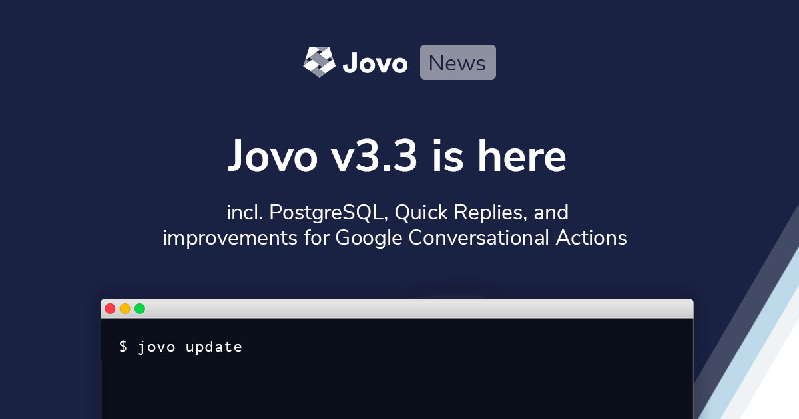

# Jovo v3.3: PostgreSQL, Quick Replies, Conversational Actions



We just released `v3.3`! This update comes with many bugfixes and improvements, as well as a new integration for PostgreSQL and an abstraction for quick replies.

> By the way, this is a smaller release while we're heavily working on Jovo `v4`. [Join the discussion](https://community.jovo.tech/t/jovo-v4-feature-request-thread/1389/9).
- [New Features and Integrations](#new-features-and-integrations)
  - [PostgreSQL Integration](#postgresql-integration)
  - [Abstracted Quick Replies](#abstracted-quick-replies)
  - [Abstracted Platform Handlers](#abstracted-platform-handlers)
- [Improvements and Bugfixes](#improvements-and-bugfixes)
- [How to Update](#how-to-update)
  - [Breaking Changes](#breaking-changes)
- [A Big Thank You](#a-big-thank-you)

*Like what we're doing? [Support us on Open Collective!](https://opencollective.com/jovo-framework)* 


## New Features and Integrations

Below is a list of new features that we're excited about. [You can find the full changelog here](https://github.com/jovotech/jovo-framework/blob/master/CHANGELOG.md).

### PostgreSQL Integration

> [Learn more about PostgreSQL in the Jovo Marketplace](https://www.jovo.tech/marketplace/jovo-db-postgresql).

PostgreSQL is a highly popular open source database. After [MySQL](https://www.jovo.tech/marketplace/jovo-db-mysql), this is the second relational database that Jovo integrates with.

[Find all database integrations here](https://www.jovo.tech/marketplace/tag/databases).


### Abstracted Quick Replies

> [Learn more in the Jovo Docs](https://www.jovo.tech/docs/output/visual-output#quick-replies).

Sometimes, it's easier to tap or click than saying the whole thing. Many platforms like [Google Assistant](https://www.jovo.tech/marketplace/jovo-platform-googleassistant), [Google Business Messages](https://www.jovo.tech/marketplace/jovo-platform-googlebusiness), and our [Jovo Web Platform](https://www.jovo.tech/marketplace/jovo-platform-web) already support quick replies. These buttons that look like small chips (also called "suggestion chps" sometimes) remove friction and help guide the conversation.

As not all platforms support this feature, you would usually have to add them yourself for each platform. Now, we offer an easier way:

```js
// New
this.showQuickReplies(['Yes', 'No']);

// Old
this.$googleAction.showQuickReplies(['Yes', 'No']);
this.$googleBusinessBot.showQuickReplies(['Yes', 'No']);
this.$webApp.showQuickReplies(['Yes', 'No']);
```


### Abstracted Platform Handlers

> [Learn more in the Jovo Docs](https://www.jovo.tech/docs/routing#platform-handlers).

While we're working on Jovo `v4`, we're exploring more and more ways to offer cleaner ways for cross-platform experiences.

One feature we have been supporting for a while was "platform handlers." This way, you can add intents that are only supported by one platform, and even add completely new experiences.

We've now made it easier to access this feature across platforms:

```js
// New
app.setPlatformHandler('Alexa', alexaHandlers);
app.setPlatformHandler('GoogleAssistant', googleAssistantHandlers);

// Old
app.setAlexaHandler(alexaHandlers);
app.setGoogleAssistantHandler(googleAssistantHandlers);
```

## Improvements and Bugfixes

> [You can find the full changelog here](https://github.com/jovotech/jovo-framework/blob/master/CHANGELOG.md).

There are lots improvements that we've added in the last few months. Some of them include:

* [Various improvements](https://github.com/jovotech/jovo-framework/pull/871) to Google Conversational Actions, [an integration we launched in October](https://www.jovo.tech/news/2020-10-08-google-conversational-actions-builder)
* [Improve Web Client browser detection](https://github.com/jovotech/jovo-framework/pull/848)
* [Support postback data for Google Business Messages](https://github.com/jovotech/jovo-framework/pull/870)
* [Various improvements](https://github.com/jovotech/jovo-cli/pull/174) to the Jovo CLI


## How to Update

> [Learn more in the Jovo Upgrading Guide](https://www.jovo.tech/docs/installation/upgrading).

To update to the latest version of Jovo, use the following commands:

```sh
# Update to the latest version of the Jovo CLI
$ npm install -g jovo-cli

# Update Jovo packages in your Jovo project
$ jovo update
```

### Breaking Changes

There are no breaking changes with this release. Update away!


## A Big Thank You

Thanks a lot for all your help to the contributors of this release, including:

* [Ruben Aegerter](https://github.com/rubenaeg)
* [Kaan Kilic](https://github.com/KaanKC)
* [Max Ripper](https://github.com/m-ripper)
* [Alex Swetlow](https://github.com/aswetlow)


And to everyone else who helped with ideas and feature requests in the [Jovo Slack](https://www.jovo.tech/slack) and [Jovo Community Forum](https://community.jovo.tech/)!

<!--[metadata]: { "description": "This update comes with many bugfixes and improvements, as well as a new integration for PostgreSQL and an abstraction for quick replies.", "author": "jan-koenig", "tags": "Releases", "og-image": "https://www.jovo.tech/img/news/2020-12-03-jovo-v3-3/jovo-v3-3.jpg" }-->
