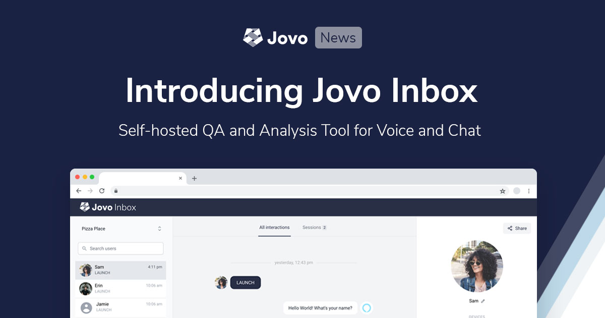
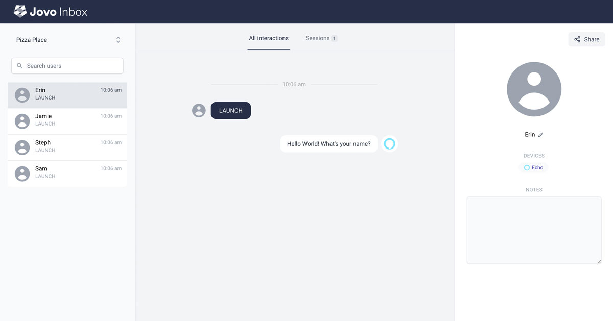
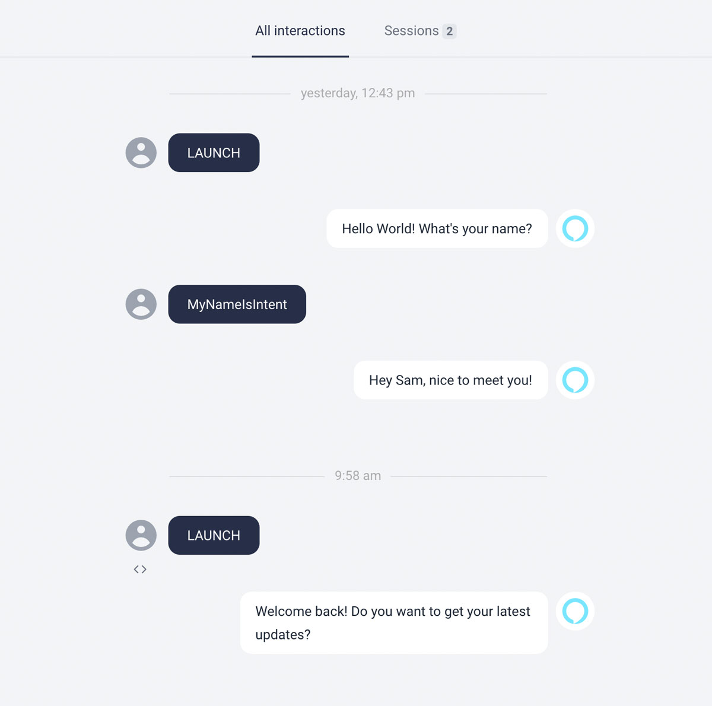
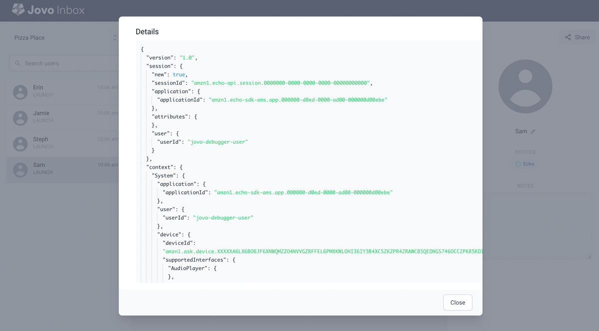
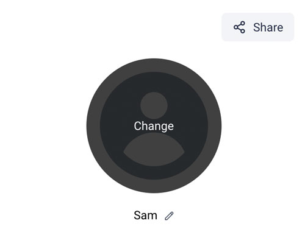
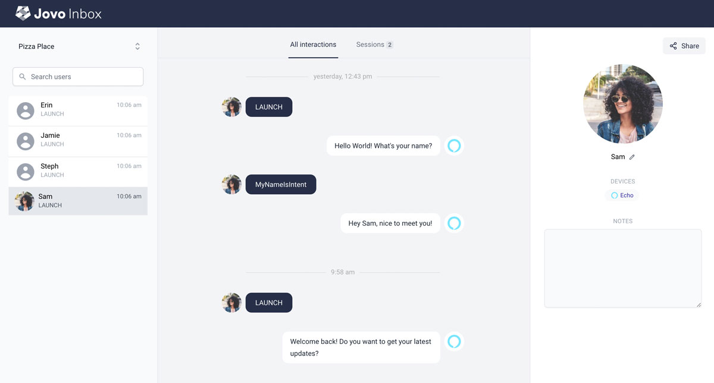

# Introducing Jovo Inbox: Self-Hosted QA and Analysis Tool for Voice and Chat Apps



Together with the `v3.4` release of the [Jovo Framework](https://github.com/jovotech/jovo-framework), we're excited to announce a completely new product built on top of our open source framework.

*Jovo Inbox* allows you to learn from actual conversations your users have with your voice and chat apps, across Alexa, Google Assistant, the web, and [all other platforms supported by Jovo](https://www.jovo.tech/marketplace). This can be used for coordinated QA testing with your team and beta testers, and even to analyze live conversations.

Learn everything about this new product and Jovo `v3.4` below.

- [New Product: Jovo Inbox](#new-product-jovo-inbox)
  - [View Past Interactions](#view-past-interactions)
  - [Inspect JSON and Visual Content](#inspect-json-and-visual-content)
  - [Edit Test Users](#edit-test-users)
  - [Share Conversations and Notes](#share-conversations-and-notes)
  - [What's Next](#whats-next)
  - [How to get Access](#how-to-get-access)
- [Jovo v3.4: Features and Improvements](#jovo-v34-features-and-improvements)
  - [How to Update](#how-to-update)
- [A Big Thank You](#a-big-thank-you)

*Like what we're doing? [Support us on Open Collective!](https://opencollective.com/jovo-framework)* 


## New Product: Jovo Inbox

> This product is currently in early access and available to our [sponsors of the silver tier and higher](https://opencollective.com/jovo-framework). Learn more in [how to get access](#how-to-get-access).

The [Jovo Framework](https://github.com/jovotech/jovo-framework) has always been about making it easer to build, debug, and deploy voice and chat experiences that work across platforms and devices.

After initially designing and building a voice and chat app, however, the work is usually just getting started. Especially early on during beta testing and first real users trying the product, it is critical to understand how users interact it in order to make improvements. Next to our [analytics integrations](https://www.jovo.tech/marketplace/tag/monitoring), we've always been missing a tool that helps us speed up the process to make apps better based on qualitative data.

This is why we built *Jovo Inbox*, a tool that lets you learn from past user interactions.



Here is why Jovo Inbox is special:

* **Self-hosted**: Inbox runs on your own servers, no user data is sent to Jovo servers. Learn more in [how to get access](#how-to-get-access)
* **Facilitates collaboration for cross-functional teams**: Our sharing capabilities make it easy for QA testers and product managers to share qualitative data with designers and developers to fix bugs and improve conversational flows
* **Unified inbox**: Works across [all platforms that are supported by Jovo](https://www.jovo.tech/marketplace)
* **Multimodal**: See intents (e.g. on Alexa), text (for chatbots), and visual output (e.g. APL) to get the full picture
* **Customizable**: You get access to the source code and can customize the product to your own needs


### View Past Interactions

For each user, you can dive into all interactions, or group them by sessions.



For QA, this removes the need to document "steps to reproduce" when communicating potential bugs. And for developers, it saves time digging through log data.


### Inspect JSON and Visual Content

For easier debugging, you can access the full JSON format of each request and response.



And you can even take a look at visual output. Here's an example of an APL document rendered inside Jovo Inbox:

 in the Jovo Inbox")

APL document taken from [apl.ninja](https://apl.ninja/DanielMittendorf/EMjmC6bU).


### Edit Test Users

For a better overview during QA, you can even upload profile images and edit the name of a user to easily see who on the team has been testing the app.



This makes it a little easier to coordinate (and friendly):




### Share Conversations and Notes

QA testers and product managers can easily share a conversation with a developer using the "Share" button.

It's also possible to add more context using notes.


### What's Next

We're just getting started with *Jovo Inbox* and can't wait to onboard new users.

Here are a few more things we're working on:
* Support more types of visual output
* Improved sharing and annotation of all interactions and interactions of a specific sessions
* Better filtering/hinting of important interactions (e.g. conversations with errors)
* Aggregated view across users


### How to get Access

Jovo Inbox is currently in early access. [Join other great companies who sponsor Jovo (silver or higher)](https://opencollective.com/jovo-framework), and you will get:

* Immediate access to the `jovo-inbox` repository on GitHub (send us your Github username)
* Access to the Jovo core team for feedback and feature requests
* All other benefits listed on [Open Collective](https://opencollective.com/jovo-framework)

Over the next weeks and months, we're going to roll this out to more and more people. First, lower sponsorship tiers, then eventually the whole community by open sourcing it. Reach out if you have any questions: *team [at] jovo.tech*.


## Jovo v3.4: Features and Improvements

We also just released `v3.4` of the Jovo Framework! The biggest update was an even bigger focus on [Google Conversational Actions](https://www.jovo.tech/marketplace/jovo-platform-googleassistantconv) (as opposed to [Google Actions using Dialogflow](https://www.jovo.tech/marketplace/jovo-platform-googleassistant)).

You can find some updates below. [And here is the full changelog](https://github.com/jovotech/jovo-framework/blob/master/CHANGELOG.md).

* We now support transactions for Google Conversational Actions. [You can find the full documentation here](https://www.jovo.tech/marketplace/jovo-platform-googleassistantconv) ([Alex Swetlow](https://github.com/aswetlow), [Ruben Aegerter](https://github.com/rubenaeg))
* [#890](https://github.com/jovotech/jovo-framework/pull/890): Added Conversational Actions functionality to Jovo Debugger ([Alex Swetlow](https://github.com/aswetlow))
* [#875](https://github.com/jovotech/jovo-framework/pull/875): Persist user.context within unit tests ([Frank Bublitz](https://github.com/fbublitz), [Norbert Gocht](https://github.com/ngocht))
* [#876](https://github.com/jovotech/jovo-framework/pull/876): Added support for Google Optimize to Google Analytics ([Ben Force](https://github.com/theBenForce))
* [#879](https://github.com/jovotech/jovo-framework/pull/879): Fixed bug related to audio in the request for CorePlatform and WebPlatform ([Max Ripper](https://github.com/m-ripper))


### How to Update

> [Learn more in the Jovo Upgrading Guide](https://www.jovo.tech/docs/installation/upgrading).

To update to the latest version of Jovo, use the following commands:

```sh
# Update to the latest version of the Jovo CLI
$ npm install -g jovo-cli

# Update Jovo packages in your Jovo project
$ jovo update
```


## A Big Thank You

Thanks a lot to all the community and core contributors of this release:

* [Frank Bublitz](https://github.com/fbublitz)
* [Norbert Gocht](https://github.com/ngocht)
* [Ben Force](https://github.com/theBenForce)
* [Ruben Aegerter](https://github.com/rubenaeg)
* [Kaan Kilic](https://github.com/KaanKC)
* [Max Ripper](https://github.com/m-ripper)
* [Alex Swetlow](https://github.com/aswetlow)


And to everyone else who helped with ideas and feature requests in the [Jovo Slack](https://www.jovo.tech/slack) and [Jovo Community Forum](https://community.jovo.tech/)!


<!--[metadata]: { "description": "Jovo Inbox allows you to learn from actual conversations your users have with your voice and chat app.", "author": "jan-koenig", "tags": "Releases", "og-image": "https://www.jovo.tech/img/news/2021-02-04-jovo-inbox-v3-4/jovo-inbox.jpg" }-->
