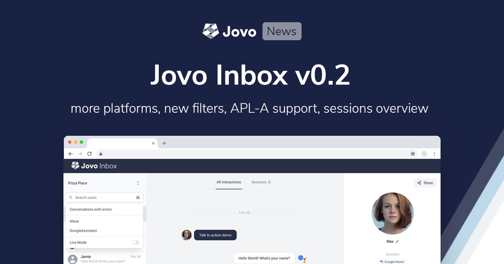
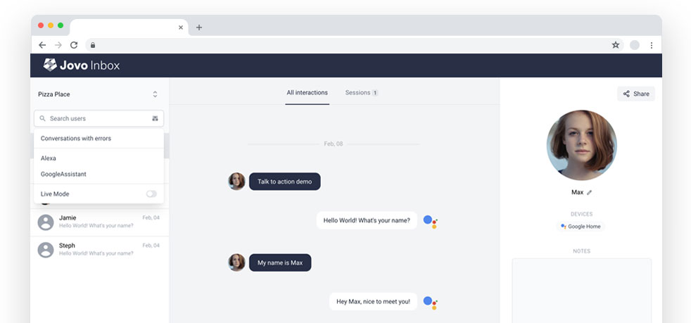
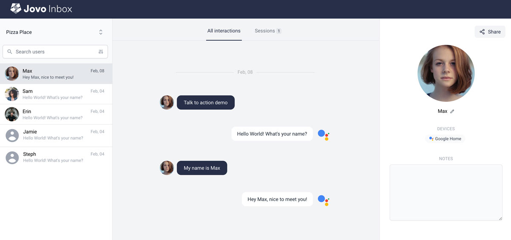
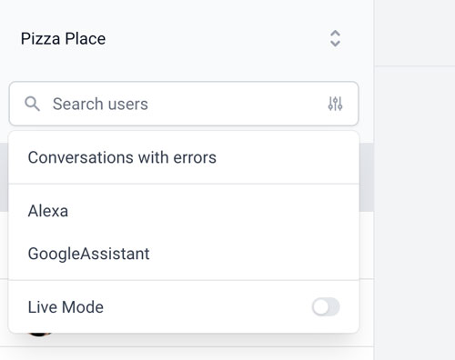
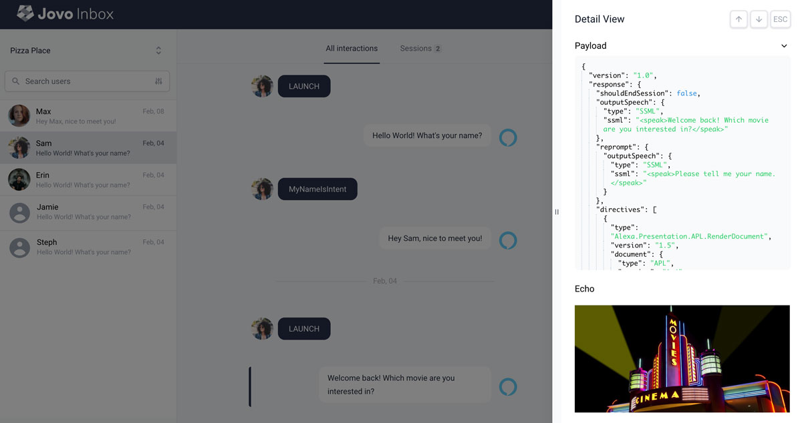
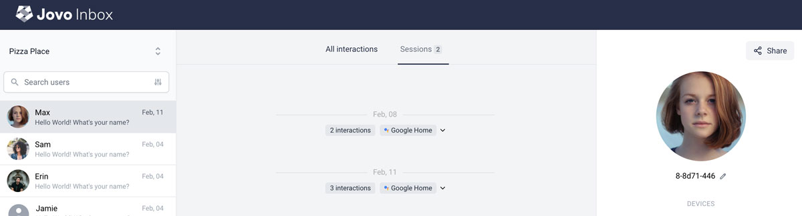

# Jovo Inbox v0.2: More Platforms, Filters, and more

[Last month, we announced Jovo Inbox](https://www.jovo.tech/news/2021-02-04-jovo-inbox-v3-4), a self-hosted QA and analysis tool that enables you to learn from actual conversations your users have with your voice and chat apps.

We just released `v0.2` of Jovo Inbox with new features, improvements, and bugfixes. Learn more below.

- [What's New in Inbox v0.2](#whats-new-in-inbox-v02)
  - [More Platforms](#more-platforms)
  - [Filters](#filters)
  - [Improved Detail View](#improved-detail-view)
  - [Sessions Overview](#sessions-overview)
  - [More Improvements](#more-improvements)
- [How to get Access](#how-to-get-access)

*Like what we're doing? [Support us on Open Collective!](https://opencollective.com/jovo-framework)* 

## What's New in Inbox v0.2

> This product is currently in early access and available to our [sponsors of the silver tier and higher](https://opencollective.com/jovo-framework). Learn more in [how to get access](#how-to-get-access).

`0.2` of Jovo Inbox comes with several improvements with the goal to make it as easy as possible to learn from user conversations, across devices and platforms.

* Connect Jovo Inbox to more platforms, including Google Assistant and the web
* Surface the right conversations with filters
* See all sessions at a glance using the sessions overview

See below for more details.

### More Platforms

We added the following platforms:

* [Google Conversational Actions](https://www.jovo.tech/marketplace/jovo-platform-googleassistantconv)
* [Google Actions using Dialogflow](https://www.jovo.tech/marketplace/jovo-platform-googleassistant)
* [Jovo for Web](https://www.jovo.tech/news/2020-10-29-jovo-for-web-v3-2)

The goal is to support [all Jovo platform integrations](https://www.jovo.tech/marketplace/tag/platforms). Let us know which one we should add next!

### Filters

The more users your experience has, the more difficult it is to surface the most important interactions. Our goal is to make it as easy as possible to discover the conversations that should be investigated.

As a first step, we added filters to our search, allowing you to filter by:

* Platform, e.g. Alexa, Google Assistant, Web
* Conversations with errors

### Improved Detail View

Double clicking a bubble now opens a sidebar with a detail view, showing:
* A JSON view of the request or response for debugging and sharing with developers
* APL screens

You can also use your arrow keys to quickly switch between interactions.

### Sessions Overview

You can now access an overview of all sessions. This allows you to see everything at a glance, even for frequent users with many sessions.

The overview currently shows the following information for each session:
* Date
* Number of interactions
* Device
* Errors

### More Improvements

And there are even more things that we've been working on, including:

* APL-A Support
* Improved user search
* Improved UX: scrolling, loading indictators
* Show multiple bubbles for platforms that support multiple responses

## How to get Access

Jovo Inbox is currently in early access. [Join other great companies who sponsor Jovo (silver or higher)](https://opencollective.com/jovo-framework), and you will get:

* Immediate access to the `jovo-inbox` repository on GitHub (send us your Github username)
* Access to the Jovo core team for feedback and feature requests
* All other benefits listed on [Open Collective](https://opencollective.com/jovo-framework)

Over the next weeks and months, we're going to roll this out to more and more people. First, lower sponsorship tiers, then eventually the whole community. Reach out if you have any questions: *team [at] jovo.tech*.

<!--[metadata]: { "description": "Jovo Inbox v0.2 was released with support for more platforms, filters, and more.", "author": "jan-koenig", "tags": "Releases", "og-image": "https://www.jovo.tech/img/news/2021-03-11-jovo-inbox-v0-2/jovo-inbox-v0-2.jpg" }-->
