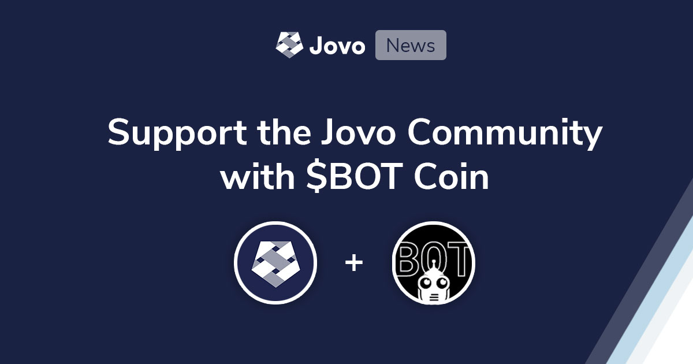

# Support the Jovo Community with $BOT Coin

Jovo is now part of a community of institutions and groups that support $BOT Coin, a new digital currency for the voice and chatbot industry.

In addition to the [Jovo Open Collective](https://opencollective.com/jovo-framework), you can now support Jovo using $BOT. Learn more about how this benefits the community below.

- [About $BOT](#about-bot)
- [Jovo and $BOT](#jovo-and-bot)
- [Voicebot.ai Sponsors Jovo with $BOT](#voicebotai-sponsors-jovo-with-bot)
- [New Benefit for Sponsors: Access to Jovo Inbox](#new-benefit-for-sponsors-access-to-jovo-inbox)

## About $BOT

$BOT Coin is a new digital currency with the goal to provide ways for members of the voice and chatbot communities to support each other. Tipping, rewards, and transactions are some of the use cases that $BOT is currently being used for.

You can learn more about $BOT here:
* [Introducing BOT Coin, a new tool for the voice and chatbot communities](https://voicebot.ai/2021/03/16/introducing-bot-coin-a-new-tool-for-the-voice-and-chatbot-communities/)
* [Voice and Chatbot Creators Get Behind $BOT Coin with New Use Cases](https://voicebot.ai/2021/03/17/voice-and-chatbot-creators-get-behind-bot-coin-with-new-use-cases/)
* [$BOT on the Rally website](https://rally.io/creator/BOT/)

## Jovo and $BOT

For the Jovo open source community, we are always looking for ways to support contributors, and for community members to support each other.

Our previous support offerings via [Open Collective](https://opencollective.com/jovo-framework) were mostly focused on financial contributions to the Jovo core team with the goal of sustaining ongoing development.

With $BOT, we now see the opportunity to reward active Jovo community members as well. For example:

* **Rewards**: Each month, we send $BOT to the "Jovo Community Member of the Month".
* **Tipping**: The Jovo core team as well as community members can easily send $BOT to other members who provide value to the community (e.g. through support, plugins, examples).
* **Payments**: In the future, we envision $BOT as being a frictionless way for people to sell things like premium Jovo templates.
* **Transactions**: $BOT could even be used to build transactions into your Jovo apps. More on this soon.

To buy your first coins, you can follow this guide: [How to buy $BOT](https://emiellangeberg.medium.com/how-to-buy-bot-a77aa1af1849).

To send $BOT to Jovo, you can use our Rally username `jovotech`.

## Voicebot.ai Sponsors Jovo with $BOT

We're excited to welcome [Voicebot.ai](https://voicebot.ai/) as new Jovo bronze sponsors. Voicebot is the first entity to sponsor Jovo using $BOT.

[Bret Kinsella](https://twitter.com/bretkinsella) of Voicebot:

_Jovo has been a great contributor to the growth and quality of the voice app ecosystem. I know countless developers that use Jovo and appreciate what Jan, Alex, and the contributors have done to make their lives easier and voice experiences better. As an open source project, Jovo has built a strong community. The leadership team immediately recognized the value of $BOT Coin as another community project that could help all developers by providing a new tool for user recognition and loyalty rewards, voice app mechanics, and monetization. The Voicebot team thought it was only fitting to recognize Jovo's industry contribution with a donation in the form of $BOT Coin._

Thanks a lot for the support and trust!

## New Benefit for Sponsors: Access to Jovo Inbox

By supporting the Jovo open source community, you not only make sure that Jovo keeps getting updated. Recurring sponsors (bronze and upwards) also receive some rewards that are listed on our [Open Collective](https://opencollective.com/jovo-framework).

And even better: You get access to Jovo Inbox, the new analysis and review tool built by the Jovo core team. [When we announced Jovo Inbox](https://www.jovo.tech/news/2021-02-04-jovo-inbox-v3-4), we opened it up to silver sponsors, and higher.

Today, we're happy to announce that bronze sponsors will get access to Jovo Inbox as well! Reach out to the team if you have any questions.

Thanks for supporting Jovo!

<!--[metadata]: { "description": "You can now support Jovo open source development with $BOT Coin.", "author": "jan-koenig", "tags": "Releases", "og-image": "https://www.jovo.tech/img/news/2021-04-19-jovo-bot-coin/jovo-bot-coin.jpg" }-->
