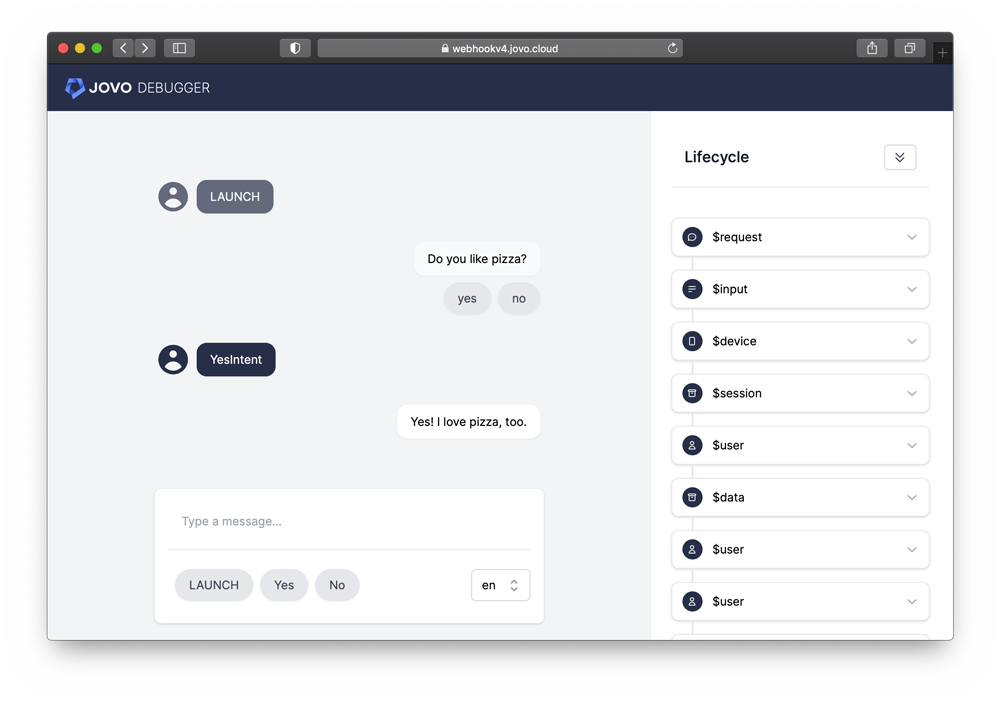
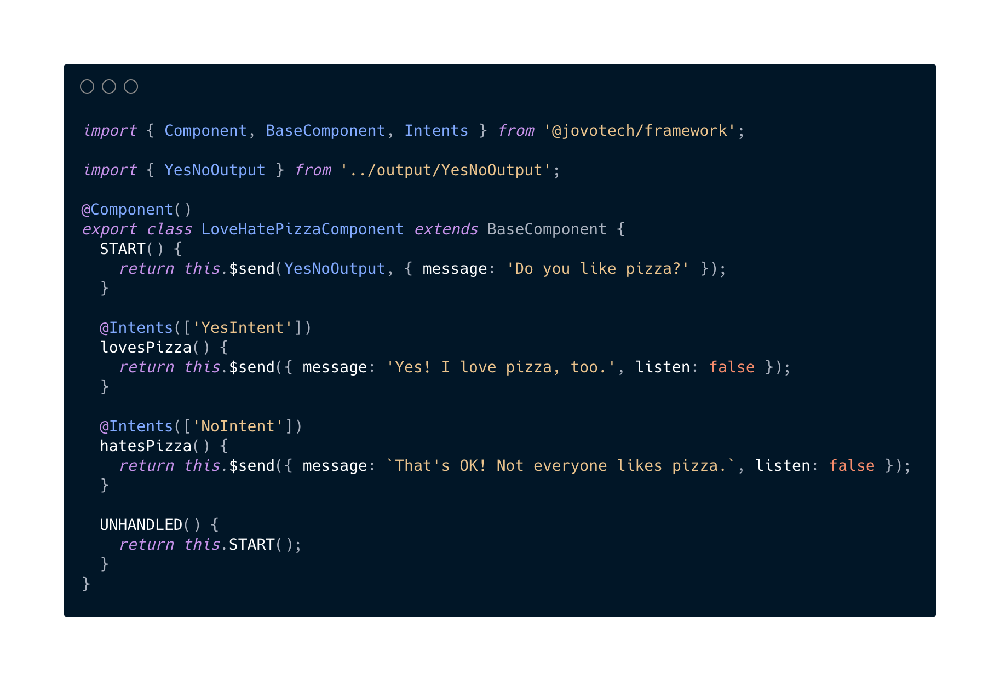
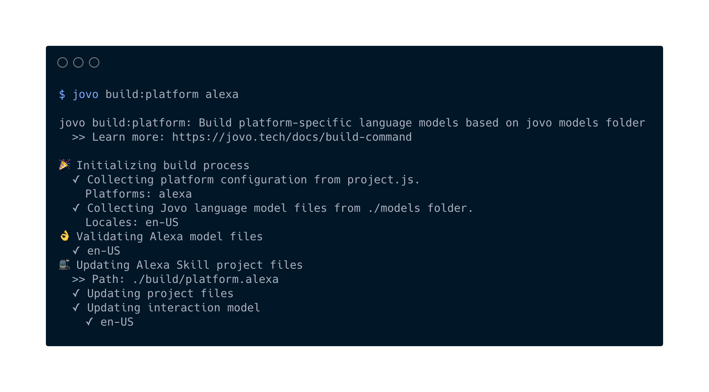

# Introducing Jovo v4: The React for Voice and Chat


After 12 months in the making, it's finally here! Jovo `v4` improves every step of the workflow, including a new browser-based Debugger, a new CLI, an output template engine, a component-based system, and much more. Learn more below.

## Introduction

When we [launched Jovo `v3`](https://www.context-first.com/introducing-jovo-v3-the-voice-layer/) in early 2020, it was a big step towards our vision of enabling companies to build great multimodal experiences that work across devices and platforms. We called Jovo the _Voice Layer_ and added support for voice on platforms like Bixby, the web, and more. Later in 2020, we launched improved support for [Jovo for Web](https://v3.jovo.tech/news/2020-10-29-jovo-for-web-v3-2).

While `v3` was all about expansion (more platforms, more integrations), it was time for us to improve the overall developer experience. We translated everything we learned from 4 years building Jovo into a completely new product.

And here it is! Jovo `v4` is a complete rewrite that brings us closer to our vision of building the _Multimodal Experience Platform_:

- A truly extensible architecture that can be embedded into your infrastructure
- A browser-based multimodal testing experience
- Efficient and integrated workflows powered by the new Jovo CLI
- A component-based architecture for more structured apps
- All based on modern TypeScript technologies

Or, if you want to put it like this: If Jovo `v3` was the jQuery, Jovo `v4` can be seen as the React for voice and chat apps, bringing the development of conversational apps with Jovo to a next level.

All of this was designed and developed in dozens of sessions with the Jovo community. Norbert Gocht from [Die Lautmaler](https://www.linkedin.com/company/die-lautmaler/) shares some insights:

> Jovo v4 is a modern component based conversational UI framework with outstanding flexibility and state of the art tooling. We were able to deliver a deeply integrated custom conversation platform and tailored conversation applications for our clients. Thanks to open source, the incredible dedicated team of Jovo and its amazing community - Jovo v4 is a top solution for professional development of all kind of conversational applications.

I'm especially proud of what we accomplished given that we're only a team of 4 people. Huge thanks go out to [Ruben](https://github.com/rubenaeg), [Max](https://github.com/m-ripper), and [Alex](https://github.com/aswetlow) for this! And for [Kaan](https://github.com/KaanKC) who has been a lot of help earlier to year. It was a pleasure. And to our community members who helped us with feedback, feature requests, and pull requests. It's great to be part of such a great community!

_Can't wait to see and hear what everyone is going to build with Jovo ´v4`!_

## Jovo v4 Features

Learn more in our [getting started guide](https://www.jovo.tech/docs/getting-started) or in this video:

https://www.youtube.com/watch?v=YwsLarNuMW0

- [New Debugger](#new-debugger): An all-new Debugger with multimodal testing capabilities
- [Components](#components): Reusable, isolated elements for a better project structure
- [Output](#output): A multimodal template engine that works across platforms
- [CLI](#cli): Rebuilt from the ground up, including plugins and custom commands
- [More](#more): Lots of more improvements and updates

### New Debugger



The new Jovo Debugger comes with lots of improvements:

- Test your app by typing, speaking, or pressing buttons
- See the whole data flow in the _Lifecycle_ view
- Customize the Debugger with a [`jovo.debugger.js` file](https://www.jovo.tech/docs/debugger-config)

[Learn more about the Jovo Debugger here](https://www.jovo.tech/docs/debugger).

### Components



Jovo `v4` has a component-based system at its core, similar to popular web frameworks like React and Vue. This makes it possible for our users to build reusable elements that can be used across projects.

[Learn more about components here](https://www.jovo.tech/docs/components).

### Output

Jovo `v4` comes with a first of its kind multimodal template engine that turns [structured output](https://www.jovo.tech/docs/output-templates) into native platform responses.

For example, the output below gets translated into the appropriate format for all platforms that you can find in the [Jovo Marketplace](https://www.jovo.tech/marketplace):

```js
{
  message: 'Do you like pizza?',
  quickReplies: ['yes', 'no']
}
```

It comes with the following features:

- It makes it easier to separate content from logic
- Multimodal: Works for voice, chat, and visual output
- Works across platforms, even on Alexa APL
- Supports validation and automatically trims content based on platform requirements

[Learn more about output here](https://www.jovo.tech/docs/output).

### CLI



The CLI was completely rebuilt from the ground up:

- A new, more modular architecture
- An improved build and deployment process
- Build your own [CLI plugins](https://www.jovo.tech/docs/cli-plugins) and custom commands

[Learn more about the Jovo CLI here](https://www.jovo.tech/docs/cli).

### More

- [Unit Testing](https://www.jovo.tech/docs/unit-testing): An improved, more powerful testing experience
- [Handlers](https://www.jovo.tech/docs/handlers): Improved handling of multimodal input
- [Staging](https://www.jovo.tech/docs/unit-testing): Improved staging capabilities
- [New Website](https://www.jovo.tech): Better docs and better search
- [New Instagram integration](https://www.jovo.tech/docs/unit-testing): Build chatbots for Instagram
- [Device](https://www.jovo.tech/docs/device): Improved device capabilities, laying the ground for powerful device-specific features

## Getting Started with v4

There are several ways how you can get started with `v4`:

- Follow our [getting started guide](https://www.jovo.tech/docs/getting-started) to install the Jovo CLI and create a new project.
- Coming from Jovo `v3`? Follow our [migration guide](https://www.jovo.tech/docs/migration-from-v3).
- Take a look at our `v4` template for [TypeScript](https://github.com/jovotech/jovo-v4-template) and [JavaScript](https://github.com/jovotech/jovo-v4-template-js).
