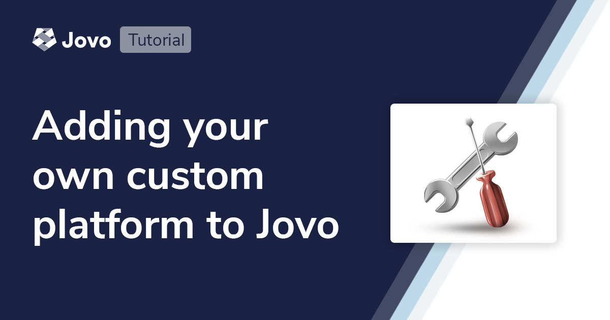
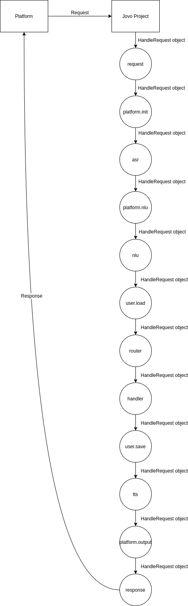

# Add a Custom Platform to the Jovo Framework



In this tutorial, we will go over the whole process of adding a new custom platform integration to the Jovo Framework.

* [Introduction](#introduction)
* [Jovo Framework Architecture](#jovo-framework-architecture)
* [Jovo Package Architecture](#jovo-package-architecture)
* [Jovo Platform Package Architecture](#jovo-platform-package-architecture)
  * [Core](#core)
  * [Modules](#modules)
  * [index.ts](#indexts)
  * [Tests](#tests)
* [Development](#development)
* [Conclusion](#conclusion)

## Introduction

Adding a new platform to the framework is not a difficult task. But, it takes some time to get it right. Each platform integration consists of a handful of different parts needed for the core functionality. In the tutorial, we will go over the framework's architecture, understand how the framework handles the request & response cycle and which part of it is handled by the platform integration. After that, we will get into more detail and layout the structure of a platform integration package.

While doing all of that, we will take the Twilio Autopilot integration as an example. It fits our purpose perfectly since it is not very complex. We've also only integrated the key features to get the platform working at this point, meaning we won't have to go over to much stuff that is only specific to the Autopilot platform. At some point we *will* talk about stuff that is more advanced and not included with the Autopilot integration, in that case, we will use the Alexa integration as an example.

The tutorial will be quite long and you won't be able to remember everything we've gone over here, so it would be best to revisit the tutorial multiple times throughout your endeavor to add a new platform.

Now let's start with the framework's architecture.

## Jovo Framework Architecture

The basics: the framework is written in Typescript, uses [Jest](https://github.com/facebook/jest) for its tests, and is a monorepo managed using [Lerna](https://github.com/lerna/lerna). It's separated into five parts:
 * `jovo-core`: contains the core functionality of the framework.
 * `jovo-clients`: contains all the client integrations
 * `jovo-platforms`: contains all the platform integrations
 * `jovo-integrations`: contains all the other integrations (e.g. DB, analytics, CMS, etc.)
 * `jovo-framework`: extends the jovo-core package with logging, hosting, and integration capabilities

The framework itself was built around the plugin architecture. There is the core component (jovo-core and jovo-framework)

To receive the request and to send out the response takes a handful of steps. First, the request has to be processed. We have to determine from which platform it came, what kind of request it is (LAUNCH, INTENT, END, etc.), and if any inputs were parsed. After that, we load the user's data from the DB and determine the route to the correct handler function. With every piece initialized and processed, the handler function can be executed. There are three pieces each handler function can modify: session data (`$session`), user's DB entry (`$user`), and the response (`$output`). After the handler functions are run, the framework saves the updated user data to the DB, and creates the response using both `$session` and `$output`.

Contrary to popular belief, stuff like `ask()`, `showImageCard()`, and all the other calls that modify the response don't do so directly. All of that only modifies the `$output` object, which is then used by the platform integrations to build the actual response.

The whole process explained above is handled by a bunch of middlewares that are executed in a particular order. Each middleware provides the possibility for plugins to hook up their functions which will also be executed.



By using the middleware approach, we allow anybody to easily extend the framework. You can either write packages that hook up into the middlewares or make use of [hooks](https://www.jovo.tech/docs/hooks) to do it directly in your Jovo project. Each middleware has a distinct purpose:

Middleware | Description
--- | --- 
`setup` | First initialization of `app` object with the first incoming request. Is executed once as long as `app` is alive
`request` | Raw JSON request from the platform gets processed. Can be used for authentication middlewares.
`platform.init` | Determines which platform (e.g. `Alexa`, `GoogleAssistant`) sent the request. Initialization of abstracted `jovo` (`this`) object.
`asr` | Request gets routed through external ASR. Only used by certain platforms.
`platform.nlu` | Natural language understanding (NLU) information gets extracted for built-in NLUs (e.g. `Alexa`). Intents and inputs are set.
`nlu` | Request gets routed through external NLU (e.g. `Dialogflow` standalone). Intents and inputs are set.
`user.load` | Initialization of user object. User data is retrieved from the database.
`router` | Request and NLU data (intent, input, state) is passed to router. intentMap and inputMap are executed. Handler path is generated. 
`handler` | Handler logic is executed. Output object is created and finalized.
`user.save` | User gets finalized, DB operations.
`tts` | Output is routed through external TTS. Only used by certain platforms.
`platform.output` | Platform response JSON gets created from output object.
`response` | Response gets sent back to platform.
`fail` | Errors get handled if applicable.

Depending on the incoming request and the platform, not all of them are necessarily needed. For example, the `asr` middleware is not needed if the request is coming from Alexa.

Now that we've covered the architecture of the framework, let's continue with the general architecture of a Jovo package.

## Jovo Package Architecture

```js
sample-request-json/
src/
test/
.npmignore
.prettierrc.js
LICENSE
package-lock.json
package.json
README.md
tsconfig.json
tslint.json
```

The easiest would be to copy all of the above files (besides the `package-lock.json`)from a different package. After that, we only have to change the `README.md` and `package.json`.

### package.json

First, we have to change the name of the package. We use the following naming pattern: `jovo-platform-[platform-name]`, e.g. `jovo-platform-twilioautopilot`. After that, we remove the dependencies we don't need besides:

* dependencies:
  * jovo-core
* devDependencies:
  * @types/jest
  * @types/node
  * jest
  * jovo-framework
  * prettier
  * rimraf
  * source-map-support
  * ts-jest
  * tslint
  * typedoc
  * typescript

I won't provide a JSON snippet for you to copy since the versions will be most likely outdated at the time you read this.

### tsconfig.json

We use the following tsconfig.json for all of our packages:

```js
{
  "compilerOptions": {
    "lib": [ "es2017" ],
    "module": "commonjs",
    "noImplicitAny": true,
    "removeComments": false,
    "preserveConstEnums": true,
    "strict": true,
    "declaration": true,
    "outDir": "./dist/",
    "target": "es2017",
    "sourceMap": true
  },
  "include": [
    "**/*.d.ts",
    "src/**/*",
    "test/**/*"
  ],
  "exclude": [
    "dist/**/*",
    "node_modules/**/*",
    "**/*.spec.ts"
  ]
}
```

### README

Modifying the README is pretty straight forward. We change the title and the package name in the code snippet. Later on, we will also add the link to the documentation.

Now that we're done with all of that, it's time to get to business.

## Jovo Platform Package Architecture

Let's start with the `src/` folder where all the logic is stored:

```js
src/
  |── core/
    |── AutopilotBot.ts
    |── AutopilotRequest.ts
    |── AutopilotRequestBuilder.ts
    |── AutopilotResponse.ts
    |── AutopilotResponseBuilder.ts
    |── AutopilotSpeechBuilder.ts
    └── AutopilotUser.ts
  |── modules/
    |── AudioPlayer.ts
    |── AutopilotCore.ts
    └── AutopilotNLU.ts
  |── Autopilot.ts
  └── index.ts
```


We will go over each file and its purpose. First, the `Autopilot.ts` file. It's the heart of the integration and implements the class the user later on imports in their Jovo project. It is also the only class that hooks up to the middlewares directly.

```ts
import {
  ExtensibleConfig,
  ActionSet,
  Platform,
  BaseApp,
  TestSuite,
  Jovo,
  JovoError,
  ErrorCode,
  HandleRequest,
} from 'jovo-core';
import { AutopilotRequestBuilder } from './core/AutopilotRequestBuilder';
// ... all the other imports

/**
 * Autopilot class will be later on imported by the user and added as a plugin to the project using `app.use()`.
 * It extends `Platform` which extends `Plugin`.
 */
export class Autopilot extends Platform<AutopilotRequest, AutopilotResponse> {
  constructor(config?: ExtensibleConfig) {
    super(config);

    if (config) {
      this.config = _merge(this.config, config);
    }

    // the action set is similar to the middlewares with the only difference that their scope is just this platform package.
    this.actionSet = new ActionSet(
      [
        'setup',
        '$init',
        '$request',
        '$session',
        '$user',
        '$type',
        '$nlu',
        '$inputs',
        '$tts',
        '$output',
        '$response',
      ],
      this,
    );
  }

  getAppType(): string {
    return 'AutopilotBot';
  }

  /**
   * Called when the `app.use()` gets executed.
   */
  install(app: BaseApp) {
    app.$platform.set(this.constructor.name, this);
    // hook into middlewares
    app.middleware('platform.init')!.use(this.initialize.bind(this));
    app.middleware('platform.nlu')!.use(this.nlu.bind(this));
    app.middleware('tts')!.use(this.tts.bind(this));
    app.middleware('before.user.save')!.use(this.saveSessionId.bind(this));
    app.middleware('platform.output')!.use(this.output.bind(this));
    app.middleware('response')!.use(this.response.bind(this));

    // add the plugins the platform uses. These will be explained later on
    this.use(new AutopilotCore(), new AutopilotNLU(), new AudioPlayerPlugin(), new Cards());

    // define the platform object
    Jovo.prototype.$autopilotBot = undefined;
    Jovo.prototype.autopilotBot = function() {
      if (this.constructor.name !== 'AutopilotBot') {
        throw new JovoError(
          `Can't handle request. Please use this.isAutopilotBot()`,
          ErrorCode.ERR_PLUGIN,
          'jovo-platform-autopilot',
        );
      }
      return this as AutopilotBot;
    };
  }

  // TestSuite allows the user to write tests for the platform
  makeTestSuite(): AutopilotTestSuite {
    return new TestSuite(new AutopilotRequestBuilder(), new AutopilotResponseBuilder());
  }

  /**
   * hooked up to the `platform.init` middleware. Used to initialize all the essential platform data.
   * The package's modules can hook up their logic into the respective action set, which will then be executed once the parent middleware is being executed.
   * In this case, the `platform.init` middleware executes the `initialize()` function which then executed the `$init`,`$request`, `$type`, and `$session` action sets.
   */
  async initialize(handleRequest: HandleRequest) {
    handleRequest.platformClazz = Autopilot;
    // initializes the platform Jovo object, if the request is from the Autopilot platform
    await this.middleware('$init')!.run(handleRequest);

    if (handleRequest.jovo?.constructor.name !== 'AutopilotBot') {
      return Promise.resolve();
    }

    // initializes both the `$user` and `$request` object
    await this.middleware('$request')!.run(handleRequest.jovo);
    // determines the request type, e.g. LAUNCH, END, INTENT, etc
    await this.middleware('$type')!.run(handleRequest.jovo);
    // extracts the session data from the request
    await this.middleware('$session')!.run(handleRequest.jovo);

    if (this.config.handlers) {
      handleRequest.app.config.handlers = _merge(
        handleRequest.app.config.handlers,
        this.config.handlers,
      );
    }
  }

  async nlu(handleRequest: HandleRequest) {
    if (handleRequest.jovo?.constructor.name !== 'AutopilotBot') {
      return Promise.resolve();
    }
    // parses the intent name if it's an INTENT request
    await this.middleware('$nlu')!.run(handleRequest.jovo);
    // parses the request's inputs to the `$inputs` object
    await this.middleware('$inputs')!.run(handleRequest.jovo);
  }

  /**
   * special case for Autopilot. Since the platform doesn't provide a flag 
   * whether the incoming request is a new session or not, we save the session ID in the database
   * to determine if the incoming request is from a new session or not.
   */
  async saveSessionId(handleRequest: HandleRequest) {
    if (handleRequest.jovo?.constructor.name !== 'AutopilotBot') {
      return Promise.resolve();
    }

    // is undefined if no active DB
    if (handleRequest.jovo.$user.$session) {
      handleRequest.jovo.$user.$session.id = handleRequest.jovo.$request!.getSessionId();
    }
  }

  async output(handleRequest: HandleRequest) {
    if (handleRequest.jovo?.constructor.name !== 'AutopilotBot') {
      return Promise.resolve();
    }
    // create response JSON from `$output` object
    await this.middleware('$output')!.run(handleRequest.jovo);
  }

  async response(handleRequest: HandleRequest) {
    if (handleRequest.jovo?.constructor.name !== 'AutopilotBot') {
      return Promise.resolve();
    }
    await this.middleware('$response')!.run(handleRequest.jovo);
    // set the final response
    await handleRequest.host.setResponse(handleRequest.jovo.$response);
  }
}
```

### Core

Next up, the `core/` folder which contains the platform's modules that are user-facing, e.g. `$autopilotBot`, `$request`, `$user`, etc.

```js
core/
  |── AutopilotBot.ts
  |── AutopilotRequest.ts
  |── AutopilotRequestBuilder.ts
  |── AutopilotResponse.ts
  |── AutopilotResponseBuilder.ts
  |── AutopilotSpeechBuilder.ts
  └── AutopilotUser.ts
```

Let's start with the `AutopilotBot.ts` file which implements the platform's Jovo object and adds some of the helper functions. In your Jovo project you would reach the object using `this.$autopilotBot`:

```ts
import { Jovo, BaseApp, Host, HandleRequest, AudioData } from 'jovo-core';
import { AutopilotSpeechBuilder } from './AutopilotSpeechBuilder';
import { AutopilotResponse } from './AutopilotResponse';
import { AutopilotUser } from './AutopilotUser';

export class AutopilotBot extends Jovo {
  $autopilotBot: AutopilotBot;
  // @ts-ignore
  $user: AutopilotUser;

  constructor(app: BaseApp, host: Host, handleRequest?: HandleRequest) {
    super(app, host, handleRequest);
    this.$autopilotBot = this;
    this.$response = new AutopilotResponse();
    // initialization of speech builders
    this.$speech = new AutopilotSpeechBuilder(this);
    // $reprompt object has to be added even if the platform doesn't use it.
    // Is used by users as platform independent feature
    this.$reprompt = new AutopilotSpeechBuilder(this);
    // platform-specific output properties are saved in their respective objects
    this.$output.Autopilot = {};
  }

  // implement abstract Jovo class functions and add platform-specific helpers

  isNewSession(): boolean {
    // undefined if no active DB
    if (this.$user.$session) {
      return this.$user.$session.id !== this.$request!.getSessionId();
    } else {
      return false;
    }
  }

  hasAudioInterface(): boolean {
    return this.$request!.hasAudioInterface();
  }

  hasScreenInterface(): boolean {
    return this.$request!.hasScreenInterface();
  }

  hasVideoInterface(): boolean {
    return this.$request!.hasVideoInterface();
  }

  getSpeechBuilder(): AutopilotSpeechBuilder {
    return new AutopilotSpeechBuilder(this);
  }

  speechBuilder(): AutopilotSpeechBuilder {
    return this.getSpeechBuilder();
  }

  getRawText(): string {
    const request = this.$request as AutopilotRequest;
    return request.getRawText();
  }

  getTimestamp(): string {
    return this.$request!.getTimestamp();
  }

  getLocale(): string {
    return this.$request!.getLocale();
  }

  getType(): string {
    return 'AutopilotBot';
  }

  getPlatformType(): string {
    return 'Autopilot';
  }

  setActions(actions: object[]): this {
    const response = this.$response as AutopilotResponse;
    response.actions = actions;

    return this;
  }

  // defined as abstract function but not supported with Autopilot
  getSelectedElementId(): undefined {
    return undefined;
  }

  getDeviceId(): undefined {
    return undefined;
  }

  getAudioData(): AudioData | undefined {
    return undefined;
  }
}
```

Now, we continue with the `AutopilotRequest.ts` file. The class has the same properties as the platform's request JSON. Besides that, it implements a handful of getter and setter functions as well as the `toJSON` and `fromJSON` functions:

```ts
import { JovoRequest, SessionData, SessionConstants, Inputs, Input } from 'jovo-core';

export interface AutopilotInputs extends Inputs {
  [key: string]: AutopilotInput;
}

export interface AutopilotInput extends Input {
  type?: string;
}

export interface AutopilotRequestJSON {
  // https://www.twilio.com/docs/autopilot/actions/autopilot-request
  AccountSid?: string; // twilio account id
  AssistantSid?: string; // autopilot assistant id
  DialogueSid?: string; // session id
  UserIdentifier?: string; // user id (for Voice and SMS it will be user's phone number)
  CurrentInput?: string; // user's raw text
  CurrentTask?: string; // intent name
  DialoguePayloadUrl?: string; // URL to JSON payload that contains the context and data collected during the Autopilot session.
  Memory?: {
    [key: string]: any; // tslint:disable-line
  };
  Channel?: string; // channel the interaction is taking place at. e.g. SMS
  CurrentTaskConfidence?: string;
  NextBestTask?: string;
  // tslint:disable-next-line:no-any
  [key: string]: any; // used for fields (inputs). can only be strings!
}

export class AutopilotRequest implements JovoRequest {
  // https://www.twilio.com/docs/autopilot/actions/autopilot-request

  // original request uses upper case properties.
  /* tslint:disable:variable-name */
  AccountSid?: string; // twilio account id
  AssistantSid?: string; // autopilot assistant id
  DialogueSid?: string; // session id
  UserIdentifier?: string; // user id (for Voice and SMS it will be user's phone number)
  CurrentInput?: string; // user's raw text
  CurrentTask?: string; // intent name
  DialoguePayloadUrl?: string; // URL to JSON payload that contains the context and data collected during the Autopilot session.
  Memory?: string; // JSON string
  Channel?: string; // channel the interaction is taking place at. e.g. SMS
  CurrentTaskConfidence?: string;
  NextBestTask?: string;
  // tslint:disable-next-line:no-any
  [key: string]: any; // used for fields (inputs). can only be strings!
  /* tslint:enable:variable-name */

  getUserId(): string {
    return this.UserIdentifier!;
  }

  getRawText(): string {
    return this.CurrentInput!;
  }

  getTimestamp(): string {
    return new Date().toISOString();
  }

  getSessionAttributes(): SessionData {
    return this.getSessionData();
  }

  // tslint:disable-next-line:no-any
  addSessionAttribute(key: string, value: any): this {
    return this.addSessionData(key, value);
  }

  getSessionData(): SessionData {
    return this.Memory ? JSON.parse(this.Memory) : {};
  }

  // tslint:disable-next-line:no-any
  addSessionData(key: string, value: any): this {
    const memory = this.Memory ? JSON.parse(this.Memory) : {};
    memory[key] = value;
    this.Memory = JSON.stringify(memory);

    return this;
  }

  setUserId(userId: string): this {
    this.UserIdentifier = userId;
    return this;
  }

  setSessionAttributes(attributes: SessionData): this {
    return this.setSessionData(attributes);
  }

  setSessionData(sessionData: SessionData): this {
    this.Memory = JSON.stringify(sessionData);
    return this;
  }

  setState(state: string): this {
    const memory = this.Memory ? JSON.parse(this.Memory) : {};
    memory[SessionConstants.STATE] = state;
    this.Memory = JSON.stringify(memory);

    return this;
  }

  getIntentName(): string {
    return this.CurrentTask || '';
  }

  setIntentName(intentName: string): this {
    this.CurrentTask = intentName;
    return this;
  }

  setSessionId(id: string): this {
    this.DialogueSid = id;
    return this;
  }

  getInputs(): AutopilotInputs {
    const inputs: AutopilotInputs = {};
    /**
     * Autopilot includes all the fields (inputs) on the root level of the request.
     * Each field has two key-value pairs on root:
     * Field_{field-name}_Value: string; &
     * Field_{field-name}_Type: string;
     * We extract these two values for each of the fields and save them inside the inputs object
     */
    Object.keys(this).forEach((key) => {
      if (key.includes('Field')) {
        const fieldName = getFieldNameFromKey(key);
        if (inputs[fieldName]) {
          // field was already parsed
          return;
        }
        const field: AutopilotInput = {
          name: fieldName,
          type: this[`Field_${fieldName}_Type`],
          value: this[`Field_${fieldName}_Value`],
        };
        inputs[fieldName] = field;
      }
    });

    return inputs;
  }

  addInput(key: string, value: string | AutopilotInput): this {
    if (typeof value === 'string') {
      this[`Field_${key}_Value`] = value;
    } else {
      this[`Field_${key}_Type`] = value.type;
      this[`Field_${key}_Value`] = value.value;
    }

    return this;
  }

  getState(): string | undefined {
    const memory = this.Memory ? JSON.parse(this.Memory) : {};

    return memory[SessionConstants.STATE];
  }

  setInputs(inputs: AutopilotInputs): this {
    Object.entries(inputs).forEach(([name, input]) => {
      this.addInput(name, input);
    });

    return this;
  }

  getSessionId(): string | undefined {
    return this.DialogueSid;
  }

  /**
   * return object without all the methods.
   */
  toJSON(): AutopilotRequestJSON {
    return Object.assign({}, this);
  }

  /**
   * function used to parse the request JSON to the class. 
   */
  static fromJSON(json: AutopilotRequestJSON | string): AutopilotRequest {
    if (typeof json === 'string') {
      json = decodeURIComponent(json);
      return JSON.parse(json);
    } else {
      const request: AutopilotRequest = Object.create(AutopilotRequest.prototype);
      Object.assign(request, json);
      Object.entries(request).forEach(([key, value]) => {
        request[key] = decodeURIComponent(value);
      });

      return request;
    }
  }
}

/**
 * Returns field name from key,
 * e.g. returns `field-name` from `Field_{field-name}_Value`
 * @param {string} key
 * @returns {string}
 */
function getFieldNameFromKey(key: string): string {
  const firstUnderscoreIndex = key.indexOf('_');
  const lastUnderscoreIndex = key.lastIndexOf('_');

  return key.slice(firstUnderscoreIndex + 1, lastUnderscoreIndex);
}
```

The `AutopilotResponse.ts` file is not any different than the request file so we will skip that.
Instead, we will have a look at the `AutopilotUser.ts` file which implements the `$user` object. Since the Autopilot platform doesn't provide any user-specific functionality, the class just provides the basic implementation.:

```ts
import { User } from 'jovo-core';
import { AutopilotBot } from './AutopilotBot';

export class AutopilotUser extends User {
  autopilotBot: AutopilotBot;

  constructor(autopilotBot: AutopilotBot) {
    super(autopilotBot);
    this.autopilotBot = autopilotBot;
  }

  getId(): string {
    return this.autopilotBot.$request!.getUserId();
  }
}
```

In the Alexa integration we use the class to implement stuff like shopping lists, profile data, etc.:

```ts
export class AlexaUser extends User {
  alexaSkill: AlexaSkill;
  alexaList: AlexaList;
  alexaReminder: AlexaReminder;

  constructor(alexaSkill: AlexaSkill) {
    super(alexaSkill);
    this.alexaSkill = alexaSkill;
    const alexaRequest: AlexaRequest = this.alexaSkill.$request as AlexaRequest;
    this.alexaList = new AlexaList(alexaRequest.getApiEndpoint(), alexaRequest.getApiAccessToken());
    this.alexaReminder = new AlexaReminder(
      alexaRequest.getApiEndpoint(),
      alexaRequest.getApiAccessToken(),
    );
  }

  /**
   * Returns alexa shopping list
   * @param {'active'|'completed'} status
   * @return {Promise}
   */
  async getShoppingList(status = 'active'): Promise<ShoppingList> {
    const list = await this.alexaList.getList('Alexa shopping list', status);
    if (!list.items) {
      list.items = [];
    }
    return list as ShoppingList;
  }

  /**
   * Returns alexa to do list
   * @param {'active'|'completed'} status
   * @return {Promise}
   */
  async getToDoList(status = 'active'): Promise<ToDoList> {
    const list = await this.alexaList.getList('Alexa to-do list', status);
    if (!list.items) {
      list.items = [];
    }
    return list as ToDoList;
  }

  /**
   * Adds item to shopping list
   * @param {string} value
   * @param {'active'|'completed'} status
   * @return {Promise}
   */
  addToShoppingList(value: string, status = 'active'): Promise<ToDoListItem> {
    return this.alexaList.addToList('Alexa shopping list', value, status);
  }
  
  // ...
```

Next up, the `AutopilotSpeechBuilder.ts` file. The class is used for both `$speech` and `$reprompt`. Again, we only provide a basic implementation of the SpeechBuilder. Other integrations do extend it with platform-specific stuff (e.g. Amazon Polly):

```ts
import { SpeechBuilder } from 'jovo-core';
import { AutopilotBot } from './AutopilotBot';

export class AutopilotSpeechBuilder extends SpeechBuilder {
  constructor(autopilotBot: AutopilotBot) {
    super(autopilotBot);
  }
}
```

The last two mandatory files in the `core/` folder are `AutopilotRequestBuilder.ts` and `AutopilotResponseBuilder.ts`. Both are needed for the Jovo TestSuite. Let's start with the request builder.

The `AutopilotRequestBuilder.ts` allows you to create all type of requests in your unit tests:

```ts
import * as path from 'path';

import { RequestBuilder } from 'jovo-core';
import { AutopilotRequest, AutopilotInputs } from './AutopilotRequest';

// map for sample request file names
const samples: { [key: string]: string } = {
  LaunchRequest: 'LaunchRequest.json',
  IntentRequest: 'IntentRequest.json',
  EndRequest: 'EndRequest.json',
};

export class AutopilotRequestBuilder implements RequestBuilder<AutopilotRequest> {
  type = 'AutopilotBot';

  // create launch request
  async launch(json?: object): Promise<AutopilotRequest> {
    return await this.launchRequest(json);
  }

  async intent(json?: object): Promise<AutopilotRequest>;
  async intent(name?: string, slots?: any): Promise<AutopilotRequest>;
  // create intent requests and adds inputs if parsed 
  async intent(obj?: any, inputs?: AutopilotInputs): Promise<AutopilotRequest> {
    if (typeof obj === 'string') {
      // in this case `obj` is the intent name, e.g. `requestBuilder.intent('HelloWorldIntent');`
      const req = await this.intentRequest();
      req.setIntentName(obj);
      if (inputs) {
        for (const slot in inputs) {
          if (inputs.hasOwnProperty(slot)) {
            req.addInput(slot, inputs[slot]);
          }
        }
      }
      return req;
    } else {
      return await this.intentRequest(obj);
    }
  }

  async launchRequest(json?: object): Promise<AutopilotRequest> {
    if (json) {
      return AutopilotRequest.fromJSON(json);
    } else {
      // gets JSON file from sample-request folder and creates an AutopilotRequest obj.
      const request = JSON.stringify(require(getJsonFilePath('LaunchRequest')));
      return AutopilotRequest.fromJSON(JSON.parse(request))
        .setTimestamp(new Date().toISOString())
        .setSessionId(generateRandomString(12)); // unique session ID by default
    }
  }

  async intentRequest(json?: object): Promise<AutopilotRequest> {
    if (json) {
      return AutopilotRequest.fromJSON(json);
    } else {
      const request = JSON.stringify(require(getJsonFilePath('IntentRequest')));
      return AutopilotRequest.fromJSON(JSON.parse(request))
        .setTimestamp(new Date().toISOString())
        .setSessionId(generateRandomString(12));
    }
  }

  /**
   * Autopilot doesn't have audio player requests.
   */
  async audioPlayerRequest(json?: object): Promise<AutopilotRequest> {
    return await this.intentRequest();
  }

  async end(json?: object): Promise<AutopilotRequest> {
    if (json) {
      return AutopilotRequest.fromJSON(json);
    } else {
      const request = JSON.stringify(require(getJsonFilePath('EndRequest')));
      return AutopilotRequest.fromJSON(JSON.parse(request))
        .setTimestamp(new Date().toISOString())
        .setSessionId(generateRandomString(12));
    }
  }

  // create your own request using a JSON object.
  async rawRequest(json: object): Promise<AutopilotRequest> {
    return AutopilotRequest.fromJSON(json);
  }

  // create your own request by parsing the name of the JSON file
  async rawRequestByKey(key: string): Promise<AutopilotRequest> {
    const req = JSON.stringify(require(getJsonFilePath(key)));
    return AutopilotRequest.fromJSON(JSON.parse(req));
  }
}

function getJsonFilePath(key: string): string {
  let folder = './../../../';

  if (process.env.NODE_ENV === 'UNIT_TEST') {
    folder = './../../';
  }

  const fileName = samples[key];

  if (!fileName) {
    throw new Error(`Can't find file.`);
  }

  return path.join(folder, 'sample-request-json', fileName);
}

/**
 * Generates a random string [a-z][A-Z][0-9] with `length` number of characters.
 * @param {number} length
 */
function generateRandomString(length: number) {
  let randomString = '';
  const stringValues = 'ABCDEFGHIJKLMNOPQRSTUVWXYZabcdefghijklmnopqrstuvwxyz0123456789';

  for (let i = 0; i < length; i++) {
    randomString += stringValues.charAt(Math.floor(Math.random() * stringValues.length));
  }

  return randomString;
}
```

The `AutopilotResponseBuilder` only has one job. Create an `AutopilotResponse` from the response the Jovo app send back after receiving the request created with the request builder:

```ts
import { ResponseBuilder } from 'jovo-core';
import { AutopilotResponse } from './AutopilotResponse';

export class AutopilotResponseBuilder implements ResponseBuilder<AutopilotResponse> {
  // tslint:disable-next-line:no-any
  create(json: any): AutopilotResponse {
    return AutopilotResponse.fromJSON(json);
  }
}
```

That's it for the `core/` folder.

### Modules

The `modules/` folder contains all the files that are responsible to process requests and prepare the response. For example, all the methods hooked up to the action set are located here.

The `AutopilotCore` plugin takes care of all the core functionality. Initializing the `AutopilotBot`, and `$request` object, determining the request type, initializing the session data, and also creating the response from the `$output` object.

```ts
import {
  Plugin,
  HandleRequest,
  JovoError,
  ErrorCode,
  EnumRequestType,
} from 'jovo-core';
import { Autopilot } from '../Autopilot';
import { AutopilotBot } from '../core/AutopilotBot';
import { AutopilotRequest } from '../core/AutopilotRequest';
import { AutopilotResponse } from '../core/AutopilotResponse';
import { AutopilotUser } from '../core/AutopilotUser';
import { AutopilotSpeechBuilder } from '../core/AutopilotSpeechBuilder';

export class AutopilotCore implements Plugin {
  install(autopilot: Autopilot) {
    // hook up to the action set
    autopilot.middleware('$init')!.use(this.init.bind(this));
    autopilot.middleware('$request')!.use(this.request.bind(this));
    autopilot.middleware('$type')!.use(this.type.bind(this));
    autopilot.middleware('$session')!.use(this.session.bind(this));
    autopilot.middleware('$output')!.use(this.output.bind(this));
  }

  uninstall(autopilot: Autopilot) {}

  async init(handleRequest: HandleRequest) {
    const requestObject = handleRequest.host.getRequestObject();
    // check request properties to determine which platform the request is from
    if (
      requestObject.DialogueSid &&
      requestObject.AccountSid &&
      requestObject.AssistantSid &&
      requestObject.UserIdentifier
    ) {
      handleRequest.jovo = new AutopilotBot(handleRequest.app, handleRequest.host, handleRequest);
    }
  }

  async request(autopilotBot: AutopilotBot) {
    if (!autopilotBot.$host) {
      throw new JovoError(
        "Couldn't access $host object",
        ErrorCode.ERR_PLUGIN,
        'jovo-platform-twilioautopilot',
        'The $host object is necessary to initialize both $request and $user',
      );
    }

    // initialize both $request and $user
    autopilotBot.$request = AutopilotRequest.fromJSON(
      autopilotBot.$host.getRequestObject(),
    ) as AutopilotRequest;
    autopilotBot.$user = new AutopilotUser(autopilotBot);
  }

  /**
   * Determine request type. Autopilot doesn't have request types.
   * Every single request is just an INTENT request. As a workaround, we map the `greeting` intent,
   * which is created by default, to the LAUNCH intent. Same for the `goodbye` intent.
   * Only the core request types are handled here. For example, AudioPlayer requests would be handled
   * in the AudioPlayer module.  
   */
  async type(autopilotBot: AutopilotBot) {
    const autopilotRequest = autopilotBot.$request as AutopilotRequest;

    if (autopilotRequest.getIntentName() === 'greeting') {
      // intent by default in every project that has "hello" etc. as utterance
      autopilotBot.$type = {
        type: EnumRequestType.LAUNCH,
      };
    } else if (autopilotRequest.getIntentName() === 'goodbye') {
      autopilotBot.$type = {
        type: EnumRequestType.END,
      };
    } else {
      autopilotBot.$type = {
        type: EnumRequestType.INTENT,
      };
    }
  }

  // initialize session data
  async session(autopilotBot: AutopilotBot) {
    const autopilotRequest = autopilotBot.$request as AutopilotRequest;
    autopilotBot.$requestSessionAttributes = autopilotRequest.getSessionData();
    if (!autopilotBot.$session) {
      autopilotBot.$session = { $data: {} };
    }
    autopilotBot.$session.$data = autopilotRequest.getSessionData();
  }

  // create response from the `$output` object
  async output(autopilotBot: AutopilotBot) {
    const output = autopilotBot.$output;
    const response = autopilotBot.$response as AutopilotResponse;

    if (Object.keys(output).length === 0) {
      return;
    }

    const tell = output.tell;
    if (tell) {
      const sayAction = {
        say: AutopilotSpeechBuilder.toSSML(tell.speech as string),
      };
      response.actions.unshift(sayAction);
    }

    const ask = output.ask;
    if (ask) {
      const sayAction = {
        say: AutopilotSpeechBuilder.toSSML(ask.speech as string),
      };
      const listenAction = {
        listen: true,
      };
      response.actions.unshift(sayAction, listenAction);
    }

    // save session attributes using Autopilot's remember action
    const rememberAction = {
      remember: autopilotBot.$session.$data,
    };
    response.actions.unshift(rememberAction);
  }
}
```

Next up, the `AutopilotNLU.ts` file which implements the plugin to parse the request's intent and input data:

```ts
import { Plugin, EnumRequestType } from 'jovo-core';
import { Autopilot } from '../Autopilot';
import { AutopilotBot } from '../core/AutopilotBot';
import { AutopilotRequest } from '../core/AutopilotRequest';

export class AutopilotNLU implements Plugin {
  install(autopilot: Autopilot) {
    // hook up to action set
    autopilot.middleware('$nlu')!.use(this.nlu.bind(this));
    autopilot.middleware('$inputs')!.use(this.inputs.bind(this));
  }

  uninstall(autopilot: Autopilot) {}

  // sets $nlu which will be used by the Router plugin to route to the correct intent in the user's handler
  async nlu(autopilotBot: AutopilotBot) {
    const autopilotRequest = autopilotBot.$request as AutopilotRequest;
    if (autopilotBot.$type?.type === EnumRequestType.INTENT) {
      autopilotBot.$nlu = {
        intent: {
          name: autopilotRequest.getIntentName(),
        },
      };
    }
  }

  // parses the inputs from the request to the `$inputs` object
  async inputs(autopilotBot: AutopilotBot) {
    const autopilotRequest = autopilotBot.$request as AutopilotRequest;
    autopilotBot.$inputs = autopilotRequest.getInputs();
  }
}
```

Besides that, the `modules/` folder contains all the output capabilities of a platform. For example, there is an AudioPlayer module that handles all of the audio functionality. Most of the time, these modules have their object which can be accessed using the platform's jovo object, e.g. `this.$autopilotBot.$audioPlayer`.

There is a small difference between all the previous files and the upcoming modules. We differentiate between the plugin and the object that can be accessed later on. The plugin object is initialized on the start-up of your Jovo app instance, meaning it's the same for multiple users.
The object you access using `this.$autopilotBot.$audioPlayer` is unique for every user since it's initialized with every incoming request.

```ts
import { Plugin } from 'jovo-core';
import { Autopilot } from '../Autopilot';
import { AutopilotBot } from '../core/AutopilotBot';
import { AutopilotResponse } from '../core/AutopilotResponse';

export interface AudioPlayerItem {
  loop: number;
  url: string;
}

// Later on accessed using `$audioPlayer`
export class AudioPlayer {
  autopilotBot: AutopilotBot;

  constructor(autopilotBot: AutopilotBot) {
    this.autopilotBot = autopilotBot;
  }

  /**
   * Add an audio file to the response
   * @param {string} url
   * @param {number} loop
   */
  play(url: string, loop: number) {
    const audio: AudioPlayerItem = {
      url,
      loop,
    };

    // add it to the $output object
    this.autopilotBot.$output.Autopilot.AudioPlayer = audio;
  }
}

/**
 * @see https://www.twilio.com/docs/autopilot/actions/play
 * The AudioPlayerPlugin. Handles the parsing of the $output object
 */
export class AudioPlayerPlugin implements Plugin {
  install(autopilot: Autopilot) {
    autopilot.middleware('$output')!.use(this.output.bind(this));

    AutopilotBot.prototype.$audioPlayer = undefined;
    AutopilotBot.prototype.audioPlayer = function() {
      return this.$audioPlayer;
    };
  }

  uninstall(autopilot: Autopilot) {}

  output(autopilotBot: AutopilotBot) {
    const output = autopilotBot.$output;
    const response = autopilotBot.$response as AutopilotResponse;

    // add the AudioPlayer output from the $output object to the $response object
    if (output.Autopilot.AudioPlayer) {
      const playAction = output.Autopilot.AudioPlayer;
      response.actions.unshift(playAction);
    }
  }
}
```

Another example would be cards, which also have their module, but not their object accessed using the jovo object. These can be accessed from the jovo object directly, e.g. `this.$autopilotBot.showStandardCard()`:

```ts
import { Plugin } from 'jovo-core';

import { Autopilot } from '../Autopilot';
import { AutopilotBot } from '../core/AutopilotBot';
import { AutopilotResponse } from '../core/AutopilotResponse';

export interface ImageItem {
  label?: string;
  url: string;
}

export interface StandardCard {
  body: string;
  images?: ImageItem[];
}

export class Cards implements Plugin {
  install(autopilot: Autopilot) {
    autopilot.middleware('$output')!.use(this.output.bind(this));

    // extend the AutopilotBot class with `showStandardCard()`
    AutopilotBot.prototype.showStandardCard = function(
      content: string,
      images?: ImageItem[] | ImageItem,
    ) {
      const card: StandardCard = {
        body: content,
      };

      if (Array.isArray(images)) {
        card.images = images;
      } else if (typeof images === 'object') {
        card.images = [images];
      }

      if (!this.$output.Autopilot.card) {
        this.$output.Autopilot.card = {};
      }
      this.$output.Autopilot.card.StandardCard = card;

      return this;
    };
  }

  uninstall(autopilot: Autopilot) {}

  // add the card output from the $output object to the $response object
  output(autopilotBot: AutopilotBot) {
    const output = autopilotBot.$output;
    const response = autopilotBot.$response as AutopilotResponse;

    if (output.card?.SimpleCard) {
      const card = output.card.SimpleCard;
      const show: StandardCard = {
        body: card.content,
      };

      response.actions.unshift({ show });
    }

    if (output.card?.ImageCard) {
      const card = output.card.ImageCard;
      const show: StandardCard = {
        body: card.content,
        images: [
          {
            url: card.imageUrl,
          },
        ],
      };

      response.actions.unshift({ show });
    }

    if (output.Autopilot.card?.StandardCard) {
      response.actions.unshift({ show: output.Autopilot.card.StandardCard });
    }
  }
}
```

### index.ts

The last piece of your integration's logic is the `index.ts` file. It has two purposes. First, we export all the types that might be useful to the user. Besides that, we extend some of the existing interfaces:

```ts
import { AutopilotBot } from './core/AutopilotBot';
import { AudioPlayerItem, AudioPlayer } from './modules/AudioPlayer';
import { StandardCard, ImageItem } from './modules/Cards';
import { TestSuite } from 'jovo-core';
import { AutopilotRequestBuilder } from './core/AutopilotRequestBuilder';
import { AutopilotResponseBuilder } from './core/AutopilotResponseBuilder';

export interface AutopilotTestSuite
  extends TestSuite<AutopilotRequestBuilder, AutopilotResponseBuilder> {}

// extend the Jovo interface to contain our platform's object
declare module 'jovo-core/dist/src/core/Jovo' {
  interface Jovo {
    $autopilotBot?: AutopilotBot;
    autopilotBot(): AutopilotBot;
  }
}

// add the AudioPlayer module's object to the $autopilotBot interface
declare module './core/AutopilotBot' {
  interface AutopilotBot {
    $audioPlayer?: AudioPlayer;
    audioPlayer(): AudioPlayer | undefined;
  }
}

// add the Card modules functions to the $autopilotBot interface
declare module './core/AutopilotBot' {
  interface AutopilotBot {
    showStandardCard(content: string, images?: ImageItem[] | ImageItem): this;
  }
}

// extend the Output interface to contain the platform-specific properties
declare module 'jovo-core/dist/src/Interfaces' {
  interface Output {
    Autopilot: {
      AudioPlayer?: AudioPlayerItem;
      card?: {
        StandardCard?: StandardCard;
      };
    };
  }
}

export { Autopilot } from './Autopilot';
```

### Tests

Last but not least, let's have a look at tests. Every platform integration has to fulfill the `FrameworkBase` tests. These test the base capabilities that are the same for every platform (routing, basic output, session, user, etc.).

They are e2e (in our case request to response) tests which make use of the Jovo TestSuite. Here's a **small part** of the test file:

```ts
import {
  LogLevel,
  HandleRequest,
  JovoRequest,
  TestSuite,
  SessionConstants,
  EnumRequestType,
  Jovo,
} from 'jovo-core';
import { App, ExpressJS } from 'jovo-framework';
import { FileDb } from 'jovo-db-filedb';
import _set = require('lodash.set');
import { writeFileSync } from 'fs';

import { Autopilot } from '../src';

const PATH_TO_DB_DIR = './test/db';

process.env.NODE_ENV = 'UNIT_TEST';
let app: App;
let t: TestSuite;
jest.setTimeout(550);
const delay = (ms: number) => {
  return new Promise((r) => setTimeout(r, ms));
};

beforeEach(() => {
  app = new App({
    user: {
      // configuration to save user data in db
      sessionData: {
        enabled: true,
        id: true,
      },
    },
  });
  const autopilot = new Autopilot();
  // we use the DB to save the session ID. Otherwise NEW_SESSION tests wouldn't work
  app.use(
    new FileDb({
      // path: PATH_TO_DB_DIR,
      pathToFile: `${PATH_TO_DB_DIR}/db.json`,
    }),
    autopilot,
  );
  t = autopilot.makeTestSuite();
});

// is executed after all the tests have been run.
afterAll(() => {
  resetDatabase();
});

describe('test tell', () => {
  test('tell plain text', async (done) => {
    app.setHandler({
      LAUNCH() {
        this.tell('Hello World!');
      },
    });

    const launchRequest: JovoRequest = await t.requestBuilder.launch();
    app.handle(ExpressJS.dummyRequest(launchRequest));

    app.on('response', (handleRequest: HandleRequest) => {
      expect(handleRequest.jovo!.$response!.isTell('Hello World!')).toBe(true);
      done();
    });
  });

  test('tell speechbuilder', async (done) => {
    app.setHandler({
      LAUNCH() {
        this.$speech.addText('Hello World!');
        this.tell(this.$speech);
      },
    });

    const launchRequest: JovoRequest = await t.requestBuilder.launch();
    app.handle(ExpressJS.dummyRequest(launchRequest));

    app.on('response', (handleRequest: HandleRequest) => {
      expect(handleRequest.jovo!.$response!.isTell('Hello World!')).toBe(true);
      done();
    });
  });

  test('tell ssml', async (done) => {
    app.setHandler({
      LAUNCH() {
        this.tell('<speak>Hello <break time="100ms"/></speak>');
      },
    });

    const launchRequest: JovoRequest = await t.requestBuilder.launch();
    app.handle(ExpressJS.dummyRequest(launchRequest));

    app.on('response', (handleRequest: HandleRequest) => {
      expect(handleRequest.jovo!.$response!.isTell('Hello <break time="100ms"/>')).toBe(true);
      done();
    });
  });
});

/**
 * All the other tests
 */
```

> If you're not familiar with the Jovo TestSuite, check out the docs [here](https://www.jovo.tech/docs/unit-testing).

Besides that, it would be best to add additional tests for platform-specific stuff.

## Development

The easiest way to develop your package is to use the jovo-framework repository. To get started, create your package, and add all the necessary configuration files (package.json, tsconfig.json, .npmignore, tslint.json, etc.). After that, run `npm run bootstrap` from the root directory of the repository to bootstrap the packages. After that, you can start developing the integration.

To test your package, first, compile all the packages using `npm run tsc` (again from the root directory). Now, add your integration as a dependency to one of the example projects in the `examples` folder, e.g. the `hello-world` project. 

After that, run `npm run clean` to first delete all the `node_modules` folders and then run `npm run bootstrap` again. This time, the example project will include your local package as well.

You can now go ahead and add the platform to the `hello-world` as you would with any other package and start testing.

Besides that, you have to configure the app on the platform you want to add. Most likely, you will only have to add your webhook URL to receive requests. But, that is specific to the platform.

## Conclusion

Well, we've finally reached the end. As I said at the beginning of the tutorial, it's not difficult to add a platform integration. It's just quite a good amount of work.

Technically there is still more to do. We could also add Jovo CLI support to build and deploy platform files but that is a whole post in itself.

If you get stuck along the way, feel free to reach out to us on [Slack](https://www.jovo.tech/slack).

---

Icon by [Eray Zesen](https://www.iconfinder.com/iconsets/eziconic-v1-0) under [Creative Commons (Attribution 3.0 Unported)](http://creativecommons.org/licenses/by/3.0/)


<!--[metadata]: { "description": "Learn how to add your own custom voice and chat platform to the Jovo Framework", "author": "kaan-kilic", "tags": "Integrations", "og-image": "https://www.jovo.tech/img/tutorials/adding-your-own-platform/jovo-custom-platform.jpg" }-->