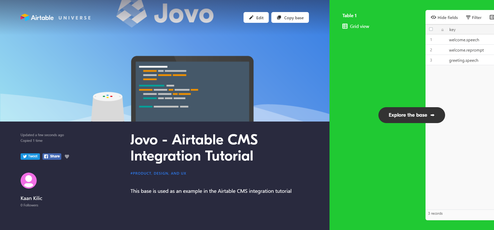
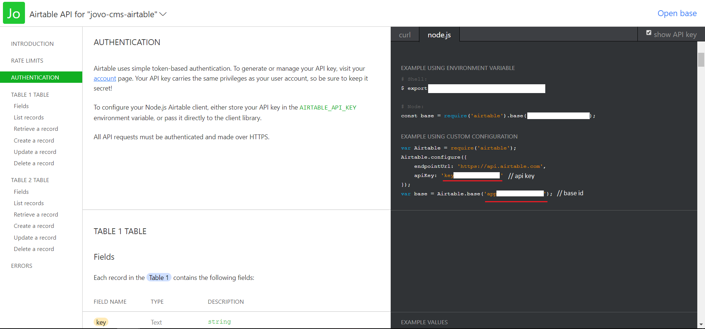

# Use Airtable as CMS for your Voice App


Learn how to use Airtable as a content management system (CMS) for your Alexa Skills and Google Actions with the Jovo CMS integrations.

> [You can find the full example code on GitHub]([TODO](https://github.com/jovotech/jovo-templates/tree/master/tutorials/airtable-helloworld))

* [Introduction](#introduction)
  * [Why a CMS?](#why-a-cms)
  * [Why Airtable?](#why-airtable)
* [Preparing the Airtable Base](#preparing-the-airtable-base)
* [Using the Jovo Airtable CMS Integration](#using-the-jovo-airtable-cms-integration)
  * [Installation](#installation)
  * [Configuration](#configuration)
  * [Accessing the Content](#accessing-the-content)
* [Next Steps](#next-steps)

## Introduction

### Why a CMS?

Right now, most people manage the content of their Alexa Skills and Google Actions in the code. This lets you start building out the functionality quickly without having to care about integrating external systems. Plus, Jovo offers an [i18next integration that allows you to localize content right from a JSON file](https://www.jovo.tech/docs/output/i18n).

However, with growing teams working on voice apps for Alexa and Google Assistant, changes are becoming higher that content is managed from a variety of people that don't necessarily have access to the code. Also, for adding fresh new content, or even doing minor changes, redeploying the complete code base can seem like a tedious task.

With the [Jovo CMS Integrations](https://www.jovo.tech/docs/cms), we want to remove that hurdle and help people work on content more collaboratively.

### Why Airtable?

Here are some reasons for using Airtable for content:
* it's a combination of a spreadsheet and a database giving you the best of both worlds
* Airtable has all the collaboration and permission features already built in
* You can create several tables (displayed as tabs) in one base, allowing you to manage several content types (we offer different [Table Types](https://www.jovo.tech/docs/v2/cms/google-sheets#default-sheet-types) for this)

Let's get started with Google Sheets and Jovo.

## Preparing the Airtable Base

First, we need to prepare a Airtable Base and add some content. We will just use a `responses` table that includes a `key` and a locale (in our case `en` for English).

[](https://airtable.com/universe/expxmfYnpMcqcGUx9/jovo-airtable-cms-integration-tutorial)

To use it for yourself, click `Copy base` at the top to save it to your workspace.

You can edit the content as much as you want.

## Using the Jovo Airtable CMS Integration

In this section, we will integrate the Airtable Base with a Jovo voice app in three simple steps:

* [Installation](#installation)
* [Configuration](#configuration)
* [Accessing the Content](#accessing-the-content)

> You can find the full documentation here: [Jovo Airtable CMS Integration](https://www.jovo.tech/docs/cms/airtable).

### Installation

> This integration works with Jovo v2. [Learn how to migrate from a v1 project here](https://www.jovo.tech/docs/v2/installation/v1-migration).

To get started, we need to enable the Airtable integration.

```sh
## Optional: Create a new Jovo project, if you don't have one already
$ jovo new <directory>
$ cd <directory>

# Download the npm package
$ npm install --save jovo-cms-airtable
```

In your `app.js` file, register it with the `use` command:

```javascript
// app.js

const { AirtableCMS } = require('jovo-cms-airtable');

app.use(new AirtableCMS());
```

### Configuration

To use the Airtable integration you need to provide both your api key and the id of the base you want to use.

You can find both of them by going over to [airtable.com/api](https://airtable.com/api), selecting the base you copied earlier and scrolling down to `Authentication`:



You can simply add the following to your `config.js` file in the `src` folder:

```javascript
// config.js

cms: {
    AirtableCMS: {
        apiKey: '<api-key>',
        baseId: '<base-id>',
        tables: [
            {
                name: 'responses',
                table: 'Responses',
                type: 'Responses'
            },
        ]
    }
},
```

> Don't forget to add your own `apiKey` and `baseId`

The Airtable integration allows you to add several different tables of various table types. For this example, we're just going to use the `Responses` table type.

> [Learn everything about Table configuration here](https://www.jovo.tech/docs/cms/airtable).

### Accessing the Content

Now let's take a look at the `app.js` file in the `src` folder. Because we're using the [`Responses` table type](https://www.jovo.tech/docs/cms/airtable#responses), you can access the content strings with the `this.('key')` method:

```javascript
// Instead of this
HelloWorldIntent() {
    this.ask('Hello World! What\'s your name?', 'Please tell me your name.');
},

// Use this
HelloWorldIntent() {
    this.ask(this.t('welcome.speech'), this.t('welcome.reprompt'));
},
```

If you want to pass additional parameters, you can add them as an object:

```javascript
// Instead of this
MyNameIsIntent() {
        this.tell('Hey ' + this.$inputs.name.value + ', nice to meet you!');
    },

// Use this
MyNameIsIntent() {
    this.tell(this.t('greeting.speech', { name: this.$inputs.name.value }));
},
```

> [Learn more about i18n here](https://www.jovo.tech/docs/output/i18n).

## Next Steps

That's it! If you now test it, you should be able to get the responses you defined in Airtable.

You can test it locally by using the following command:

```sh
$ jovo run
```

There are lots of additional things you can do with this integration, which we are going to focus on in upcoming tutorials.

For example:

* You can use additional Sheet Types ([find the docs here](https://www.jovo.tech/docs/cms/airtable#default-table-types))

**Any questions? Please let us know in the comments below 👇. You can also reach us on [Twitter](https://twitter.com/jovotech) or [Slack](https://www.jovo.tech/slack).**

<!--[metadata]: { "description": "Learn how to use Airtable as a content management system (CMS) for your Alexa Skills and Google Actions with Jovo.", "author": "kaan-kilic", "tags": "Airtable, CMS", "og-image": "TODO" }-->