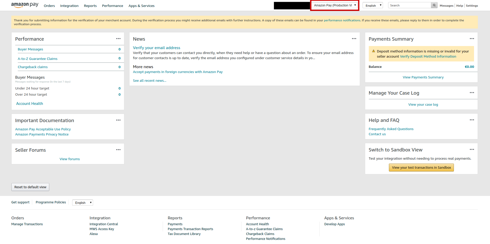
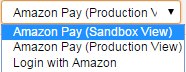
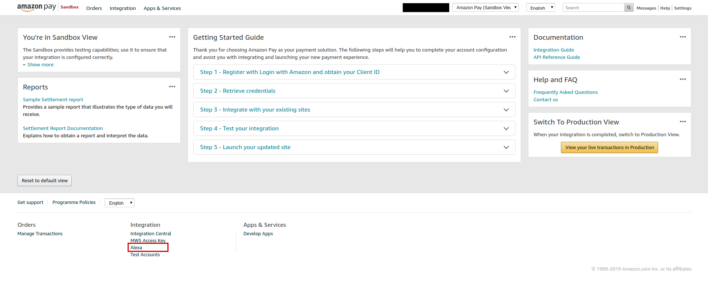
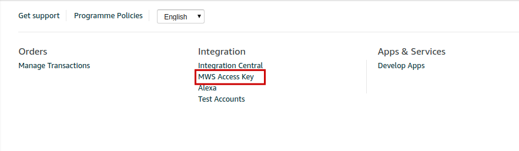
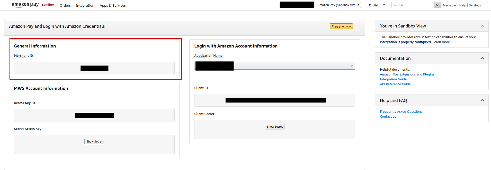
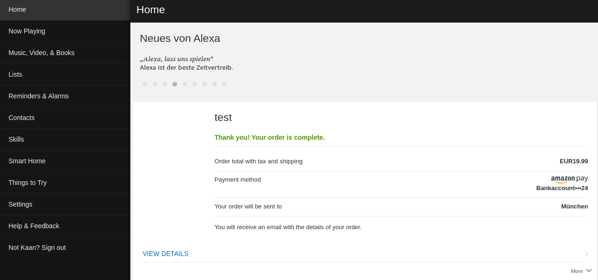

# Use Amazon Pay with Jovo

Learn how to make money with your Alexa Skills by selling physical goods with Amazon Pay and the Jovo Framework.

> If you are more interested in selling digital goods, check out our tutorial on [In-Skill-Purchasing (ISP)](https://www.jovo.tech/tutorials/alexa-in-skill-purchasing)

* [Introduction](#introduction)
* [Setting up your Amazon Pay Account](#setting-up-your-amazon-pay-account)
* [Implementing Amazon Pay in Jovo](#implementing-amazon-pay-in-jovo)
  * [General Outline of the Skill](#general-outline-of-the-skill)
  * [Setup Directive](#setup-directive)
  * [Charge Directive](#charge-directive)
  * [Saving Transaction Data](#saving-transaction-data)
  * [Cancel and Refund](#cancel-and-refund)
  * [Buyer ID](#buyer-id)
  * [Shipping Address](#shipping-address)
* [Conclusion](#conclusion)

## Introduction

If you want to sell physical products, everything from t-shirts to concert tickets, with your Alexa Skill, Amazon Pay is your best bet. It allows your user to make purchases using their payment and shipping information on their Amazon account, providing the most seamless user experience.

The tutorial is divided into two parts. In the first one you will setup our Amazon Pay account. The second one will focus on actual implementation of the skill logic.

> Through out the tutorial, I will not include any of the basic steps like creating a new Jovo project or deploying it. If you need a small refresher, check out the documentation on [Project Lifecycle](https://www.jovo.tech/docs/project-lifecycle)

> You can find the template containing the code in both Javascript and Typescript [here](https://github.com/jovotech/jovo-templates/tree/master/alexa/pay).

## Setting your Amazon Pay Account

First of all, you have to register as an Amazon Pay merchant. Simply follow the link for your respective region:

* In Austria: https://pay.amazon.com/at/merchant
* In France: https://pay.amazon.fr/merchant
* In Germany: https://pay.amazon.de/sicheres-bezahlen
* In Ireland: https://pay.amazon.ie/merchant
* In Italy: https://pay.amazon.it/merchant
* In Japan: https://pay.amazon.com/jp/merchant
* In Spain: https://pay.amazon.es/merchant
* In the UK: https://pay.amazon.co.uk/secure-checkout
* In the US: https://pay.amazon.com/us/secure-checkout

After you've created your account, open the Amazon Seller Central:

* EU Seller Central: https://sellercentral-europe.amazon.com/
* JP Seller Central: https://sellercentral-japan.amazon.com/
* UK Seller Central: https://sellercentral.amazon.co.uk/
* US Seller Central: https://sellercentral.amazon.com/

For testing purposes, switch to the Sandbox mode:





After that, you have to connect your Alexa Skill to your Amazon Pay account. Click on **Alexa** under **Integration** at the bottom of the page:



Now, select **Connect an Alexa Skill** and enter your skill's ID.

You also need to get your Seller ID (also called Merchant ID). You can find it under **MWS Access Key**:





Last but not least, you have to setup a test account. Simply follow the quick tutorial here: [Link](https://developer.amazon.com/docs/amazon-pay-onetime/setting-up-test-account.html)

Now that you're done with that, we can switch over to the actual code part.

## Implementing Amazon Pay in Jovo

First, add Amazon Pay to your skill's list of necessary permissions. You can do that in your [project.js](https://www.jovo.tech/docs/project-js) file:

```js
// project.js

module.exports = {
  alexaSkill: {
    nlu: 'alexa',
    manifest: {
      permissions: [
        {
          name: 'payments:autopay_consent'
        }
      ]
    },
  },
  endpoint: '${JOVO_WEBHOOK_URL}',
};
```


### General Outline of the Skill

Our Skill will have a really simple interaction path. At launch we ask whether the user wants to buy a t-shirt for $19.99. If they say yes, we start the transaction. If they no, we end the session. Lets implement that first:

First, add the `YesIntent` and `NoIntent` to the language model:

```js
// models/en-US.json

{
  "invocation": "my test app",
  "intents": [
    {
      "name": "YesIntent",
      "phrases": [
        "yes",
        "yep",
        "ok",
        "yeah"
      ],
      "alexa": {
        "name": "AMAZON.YesIntent",
        "samples": []
      }
    },
    {
      "name": "NoIntent",
      "phrases": [
        "no",
        "nope",
        "na"
      ],
      "alexa": {
        "name": "AMAZON.NoIntent",
        "samples": []
      }
    }
  ],
  // rest of the language model
}
```

Now the handler logic:

```js
// src/app.js

app.setHandler({
  LAUNCH() {
    return this.ask('Welcome to my store. Would you like to buy a t-shirt for 19.99 Euro?');
  },

  /**
   * User wants to buy a t-shirt
   */
  YesIntent() {
    // TODO: Amazon Pay transaction
  },

  /**
   * User doesn't want to buy a t-shirt
   */
  NoIntent() {
    return this.tell('Ok, see you next time');
  },
});
```

Before we can start the transaction in the `YesIntent`, we have to first check whether the user enabled the Amazon Pay permission. If they did not, we send them a permission card:

```js
YesIntent() {
  if (this.$alexaSkill.isAmazonPayPermissionDenied()) {
    this.$alexaSkill.showAskForAmazonPayPermissionCard();
    return this.tell('Please provide the permission to use Amazon Pay using the card I\'ve send to your Alexa app and restart the skill.');
  }
}
```

Now, lets take a look at the Amazon Pay implementation. The two main components are the **Setup** and **Charge** directive.

### Setup Directive

The Setup directive is used to get a billing agreement. It's the confirmation that the customer opted in to pay using Amazon Pay.

In our case, the directive will look the following:

```js
const setupDirective = {
  type: 'Connections.SendRequest',
  name: 'Setup',
  payload: {
    '@type': 'SetupAmazonPayRequest',
    '@version': '2',
    sellerId: 'ADD YOUR SELLER/MERCHANT ID HERE', // TODO
    countryOfEstablishment: 'DE', // TODO
    ledgerCurrency: 'EUR', // TODO
    checkoutLanguage: 'en_US',
    billingAgreementAttributes: {
      '@type': 'BillingAgreementAttributes',
      '@version': '2',
      billingAgreementType: 'CustomerInitiatedTransaction', // TODO EU merchants only
      sellerNote: 'Billing Agreement Seller Note',
      sellerBillingAgreementAttributes: {
        '@type': 'SellerBillingAgreementAttributes',
        '@version': '2',
        storeName: 'Test store name',
        customInformation: 'Test custom information',
      }
    },
    needAmazonShippingAddress: true,
    sandboxMode: true,
    sandboxCustomerEmailId: 'ADD YOUR TEST ACCOUNT\'s EMAIL HERE' // TODO
  },
  token: 'token'
};

return this.$alexaSkill.addDirective(setupDirective);
```

Some of the directive's values have to be replaced. First, you have to add your own `sellerId` and `sandboxCustomerEmailId` (the email of the test account you created earlier). Second, depending on your location you have to change the `countryOfEstablishment`, `ledgerCurrency`, and `billingAgreementType` (only needed if you're an EU merchant). All of these are marked by a `TODO` comment.

You can find the detailed explanation of every attribute in the official [documentation](https://developer.amazon.com/en-US/docs/alexa/amazon-pay-alexa/amazon-pay-apis-for-alexa.html#setup).

That's all we need for both the Setup directive and our `YesIntent`:

```js
YesIntent() {
  if (this.$alexaSkill.isAmazonPayPermissionDenied()) {
    this.$alexaSkill.showAskForAmazonPayPermissionCard();
    return this.tell('Please provide the permission to use Amazon Pay using the card I\'ve send to your Alexa app and restart the skill.');
  } else {
    const setupDirective = {
      type: 'Connections.SendRequest',
      name: 'Setup',
      payload: {
        '@type': 'SetupAmazonPayRequest',
        '@version': '2',
        sellerId: 'ADD YOUR SELLER/MERCHANT ID HERE', // TODO
        countryOfEstablishment: 'DE', // TODO
        ledgerCurrency: 'EUR', // TODO
        checkoutLanguage: 'en_US',
        billingAgreementAttributes: {
          '@type': 'BillingAgreementAttributes',
          '@version': '2',
          billingAgreementType: 'CustomerInitiatedTransaction', // TODO EU merchants only
          sellerNote: 'Billing Agreement Seller Note',
          sellerBillingAgreementAttributes: {
            '@type': 'SellerBillingAgreementAttributes',
            '@version': '2',
            storeName: 'Test store name',
            customInformation: 'Test custom information',
          }
        },
        needAmazonShippingAddress: true,
        sandboxMode: true,
        sandboxCustomerEmailId: 'ADD YOUR TEST ACCOUNT\'s EMAIL HERE' // TODO
      },
      token: 'token'
    };

    return this.$alexaSkill.addDirective(setupDirective);
  }
},
```

The response to our Setup directive, if it's successful, looks like this:

```js
{
  "billingAgreementDetails": {
    "billingAgreementId": "C01-0000002-0000003",
    "creationTimestamp": "2018-03-24T00:31:57.352Z",
    "destination": {
      "addressLine1": "1234 Main Street",
      "city": "CUPERTINO",
      "countryCode": "US",
      "name": "Jane Doe",
      "phone": "1111122222",
      "postalCode": "90000",
      "stateOrRegion": "CA"
    },
    "billingAddress": {
      "addressLine1": "1234 Main Street",
      "city": "Seattle",
      "countryCode": "US",
      "name": "Jane Doe",
      "phone": "1111122222",
      "postalCode": "98104",
      "stateOrRegion": "WA"
    },
    "checkoutLanguage": "en_US",
    "billingAgreementStatus": "OPEN",
    "releaseEnvironment": "SANDBOX"
  }
}
```

The response will always be routed to the `ON_PURCHASE` intent.

Besides the response of the Setup directive, the responses to both Amazon Pay's Charge and In-Skill-Purchase directives are routed to this intent. For that reason, we have to first distinguish which type of response it is, before we can handle it:

```js
  ON_PURCHASE() {
    const request = this.$request.toJSON();

    if (request.request.name === 'Setup') {
      // handle setup directive response
    } else {
      
    }
  },
```

The Setup directive's response will be handled by sending out a Charge directive, which is the actual transaction.

We will add the logic to handle the response in a different file, so we don't bloat the `ON_PURCHASE` intent. For that, add a new `amazonPay.js` file to the `src` folder. Inside that file, we will have a function called `handleSetupResponse()` which we parse the `Jovo` object to:

```js
// src/amazonPay.js

function handleSetupResponse(jovo) {

}
```

First, we have to check if we got an error:

```js
// src/amazonPay.js

function handleSetupResponse(jovo) {
  const request = jovo.$request.toJSON();
  const responseStatusCode = request.request.status.code;

  if (responseStatusCode != 200) {
    /**
     * Check the documentation on how to handle each reason:
     * https://developer.amazon.com/en-US/docs/alexa/amazon-pay-alexa/payment-declines-and-processing-errors.html
     */
    console.log(request.request);
    return jovo.tell('There was an error. Check the logs');
  }
}
```

If that's not the case, we can now send the Charge directive.

### Charge Directive

This directive triggers the actual transaction. The money is captured and the user receives a confirmation card in the Alexa app containing the transaction's details (price, store name, etc.).

Here's our Charge directive:

```js
const sellerOrderId = helper.generateRandomString(9);
const authorizationReferenceId = helper.generateRandomString(9);
const amount = '19.99';
const currencyCode = 'EUR';

const payload = request.request.payload;

const chargeDirective = {
  type: 'Connections.SendRequest',
  name: 'Charge',
  payload: {
    '@type': 'ChargeAmazonPayRequest',
    '@version': '2',
    sellerId: 'YOUR SELLER/MERCHANT ID', // TODO
    billingAgreementId: payload.billingAgreementDetails.billingAgreementId,
    paymentAction: 'AuthorizeAndCapture',
    authorizeAttributes: {
      '@type': 'AuthorizeAttributes',
      '@version': '2',
      authorizationReferenceId,
      authorizationAmount: {
        '@type': 'Price',
        '@version': '2',
        amount,
        currencyCode
      },
      transactionTimeout: 0,
      sellerAuthorizationNote: 'Test Seller Authorization Note'
    },
    sellerOrderAttributes: {
      '@type': 'SellerOrderAttributes',
      '@version': '2',
      storeName: 'Test Store Name',
      customInformation: 'Test custom information',
      sellerNote: 'Test seller note',
      sellerOrderId // should be saved in db. Otherwise can't follow up on support requests
    }
  },
  token: 'correlationToken'
};
```

Again, you have to add your own `sellerId` to the directive. Besides that, there are multiple new attributes. Some of these are optional, some are required. You should have a look at the official Amazon [documentation](https://developer.amazon.com/en-US/docs/alexa/amazon-pay-alexa/amazon-pay-apis-for-alexa.html#charge-1) to get a better understanding of each attribute. 

Some of the attributes, namely `sellerOrderId`, `authorizationReferenceId` are randomly generated ID's by a helper function. But, that's not the optimal solution, because we don't check whether the values are unique or not. But, it's enough for a tutorial.

Now, our `handleSetupResponse()` looks like this:

```js
function handleSetupResponse(jovo) {
  const request = jovo.$request.toJSON();
  const responseStatusCode = request.request.status.code;

  if (responseStatusCode != 200) {
    /**
     * Check the documentation on how to handle each reason:
     * https://developer.amazon.com/en-US/docs/alexa/amazon-pay-alexa/payment-declines-and-processing-errors.html
     */
    console.log(request.request);
    return jovo.tell('There was an error. Check the logs');
  }
  const sellerOrderId = helper.generateRandomString(9);
  const authorizationReferenceId = helper.generateRandomString(9);
  const amount = '19.99';
  const currencyCode = 'EUR';

  const payload = request.request.payload;

  const chargeDirective = {
    type: 'Connections.SendRequest',
    name: 'Charge',
    payload: {
      '@type': 'ChargeAmazonPayRequest',
      '@version': '2',
      sellerId: 'A39B4X8QQFPFSV',
      billingAgreementId: payload.billingAgreementDetails.billingAgreementId,
      paymentAction: 'AuthorizeAndCapture',
      authorizeAttributes: {
        '@type': 'AuthorizeAttributes',
        '@version': '2',
        authorizationReferenceId,
        authorizationAmount: {
          '@type': 'Price',
          '@version': '2',
          amount,
          currencyCode
        },
        transactionTimeout: 0,
        sellerAuthorizationNote: 'Test Seller Authorization Note'
      },
      sellerOrderAttributes: {
        '@type': 'SellerOrderAttributes',
        '@version': '2',
        storeName: 'Test Store Name',
        customInformation: 'Test custom information',
        sellerNote: 'Test seller note',
        sellerOrderId // should be saved in db. Otherwise can't follow up on support requests
      }
    },
    token: 'correlationToken'
  };

  return jovo.$alexaSkill.addDirective(chargeDirective);
}
```

The response to the Charge directive will be routed to the `ON_PURCHASE` intent:

```js
ON_PURCHASE() {
  const request = this.$request.toJSON();

  if (request.request.name === 'Setup') { // response to setup directive
    return amazonPay.handleSetupResponse(this);
  } else if (request.request.name === 'Charge') { // response to charge directive
    return amazonPay.handleChargeResponse(this);
  } else {
    // In-Skill_Purchase responses are also routed to ON_PURCHASE.
    // should be handled as well if you use the feature.
  }
},
```

Again, we place the logic into the `amazonPay.js` file. This time, we don't send out another directive but rather just check whether the Charge directive was successful or not. If it was, we simply tell the user that the order is complete and end the session.

For this directive there are two types of "errors". First, actual errors. Second, the directive was declined.

```js
function handleChargeResponse(jovo) {
  const request = jovo.$request.toJSON();
  const responseStatusCode = request.request.status.code;
  if (responseStatusCode != 200) {
    /**
     * Check the documentation on how to handle each reason:
     * https://developer.amazon.com/en-US/docs/alexa/amazon-pay-alexa/payment-declines-and-processing-errors.html
     */
    console.log(request.request);
    return jovo.tell('There was an error. Check the logs');
  }

  const payload = request.request.payload;
  if (payload.authorizationDetails.state === 'Declined') {
    console.log(payload);
    /**
     * Check the documentation on how to handle each reason:
     * https://developer.amazon.com/en-US/docs/alexa/amazon-pay-alexa/payment-declines-and-processing-errors.html#decline-handling
     */
    return jovo.tell('There was an error processing your order. Please try again later');
  } else {

    return jovo.tell('Your order for a t shirt for 19.99 Euro is complete. You will receive an email and card in your Alexa app with the details');
  }
}
```

After the order is complete, your user will automatically receive a card with the details:



<details>
<summary>View complete content of the amazonPay.js file up until now</summary>

```js
const helper = require('./helper');

/**
 * 
 * @param {Jovo} jovo 
 */
function handleChargeResponse(jovo) {
  const request = jovo.$request.toJSON();
  const responseStatusCode = request.request.status.code;
  if (responseStatusCode != 200) {
    /**
     * Check the documentation on how to handle each reason:
     * https://developer.amazon.com/en-US/docs/alexa/amazon-pay-alexa/payment-declines-and-processing-errors.html
     */
    console.log(request.request);
    return jovo.tell('There was an error. Check the logs');  
  }

  const payload = request.request.payload;
  if (payload.authorizationDetails.state === 'Declined') {
    console.log(payload);
    /**
     * Check the documentation on how to handle each reason:
     * https://developer.amazon.com/en-US/docs/alexa/amazon-pay-alexa/payment-declines-and-processing-errors.html#decline-handling
     */
    return jovo.tell('There was an error processing your order. Please try again later');
  } else {

    return jovo.tell('Your order for a t shirt for 19.99 Euro is complete. You will receive an email and card in your Alexa app with the details');
  }
}

function handleSetupResponse(jovo) {
  const request = jovo.$request.toJSON();
  const responseStatusCode = request.request.status.code;

  if (responseStatusCode != 200) {
    /**
     * Check the documentation on how to handle each reason:
     * https://developer.amazon.com/en-US/docs/alexa/amazon-pay-alexa/payment-declines-and-processing-errors.html
     */
    console.log(request.request);
    return jovo.tell('There was an error. Check the logs');  
  }

  const sellerOrderId = helper.generateRandomString(9);
  const authorizationReferenceId = helper.generateRandomString(9);
  const amount = '19.99';
  const currencyCode = 'EUR';

  const payload = request.request.payload;

  const chargeDirective = {
    type: 'Connections.SendRequest',
    name: 'Charge',
    payload: {
      '@type': 'ChargeAmazonPayRequest',
      '@version': '2',
      sellerId: 'A39B4X8QQFPFSV',
      billingAgreementId: payload.billingAgreementDetails.billingAgreementId,
      paymentAction: 'AuthorizeAndCapture',
      authorizeAttributes: {
        '@type': 'AuthorizeAttributes',
        '@version': '2',
        authorizationReferenceId,
        authorizationAmount: {
          '@type': 'Price',
          '@version': '2',
          amount,
          currencyCode
        },
        transactionTimeout: 0,
        sellerAuthorizationNote: 'Test Seller Authorization Note'
      },
      sellerOrderAttributes: {
        '@type': 'SellerOrderAttributes',
        '@version': '2',
        storeName: 'Test Store Name',
        customInformation: 'Test custom information',
        sellerNote: 'Test seller note',
        sellerOrderId // should be saved in db. Otherwise can't follow up on support requests
      }
    },
    token: 'correlationToken'
  };

  return jovo.$alexaSkill.addDirective(chargeDirective);
}

module.exports = {
  handleChargeResponse,
  handleSetupResponse,
  canShipToUser
}
```

</details>

<details>
<summary>View the whole content of the app.js file up until now</summary>

```js
'use strict';

// ------------------------------------------------------------------
// APP INITIALIZATION
// ------------------------------------------------------------------

const { App } = require('jovo-framework');
const { Alexa } = require('jovo-platform-alexa');
const { JovoDebugger } = require('jovo-plugin-debugger');
const { FileDb } = require('jovo-db-filedb');

const amazonPay = require('./amazonPay');
const helper = require('./helper');

const app = new App();

app.use(
  new Alexa(),
  new JovoDebugger(),
  new FileDb(),
);


// ------------------------------------------------------------------
// APP LOGIC
// ------------------------------------------------------------------

app.setHandler({
  LAUNCH() {
    return this.ask('Welcome to my store. Would you like to buy a t-shirt for 19.99 Euro?');
  },

  /**
   * User wants to buy a t shirt
   */
  YesIntent() {
    if (this.$alexaSkill.isAmazonPayPermissionDenied()) {
      this.$alexaSkill.showAskForAmazonPayPermissionCard();
      return this.tell('Please provide the permission to use Amazon Pay using the card I\'ve send to your Alexa app and restart the skill.');
    } else {
      const setupDirective = {
        type: 'Connections.SendRequest',
        name: 'Setup',
        payload: {
          '@type': 'SetupAmazonPayRequest',
          '@version': '2',
          sellerId: 'ADD YOUR SELLER/MERCHANT ID HERE', // TODO
          countryOfEstablishment: 'DE', // TODO
          ledgerCurrency: 'EUR', // TODO
          checkoutLanguage: 'en_US',
          billingAgreementAttributes: {
            '@type': 'BillingAgreementAttributes',
            '@version': '2',
            billingAgreementType: 'CustomerInitiatedTransaction', // TODO EU merchants only
            sellerNote: 'Billing Agreement Seller Note',
            sellerBillingAgreementAttributes: {
              '@type': 'SellerBillingAgreementAttributes',
              '@version': '2',
              storeName: 'Test store name',
              customInformation: 'Test custom information',
            }
          },
          needAmazonShippingAddress: true,
          sandboxMode: true,
          sandboxCustomerEmailId: 'ADD YOUR TEST ACCOUNT\'s EMAIL HERE' // TODO
        },
        token: 'token'
      };

      return this.$alexaSkill.addDirective(setupDirective);
    }
  },

  /**
   * User doesn't want to buy a t shirt
   */
  NoIntent() {
    return this.tell('Ok, see you next time');
  },

  /**
   * Responses to the `Setup` and `Charge` directive are routed to the `ON_PURCHASE` intent
   */
  ON_PURCHASE() {
    const request = this.$request.toJSON();

    if (request.request.name === 'Setup') { // response to setup directive
      return amazonPay.handleSetupResponse(this);
    } else if (request.request.name === 'Charge') { // response to charge directive
      return amazonPay.handleChargeResponse(this);
    } else {
      // In-Skill_Purchase responses are also routed to ON_PURCHASE.
      // should be handled as well.
    }
  },
});


module.exports.app = app;
```

</details>

### Saving Transaction Data

Throughout the whole transaction process we encountered data that should better be saved. They might come in handy on refund requests for example. While there are multiple approaches to this, we will simply add data of every order to the database record of the user.

The attributes we will persist are:

* productId
* orderId
* billingAgreementId
* authorizationReferenceId

We update the `handleSetupResponse()` function to also save the data in a `order` object:

```js
function handleSetupResponse(jovo) {
  const request = jovo.$request.toJSON();
  const responseStatusCode = request.request.status.code;

  if (responseStatusCode != 200) {
    /**
     * Check the documentation on how to handle each reason:
     * https://developer.amazon.com/en-US/docs/alexa/amazon-pay-alexa/payment-declines-and-processing-errors.html
     */
    console.log(request.request);
    return jovo.tell('There was an error. Check the logs');
  }
  const sellerOrderId = helper.generateRandomString(9);
  const authorizationReferenceId = helper.generateRandomString(9);
  const amount = '19.99';
  const currencyCode = 'EUR';

  const payload = request.request.payload;

  const chargeDirective = {
    // directive...
  };

  jovo.$user.$data.order = {
    id: sellerOrderId,
    productId: '000001', // in your own skill you need a system to identify each product.
    billingAgreementId: payload.billingAgreementDetails.billingAgreementId,
    authorizationReferenceId
  }

  return jovo.$alexaSkill.addDirective(chargeDirective);
}
```

In the `handleChargeResponse()` function we add `order` object to an array and delete it.

```js
function handleChargeResponse(jovo) {
  const request = jovo.$request.toJSON();
  const responseStatusCode = request.request.status.code;
  if (responseStatusCode != 200) {
    /**
     * Check the documentation on how to handle each reason:
     * https://developer.amazon.com/en-US/docs/alexa/amazon-pay-alexa/payment-declines-and-processing-errors.html
     */
    console.log(request.request);
    return jovo.tell('There was an error. Check the logs');
  }

  const payload = request.request.payload;
  if (payload.authorizationDetails.state === 'Declined') {
    console.log(payload);
    /**
     * Check the documentation on how to handle each reason:
     * https://developer.amazon.com/en-US/docs/alexa/amazon-pay-alexa/payment-declines-and-processing-errors.html#decline-handling
     */
    return jovo.tell('There was an error processing your order. Please try again later');
  } else {
    if (!jovo.$user.$data.orders) {
      jovo.$user.$data.orders = [jovo.$user.$data.order];
    } else {
      jovo.$user.$data.orders.push(jovo.$user.$data.order);
    }

    delete jovo.$user.$data.order;

    return jovo.tell('Your order for a t shirt for 19.99 Euro is complete. You will receive an email and card in your Alexa app with the details');
  }
}
```

### Cancel and Refund

You also have to provide the user with a way to cancel the order or to request a refund. For that, we add two new intents to our language model:

```js
{
  "name": "CancelOrderIntent",
  "phrases": [
    "cancel my order",
    "i want to cancel my order",
    "i would like to cancel my order",
    "please cancel my order",
    "cancel order",
    "cancel the order",
    "cancel the previous order"
  ]
},
{
  "name": "RefundOrderIntent",
  "phrases": [
    "refund my order",
    "request a refund",
    "I would like to get a refund",
    "refund the previous order"
  ]
},
```

When these intents are called, we will simply tell the user that they should send an email with the order ID. You could also add the refund/cancel logic to the Skill, but that's up to you.

```js
CancelOrderIntent() {
  this.showSimpleCard('Cancel Your Order', 'To cancel your order send an email to help@mail.com');
  return this.tell('To cancel your order send an email to help at mail dot com with your order id. I\'ve send the details to your Alexa app');
},

RefundOrderIntent() {
  this.showSimpleCard('Refund Your Order', 'To request a refund send an email to help@mail.com');
  return this.tell('To request a refund send an email to help at mail dot com with your order id. I\'ve send the details to your Alexa app');
},
```

### Buyer ID

The Amazon Pay API allows one to uniquely identify one of its users. You can use that to identify the same customer on different platforms (e.g. Web and Alexa). Although we won't use it in this tutorial, I wanted to take a quick moment to introduce the feature.

To access your user's buyer ID use the `getBuyerId()` helper function:

```js
const { buyerId } = await this.$alexaSkill.$user.getBuyerId();
```

The buyer ID stays the same even if the user deactivates your Skill. Be aware that Amazon adds additional certification requirements if you use the buyer ID. You can read more about it [here](https://developer.amazon.com/en-US/docs/alexa/amazon-pay-alexa/certify-skill-with-amazon-pay.html#amazon-pay-buyer-id-requirements).

### Shipping Address

Last but not least, we want to add a small quality of life feature. Since, you probably don't support global shipping, you should check whether the user's shipping address is one where you can ship your item to.

Amazon provides us with an API, where we can get an array of all the user's addresses from. To access it, you use one of the framework's helper methods. There is `getBuyerAddress()` which returns the array of addresses and `getDefaultBuyerAddress()` which returns the default shipping address. Both functions expect the `sellerId` to be parsed as well as the `sandboxEmail` if sandbox mode is active:

```js
const options = {
  sellerId: 'YOUR SELLER ID', // TODO
  sandbox: true,
  sandboxEmail: 'YOUR TEST ACCOUNT EMAIL'
};

const response = await this.$alexaSkill.$user.getDefaultBuyerAddress(options);
```

Using the default shipping address we call another helper function that checks whether we can ship to that address or not. Again, for this tutorial it's just a placeholder since the implementation looks different for everybody:

```js
// src/app.js

async LAUNCH() {
  const options = {
    sellerId: 'YOUR SELLER ID',
    sandbox: true,
    sandboxEmail: 'YOUR TEST ACCOUNT EMAIL'
  };

  const response = await this.$alexaSkill.$user.getDefaultBuyerAddress(options);
  if (amazonPay.canShipToUser(response)) {
    return this.ask('Welcome to my store. Would you like to buy a t shirt for 19.99 Euro?');
  } else {
    return this.tell('I\'m sorry, we don\'t ship to your location. Have a nice day.')
  }
},
```

```js
// src/amazonPay.js

function canShipToUser(address) {
  // We can't provide a universal implementation here since it's different for every project.

  return true;
}
```

> You can find the template containing the code in both Javascript and Typescript [here](https://github.com/jovotech/jovo-templates/tree/master/alexa/pay).

## Conclusion

We've only scratched the surface of the whole topic, but that's all you need to know to get started. Actually creating a complete voice experience encompassing Amazon Pay takes a little more time. For example, you could setup the cancel/refund logic. You could add more products, which would open up a handful of new challenges.

But that should be it for now. 

**Any questions? You can reach us on [Twitter](https://twitter.com/jovotech) or [Slack](https://www.jovo.tech/slack).**

<!--[metadata]: { "description": "Learn how to make money with Alexa Skills by implementing the Amazon Pay feature with Jovo", "author": "kaan-kilic", "tags": "Amazon Alexa, Amazon Pay", "og-image": "" }-->
