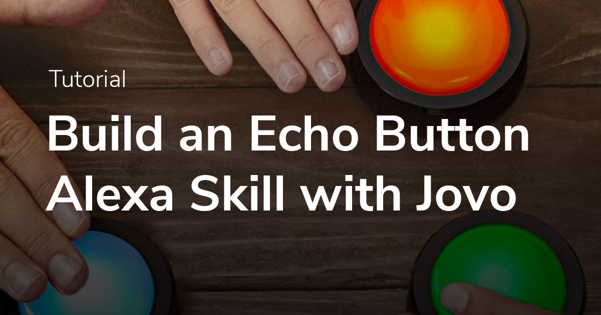
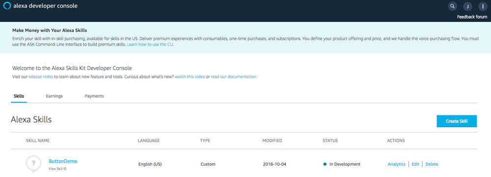
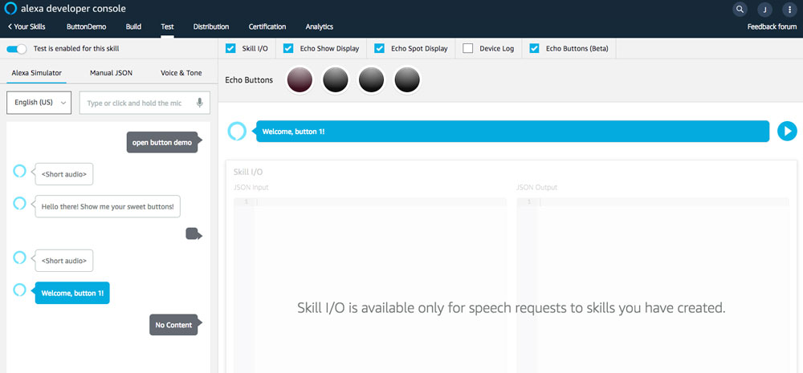

# Build an Alexa Skill with Echo Buttons



Learn how to build an Echo Buttons Alexa Skill with Jovo and the Alexa Game Controller and Gadgets API.

* [Introduction](#introduction)
* [Set up the Project](#set-up-the-project)
   * [Create new Project](#create-new-project)
   * [Project Configuration](#project-configuration)
   * [Deploy Project](#deploy-project)
   * [Test the Skill](#test-the-skill)
* [Understand the Code](#understand-the-code)
   * [Setting up the Game Engine](#setting-up-the-game-engine)
   * [Setting up the Gadget Controller](#seting-up-the-gadget-controller)
   * [Responding to Game Engine Events](#responding-to-game-engine-events)

## Introduction

With Jovo, you can build Alexa Skills that use the *Game Engine* ([Official Amazon Docs](https://developer.amazon.com/docs/custom-skills/game-engine-interface-reference.html), [Jovo Docs](https://www.jovo.tech/docs/amazon-alexa/game-engine)) and the *Gadget Controller Interfaces* ([Official Amazon Docs](https://developer.amazon.com/docs/custom-skills/gadget-controller-interface-reference.html), [Jovo Docs](https://www.jovo.tech/docs/amazon-alexa/gadget-controller)) of the Gadgets Skill API.

In this tutorial, we will use the Jovo `alexa/buttons` template to understand how Echo Buttons Alexa Skills work and how you can implement the interfaces into your own voice apps.

Actual Echo Buttons are not required to run this template, as they can be simulated in the Alexa developer console.


## Set up the Project

In this section, we will create and deploy a project that you can use to play with Button events.

The template contains:

* A language model (`models/en-US.json`) corresponding to the default one of a custom Skill, with the invocation name `button demo`
* App logic (`src/app.js`) that uses the Jovo implementation of the Gadgets Skill API for Amazon Alexa
* A demo implementation of:
  *  an input handler directive to define Gadget events
  *  a handler function to respond to these events
  *  gadget controller directives to control the LED lights of the Buttons
* A full [roll call](https://developer.amazon.com/docs/gadget-skills/discover-echo-buttons.html) is not in the scope of this template

### Create new Project

> You can find the source code of the template here: [alexa/buttons Jovo Template](https://github.com/jovotech/jovo-templates/tree/master/alexa/buttons)

To get started, create a new project from the `alexa/buttons` Jovo template:

```sh
$ jovo new <directory> --template alexa/buttons
```

A new folder with the name you've chosen for `<directory>` is then created. Go into the project directory:

```sh
$ cd <directory>
```

### Project Configuration

To make use of the Game Engine and Gadget Controller interfaces, you need to enable certain configurations in the Alexa Skill's `skill.json` file.

The template comes with a pre-configured [project.js](https://www.jovo.tech/docs/project-js) file that does the job for you by using the `jovo build` command:

```sh
# Build Platform Files (for all platforms in project.js)
$ jovo build

# Alternative for only Alexa
$ jovo build -p alexaSkill
```

This will use the information in the `project.js` file to write the right information into the Alexa `skill.json` that will be used in the next step.

The Alexa-specific configuration in the `project.js` looks like this:

```javascript
// project.js

module.exports = {
   alexaSkill: {
        nlu: 'alexa',
        manifest: {
            publishingInformation: {
                gadgetSupport: {
                    maxGadgetButtons: 4,
                    numPlayersMax: 1,
                    minGadgetButtons: 1,
                    requirement: 'REQUIRED',
                    numPlayersMin: 1
                }
            },
            apis: {
                custom: {
                    interfaces: [
                        {
                            type: 'GAME_ENGINE'
                        },
                        {
                            type: 'GADGET_CONTROLLER'
                        }
                    ]
                }
            }
        }
   },
   // Other configurations
}
```

### Deploy Project

The Skill is ready to be deployed to the Amazon Developer console:

```sh
$ jovo deploy

# Alternative for only Alexa
$ jovo deploy -p alexaSkill
```

The Skill should now show up in your Alexa Developer Console:




### Test the Skill

The Skill is configured to use the Jovo Webhook as its HTTPS endpoint (the `endpoint` element in the `app.json` file), so your Jovo Webhook needs to be active in order to process requests.

```sh
# Run Jovo Webhook
$ jovo run
```

The default invocation name of the template is "button demo". There are two options to test the Skill:

* If you have actual Echo Buttons, you can use them to test the Skill on the device that they are paired with
* If you don't have Echo Buttons, you can test the Skill in the Amazon Developer console's test tab




## Understand the Code

Now that you have played with the Skill, lets dive into the technical implementation.

The logic of the Skill has three main parts:
* Defining which Gadget events to receive (i.e. setting up the game engine)
* Defining the light effects of the buttons up to where the pre-defined events happen (i.e. setting up the gadget controller)
* Reacting to Button presses (i.e. the events defined by the game engine)

### Setting up the Game Engine

The details of how the code works can be found in the comments of `app.js` ([find the file here](https://github.com/jovotech/jovo-templates/blob/master/alexa/buttons/src/app.js)), and here's a general outline.

Upon launching the Skill, we define which button events we want to receive. Technically, this means we have to set the input handler for the **Game Engine Interface** using the `jovo.$alexaSkill.$gameEngine` class.

First, we define a **recognizer** to recognize one type of button event. In this template, we only have one recognizer `buttonDownRecognizer` to recognize when a button is pressed down:

```js
const buttonDownRecognizer = this.$alexaSkill.$gameEngine
    .getPatternRecognizerBuilder('buttonDownRecognizer')
    .anchorEnd()
    .fuzzy(false)
    .pattern([
      {'action': 'down',}
    ]);
```
Now we can use this recognizer to define an **event** `buttonDownEvent` that we want to receive from the Button (i.e. the Game Engine interface):

```js
const buttonDownEvent = this.$alexaSkill.$gameEngine
    .getEventsBuilder('buttonDownEvent')
    .meets(['buttonDownRecognizer'])
    .reportsMatches()
    .shouldEndInputHandler(false)
    .build();
```

We also need a `timeoutEvent` to know when the designated time to press buttons has ended. This one uses the built-in `timed out` recognizer and ends the input handler, so that we receive no more Button events in this session.

```js
const timeoutEvent = this.$alexaSkill.$gameEngine
    .getEventsBuilder('timeoutEvent')
    .meets(['timed out'])
    .reportsNothing()
    .shouldEndInputHandler(true)
    .build();
```

Finally, we need to register our recognizer and the two events with the game engine. The `timeout` and `proxies` aren't relevant at this point.

```js
this.$alexaSkill.$gameEngine
    .setEvents([buttonDownEvents, timeoutEvents])
    .setRecognizers([buttonDownRecognizer])
    .startInputHandler(timeout, proxies);
```

### Setting up the Gadget Controller

For the lights, we need to set up one gadget controller object for each of the three events `'buttonUp'`, `'buttonDown'` and `none` (for when the button is not pressed). Note that these events do no correspond to the events defined for the game engine above, and cannot be configured!

For the easiest case of the button being pressed (`'buttonDown'` event), we want it to simply light up for one second in bright white color, without repetition:
```js
this.$alexaSkill.$gadgetController
    .setTriggerEvent('buttonDown')
    .setAnimations(
        [{
            "repeat": 1,
            "targetLights": ["1"],
            "sequence": [{
                "durationMs": 1000,
                "color": "ffffff",
                "blend": true
            }]
        }]
    )
    .setLight([], 0, []); // Let's ignore these parameters for now
```
We define exactly the same animation for the `'buttonUp'` event, to replace a default blue flash animation.

For when the button is idle, i.e. not (yet) pressed, we want a soft white pulsating animation. We create a single sequence of the animation by blending 500 miliseconds of black (`#000000`) and dark gray (`#111111`) each, and repeating it 20 times.

```js
this.$alexaSkill.$gadgetController
    .setNoneTriggerEvent()
    .setAnimations(
        [
            {
                'repeat': 20,
                'targetLights': ['1'],
                'sequence': [
                    {
                        'durationMs': 500,
                        'color': '111111',
                        'blend': true,
                    },
                    {
                        'durationMs': 500,
                        'color': '000000',
                        'blend': true,
                    },
                ],
            },
        ]
    )
    .setLight([], 0, []); // Let's ignore these parameters for now
```

Now we can add a text (with a sound effect) and send the request using either the `gameEngine` or the `gadgetController`'s `respond()` method. We can't use the regular `ask()` method at this point, because in the response, the `shouldEndSession` attribute has to be deleted.

```js
this.speech
    .addAudio('https://s3.amazonaws.com/ask-soundlibrary/ui/gameshow/amzn_ui_sfx_gameshow_intro_01.mp3')
    .addText('Hello there! Show me your sweet buttons!');

this.$alexaSkill.$gameEngine.respond(
    this.speech
);
```
### Responding to Game Engine Events

For processing button requests, the Jovo framework has a `ON_GAME_ENGINE_INPUT_HANDLER_EVENT()` handler. What it does is first to extract the event name, which is one of those we defined in the input handler (or game engine object) earlier, i.e. either `buttonDownEvent` or `timeoutEvent`.

The `timeoutEvent` is the easy case, in which we say goodbye and quit the demo:
```js
const inputEvent = this.$request.getEvents()[0];
const eventName = inputEvent.name;
console.log(`Event name: ${eventName}`);

if (
    eventName === 'timeoutEvent'
) {
    this.tell(
        'This was it. Thanks!'
        + `<audio src='https://s3.amazonaws.com/ask-soundlibrary/ui/gameshow/amzn_ui_sfx_gameshow_outro_01.mp3'/>`
    );
}
```

In case of the `buttonDownEvent`, there are two different cases we need to cover: Either a 'new' button is pressed for the first time, or a 'known' button has been pressed more then once.

In case of a new button, we assign it an index `buttonNumber` and add a greeting.

```js
this.speech
    .addAudio(
        `https://s3.amazonaws.com/ask-soundlibrary/ui/gameshow/amzn_ui_sfx_gameshow_player${buttonNumber}_01.mp3`
    )
    .addText(`Welcome, button ${buttonNumber}!`);
```

Now we change the button's animation by changing the configuration of the gadget controller for only the respective button, using the corresponding color from the `BUTTON_COLORS` array:

```js
this.$alexaSkill.$gadgetController
    .setNoneTriggerEvent()
    .setAnimations(
        [
            {
                'repeat': 20,
                'targetLights': ['1'],
                'sequence': [
                    {
                        'durationMs': 500,
                        'color': BUTTON_COLORS[buttonNumber - 1],
                        'blend': true,
                    },
                    {
                        'durationMs': 500,
                        'color': '000000',
                        'blend': true,
                    },
                ],
            },
        ]
    )
    .setLight(
        [buttonId], // This applies the new animation to only this button
        0,
        []
    );
```
This was it, now we can again send the response using the `this.$alexaSkill.$gadgetController.respond()` method .

**Short summary**: The input handler for the game engine we defined initially, as well as the gadget controller settings we made for the other buttons are still active. We only changed the idle animation of one single button.
We could also change the animations for the specific button's `'buttonUp'` and `'buttonDown'` event, but this is beyond the scope of this simple demo.

In case of a known button, don't make changes in the game engine or gadget controller settings at all, but only add a simple sound effect, delete the `shouldEndSession()` attribute and send the response.:
```js
this.speech.addAudio(
    'https://s3.amazonaws.com/ask-soundlibrary/ui/gameshow/amzn_ui_sfx_gameshow_neutral_response_02.mp3'
);
this.$alexaSkill.$gadgetController.respond(
    this.speech
);
```

For the `timeoutEvent`, we simply send a goodbye message and end the session:
```js
this.speech
    .addText('This was it. Thanks!')
    .addAudio('https://s3.amazonaws.com/ask-soundlibrary/ui/gameshow/amzn_ui_sfx_gameshow_outro_01.mp3');
this.tell(
    this.speech
);
```

Congratulations on building your first Echo Button Skill! :)


<!--[metadata]: { "description": "Learn how to build an Echo Buttons Alexa Skill with Jovo and the Alexa Game Controller and Gadgets API.", "author": "florian-hollandt", "tags": "Amazon Alexa, Echo Buttons", "og-image": "https://www.jovo.tech/img/tutorials/alexa-echo-buttons/alexa-echo-buttons.jpg"  }-->
