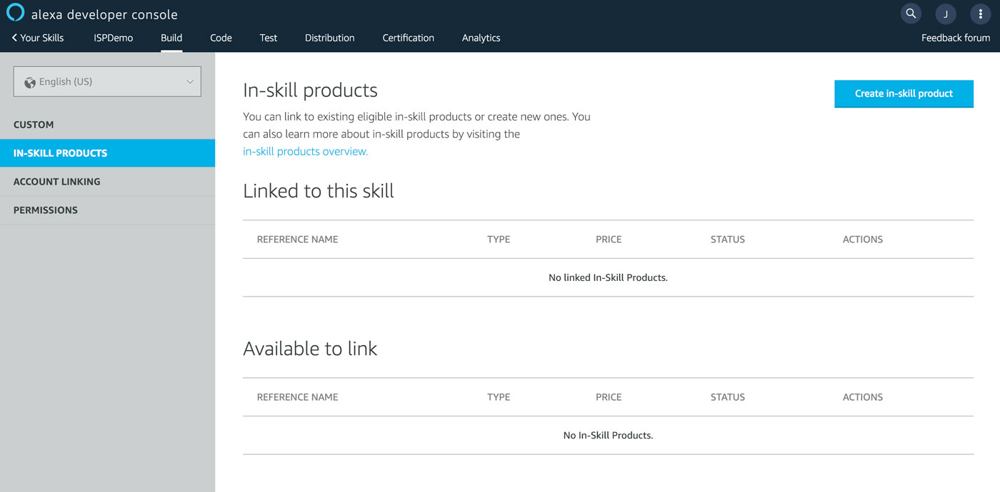
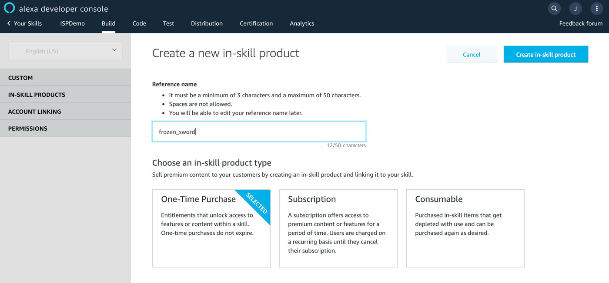
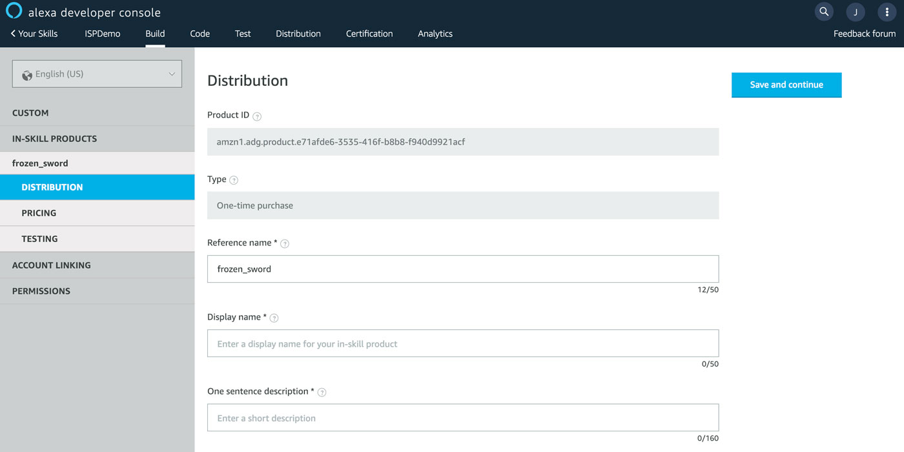
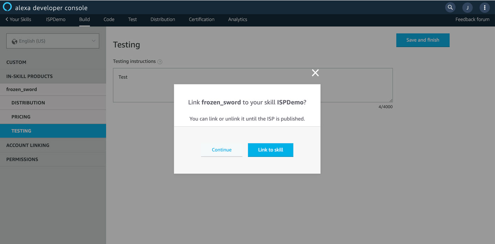
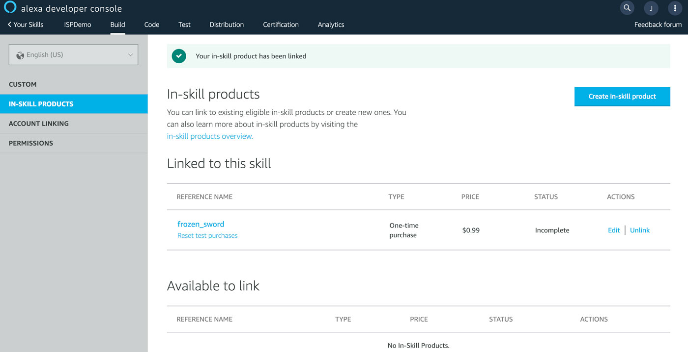

# Use Alexa In-Skill-Purchasing (ISP) with Jovo
 


Learn how to make money with your Alexa Skills by selling digital goods with Alexa's In-Skill Purchasing (ISP) feature and the Jovo Framework. In this tutorial, we will build a simple Alexa Skill that allows users to buy and refund items.

> You can find the full code example of this tutorial here: [jovo-templates/alexa/isp](https://github.com/jovotech/jovo-templates/tree/master/alexa/isp).

* [Introduction to Alexa In-Skill Purchasing](#introduction-to-alexa-in-skill-purchasing)
* [Adding Products for Alexa ISP](#adding-products-for-alexa-isp)
   * [Using the Alexa Developer Console](#using-the-alexa-developer-console)
   * [Using ASK CLI](#using-ask-cli)
* [Implementing Alexa ISP with Jovo](#implementing-alexa-isp-with-jovo)
    * [Updating your Language Model](#updating-your-language-model)
    * [Adding ISP to the Logic](#adding-isp-to-the-logic)
        * [Upsell](#upsell)
        * [Purchase Request](#purchase-request)
        * [Refund](#refund)
        * [ON_PURCHASE](#onpurchase)
    * [Inventory Management for Consumables](#inventory-management-for-consumables)

Watch the video here:

[](https://www.youtube.com/watch?v=lpKpwfOjZ0M)


## Introduction to Alexa In-Skill Purchasing

> Jovo Docs: [In-Skill Purchases](https://www.jovo.tech/marketplace/jovo-platform-alexa/in-skill-purchases).

In May 2018, Amazon [introduced](https://developer.amazon.com/blogs/alexa/post/5d852c9c-8cdf-45c1-9b68-e2f02af26c89/make-money-with-alexa-skills) the ability for Alexa Skill developers to make money through in-skill purchasing. It allows you to sell premium content either through one-time purchases, consumables, or subscriptions.

The Alexa ISP API works independently from your own skill. You do not handle the transactions yourself, but you send a directive just like with the [Dialog Interface](https://www.jovo.tech/marketplace/jovo-platform-alexa#dialog-interface). Alexa will use predefined values from products that you either [define in the Alexa Developer Console](#using-the-alexa-developer-console), or [with the ASK CLI](#using-ask-cli), to fulfill the transaction. The moment you send out one of these directives, the current session ends. Once the transaction is finished, your Skill will get a request with data about the transaction at which point you can resume where the user left off.  

There are two main steps that need to be done to add In-Skill Purchases to your Alexa Skill:

* [Adding Products for Alexa ISP](#adding-products-for-alexa-isp)
* [Implementing Alexa ISP with Jovo](#implementing-alexa-isp-with-jovo)


## Adding Products for Alexa ISP

Before we can implement the interactions in our code base, we have to first create the items we want to sell. 

There are two different ways how products can be added to an Alexa Skill:

* [Using the Alexa Developer Console](#using-the-alexa-developer-console)
* [Using ASK CLI](#using-ask-cli)


### Using the Alexa Developer Console

Recently, Amazon introduced the ability to add products with a graphical user interface directly in the [Amazon Developer Console](https://developer.amazon.com).

To do this, go to the "In-Skill products" tab:



Create a new product and call it `frozen_sword`. For this product, we select the "One-Time Purchase" option:



Add all the necessary information:



In the next step, we have to select pricing and use a tax category. For the purposes of this tutorial, it doesn't really matter, so we stay at 99 cents and will choose the "Software" category:


The final step is to add testing instructions. If you then save the product, you need to confirm to link it to your Alexa Skill:



That's it! Your product is now linked to your Alexa Skill:



You can now move on to [Implementing Alexa ISP with Jovo](#implementing-alexa-isp-with-jovo), or take a look at how you can also add products by using the ASK CLI.

### Using ASK CLI

To add items without using a graphical interface, we will use the ASK CLI (version `1.4.3` or later). If you did not install or initialize the ASK CLI yet, check out this [quickstart guide by Amazon](https://developer.amazon.com/docs/smapi/quick-start-alexa-skills-kit-command-line-interface.html#step-2-install-and-initialize-ask-cli).

To run the ASK CLI's commands we have to move from the project's root folder to the `alexaSkill` folder:

```text
$ cd platforms/alexaSkill
```

We're going to add an entitlement, which is a one-time purchase item, and call it `frozen_sword` using the `ask add isp` command:

```text
$ ask add isp

? List of in-skill product types you can choose (Use arrow keys)
❯ Entitlement 
  Subscription 

? List of in-skill product templates you can choose (Use arrow keys)
> Entitlement_Template

? Please type in your new in-skill product name:
 frozen_sword
In-skill product frozen_sword.json is saved to ./isps/entitlement/frozen_sword.json
```

After that, there should be a `frozen_sword.json` file in your `alexaSkill/isps` folder. The content of that `json` file is used to define the price, release date, description as well as the prompts Alexa will use when she handles the transaction and much much more. You can find examples and a small description for each field [in the official Amazon reference](https://developer.amazon.com/docs/smapi/isp-schemas.html).

Here's how our product's file looks like:

```javascript
{
  "version": "1.0",
  "type": "ENTITLEMENT",
  "referenceName": "frozen_sword",
  "publishingInformation": {
    "locales": {
      "en-US": {
        "name": "Frozen Sword",
        "smallIconUri": "https://s3.amazonaws.com/jovocards/logo108.png",
        "largeIconUri": "https://s3.amazonaws.com/jovocards/logo512.png",
        "summary": "A sword once used by Arthas.",
        "description": "Use the overpowered Frozen Sword",
        "examplePhrases": [
          "Alexa, buy the frozen sword"
        ],
        "keywords": [
          "frozen sword",
          "sword",
          "frozen"
        ],
        "customProductPrompts": {
          "purchasePromptDescription": "Do you want to buy the Frozen Sword?",
          "boughtCardDescription": "Congrats. You successfully purchased the Frozen Sword!"
        }
      }
    },
    "distributionCountries": [
      "US"
    ],
    "pricing": {
      "amazon.com": {
        "releaseDate": "2018-05-14",
        "defaultPriceListing": {
          "price": 0.99,
          "currency": "USD"
        }
      }
    },
    "taxInformation": {
      "category": "SOFTWARE"
    }
  },
  "privacyAndCompliance": {
    "locales": {
      "en-US": {
        "privacyPolicyUrl": "https://www.yourcompany.com/privacy-policy"
      }
    }
  },
  "testingInstructions": "This is an example product.",
  "purchasableState": "PURCHASABLE"
}
```

Additionally, we could add a subscription by running the `ask add isp` command again and adding the `premium_pass`:

```text
$ ask add isp

? List of in-skill product types you can choose (Use arrow keys)
  Entitlement 
❯ Subscription 

? List of in-skill product templates you can choose (Use arrow keys)
> Subscription_Template

? Please type in your new in-skill product name:
 premium_pass
In-skill product premium_pass is saved to ./isps/subscription/premium_pass.json
```

Here's the template for the subscription:

```javascript
{
  "version": "1.0",
  "type": "SUBSCRIPTION",
  "referenceName": "premium_pass",
  "subscriptionInformation": {
    "subscriptionPaymentFrequency": "MONTHLY",
    "subscriptionTrialPeriodDays": 30
  },
  "publishingInformation": {
    "locales": {
      "en-US": {
        "name": "Premium Pass",
        "smallIconUri": "https://s3.amazonaws.com/jovocards/logo108.png",
        "largeIconUri": "https://s3.amazonaws.com/jovocards/logo512.png",
        "summary": "Get access to all the premium content",
        "description": "Get content updates two weeks earlier than everbody else",
        "examplePhrases": [
          "Alexa, buy premium pass"
        ],
        "keywords": [
          "premium pass",
          "pass",
          "premium"
        ],
        "customProductPrompts": {
          "purchasePromptDescription": "Do you want to buy the premium pass?",
          "boughtCardDescription": "Congrats. You successfully purchased the premium pass"
        }
      }
    },
    "distributionCountries": [
      "US"
    ],
    "pricing": {
      "amazon.com": {
        "releaseDate": "2018-05-14",
        "defaultPriceListing": {
          "price": 0.99,
          "currency": "USD"
        }
      }
    },
    "taxInformation": {
      "category": "SOFTWARE"
    }
  },
  "privacyAndCompliance": {
    "locales": {
      "en-US": {
        "privacyPolicyUrl": "https://www.yourcompany.com/privacy-policy"
      }
    }
  },
  "testingInstructions": "This is an example product.",
  "purchasableState": "PURCHASABLE"
}
```

Since the file structure for a `consumable` is the same as for a `entitlement`, we will skip adding that.

Save the files and deploy everything with the ASK CLI:

```text
$ ask deploy
```


## Implementing Alexa ISP with Jovo

Now that we've added at least one product to our Alexa Skill, we can start implementing it into our app. The Alexa In-Skill Purchases API offers three kinds of interactions with our user:

* **Upsell**: We proactively offer the user our products ("The Product X could help you with that..").
* **Purchase request**: The user asks to buy something ("I want to buy X").
* **Refund**: The user wants to return a product ("I want a refund for X").

For the Alexa Skill to understand those requests mentioned above, you need to do two things:

* [Update your Language Model](#updating-your-language-model)
* [Add ISP to the Logic](#adding-isp-to-the-logic)


### Updating your Language Model

> Docs: [Jovo Language Model](https://www.jovo.tech/docs/model).

As I described earlier, there are three kinds of interactions we have to implement in our Skill, but only two of these need to be added to the language model because the buy and refund request are the only ones initiated by the user.

All of the elements that we're going to add now should be placed inside in the `alexa` object of our Jovo Language Model (`models/en-US.json`) to keep everything as clean as possible. 

First of all, we will add a custom slot type for our product names. The important thing here is that the `id` of each value is the `reference_name` of our product, because we need it later on to initiate the transaction.


```javascript
// Rest of the language model
"alexa": {
    "interactionModel": {
        "languageModel": {
            "intents": [
                /*
                 * Intents
                 */
            ],
            "types": [
                {
                    "name": "PRODUCT_NAMES",
                    "values": [
                        {
                            "id": "frozen_sword",
                            "name": {
                                "value": "frozen sword"
                            }
                        },
                        {
                            "id": "premium_pass",
                            "name": {
                                "value": "premium pass"
                            }
                        }
                    ]
                }
            ]
        }
    }
}
```


Next up the intents. Amazon provides sample intents for both buy and refund requests:

```javascript
// Rest of the language model
"alexa": {
    "interactionModel": {
        "languageModel": {
            "intents": [
                /*
                 * Other intents
                 */
                {
                    "name": "RefundSkillItemIntent",
                    "samples": [
                        "return {ProductName}",
                        "refund {ProductName}",
                        "want a refund for {ProductName}",
                        "would like to return {ProductName}"
                    ],
                    "slots": [
                        {
                            "name": "ProductName",
                            "type": "PRODUCT_NAMES"
                        }
                    ]
                },
                {
                    "name": "BuySkillItemIntent",
                    "samples": [
                        "buy",
                        "shop",
                        "buy {ProductName}",
                        "purchase {ProductName}",
                        "want {ProductName}",
                        "would like {ProductName}"
                    ],
                    "slots": [
                        {
                            "name": "ProductName",
                            "type": "PRODUCT_NAMES"
                        }
                    ]
                }
            ],
            "types": [
                {
                    "name": "PRODUCT_NAMES",
                    "values": [
                        {
                            "id": "frozen_sword",
                            "name": {
                                "value": "frozen sword"
                            }
                        },
                        {
                            "id": "premium_pass",
                            "name": {
                                "value": "premium pass"
                            }
                        }
                    ]
                }
            ]
        }
    }
}
```

That's everything we need for our Language Model. To upload it to the Alexa platform, use the following commands:

```sh
# Build platforms folder (in this case platforms/alexaSkill)
$ jovo build

# Deploy contents of platforms folder
$ jovo deploy
```


### Adding ISP to the Logic

As we discussed earlier, our only task is to **start** the transaction, since Alexa will handle the transaction autonomously. After the transaction finished, we will receive a request notifying us about the outcome, i.e. the purchase was successful or not. Inside that request, there will also be a `token`, which we can define while starting the transaction, to help us resume the Skill at the place the user left off.

To access the Alexa ISP API in Jovo we use the Alexa In-Skill Purchase object of the Jovo framework:

```js
this.$alexaSkill.$inSkillPurchase
```

Before we start any kind of transaction or refund process, we always retrieve the product first:

```javascript
const product = await this.$alexaSkill.$inSkillPurchase.getProductByReferenceName(productReferenceName);

console.log(product);
```

The data we get looks like this:
```javascript
{ productId: 'amzn1.adg.product.994e8ec0-2f73-4130-837a-0bb06abe1ded',
  referenceName: 'frozen_sword',
  type: 'ENTITLEMENT',
  name: 'Frozen Sword',
  summary: 'A sword once used by Arthas.',
  entitled: 'NOT_ENTITLED',
  entitlementReason: 'NOT_PURCHASED',
  purchasable: 'PURCHASABLE',
  activeEntitlementCount: 0,
  purchaseMode: 'TEST' 
}
```

Using that data we can check if the user already owns the product:

```javascript
const product = await this.$alexaSkill.$inSkillPurchase.getProductByReferenceName(productReferenceName);

if (product.entitled === 'ENTITLED') {
    // User already owns it
} else {
    // User does not own it
}
```

#### Upsell

The upsell method is used to proactively offer the user our products. To send out the request, we need three things:

* the reference name of the product
* a message/prompt
* a token

For simplicity reasons and because these things are different for every individual skill, we will just hard-code the reference name and use a placeholder token.

For your own skill, you should try to build a system which offers each product at the right time, e.g. offer the user extra lives after they have died, so you don't annoy your user.

For the message/prompt, Amazon offers the following guidelines:

* Don't include the price. The price, subscription term, or free trial length are obtained from the product's `json` file during the transaction.
* End the message with a question to determine if the user is interested, but don't specifically ask if they want to buy it. That will be handled in the transaction by Alexa.
* Explain the benefit the user would have from that product at the current situation.

In general, you should also avoid suggesting multiple products in a row or suggestion products too often, so you don't interrupt and annoy the user.

Alright, now that we discussed all that, we can start the transaction using the  `upsell()` method, which takes the `productId`, `prompt` and `token` as parameters, after we've checked if the user already owns the product:

```javascript
async UpsellIntent() {
    const productReferenceName = 'frozen_sword';

    const product = await this.$alexaSkill.$inSkillPurchase.getProductByReferenceName(productReferenceName);
    console.log(product);

    if (product.entitled === 'ENTITLED') {
        return this.tell('You have already bought this item.');
    } else {
        const prompt = 'The frozen sword will help you on your journey. Are you interested?';
        const token = 'testToken';
        return this.$alexaSkill.$inSkillPurchase.upsell(product.productId, prompt, token);
    }
},
```

#### Purchase Request

Now we can get to the first user requested intent, `BuySkillItemIntent`. 

There are two scenarios at which the intent gets invoked. In the first one, the user does not specify which item they want to buy, i.e. there is no value for our input variable, where we just suggest them some.

```javascript
BuySkillItemIntent() {
    if (!this.$inputs.productName) {
        return this.ask('You can choose either the premium pass. or frozen sword. Which are you interested in?');
    }
}
```

In the other scenario the user specifies the product and we use the input's id as our product's `reference_name` to check whether they already own it. If that's not the case, we start the transaction:

```javascript
async BuySkillItemIntent() {
    const productName = this.$inputs.ProductName;
    if (!productName) {
        return this.ask('You can choose either the "premium pass", or "frozen sword". Which are you interested in?');
    }
    const productReferenceName = productName.id;
    const token = 'testToken';
    
    const product = await this.$alexaSkill.$inSkillPurchase.getProductByReferenceName(productReferenceName);
    console.log(product);

    if (product.entitled === 'ENTITLED') {
        return this.tell('You have already bought this item.');
    } else {
        return this.$alexaSkill.$inSkillPurchase.buy(product.productId, token);
    }
},
```

#### Refund

Next, the `RefundSkillItemIntent`. Same procedure, get the input's id, use it to get the product, check if the user even owns the product and start the refund process:

```javascript
async RefundSkillItemIntent() {
    const productName = this.$inputs.ProductName;
    const productReferenceName = productName.id;
    const token = 'testToken';

    const product = await this.$alexaSkill.$inSkillPurchase.getProductByReferenceName(productReferenceName)
    console.log(product);

    if (product.entitled !== 'ENTITLED') {
        return this.tell('You have not bought this item yet.');
    } else {
        return this.$alexaSkill.$inSkillPurchase.cancel(product.productId, token);
    }
},
```

#### ON_PURCHASE

As we discussed earlier, the initial session ends after we start a transaction (`upsell`, `buy` or `cancel`). After it's finished your Skill will get another request, which will looks like this for example:

```javascript
{
    "type": "Connections.Response",
    "requestId": "string",
    "timestamp": "string",
    "name": "Upsell",
    "status": {
        "code": "string",
        "message": "string"  
    },
    "payload": {
        "purchaseResult":"ACCEPTED",    
        "productId":"string",   
        "message":"optional additional message"
    },
    "token": "string"
}
```

The important parts of that request are:

Name | Description
:--- | :---
`name` | Either `Upsell`, `Buy` or `Cancel`. Used to determine which kind of transaction took place
`payload.purchaseResult` | Either `ACCEPTED`, `DECLINED`, `ALREADY_PURCHASED` or `ERROR`. Used to determine the outcome of the transaction
`payload.productId` | The product in question
`token` | The token used to resume the skill where it left off

The incoming request will be mapped to the Jovo built-in `ON_PURCHASE` intent, where you can resume the Skill at the point before the transaction. The `token` you can send is supposed to help you with that.

```javascript
ON_PURCHASE() {
    const name = this.$request.request.name;
    const productId = this.$alexaSkill.$inSkillPurchase.getProductId();
    const purchaseResult = this.$alexaSkill.$inSkillPurchase.getPurchaseResult();
    const token = this.$request.request.token;

    if (purchaseResult === 'ACCEPTED') {
        return this.tell('Great! Let\'s use your new item');
    } else {
        return this.tell('Okay. Let\'s continue where you left off.');
    }
},
```

### Inventory Management for Consumables

With consumables, you have to maintain one more thing, the user's inventory. While Alexa keeps track of the number of purchases per item, `activeEntitlementCount`, which gets incremented with every purchase and decremented with every refund, you have to track how many times the user has used the consumable. Simply storing the data inside a database would be enough in this case.

Because you are offering consumables, the `userId` of your user stays the same even if they disable and re-enable the skill later on, so keep that in mind if you clean up the user data after they've disabled your skill using the [Alexa Skill Events](https://www.jovo.tech/tutorials/alexa-skill-events).

The incoming `AlexaSkillEvent.SkillDisabled` request will have the `userInformationPersistenceStatus` property that has either the value `PERSISTED` or `NOT_PERSISTED`, which you can use to decide, whether you can clean up the data or not.

That's the basic implementation of Alexa in-skill-purchasing (ISP) with Jovo.

**Any questions? You can reach us on [Twitter](https://twitter.com/jovotech) or [Slack](https://www.jovo.tech/slack).**

<!--[metadata]: { "description": "Learn how to make money with Alexa Skills by implementing the Alexa In-Skill-Purchasing (ISP) feature with Jovo", "author": "kaan-kilic", "tags": "Amazon Alexa, Purchasing", "og-image": "https://www.jovo.tech/img/tutorials/alexa-in-skill-purchasing/alexa-in-skill-purchase.jpg" }-->
