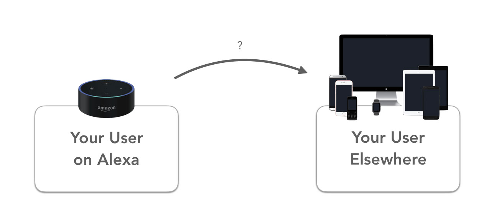

# Login with Amazon: How to get your Alexa Skill User's Email

This time we will show you how to use Alexa **Login with Amazon** account linking to get the email address as well as the name of your Alexa Skill's user the most convenient way.

- [Introduction](#introduction)
- [Implementing Login with Amazon](#implementing-login-with-amazon)
  - [Setting up your Login with Amazon Security Profile](#setting-up-your-login-with-amazon-security-profile)
  - [Enabling Account Linking in the Alexa Developer Console](#enabling-account-linking-in-the-alexa-developer-console)
  - [The Code](#the-code)

> Interested in Alexa Account Linking? [How to set up Account Linking for Alexa with Auth0 and Jovo](https://www.jovo.tech/blog/alexa-account-linking-auth0/).   

## Introduction



The problem developers currently face with Alexa Skills is that, after the voice experience ended, you can't really interact with your users. You can't inform them about any updates on your Skill, upcoming new Skills, or anything else. An option would be the [notifications feature](https://www.amazon.com/gp/help/customer/display.html?nodeId=202165800), which is sadly still in beta. Until then, you should try using **Account Linking**.

Account Linking is the process of connecting user accounts between your Alexa Skill (the Skill User ID) and other services (your own service with username and password, or identity providers like Facebook, Twitter, ...). One of the biggest benefits of Account Linking is the **access to an email address**, which you can use for everything from marketing to sharing important additional information with your user (like booking details and receipts), which you simply can't provide on a voice platform.


However, setting up account linking for Alexa can be quite difficult, as you have to follow certain guidelines and set up your own oAuth 2.0 provider (read a [tutorial about Alexa Account Linking with Auth0 here](https://www.jovo.tech/tutorials/alexa-account-linking-auth0/)).

Fortunately, if you just want to get your user's email address and some other basic information, there is a simple way to do so without having to deal with all the complexities of account linking: **Login with Amazon**. In this tutorial, we're going to show you how it works.

## Implementing Login with Amazon

There is one thing you can be sure about all your Alexa Skill users: that every one of them has an **Amazon account**. That's the reason using Amazon's very own social login, Login with Amazon, is so convenient. 


It allows the user to sign in with their Amazon username and password, which grants us developers access to the user's profile data, consisting of **name, email and postal code**.

To get the data, you have to prompt your user to login, showing a card in the Alexa companion app or website, which will redirect them to a typical Amazon login page.

Let's walk you trough the steps needed to implement Login with Amazon Account Linking for your Alexa Skill:

*   [Setting up your Login with Amazon Security Profile](#setting-up-your-login-with-amazon-security-profile)
*   [Enabling Account Linking in the Alexa Developer Console](#enabling-account-linking-in-the-alexa-developer-console)
*   [The Code](#the-code)

### Setting up your Login with Amazon Security Profile

First, we have to create a Security Profile. Go to the [Amazon Developer Console](https://developer.amazon.com/) and select **Login with Amazon** on the **Apps & Services** tab.


Simply fill out the form and save it. 


Before you close the tab, save both **Client ID** and **Client Secret**. We will need them later on.


In the next step, we will add Account Linking to your Skill on the Alexa Developer Console.

### Enabling Account Linking in the Alexa Developer Console

Go to the **Configuration** tab on your Alexa Skill and enable Account Linking. Fill out the form with the following values:

* **Authorization URL:** https://www.amazon.com/ap/oa
* **Client ID:** Client ID from the Security Profile which we created earlier
* **Scope:** profile; The profile scope will give us access to the user's name, email and user ID. Find out more about [Scopes](https://developer.amazon.com/docs/login-with-amazon/customer-profile.html).
* **Authorization Grant Type:** Auth Code Grant
* **Access Token URL:** https://api.amazon.com/auth/o2/token
* **Client Secret:** Client Secret from the Security Profile


There is one more thing to do. Go back to your Security Profile and select the **Web Settings** tab. Add the Redirect URLs to the **Allowed Return URLs** field.


### The Code

The last thing we want to show you is how to both prompt your user to login and how to access their data in your Alexa Skill's code with Jovo.

The first thing you should know is that there will be an access token sent with every request to your skill, as long as the user has linked their account. So the easiest way to check whether the user has to sign in or not is by verifying that there is an access token.

In Jovo you can do it the following way:

```javascript
this.$request.getAccessToken()
```

The method will either return the access token or `undefined`.

To prompt the user to link their account, you just add an **Account Linking Card** to your response object:

```javascript
this.$alexaSkill.showAccountLinkingCard();
this.tell("Please link your account");
```

To access the stored user data, you simply make an API request, using the access token your skill gets with every request made after the user linked his account. The Jovo Framework uses [axios](https://github.com/axios/axios) internally with a simple interface, which you can also use in your Jovo project. For that, simply import the class:

```javascript
const { App, HttpService } = require('jovo-framework');
```

Here's how the API call might look like:

```javascript
const url = `https://api.amazon.com/user/profile?access_token=${this.$request.getAccessToken()}`;

const { data } = await HttpService.get(url);
/*
* Depending on your scope you have access to the following data:
* data.user_id : "amzn1.account.XXXXYYYYZZZ"
* data.email : "email@jovo.tech"
* data.name : "Kaan Kilic"
* data.postal_code : "12345"
*/
return this.tell(data.name + ', ' + data.email); // Output: Kaan Kilic, email@jovo.tech
```

At the end, your code should look like this:

```javascript
async LAUNCH() {
    if (!this.$request.getAccessToken()) {
        this.$alexaSkill.showAccountLinkingCard();
        return this.tell('Please link you Account');
    } else {
        const url = `https://api.amazon.com/user/profile?access_token=${this.$request.getAccessToken()}`;

        const { data } = await HttpService.get(url);
        /*
        * Depending on your scope you have access to the following data:
        * data.user_id : "amzn1.account.XXXXYYYYZZZ"
        * data.email : "email@jovo.tech"
        * data.name : "Kaan Kilic"
        * data.postal_code : "12345"
        */
        return this.tell(data.name + ', ' + data.email); // Output: Kaan Kilic, email@jovo.tech
    }
},
```

That's it, you made it to the end!

**Any questions? You can reach us on [Twitter](https://twitter.com/jovotech) or [Slack](https://www.jovo.tech/slack).**

<!--[metadata]: { "description": "Learn how to get your user's email using Login with Amazon", "author": "kaan-kilic", "tags": "Account Linking, Amazon Alexa", "og-image": "https://www.jovo.tech/blog/wp-content/uploads/2018/01/alexa-og-image.jpg"}-->