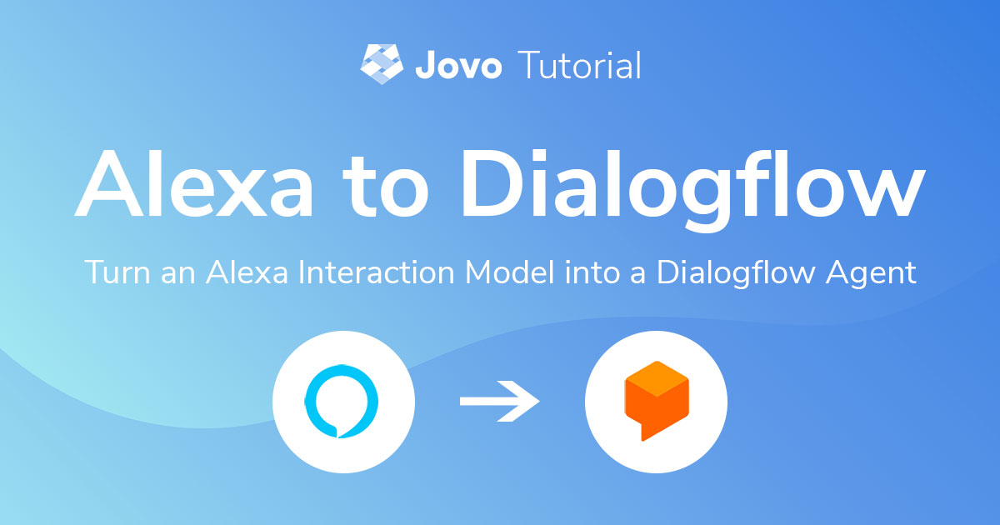
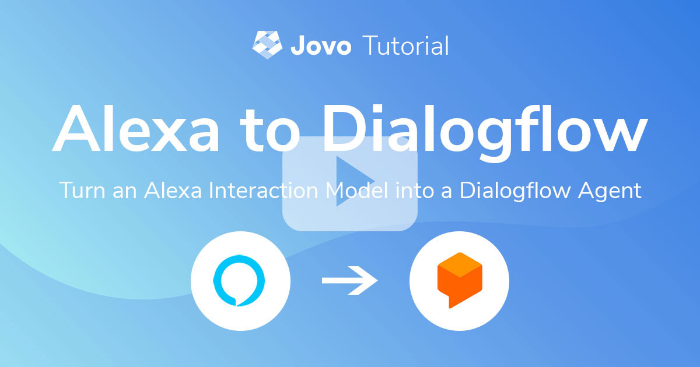
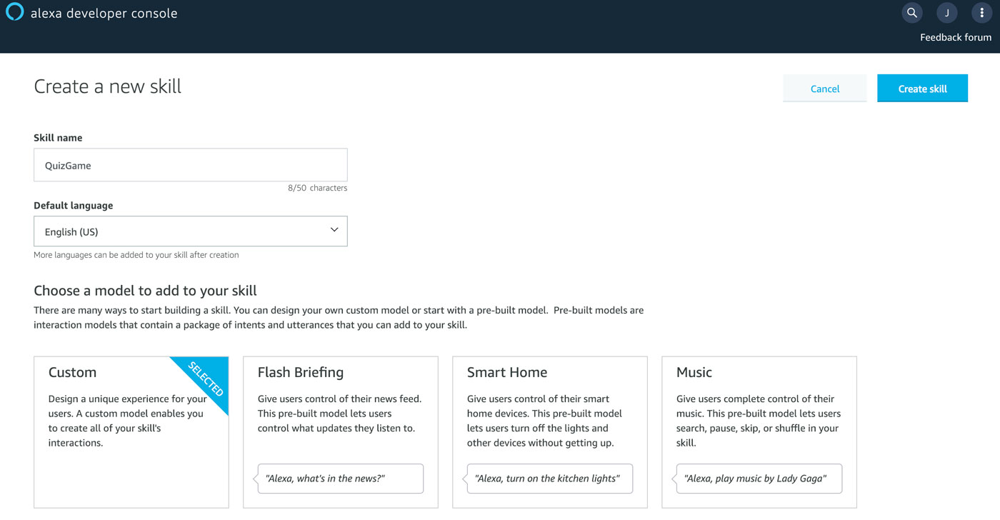
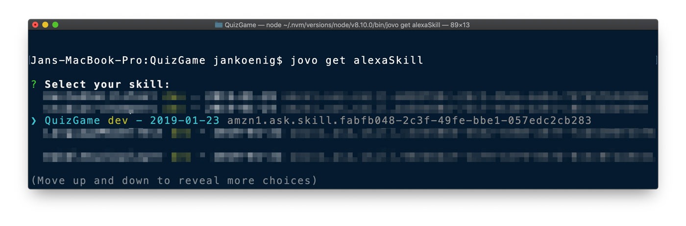

# Turn an Alexa Interaction Model into a Dialogflow Agent



This tutorial will show you how to use an existing Alexa Skill Interaction Model and turn it into a Dialogflow Agent. Dialogflow is the natural language understanding tool most developers use for Google Actions.

* [Introduction](#introduction)
* [Import an Existing Alexa Interaction Model](#import-an-existing-alexa-interaction-model)
   * [Build Interaction Model in the Skill Builder](#build-interaction-model-in-the-skill-builder)
   * [jovo get](#jovo-get)
   * [jovo build reverse](#jovo-build-reverse)
* [Update Intents with Dialogflow Entities](#update-intents-with-dialogflow-entities)
   * [Add System Entities](#add-system-entities)
   * [Define Custom Entities](#define-custom-entities)
* [Add Custom Intents for Dialogflow](#add-custom-intents-for-dialogflow)
   * [Add Dialogflow Object](#add-dialogflow-object)
   * [Turn Alexa Built-in Intents into Custom Intents](#turn-alexa-built-in-intents-into-custom-intents)
* [Deploy to Dialogflow](#deploy-to-dialogflow)

Watch the video:

[](https://www.youtube.com/watch?v=d2AMPKjzPhc)


## Introduction

> [Learn more about the Jovo Language Model here](https://www.jovo.tech/docs/model).

Creating and maintaining language models for both Alexa Skills and Google Actions can be a timeconsuming task. Fortunately, Jovo offers an abstraction for language model definitions with the [Jovo Language Model](https://www.jovo.tech/docs/model). The Jovo Language Model allows you to specify language model documents that can be translated into both an Alexa Interaction Model and a [Dialogflow](https://dialogflow.com/) Agent.

Starting with the Jovo Language Model right away sounds like a great idea, however, many people usually get started with one platform, and then find themselves having difficulties converting from one to the other platform. For example, if you get started with an Alexa Skill, it can be tedious to create a Dialogflow Agent with essentially the same information, by hand.

Fortunately, the [Jovo Language Model](https://www.jovo.tech/docs/model) offers a tool to translate your Alexa Interaction Model into a Dialogflow Agent. Let's take a look how this works!

Learn about the three main steps here:

* [Import an Existing Alexa Interaction Model](#import-an-existing-alexa-interaction-model)
* [Update Intents with Dialogflow Entities](#update-intents-with-dialogflow-entities)
* [Add Custom Intents for Dialogflow](#add-custom-intents-for-dialogflow)


## Import an Existing Alexa Interaction Model

In this section, we will create an interaction model for an Alexa Skill and turn it into a Jovo Language Model.

For this, we need to do the following steps:

* [Build Interaction Model in the Skill Builder](#build-interaction-model-in-the-skill-builder)
* [jovo get](#jovo-get)
* [jovo build reverse](#jovo-build-reverse)

### Build Interaction Model in the Skill Builder

For this tutorial, we create a simple Alexa Skill Interaction Model in the Alexa Skill Developer Console. If you already have an existing interaction model, you can skip this and go to the next step: [jovo get](#jovo-get).

We will use the Alexa Quiz Game template, which already offers a few custom intents and slots.

For this, go to the [Alexa Developer Console](https://developer.amazon.com/alexa/console/ask) and create a new custom skill:



For some locales (in our case `en-US`), there is the option to choose from a few templates. We will use the "Quiz Game":


This Alexa Skill template comes with some custom intents and a custom slot type:


We can now use this interaction model as a starting point to build our Jovo Language Model.

### jovo get

Before we can translate the Alexa Interaction Model into the Jovo Language Model, we need to import it into the Jovo project.

You can do this by using the [`jovo get`](https://www.jovo.tech/docs/cli/get) command:

```sh
# Get the Alexa Skill project files from the "default" ASK profile
$ jovo get alexaSkill

# Alternative: Specify ASK profile
$ jovo get alexaSkill --ask-profile <yourprofile>
```

If you're doing this for the first time, this will prompt you to choose from all Alexa Skills in the current developer account connected to your ASK profile:



After you select your Skill project, it will import the files into the `platforms/alexaSkill` folder of your Jovo project.

In the `platforms/alexaSkill/models` folder you can now find a file called `en-US.json` which contains your interaction model. It starts like this:

```javascript
{
  "interactionModel": {
    "languageModel": {
      "invocationName": "quiz game",
      "intents": [
        {
          "name": "AMAZON.CancelIntent",
          "samples": []
        },
        {
          "name": "AMAZON.HelpIntent",
          "samples": []
        },
        {
          "name": "AMAZON.PauseIntent",
          "samples": []
        },

        // More intents can be found here
      ],
      "types": [
        // Slot types can be found here
      ]
```

### jovo build reverse

Bringing the Interaction Model from above into the right format for the [Jovo Language Model](https://www.jovo.tech/docs/model) by hand can be quite time consuming.

This is why we created a "[reverse build](https://www.jovo.tech/marketplace/jovo-cli/build#reverse-build)" CLI command that saves you some time: 

```sh
$ jovo build --platform alexaSkill --reverse
```

This will use the `en-US.json` file in the `platforms/alexaSkill/models` folder and translate it into a Jovo Language Model file in the `models` folder of your Jovo project directory.

This file looks like this:

```javascript
{
	"invocation": "quiz game",
	"intents": [
		{
			"name": "AnswerIntent",
			"phrases": [
				"{StateName}",
				"{Capital}",
				"{StatehoodYear}",
				"{StatehoodOrder}",
				"{Abbreviation}",
				// More phrases
			],
			"inputs": [
				{
					"name": "StateName",
					"type": {
						"alexa": "AMAZON.US_STATE"
					}
				{
					"name": "Abbreviation",
					"type": "US_STATE_ABBR"
				}
        // More inputs
			]
		},
		{
			"name": "QuizIntent",
			"phrases": [
				"start a quiz",
				"start a quiz game",
				// More phrases
			],
			"inputs": []
		}
	],
  "inputTypes": [
    {
      "name": "US_STATE_ABBR",
      "values": [
				{
					"value": "AK"
				},
        // More values
      ]
    }
  ],
  "alexa": {
		"interactionModel": {
			"languageModel": {
				"intents": [
					{
						"name": "AMAZON.CancelIntent",
						"samples": []
					},
          // More Alexa-specific intents
        ]
      }
    }
  }
}
```

The Jovo Language Model consists of three elements:
* `intents`: Cross-platform intents. [Learn more in the Jovo Docs](https://www.jovo.tech/docs/model#intents).
* `inputTypes`: Cross-platform input types, also called slot types or entities. [Learn more in the Jovo Docs](https://www.jovo.tech/docs/model#input-types).
* `alexa`, `dialogflow`: Platform-specific language model elements. [Learn more in the Jovo Docs](https://www.jovo.tech/docs/model#platform-specific-elements).

To make the language model work on Dialogflow, there are a few more steps to take to make sure Alexa-specific intents and slots are translated correctly:

* [Update Intents with Dialogflow Entities](#update-intents-with-dialogflow-entities)
* [Add Custom Intents for Dialogflow](#add-custom-intents-for-dialogflow)


## Update Intents with Dialogflow Entities

If you take a look at the `AnswerIntent`, it references several slot types (`inputs` in the Jovo Language Model):

```js
"intents": [
		{
			"name": "AnswerIntent",
			"phrases": [
				"{StateName}",
				"{Abbreviation}",
				// More phrases
			],
			"inputs": [
				{
					"name": "StateName",
					"type": {
						"alexa": "AMAZON.US_STATE"
					}
				{
					"name": "Abbreviation",
					"type": "US_STATE_ABBR"
				}
        // More inputs
			]
		},
```

We need to make sure that these inputs also work on Dialogflow. There are two different ways to do this:

* [Add System Entities](#add-system-entities) (shown with `StateName`)
* [Define Custom Entities](#define-custom-entities) (shown with `Abbreviation`)


### Add System Entities

> [Learn more about Jovo Inputs here](https://www.jovo.tech/docs/model#inputs).

If we take a look at the `StateName` input in the `AnswerIntent`, we can see that there is an Alexa-specific element (`alexa`) in there that references `AMAZON.US_STATE`:

```js
{
  "name": "StateName",
  "type": {
    "alexa": "AMAZON.US_STATE"
  }
}
```

This means: The slot `StateName` uses the built-in slot type `AMAZON.US_STATE` from Amazon. Although these built-in slots are helpful, they can't be used across platforms.

Dialogflow offers a similar concept: System Entities. [You can find a full list of all available system entities here](https://dialogflow.com/docs/reference/system-entities).

For this input, the entity `@sys.geo-state` seems appropriate. You can add it by adding a `dialogflow` element to the input:

```js
{
  "name": "StateName",
  "type": {
    "alexa": "AMAZON.US_STATE",
    "dialogflow": "@sys.geo-state"
  }
},
```

This step needs to be done for all intents that reference Amazon built-in slots. If there is not a built-in input (slot, entity) for both, you can also define your own custom input type.


### Define Custom Entities

> [Learn more about Jovo InputTypes here](https://www.jovo.tech/docs/model#input-types).

As mentioned above, there are many situations where we can't use built-in inputs that are offered by the platforms. For this, you can create a [custom input type](https://www.jovo.tech/docs/model#input-types), which translates into a custom slot type for Alexa, and a custom entity for Dialogflow.

If you look at the existing language model, you can find that the `US_STATE_ABBR` was already created from the custom slot type on Alexa:

```js
"inputTypes": [
		{
			"name": "US_STATE_ABBR",
			"values": [
				{
					"value": "AK"
				},
      ],
      // More values
    }
]
```


## Add Custom Intents for Dialogflow

Next, let's take a look at intents. If we take a look at the current language model, you can find an Alexa-specific block all the way down in the document.

This contains all intents that are only used on Alexa:

```js
"alexa": {
  "interactionModel": {
    "languageModel": {
      "intents": [
        {
          "name": "AMAZON.CancelIntent",
          "samples": []
        },
        // More Alexa-specific intents
      ]
    }
  }
}
```

For example, this contains required built-in intents by the Alexa platform, like `AMAZON.HelpIntent`.


### Add Dialogflow Object

> [Learn more about the Dialogflow element here](https://www.jovo.tech/docs/model#dialogflow).

Similar to the Alexa-specific element in the language model, there are also a few intents that are specific to Dialogflow. We cann add them by pasting the following block to the language model:

```js
"alexa": {
  // Alexa-specific elements
},
"dialogflow": {
  "intents": [
    {
      "name": "Default Fallback Intent",
      "auto": true,
      "webhookUsed": true,
      "fallbackIntent": true
    },
    {
      "name": "Default Welcome Intent",
      "auto": true,
      "webhookUsed": true,
      "events": [
        {
          "name": "WELCOME"
        }
      ]
    }
  ]
}
```

### Turn Alexa Built-in Intents into Custom Intents

For some other intents that can be found in the Alexa-specific block of the language model, we need to find a way to use them in Dialogflow as well.

For example, let's take a look at `AMAZON.HelpIntent`:

```js
{
  "name": "AMAZON.HelpIntent",
  "samples": []
},
```

To be able to use this as a `HelpIntent` in Dialogflow, we need to move this to the cross-platform `intents` section of the language model. We would typically do it like this:

```js
"intents": [
		{
			"name": "HelpIntent",
			"phrases": [
				// Phrases
			]
		}
    // Other intents
]
```

What we can do now: We can add phrases for Dialogflow, while still making sure that it gets translated into an Alexa built-in intent. There are two options:

* Option 1: Extend the Alexa built-in intent with additional phrases
* Option 2: Only use the phrases for the Dialogflow intent

```js
// Option 1: Extend the Alexa built-in intent with additional phrases
{
	"name": "HelpIntent",
	"alexa": {
		"name": "AMAZON.HelpIntent"
	},
	"phrases": [
		"help",
		"help me",
		"can you help me",
		"what can i do"
	]
}

// Option 2: Only use the phrases for the Dialogflow intent
{
	"name": "HelpIntent",
	"alexa": {
		"name": "AMAZON.HelpIntent",
    "samples": []
	},
	"phrases": [
		"help",
		"help me",
		"can you help me",
		"what can i do"
	]
}
```

Writing all of this yourself can be tedious, so we open sourced a repository of intents that you can copy-paste: [Jovo Model Library Git Repository](https://github.com/jovotech/model-library).


## Deploy to Dialogflow

After updating the language model file, we can build the platform-specific files and then deploy the agent:

```sh
# Build platform-specific files
$ jovo build

# Create Dialogflow Agent deployment zip file 
$ jovo deploy --platform googleAction
```

The `deploy` command will create a zip file that you can then import into Dialogflow.

Learn more about how to deploy your Dialogflow Agent here: [Deploy a Dialogflow Agent with the Jovo CLI](../deploy-dialogflow-agent './deploy-dialogflow-agent').

<!--[metadata]: { "description": "Learn how to turn an existing Alexa Interaction Model into a Dialogflow Agent.", "author": "jan-koenig", "tags": "Dialogflow, Language Model", "og-image": "https://www.jovo.tech/img/tutorials/alexa-model-to-dialogflow/alexa-to-dialogflow.jpg" }-->
