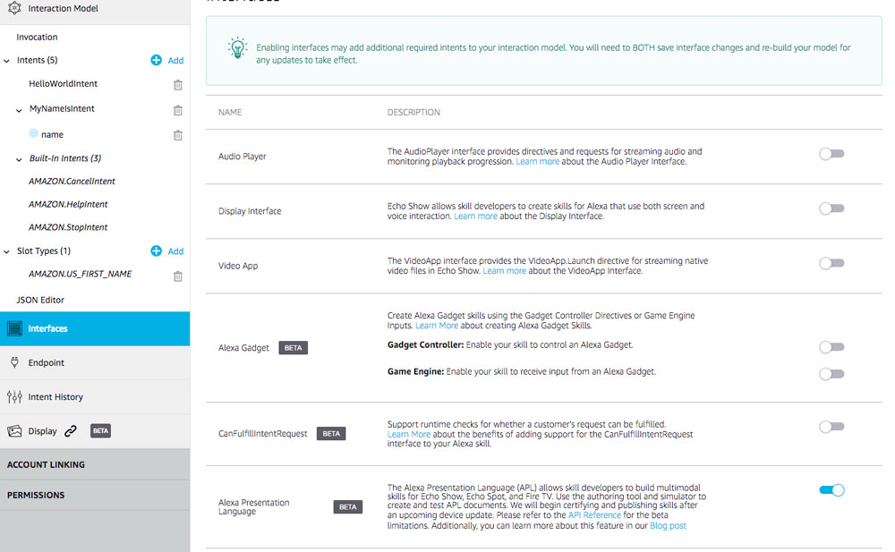
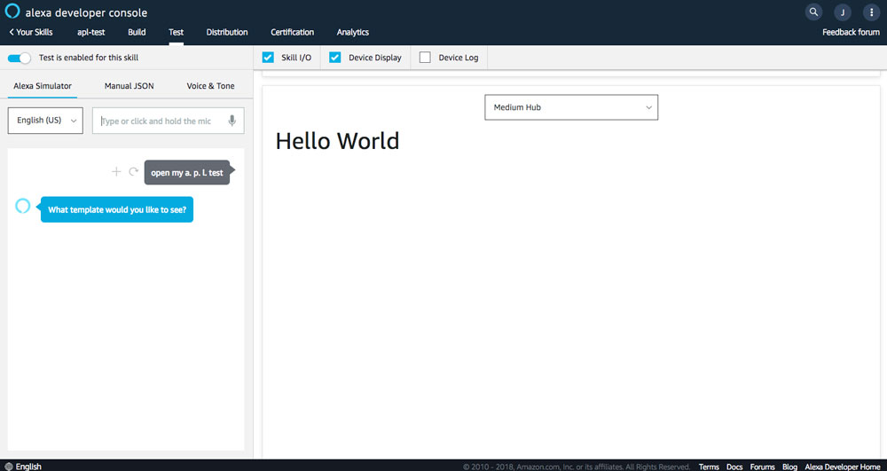
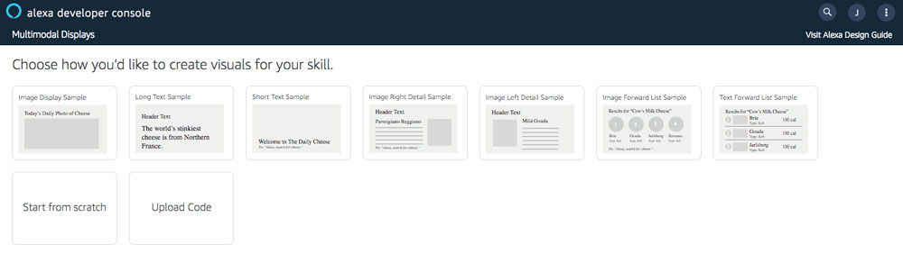
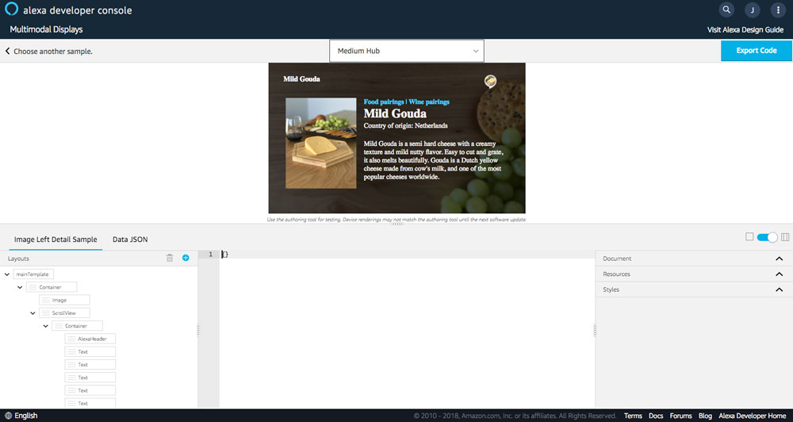
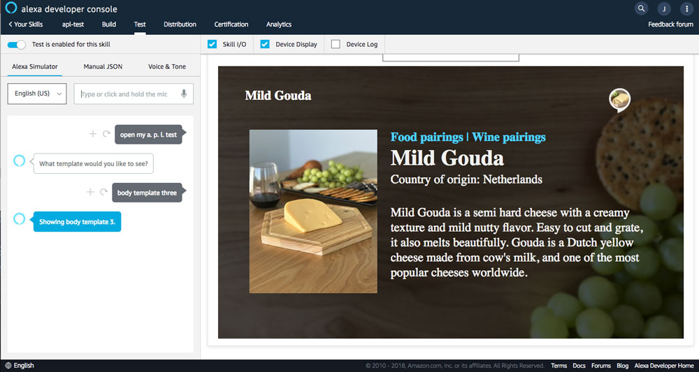

# Using the Alexa Presentation Language (APL) with Jovo

 with Jovo")

Learn how to build visual Alexa Skills with the Alexa Presentation Language (APL) and the Jovo Framework.

You can also find the Jovo beginner template for APL here: [jovo-templates/alexa/apl](https://github.com/jovotech/jovo-templates/tree/master/alexa/apl)

```shell
$ jovo new --template alexa/apl
```

* [Introduction to APL](#introduction-to-apl)
* [Adding APL to your Alexa Skill with Jovo](#adding-apl-to-your-alexa-skill-with-jovo)
   * [Alexa Presentation Language Interface](#alexa-presentation-language-interface)
   * [addDirective](#adddirective)
* [Working with Documents and Data Sources](#working-with-documents-and-data-sources)
   * [The APL Authoring Tool from Amazon](#the-apl-authoring-tool-from-amazon)
   * [Next Steps](#next-steps)

## Introduction to APL

As [recently announced by Amazon](https://developer.amazon.com/blogs/alexa/post/0d2ad283-b7c3-48ba-8313-40f2b5fdc19d/alexa-presentation-language-now-available), the public beta of the new Alexa Presentation Language (APL) is now available.

APL allows you to build visual (or, multimodal) experiences for Alexa. Devices like the Echo Show, the Echo Spot, or even TVs can now display visual information that goes beyond the previously known [Display Templates](https://www.jovo.tech/docs/amazon-alexa/visual-output).

The Alexa Presentation Language is quite compley, so we're using this tutorial just to get started with some simple displays to make it easier for you to dive into this topic. Let us know in the comments if you have specific questions about APL where you would want to see a tutorial.

Here are more resources for you to get started:
* Amazon Docs: [Alexa Presentation Language (APL) Overview](https://developer.amazon.com/docs/alexa-presentation-language/apl-overview.html)
* Amazon Docs: [APL Support for Your Skill](https://developer.amazon.com/docs/alexa-presentation-language/apl-support-for-your-skill.html)
* Great introduction by Dustin Coates: [Alexa Presentation Language Walkthrough](https://www.talkingtocomputers.com/apl-alexa-presentation-language)

## Adding APL to your Alexa Skill with Jovo

We prepared a small Jovo app template for you that uses some APL documents. You can download the template like this:

```shell
$ jovo new --template alexa/apl
```
In the next few steps, we're going through all the essential elements that you need to create simple APL displays in your Alexa Skills.

### Alexa Presentation Language Interface

First, you need to enable the APL Interface for your Skill.

You can either do this in the "Interfaces" tab in the Alexa Developer console:



Or you can deploy with the Jovo CLI. The Jovo APL template has the right configurations for the interface in its [app.json](https://github.com/jovotech/jovo-templates/blob/master/alexa/apl/app.json):

```
"manifest": {
    "apis": {
        "custom": {
            "interfaces": [
                {
                    "type": "ALEXA_PRESENTATION_APL"
                }
            ]
        }
    }
}
```
Just use the following Jovo CLI commands to deploy the template to your Amazon Alexa developer account:

```shell
# Build platforms folder
$ jovo build

# Upload to Alexa
$ jovo deploy
```

### addDirective

To use APL templates, you need to add an additional directive called `Alexa.Presentation.APL.RenderDocument` to your response.

For this, you can use the `addDirective` method and add the following elements:

```javascript
this.alexaSkill().addDirective({
        type: 'Alexa.Presentation.APL.RenderDocument',
        version: '1.0',
        document: {},
        datasources: {},
});
```

We will talk a little bit more about the `document` and `datasources` elements in the next step. The document block can get quite lenghty. This is why it is recommended to put it into a separate JSON file and then require it.

For example, the Jovo APL template uses the main layout by Amazon as a `main.json` file in a dedicated `apl` folder:

```javascript
this.alexaSkill().addDirective({
        type: 'Alexa.Presentation.APL.RenderDocument',
        version: '1.0',
        document: require(`./apl/main.json`),
        datasources: {},
});
```

For example, this `main.json` file looks like this:

```
{
    "type": "APL",
    "version": "1.0",
    "import": [
        {
            "name": "alexa-layouts",
            "version": "1.0.0"
        }
    ],
    "mainTemplate": {
        "parameters": [
            "payload"
        ],
        "items": [
            {
                "type": "Text",
                "text": "Hello World"
            }
        ]
    }
}
```

If we're testing it in the Alexa Simulator, we can see a very simple "Hello World":



In the next section, we're taking a detailed look at both documents and data sources.

## Working with Documents and Data Sources

One of the interesting aspects about APL is how it separates the data from the presentation. This way, complex visuals can be created, stored in a content management system, and then be dynamically changed by the code.

As the whole layout creation process is such a complex process, we're first taking a look at a helpful new tool by Amazon.

### The APL Authoring Tool from Amazon

The [authoring tool](https://developer.amazon.com/alexa/console/ask/displays/?) by Amazon allows you to build your own templates for APL, or build on top of existing ones (currently, the display templates known as `Body Templates` and `List Templates`):



For example, if we select one of those, like `Image Left Detail Sample` (similar to Body Template 3), it looks like this:



By clicking on the upper right "Export Code" button, we can download a JSON called `apml_template_export.json` that includes both the important `document` and `dataSources` elements.

In the Jovo APL template, we split up these elements and put them into different folders, so you can see how the display templates differ from each other.

```javascript
'ShowTemplateIntent': function() {
    let template = this.getInput('template');

    // Retrieve document and data from folder
    this.alexaSkill().addDirective({
            type: 'Alexa.Presentation.APL.RenderDocument',
            version: '1.0',
            document: require(`./apl/${template.id}/document.json`),
            datasources: require(`./apl/${template.id}/data-sources.json`),
    });

    this.tell(`Showing ${template.value}.`);
},
```

Just say `Alexa, ask my APL test to show Body Template three`, and it should display the right template:



### Next Steps

This short tutorial just scratches the surface of what's possible with the Alexa Presentation language by showing how previously known display templates can be migrated to APL templates.

In the next tutorials, we are going to look at additional elements of APL:

* New layouts
* APL commands
* Layouts for different viewports
* UserEvent requests

<!--[metadata]: { "description": "Learn how to build visual Alexa Skills with the Alexa Presentation Language (APL) and the Jovo Framework.", "author": "jan-koenig", "tags": "Amazon Alexa", "og-image": "https://www.jovo.tech/img/tutorials/alexa-presentation-language/alexa-presentation-language-og.jpg" }-->
