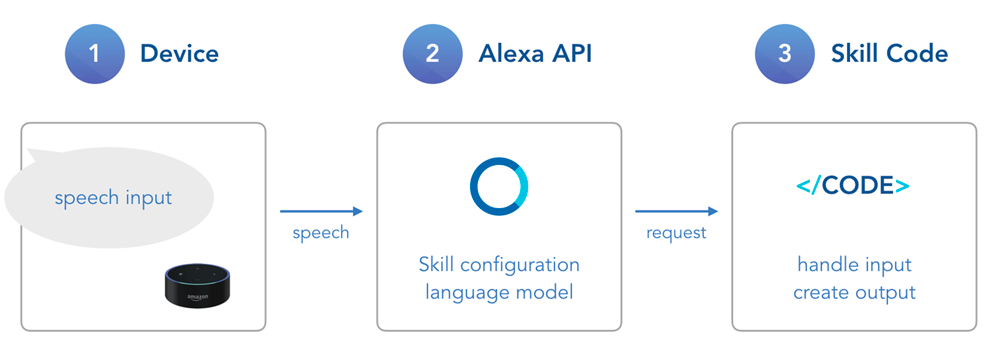
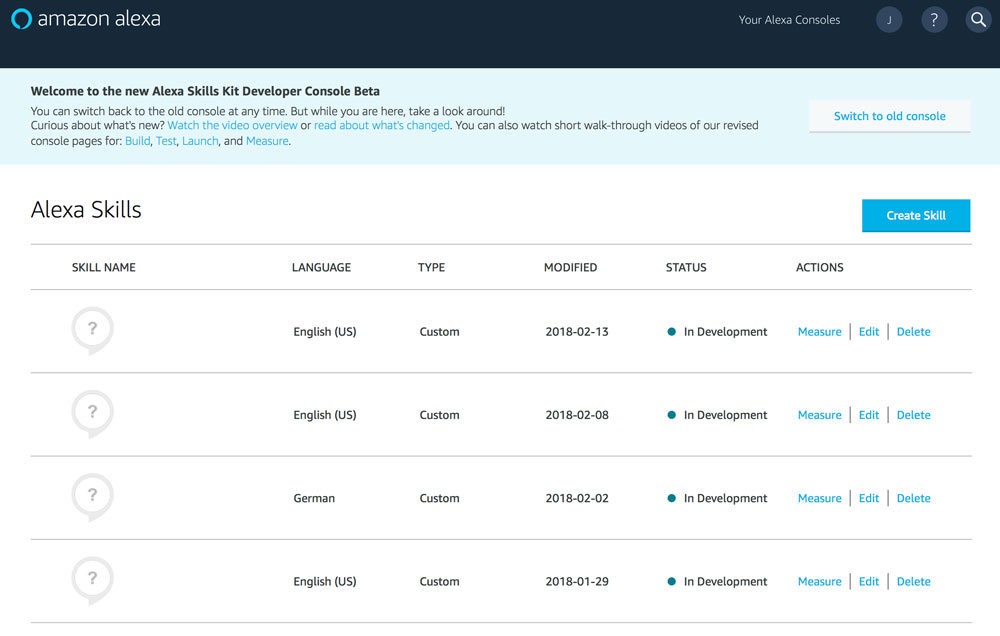
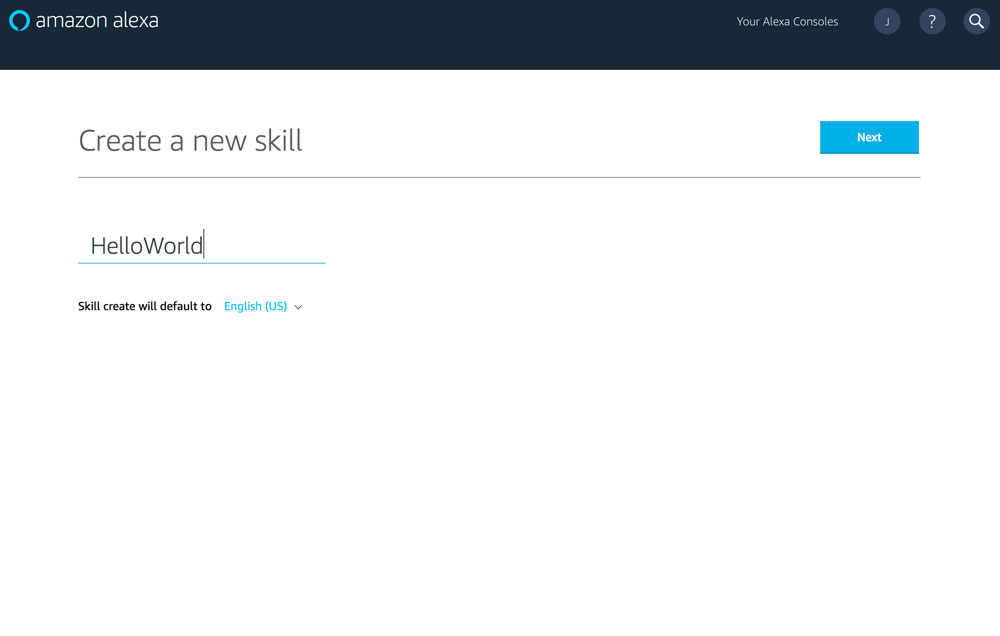
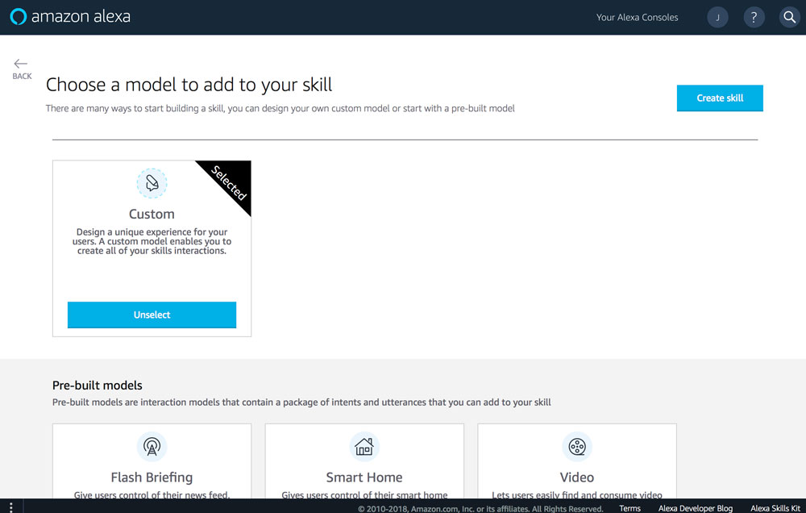
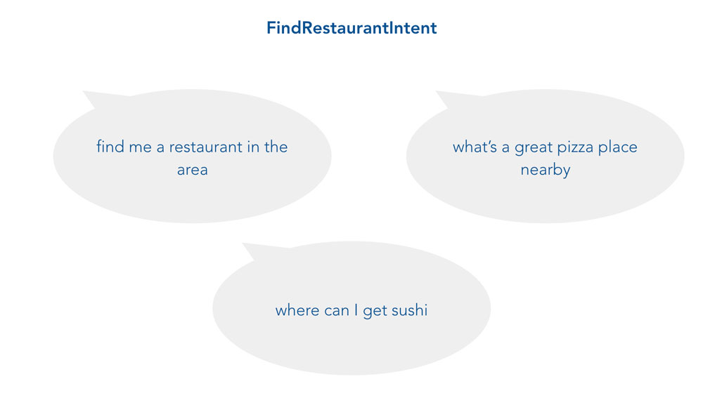
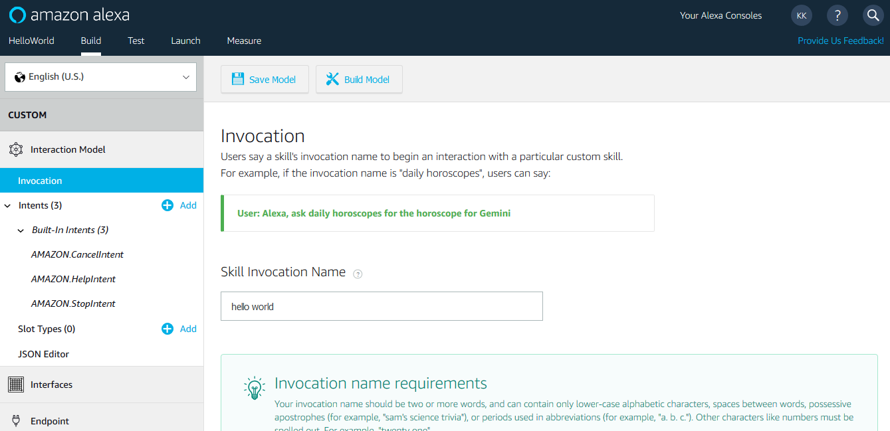
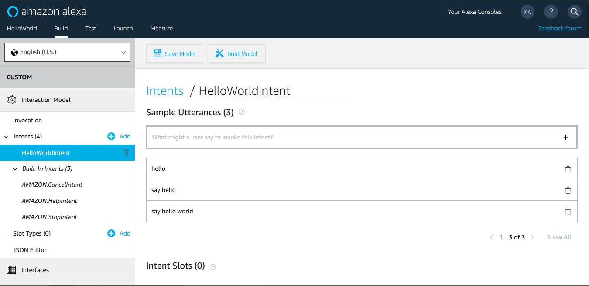
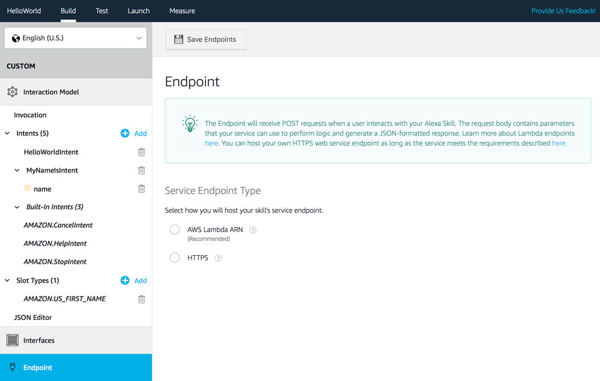
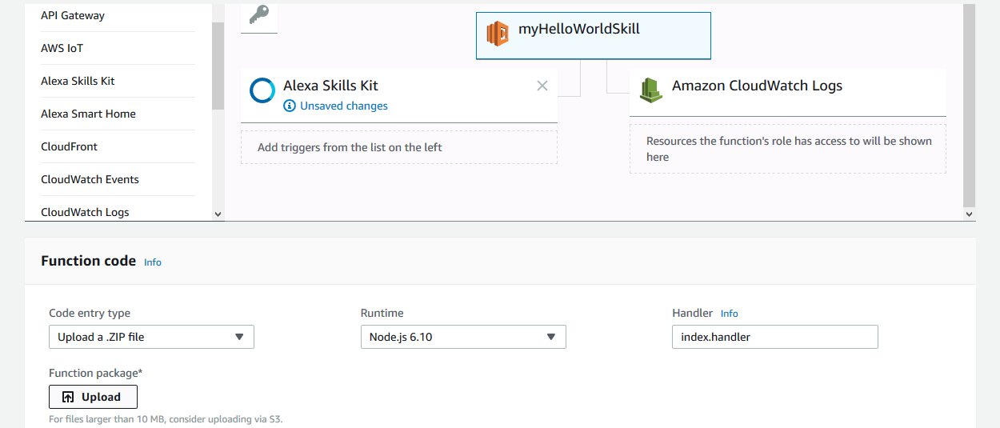
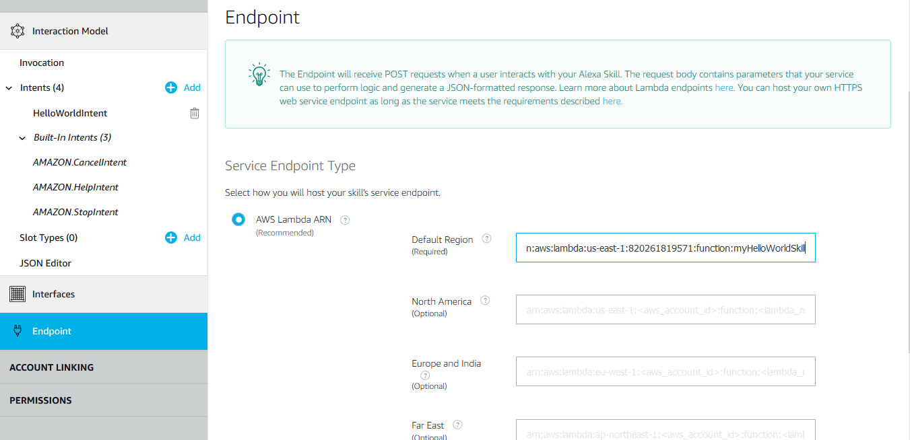

# Build an Alexa Skill in Node.js with Jovo

In this Alexa Skill tutorial for beginners, you will learn how to build a project for the popular voice platform from scratch. We will cover the essentials of building an app for Alexa, how to set everything up on the Amazon Developer Portal, and how to use [Jovo](https://www.jovo.tech) to build your Skill's logic. 

- [How Alexa Skills Work](#how-alexa-skills-work)
- [Create a Skill on the Amazon Developer Portal](#create-a-skill-on-the-amazon-developer-portal)
- [Create a Language Model](#create-a-language-model)
- [Build Your Skill's Code](#build-your-skills-code)
- [Where to Run Your Code](#where-to-run-your-code)
- [Hello World](#hello-world)
- [Next Steps](#next-steps)

> See also: [Build a Google Action in Node.js with Jovo](https://www.jovo.tech/blog/google-action-tutorial-nodejs/)

### What We're Building

To get you started as quickly as possible, we're going to create a simple Skill that responds with "Hello World!"

Please note: This is a tutorial for beginners and explains the essential steps of Alexa Skill development in detail. If you already have experience with Alexa and just want to learn more about how to use Jovo, either skip the first few sections and go right to [Code the Skill](#build-your-skills-code), or take a look at the [Jovo Documentation](https://www.jovo.tech/docs).

## How Alexa Skills Work

In this section, you will learn more about the architecture of Alexa and how users interact with its Skills. An Alexa Skill interaction basically consists of **speech input (your user's request)** and **output (your Skill's response)**.

There are a few steps that happen before a user's speech input is reaching your Skill. The voice input process (from left to right) consists of three stages that happen at three different places:



1.  A user talking to an **Alexa enabled device** (speech input), which is passed to...
2.  the **Alexa API** which understands what the user wants (through natural language understanding), and creates a request, which is passed to...
3.  your **Skill code** which knows what to do with the request.

The third stage is where your magic is happening. The voice output process (from right to left) goes back and passes the stages again: 

. We will do this on the Amazon Developer Portal.

## Create a Skill on the Amazon Developer Portal

The [Amazon Developer Portal](https://developer.amazon.com) is the console where you can add your Skill as a project, configure the language model, test if it's working, and publish it to the Alexa Skill Store.

**Please note:** With the new [Jovo CLI](https://www.jovo.tech/docs/cli), you don't have to go through all the steps in the Developer Portal, as you can create a new Skill project and Interaction Model with the [jovo deploy](https://www.jovo.tech/docs/cli#jovo-deploy) command. However, we believe for starters it's good training to understand how Alexa Skills work. Let's get started:

- [Log in with your Amazon Developer Account](#log-in-with-your-amazon-developer-account)
- [Create a new Skill](#create-a-new-skill)

### Log in with your Amazon Developer Account

Go to [developer.amazon.com](https://developer.amazon.com) and click "Developer Console" on the upper right:


Now either sign in with your Amazon Developer account or create a new one. To simplify things, make sure to use the same account that's registered with your Alexa enabled device (if possible) for more seamless testing. 


Great! You should now have access to your account. This is what your dashboard of the Amazon Developer Console looks like: 


### Create a new Skill

Now it's time to create a new project on the developer console. Click on the "Alexa" menu item in the navigation bar and choose "Alexa Skill Kit" to access your Alexa Skills:


Let's create a new Skill by clicking on the blue button to the upper right: 



The next step is to give the Skill a name: 



Alexa is available in different countries and languages, like the US, UK, and Germany. A Skill can have more than one language (although you have to configure all the following steps again). Make sure to use the language that is also associated to the Amazon account that is linked to your Alexa enabled device, so you can test it without any problems. In our case, it will be English (U.S.) for the United States.

After this step, choose **Custom** as Skill model: 



In the following steps, we will create a language model that works with Alexa.

## Create a Language Model

- [An Introduction to Alexa Interaction Models](#an-introduction-to-alexa-interaction-models)
- [Choose an Invocation Name](#choose-an-invocation-name)
- [Create a HelloWorldIntent](#create-a-helloworldintent)

After successfully creating the Skill, the screen looks like this:


As you can see in the left sidebar, an **Interaction Model** consists of an **Invocation**, **Intents**, and **Slot Types**.

But first, let's take a look at how natural language understanding (NLU) with Alexa works.

### An Introduction to Alexa Interaction Models

Alexa helps you with several steps in processing input. First, it takes a user's speech and transforms it into written text (speech to text). Afterward, it uses a language model to make sense out of what the user means (natural language understanding).

A simple interaction model for Alexa consists of the following elements: **Invocation**, **intents**, **utterances**, and **slots**.

#### Invocation

There are two types of names for your Alexa Skill: While the first, the **Name** is the one people can see in their Alexa app and the Alexa Skill Store, the **Invocation Name** is the one that is used by your users to access your Skill:


#### Intents

An intent is something a user wants to achieve while talking to your product. It is the basic meaning that can be stripped away from the sentence or phrase the user is telling you. And there can be several ways to end up at that specific intent.



For example, a **FindRestaurantIntent** from the image above could have different ways how users could express it. In the case of Alexa language models, these are called utterances:

#### Utterances

An utterance (sometimes called user expression) is the actual sentence a user is saying. There are often a large variety of utterances that fit into the same intent. And sometimes it can even be a little more variable. This is when slots come into play:

#### Slots

No matter if I'm looking for a super cheap place, a pizza spot that serves Pabst Blue Ribbon, or a dinner restaurant to bring a date, generally speaking it serves one purpose (user intent): to find a restaurant. However, the user is passing some more specific information that can be used for a better user experience. These are called slots:


### Choose an Invocation Name

Make sure to choose an invocation name that can be understood by Alexa. For this simple tutorial, we can just go with **HelloWorld** (name, done during Skill creation) and **hello world** (invocation name):



### Create a HelloWorldIntent

For our simple voice app we only need to create two intents and add a few sample utterances, as well as a slot. So let's dive into the Amazon Developer Console and do this.

Click on the "+ Add" button to add our "HelloWorldIntent":


And add the following example phrases to the "**Sample Utterances**":

```text
hello
say hello
say hello world
```



Create the "MyNameIsIntent" next with the following utterances:

```text
my name is {name}
it's {name}
{name}
```


After you did that, you will see that the console automatically added an intent slot called "name", but we still have to assign a slot type, so our Skill knows what kind of input it should execpt. In our case it's "AMAZON.US_FIRST_NAME":


That's all we need. Now click on the "Build Model" button on the top: 


## Build Your Skill's Code

Now let's build the logic of our Alexa Skill. 

We're going to use our [Jovo Framework](https://www.jovo.tech/framework/) which works for both Alexa Skills and Actions on Google Home.

- [Install the Jovo CLI](#install-the-jovo-cli)
- [Create a new Project](#create-a-new-project)
- [A First Look at the Project](#a-first-look-at-the-project)
- [Understanding the App Logic](#understanding-the-app-logic)

### Install the Jovo CLI

The Jovo Command Line Tools ([see the GitHub repository](https://github.com/jovotech/jovo-cli)) offer a great starting point for your voice application, as it makes it easy to create new projects from templates.

```sh
$ npm install -g jovo-cli
```

This should be downloaded and installed now ([see our documentation for more information like technical requirements](https://www.jovo.tech/docs/installation)). After the installation, you can test if everything worked with the following command, which should return the current version of the CLI:

```sh
$ jovo -v
```

### Create a new Project

Let's create a new project. You can see from the feature above that it's possible to create new projects with this command (the "helloworld" template is the default template and will clone our [Jovo Sample App](https://github.com/jovotech/jovo-sample-voice-app-nodejs) into the specified directory):

```sh
$ jovo new HelloWorld
```

```text
  I'm setting everything up

   V Creating new directory /HelloWorld
   V Downloading and extracting template helloworld
   V Installing npm dependencies

  Installation completed.
```

### A First Look at the Project

Let's take a look at the code provided by the sample application. This is what the folder structure looks like: 


For now, you only have to touch the `app.js` file in the `src` folder. This is where all the configurations and app logic will happen. Learn more about the [Jovo Project Structure here](https://www.jovo.tech/docs/project-structure).

Let's take a look at the App Logic first:

### Understanding the App Logic

The setHandler method is where you will spend most of your time when you're building the logic behind your Alexa Skill. It already has a "HelloWorldIntent" and a "MyNameIsIntent", as you can see below:

```javascript
app.setHandler({
 LAUNCH() {
  this.toIntent('HelloWorldIntent');
 },

 HelloWorldIntent() {
  this.ask('Hello World! What\'s your name?', 'Please tell me your name.');
 },

 MyNameIsIntent() {
  this.tell('Hey ' + this.$inputs.name.value + ', nice to meet you!');
 },
});
```

What's happening here? When your skill is opened, it triggers the [LAUNCH](https://www.jovo.tech/docs/routing/intents#launch)-intent, which contains a [toIntent](https://www.jovo.tech/docs/routing#intent-redirects) call to switch to the `HelloWorldIntent`. The [ask](https://www.jovo.tech/docs/output#ask) method is used to ask a user for a name.

If a user responds with a name, the `MyNameIsIntent` is triggered. Here, the [tell](https://www.jovo.tech/docs/output#tell) method is called to respond to your users with a "Nice to meet you!"

## Where to Run Your Code

- [Local Prototyping with the Jovo Webhook](#local-prototyping-with-the-jovo-webhook)
- [Host your Code on AWS Lambda](#host-your-code-on-aws-lambda)

So where do we send the response to? Let's switch tabs once again and take a look at the Amazon Developer Console, this time the Endpoint section:



To make a connection between the Alexa API and your application, you need to either upload your code to AWS Lambda, or provide an HTTPS endpoint (a webhook).

Jovo supports both. For local prototyping and debugging, we recommend using HTTPS (which we are going to describe in the next step), but you can also [jump to the Lambda section](#b-host-your-code-on-aws-lambda).

### Local Prototyping with the Jovo Webhook

The index.js comes with off-the-shelf server support so that you can start developing locally as easy as possible.

Let's try that out with the following command (make sure to go into the project directory first):

```sh
$ jovo run
```

This will start the express server and look like this:

```sh
$ jovo run

Local development server listening on port 3000.
This is your webhook url: https://webhook.jovo.cloud/[your-id]
```

As you can see above, Jovo is automatically creating a link to your local server: the [Jovo Webhook](https://www.jovo.tech/docs/jovo-webhook). Paste the link into the field of the Amazon Developer Console and choose the second option for the SSL Certificate (the link Jovo webhook provides you is a secure subdomain):


Great! Your voice app is now running locally and ready to test. If you're interested in how to set up Lambda, read further. If you want to dive right into the testing, jump to ["Hello World!"](#hello-world).

### Host your Code on AWS Lambda

[AWS Lambda](https://aws.amazon.com/lambda/) is a serverless hosting solution by Amazon. Many Skills are hosted on this platform, as it is a cheap alternative to other hosting providers, and also Amazon offers additional credits for Alexa Skill developers. In this section, you'll learn how to host your Skill on Lambda. This usually takes a few steps, so be prepared. If you only want to get an output for the first time, go back up to [Local Prototyping](#local-prototyping).

In the next steps, we are going to create a new Lambda function on the AWS Developer Console.

#### Create a Lambda Function

Go to [aws.amazon.com](https://aws.amazon.com) and log into your account (or create a new one):


Go to the [AWS Management Console](https://console.aws.amazon.com): 


Search for "lambda" or go directly to [console.aws.amazon.com/lambda](https://console.aws.amazon.com/lambda): 


Click "Create a Lambda function", choose "Author from scratch" and fill out the form:


You can either choose an existing role (if you have one already), or create a new one. We're going to create one from a template and call it "myNewRole" with no special policy templates.

Now it's time to configure your Lambda function. Let's start by adding the Alexa Skills Kit as a trigger:


You can enable skill ID verification, if you want, but it's not neccessary. 


#### Upload Your Code

Now let's get to the fun part. You can either enter to code inline, upload a zip, or upload a file from Amazon S3. As we're using other dependencies like the [jovo-framework npm package](https://www.npmjs.com/package/jovo-framework), we can't use the inline editor. We're going to zip our project and upload it to the function.

To create a zip file that is ready to upload, run the following command:

```sh
$ jovo deploy --target zip

// Alternative
$ npm run bundle
```

This will create an optimizeds `bundle.zip` file into your project directory, which includes all necessary dependencies.

Let's go back to the AWS Developer Console and upload the zip:



Now save your changes with the orange button in the upper right corner:


#### Test Your Lambda Function

Great! Your Lambda function is now created. Click "Test" right next to the "Save" button and select "Alexa Start Session" as the event template:


Click "Test," aaand 🎉 it works! 


#### Add ARN to Alexa Skill Configuration

Copy the ARN at the upper right corner:


Then go to the Configuration step of your Alexa Skill in the Amazon Developer Console and enter it: 



Great! Now it's time to test your Skill: 

## Hello World

- [Test Your Skill in the Service Simulator](#test-your-skill-in-the-service-simulator)
- [Test Your Skill on an Alexa Enabled Device](#test-your-skill-on-an-alexa-enabled-device)
- [Test Your Skill on Your Phone](#c-test-your-skill-on-your-phone)

Go to "Test" and enable your Skill for testing:


Wanna get your first "Hello World!"? You can do this by either using the Service Simulator by Alexa, test on your device, or on your phone.

### Test Your Skill in the Service Simulator

To use the simulator simply invoke your Skill: 


This will create a JSON request and test it with your Skill. And if you look to the right: TADA 🎉! There is your response with "Hello World!" as output speech.

### Test Your Skill on an Alexa Enabled Device

Once the Skill is enabled to test, you can use a device like Amazon Echo or Echo Dot (which is associated with the same email address you used for the developer account) to test your Skill:


### Test Your Skill on Your Phone

Don't have an Echo or Echo Dot handy, but still want to listen to Alexa's voice while testing your Skill? You can use the Alexa App on [iOS](https://apps.apple.com/us/app/amazon-alexa/id944011620) and [Android](https://play.google.com/store/apps/details?id=com.amazon.dee.app).

## Next Steps

Great job! You've gone through all the necessary steps to prototype your own Alexa Skill. The next challenge is to build a real Skill. For this, take a look at the Jovo Documentation to see what else you can do with our Framework: 

[](https://www.jovo.tech/docs/)

<!--[metadata]: { "description": "Learn how to build Alexa Skills with the Jovo Framework from scratch", "author": "jan-koenig", "tags": "Beginner, Amazon Alexa", "og-image": "https://www.jovo.tech/blog/wp-content/uploads/2017/07/alexa-skill-tutorial-og-image.jpg" }-->
