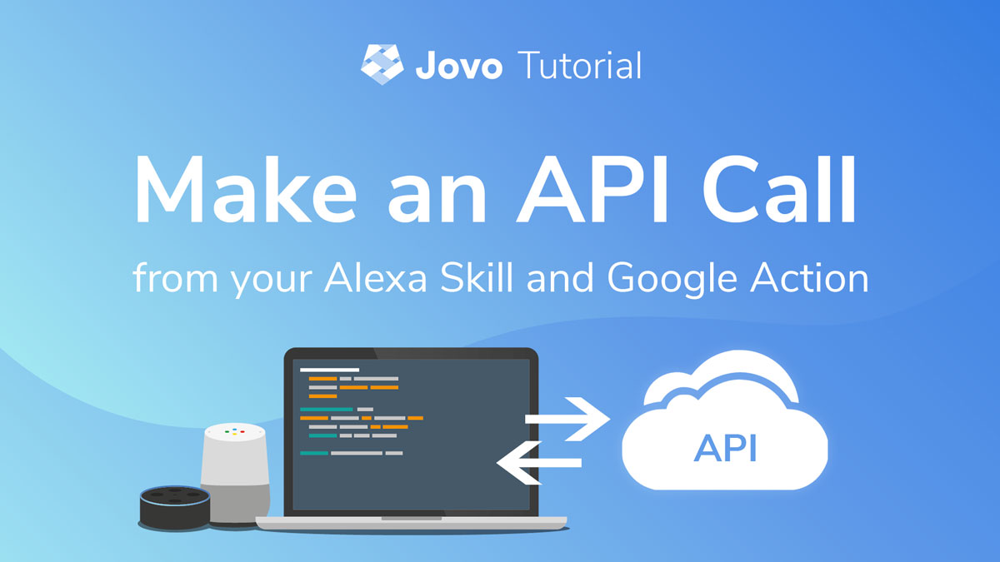

# Make an API Call from an Alexa Skill and Google Action



Learn how to build a voice app that calls an external API and leverages the modern JavaScript concept async/await.

* [Introduction](#introduction)
* [Making an API Call that Returns a Random Quote](#making-an-api-call-that-returns-a-random-quote)
   * [Option 1: Using Request Promise](#option-1:-using-request-promise)
   * [Option 2: Using Traditional Request](#option-2:-using-traditional-request)
* [Next Steps](#next-steps)
* [Troubleshooting](#troubleshooting)


## Introduction

With the launch of `v2` of the Jovo Framework, we updated the way requests and responses are executed. [You can learn more about requests and responses here](https://www.jovo.tech/docs/requests-responses).

The framework now uses the concept of JavaScript promises: The response back to the voice platform (Amazon Alexa, Google Assistant) is sent out once the handler promise is resolved. This means there are a few things to consider when dealing with asynchronous method calls.

In this tutorial, we are going to build a simple Alexa Skill and Google Action with the Jovo Framework that does an API call and return a response based on the data it receives.

Want to learn more about the basics first?
* [async/await](https://javascript.info/async-await) tutorial
* [Promise](https://javascript.info/promise-basics) tutorial


## Making an API Call that Returns a Random Quote

As an example, let's build a voice app that returns a random quote. There is a free [Star Wars Quote API](http://swquotesapi.digitaljedi.dk/index.html) that we can use:

```javascript
// URI to make GET requests
'http://swquotesapi.digitaljedi.dk/api/SWQuote/RandomStarWarsQuoteFromFaction/4'
```

Ideally, we would want a quote intent and that calls a `getRandomQuote` method:

```javascript
// app.js

app.setHandler({
    LAUNCH() {
        return this.toIntent('QuoteIntent');
    },

    async QuoteIntent() {
        const quote = await getRandomQuote();
        console.log(quote);

        this.tell(quote.starWarsQuote);
    },
});

function getRandomQuote() {
    // Do API call and return data
}
```

In this tutorial, you can find two options how we can make this work:

* [Option 1: Using Request Promise](#option-1:-using-request-promise)
* [Option 2: Using Traditional Request](#option-2:-using-traditional-request)

### Option 1: Using Request Promise

The cleanest way is to let the `request` module return a promise right away. There are several packages that offer this functionality:

* [`request-promise`](https://github.com/request/request-promise) (uses Bluebird Promises)
* [`request-promise-native`](https://github.com/request/request-promise-native) (uses native Promises)
* [`request-promise-any`](https://github.com/request/request-promise-any) (uses any-promise Promises)

We are going to use the `request-promise-native` package for this:

```sh
# Install request-promise-native
$ npm install request-promise-native

# Install request (needed as peer dependency)
$ npm install request
```

In the app instantiation section, we can require it like this:

```javascript
// app.js

const requestPromise = require('request-promise-native');
```

And then use it in the `getRandomQuote` method:

```javascript
// app.js

function getRandomQuote() {
    const options = {
        uri: 'http://swquotesapi.digitaljedi.dk/api/SWQuote/RandomStarWarsQuoteFromFaction/4',
        json: true // Automatically parses the JSON string in the response
    };
    const quote = await requestPromise(options);

    return quote;
}
```

### Option 2: Using Traditional Request

If you're used to the traditional `request` package, you can use this as well:

```sh
# Install request (needed as peer dependency)
$ npm install request
```

And initialize it like thos:

```javascript
// app.js

const request = require('request');
```
This won't return a promise, so we need to create a promise from the API response like this:

```javascript
// app.js

function getRandomQuote() {
    return new Promise((resolve, reject) => {
        const options = {
            uri: 'http://swquotesapi.digitaljedi.dk/api/SWQuote/RandomStarWarsQuoteFromFaction/4',
            json: true // Automatically parses the JSON string in the response
        };
        request(options, (error, response, body) => {
            if (error) {
                return reject(error);
            }
            resolve(body);
        });
    });
}
```

## Next Steps

* Read this post to learn how to migrate your existing code: [From Callbacks to Async-Await: A Migration Guide](https://dzone.com/articles/from-callbacks-to-async-await-a-migration-guide).
* There are also a few considerations when using async/await: [How to escape async/await hell](https://medium.freecodecamp.org/avoiding-the-async-await-hell-c77a0fb71c4c)

## Troubleshooting

If you are doing an intent redirect like `this.toIntent` to an intent that is asynchronous, make sure to either await it or add a `return` statement:

```javascript
return this.toIntent('HelloWorldIntent');
```


<!--[metadata]: { "description": "Learn how to build a voice app that calls an external API and leverages the modern JavaScript concept async/await.", "author": "jan-koenig", "tags": "API", "og-image": "https://www.jovo.tech/img/tutorials/api-call/api-call-jovo.jpg"  }-->
