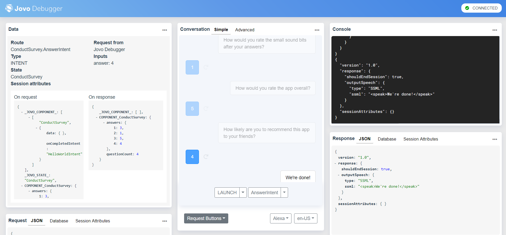

# Getting Started with Conversational Components

Learn how to integrate a basic Conversational Component in a Jovo project.

* [Introduction](#introduction)
* [A Component's Structure](#a-components-structure)
* [Installation](#installation)
* [Configuration](#configuration)
* [Delegating to the Component](#delegating-to-the-component)
* [The Response](#the-response)
* [Conclusion](#conclusion)

## Introduction

Conversational Components are small pre-packaged Jovo project snippets, which solve one particular problem and can be seamlessly integrated into your existing project, using the Jovo CLI.

They include the following parts, neatly bundled into an npm package:

* a **language model** with all the needed intents and entities/slots,
* the **handler** (logic) for the code fulfilment, and
* the **i18n** (cms) files that store all the responses/content.

The main benefit of Conversational Components is the saved time. With even seemingly easy tasks, such as retrieving the user's phone number, turning into large time consuming problems, where most people try to find their own solution, Conversational Components try to provide a customizable solution.

In the future, with the help of our community, these components could be used as best-practices for the growing field of voice app development.

Here are a few sample components that are already available:
* get the user's phone number
* get the user's email address
* allow the user to book a calendar meeting with you
* ask the user for their opinion in a survey


In this short tutorial we will go over the process of integrating the `ConductSurvey` component into a Hello World example project.

It's a fairly simple component, where you define a set of questions, which the user can answer to with a number between 1 and 5, where 1 is the worst and 5 the best.

## A Component's Structure

A Conversational Component structure should look familiar to you, as it was modeled after a standard Jovo project.

The basic version looks the following:

```
models/
  └── en-US.json
  └── de-DE.json
  └── ...
src/
  └── i18n/
    └── en-US.json
    └── de-DE.json
    └── ...
  └── handler.js
  └── config.js
index.js
```

Their are four parts to every component.

The first part is the **handler**. It contains the logic, which are the intents in our case.

Second, the **config** file. It is used to specify the components default config, which can be overwritten using your projects own config file. It provides a way to make small modifications without having to dig deep into the codebase of the component.

On the third sport are the **i18n** files. As of now we use i18n as the supported form of CMS. Again it provides you with a way to customize the components, this time the responses. An integration with an external CMS is planned.

Last but not least, the **index** file. It's the core of the component, which is used to export all the other parts.

Although every part is inside a single file here, it's obviously also possible and also recommended to split stuff up the bigger the whole component gets.

*We go into more detail about each part of the component inside the documentation, which you can find [here](https://www.jovo.tech/docs/components#component-structure).*

## Installation

First of all, we create a new Jovo project:

```sh
$ jovo new componentTest
```

After that we install the component:

```sh
$ npm install jovo-component-conduct-survey --save
```

After installing the component you have to load it into your project using the `jovo load` command:

```sh
$ jovo load jovo-component-conduct-survey
```

It will create a `components` folder inside `src/` which will store all the components:

```
// root folder
models/
src/
└── components/
    jovo-component-conduct-survey/
        └── models/
        └── src/
            └── i18n/
            └── config.js
            └── handler.js
project.js
```

After that have the enable the component using the the `useComponent(...components)` function inside our `app.js` file:

```js
// app.js
const app = new App();

app.use(
  // ...
);

const { ConductSurvey } = require("./components/jovo-component-conduct-survey");

app.useComponents(new ConductSurvey());

app.setHandler({
  // ...
});
```

That's all.

## Configuration

Every component can be configured using your project's root config file.

The interface for the possible configurations should be documented in the component's README file.

In our case we want to increase the number of questions of the survey to 4 instead of the default 3.

```js
// config.js

module.exports = {
    // ...
    components: { // contains configuration of every component
        ConductSurvey: { // name of the component we want to configure
            numberOfQuestions: 4
        }
    }
};
```

The questions are specified in the i18n files, so we go ahead and replace the placeholder questions:

```js
// i18n/en-US.json
{
    "translation": {
        "component-ConductSurvey": {
            "questions": {
                "1": "How did you like the length of the responses?",
                "2": "How would you rate the small sound bits after your answers?",
                "3": "How would you rate the app overall?",
                "4": "How likely are you to recommend this app to your friends?"
            },
            // ...
        }
    }
}
```

Now that our component is configured, we can go ahead add the delegation logic to our handler.

## Delegating to the Component

To delegate the task to the component, you have to use the `delegate(componentName, delegationOptions)` function. It will automatically route to the component's `START` intent and which point it will take over.

```js
app.setHandler({
    LAUNCH() {
        this.delegate('ConductSurvey', {
            onCompletedIntent: 'CompletedIntent'
        });
    },

    CompletedIntent() {
        this.tell('We\'re done!');
    }
});
```

The only necessary property that you have to add to the `delegationOptions` is the `onCompletedIntent`. It is used to specify the intent to which the component will route to after it's done.

Now, let's test the first version of our test project in the Jovo Debugger:

```sh
$ jovo run
```



As you can see the app now runs through the questions we specified earlier and routes back to the `onCompletedIntent` once it's finished. The only thing missing is the response of the component.

## The Response

While the component goes through the necessary steps to fulfill the task, there are three conditions at which it will route back to the intent you specified in the delegation options.

1. the component finished the task
2. an error occurred along the way
3. the user tried to manually stop the app, e.g. `Alexa, stop`

No matter which reason, the component will always return a response.

The response has the following properties:

Name | Description | Value | Required 
--- | --- | --- | ---
`status` | Represents the status of the component. Will be set to `SUCCESSFUL` if the component managed to collect the data without problems. Will be set to `REJECTED` if the user tried to stop the app at any point, e.g. *Alexa, stop*. Will be set `ERROR` if an error occurred at some point. | Either `SUCCESSFUL`, `REJECTED`, or `ERROR` | Yes
`data` | An object containing the data the component was supposed to collect. The content of the object will be different for each component | `object` | Yes
`error` | An error object, which is only present if the status is set to `ERROR` | `Error` | No

The response is stored in the respective component's `$response` object, which we can access using the new `$components` object, a register for every active component.

```js
app.setHandler({
    LAUNCH() {
        this.delegate('ConductSurvey', {
            onCompletedIntent: 'CompletedIntent'
        });
    },

    CompletedIntent() {
        const response = this.$components.ConductSurvey.$response;
        console.log('ConductSurvey\'s response:');
        console.log(response);

        this.tell('We\'re done!');
    }
});
```

Now test the app once again and the response should pop up in the console:


Since the component ran through without problems, our response's status is set to `SUCCESSFUL` and it also contains the `data` object, which is map containing the question number and the user's response, e.g. the user gave the first question a rating of 3.

To not run into any errors, you should always check the status of the response and handle each of them accordingly. For example:

```js
app.setHandler({
    LAUNCH() {
        this.delegate('ConductSurvey', {
            onCompletedIntent: 'CompletedIntent'
        });
    },

    CompletedIntent() {
        const response = this.$components.ConductSurvey.$response;
        
        if (response.status === 'REJECTED') {
            return this.toIntent('END');
        }
        else if (response.status === 'ERROR') {
            console.log(response.error);
            
            return this.toIntent('HandleErrorIntent');
        }
        else {
            console.log(response.data);
        }

        this.tell('We\'re done!');
    }
});
```

## Conclusion

That's all you need to know to get started with Conversational Components. 

[*We've only scratched the surface in this small tutorial, so if you want to find out more, go over to the documentation, where the concept is explained in more detail.](https://www.jovo.tech/docs/components)

You can also check out a more complex Conversational Component, which allows your user to schedule meetings using a Google Calendar integration [here](https://github.com/jovotech/jovo-component-schedule-meeting).

**Any questions? You can reach us on [Twitter](https://twitter.com/jovotech) or [Slack](https://www.jovo.tech/slack).**

<!--[metadata]: { "description": "Learn how to integrate a basic Conversational Component in a Jovo project.", "author": "kaan-kilic", "tags": "Conversational Components, Components", "og-image": "TODO" }-->
