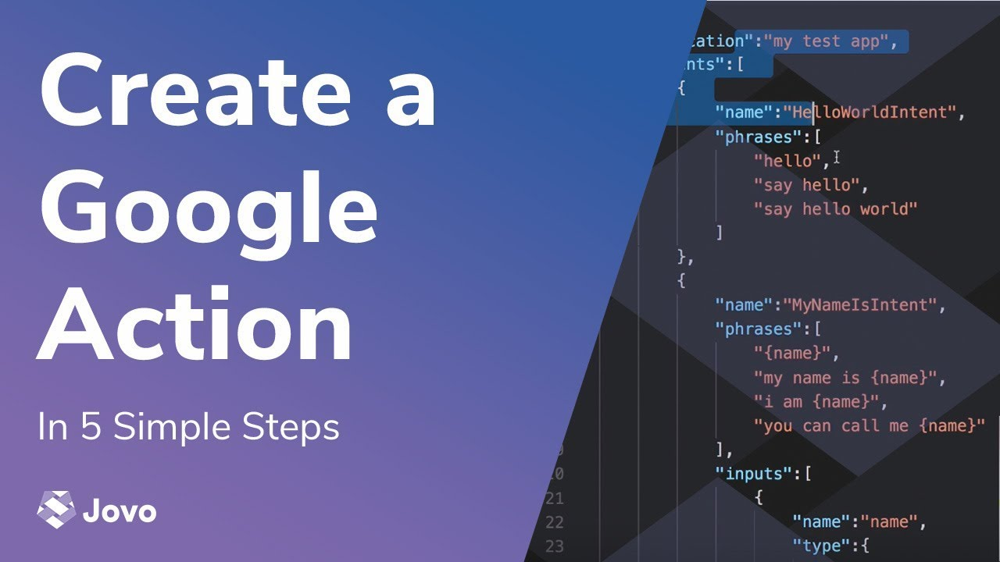
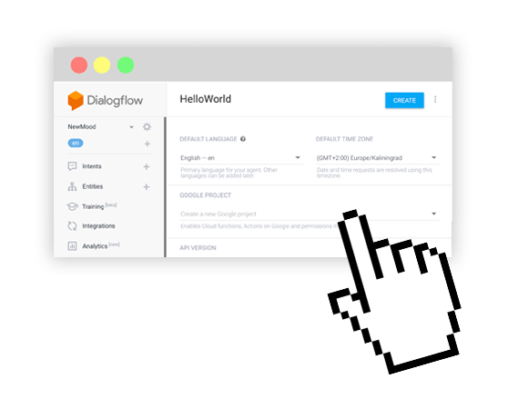
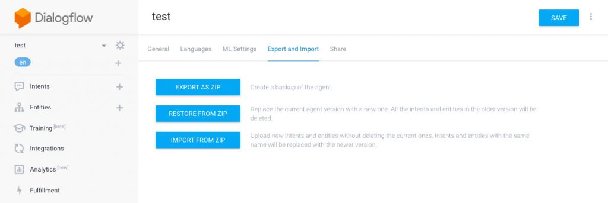
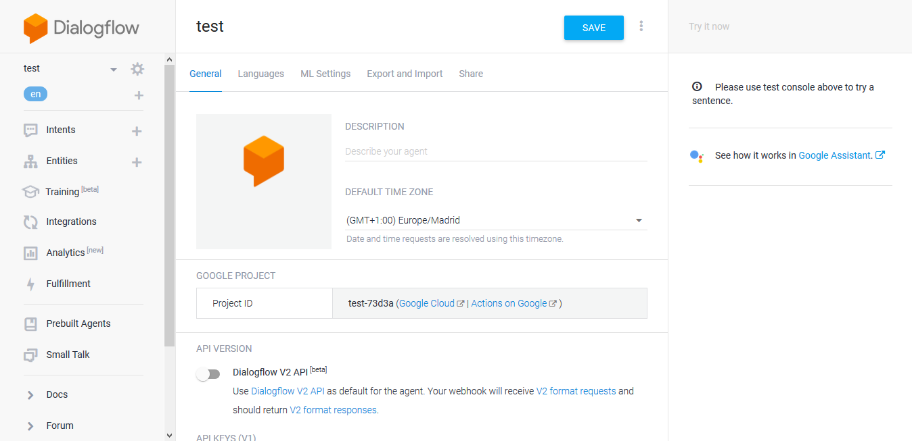
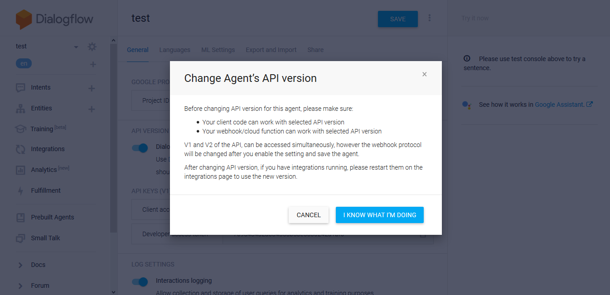
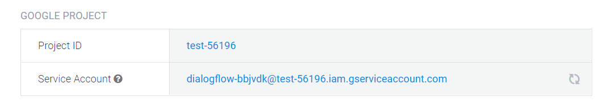
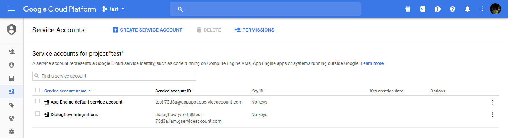
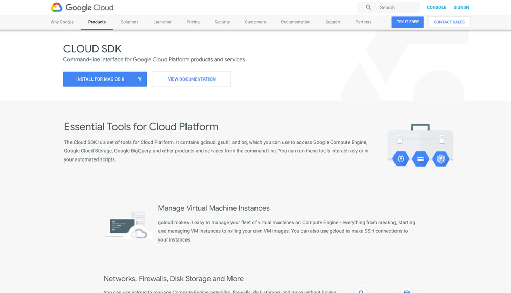

# Deploying your Dialogflow Agent using the Jovo CLI

Still updating your Dialogflow agent manually? In this post you're going to learn how to use the Jovo CLI and Dialogflow v2 API to deploy a Dialogflow agent from your command line.

### Contents

- [Introduction](#introduction)
- [Step 1: Updating to the Dialogflow V2 API](#step-1-updating-to-the-dialogflow-v2-api)
- [Step 2: Setting up Authentication](#step-2-setting-up-authentication)
  - [Step 2.1: Creating a new Service Account](#step-21-creating-a-new-service-account)
  - [Step 2.2: Activating the Account with the Cloud SDK](#step-22-activating-the-account-with-the-cloud-sdk)
- [Step 3: Deploying your Agent with the Jovo CLI](#step-3-deploying-your-agent-with-the-jovo-cli)


You can also watch the full process of creating a Jovo project and a Dialogflow agent, and deploying it with the CLI in this video (for the deployment part, feel free to skip to minute 12:20): 

[](https://www.youtube.com/watch?v=6ypo5X6tKHc)

## Introduction


 
Making changes to Dialogflow (the natural language understanding platform that is used for Google Assistant projects in Jovo) can be tedious if you want to keep it up to date with the [Jovo Language Model](https://www.jovo.tech/framework/docs/model). Usually, you have to do one of the following in the [Dialogflow Console](https://console.dialogflow.com/):

* Update the language model manually
* Use the _dialogflow_agent.zip_ file created with [jovo deploy](https://www.jovo.tech/framework/docs/cli#jovo-deploy) to RESTORE your existing Dialogflow agent in the preferences:




Can become quite annoying, right?

Finally, you can use the command line to update your Dialogflow agent! Since Jovo v1.0, we support the Dialogflow v2 API which allows you to set up an authentication for programmatic deployments. There are a few manual steps we need to do first, so let's get started.

## Step 1: Updating to the Dialogflow V2 API

First of all, go to the [Dialogflow console](https://console.dialogflow.com/api-client/) and click on the gear icon right next to your agent's name to get to the settings tab:



 n the bottom of the page you can find the toggle for the V2 API. The system will ask you, if you're sure, that you want to change the API version, since the request and response format will change, but no worries, the Jovo framework can handle both the V1 and V2 API.



That's it! Now we need to set up the authentication to be able to access the Dialogflow agent programmatically.

## Step 2: Setting up Authentication

After saving the changes (Dialogflow v2 API), you will find a service account right beneath the project ID: 



### Step 2.1: Creating a new Service Account

It will lead you to the Google Cloud Platform, where we will create a new service account using the button at the top of the page:



Add the **Dialogflow API Admin** role and furnish a new private key:


Make sure to download the key and remember where it's stored, as you can only download it once.

### Step 2.2: Activating the Account with the Cloud SDK



The Jovo CLI uses the Google Cloud SDK to access Dialogflow through projects on the Google Cloud Platform. You can download it [here](https://cloud.google.com/sdk/docs/).

Install the SDK and initialize it using the [quickstart guide](https://cloud.google.com/sdk/docs/quickstarts) from Google.

## Step 3: Deploying your Agent with the Jovo CLI


After that add both the `projectId` of your Dialogflow agent and the path to the `keyFile` to your project's `app.json`:

```js
"googleAction": {
  "dialogflow": {
    "projectId": "<your-project-id>",
    "keyFile": "<path-to-key-file>"
    }
}
```

Now run the build and deploy command and your agent will be updated:

```sh
jovo build -p googleAction --deploy
```

The result should look like this:

```text
   √ Deploying Google Action
     √ Creating file /googleAction/dialogflow_agent.zip
       Language model: en-US
       Fulfillment Endpoint: https://webhook.jovo.cloud/yourEndpoint
     √ Uploading and restoring agent for project test-73d3a
     √ Training started

  Deployment complete
```

**Any questions? You can reach us on [Twitter](https://twitter.com/jovotech) or [Slack](https://www.jovo.tech/slack).**

<!--[metadata]: { "description": "Learn how to deploy a Dialogflow agent from the command line with the Jovo CLI", "author": "jan-koenig", "tags": "Google Assistant, Dialogflow, Deployment", "og-image": "https://www.jovo.tech/blog/wp-content/uploads/2018/03/deploy-dialogflow-agent-1.jpg" }-->
